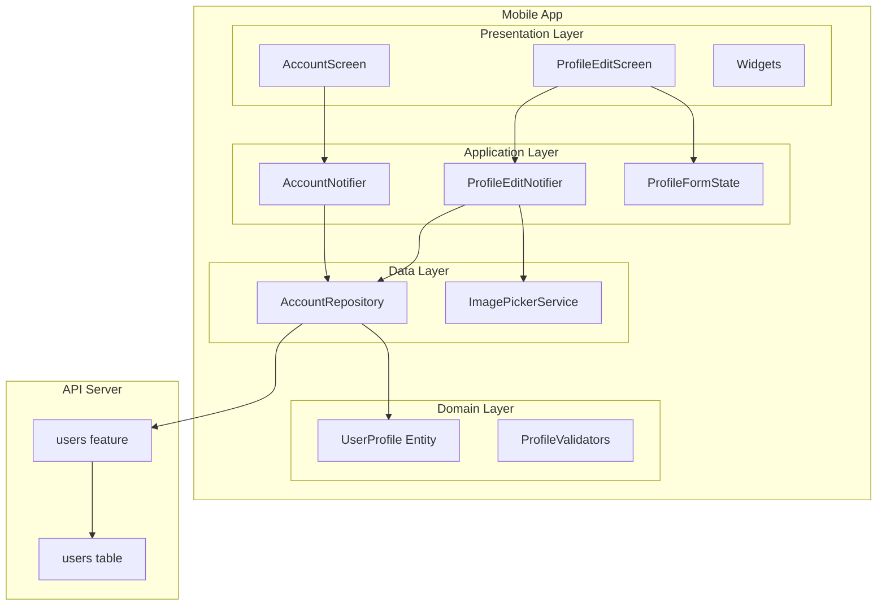
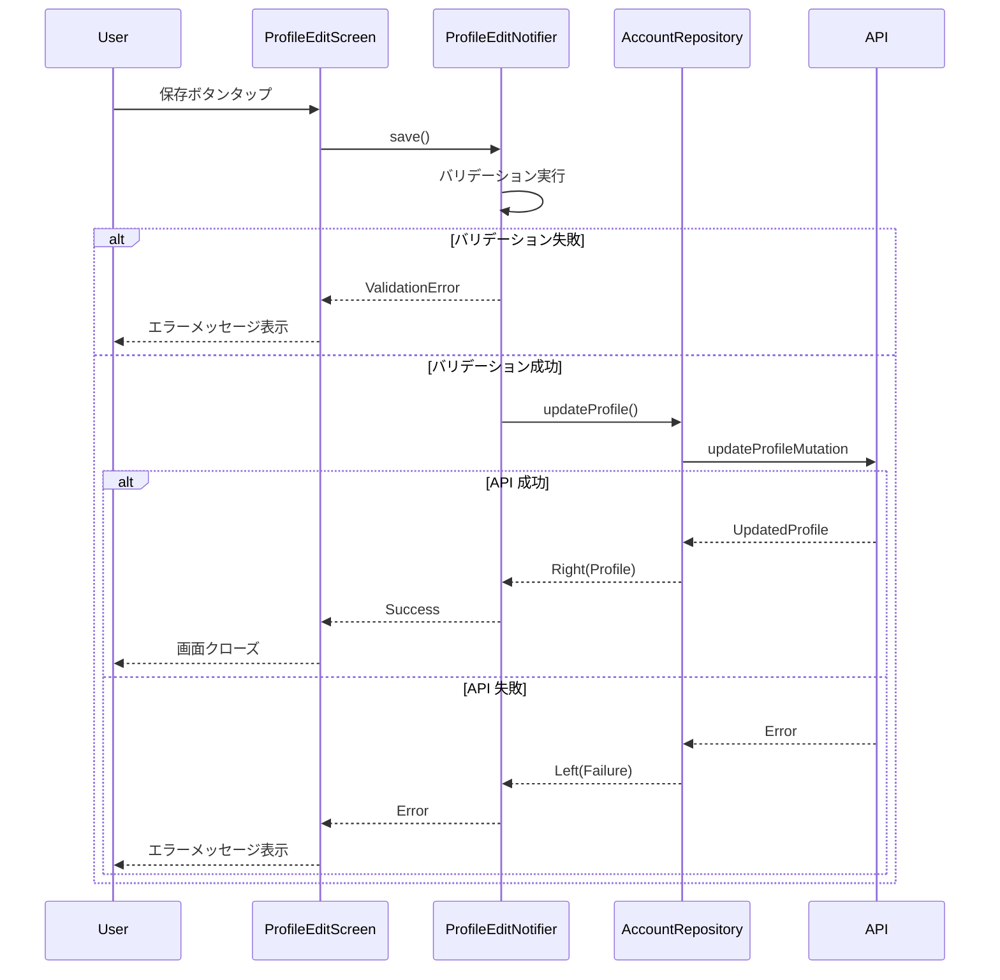
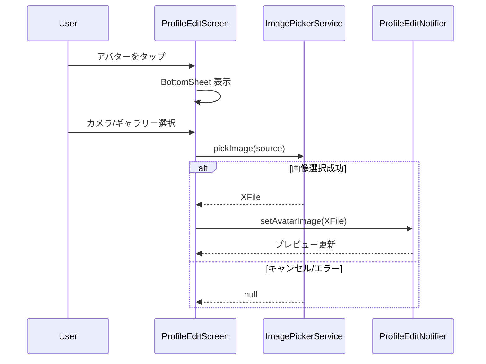

# 設計ドキュメント

## Overview

本機能は、Shelfie モバイルアプリケーションにおいてユーザーが自身のアカウント情報を確認・編集するための画面群を提供する。アカウント画面はプロフィール概要と各種設定へのナビゲーションハブとして機能し、プロフィール編集画面ではユーザー情報（氏名、メールアドレス、アバター）の更新を行う。

**Purpose**: ユーザーが自身のプロフィール情報を管理し、各種設定にアクセスするための統一されたインターフェースを提供する。

**Users**: 登録済みユーザーがプロフィール情報の確認・編集、および設定画面へのナビゲーションに使用する。

**Impact**: 既存のルーティング設定（`/account` ルート）を実装に置き換え、API にプロフィール更新機能を追加する。

### Goals

- ユーザープロフィールの概要表示と各種設定メニューへのアクセスを提供
- 氏名・アバターの編集と API 連携による永続化
- メールアドレス変更フローの実装（確認メール送信）
- 既存の Clean Architecture パターンとの整合性維持

### Non-Goals

- プレミアムプラン画面の実装（将来実装、ナビゲーションのみ）
- 通知設定画面の実装（将来実装、ナビゲーションのみ）
- パスワード設定画面の実装（将来実装、ナビゲーションのみ）
- テーマ設定画面の実装（将来実装、ナビゲーションのみ）
- 画像の編集・クロッピング機能

## Architecture

### Existing Architecture Analysis

**現在のアーキテクチャパターン**:
- Feature-first + Clean Architecture（Presentation / Application / Domain / Data レイヤー）
- Riverpod による状態管理（`@riverpod` アノテーションによるコード生成）
- freezed によるイミュータブルデータモデリング
- Ferry による GraphQL クライアント
- fpdart による Either 型エラーハンドリング

**既存の統合ポイント**:
- `AppRoutes.account` ルートが既に定義されている（プレースホルダー実装）
- `authStateProvider` でユーザー認証情報を管理
- `BaseRepository` による GraphQL 操作の標準化
- `Failure` 型階層による統一エラーハンドリング

**API 側の制約**:
- 現在の `users` テーブルには `name`、`avatarUrl` フィールドが存在しない
- プロフィール更新用の GraphQL Mutation が未実装

### Architecture Pattern & Boundary Map



**Architecture Integration**:
- Selected pattern: Feature-first + Clean Architecture（既存パターンを継続）
- Domain boundaries: `account` feature として独立、`core/auth` との連携
- Existing patterns preserved: Riverpod Provider、freezed モデル、Either エラーハンドリング
- New components rationale: 画像選択サービスを Data 層に配置（外部プラットフォーム依存のため）
- Steering compliance: mobile-tech.md のレイヤー構成・ライブラリ選定に準拠

### Technology Stack

| Layer | Choice / Version | Role in Feature | Notes |
|-------|------------------|-----------------|-------|
| UI Framework | Flutter 3.x | 画面・ウィジェット構築 | 既存 |
| State Management | flutter_riverpod ^2.5.1 | Provider による状態管理 | 既存 |
| Data Modeling | freezed ^2.4.7 | イミュータブルモデル生成 | 既存 |
| Routing | go_router ^14.6.2 | プロフィール編集画面への遷移 | 既存 |
| GraphQL Client | ferry ^0.16.1+2 | API 通信 | 既存 |
| Error Handling | fpdart ^1.1.0 | Either 型エラー伝播 | 既存 |
| Image Picker | image_picker ^1.1.2 | カメラ/ギャラリーからの画像選択 | **新規追加** |

## System Flows

### プロフィール編集フロー



### アバター選択フロー



**Key Decisions**:
- 画像アップロードはプロフィール保存時に一括で実行（UX の観点から即時アップロードは行わない）
- メールアドレス変更は確認メール送信後、確認完了まで元のメールアドレスを維持

## Requirements Traceability

| Requirement | Summary | Components | Interfaces | Flows |
|-------------|---------|------------|------------|-------|
| 1.1 | ヘッダー表示 | AccountScreen, AccountHeader | - | - |
| 1.2 | プロフィールカード | AccountScreen, ProfileCard | AccountNotifier.state | - |
| 1.3-1.5 | メニュー項目表示 | AccountScreen, AccountMenuSection | MenuItemData | - |
| 1.6 | テーマバッジ | AccountMenuSection | - | - |
| 1.7 | 閉じるボタン | AccountHeader | - | - |
| 2.1 | 画面遷移 | ProfileEditScreen | go_router | - |
| 2.2 | 編集画面ヘッダー | ProfileEditHeader | - | - |
| 2.3 | アバター編集 | AvatarEditor | ProfileFormState | - |
| 2.4-2.6 | 入力フィールド | ProfileEditForm | ProfileFormState | - |
| 3.1-3.3 | プロフィール保存 | ProfileEditNotifier | AccountRepository | プロフィール編集フロー |
| 3.4-3.6 | エラー/ローディング | ProfileEditScreen | ProfileEditNotifier.state | - |
| 4.1-4.3 | 画像選択 | ImagePickerService, AvatarEditor | - | アバター選択フロー |
| 4.4-4.5 | 画像アップロード | AccountRepository | updateProfileMutation | - |
| 5.1-5.4 | メールアドレス変更 | AccountRepository | requestEmailChangeMutation | - |
| 6.1-6.5 | ナビゲーション | AccountScreen | go_router | - |

## Components and Interfaces

| Component | Domain/Layer | Intent | Req Coverage | Key Dependencies | Contracts |
|-----------|--------------|--------|--------------|------------------|-----------|
| AccountScreen | Presentation | アカウント画面のメイン UI | 1.1-1.7, 6.1-6.5 | AccountNotifier (P0), go_router (P0) | State |
| ProfileEditScreen | Presentation | プロフィール編集画面 UI | 2.1-2.6, 3.4-3.6 | ProfileEditNotifier (P0), ProfileFormState (P0) | State |
| AccountNotifier | Application | アカウント画面の状態管理 | 1.2 | AccountRepository (P0), authStateProvider (P1) | Service, State |
| ProfileEditNotifier | Application | プロフィール編集の状態管理 | 3.1-3.3, 4.4, 5.1-5.2 | AccountRepository (P0), ImagePickerService (P1) | Service, State |
| ProfileFormState | Application | フォーム入力状態管理 | 2.4-2.6, 3.6 | - | State |
| UserProfile | Domain | ユーザープロフィールエンティティ | All | - | - |
| AccountRepository | Data | API 通信とデータ変換 | 3.1, 4.4, 5.1 | Ferry Client (P0) | Service |
| ImagePickerService | Data | 画像選択の抽象化 | 4.1-4.3 | image_picker (P0) | Service |

### Domain Layer

#### UserProfile

| Field | Detail |
|-------|--------|
| Intent | ユーザープロフィール情報を表現するイミュータブルエンティティ |
| Requirements | 1.2, 2.4-2.5, 3.3 |

**Responsibilities & Constraints**
- ユーザーの表示用プロフィール情報を保持
- アカウント画面とプロフィール編集画面で共有されるドメインモデル
- freezed による不変性保証

**Contracts**: State [x]

##### State Model

```dart
@freezed
class UserProfile with _$UserProfile {
  const factory UserProfile({
    required int id,
    required String email,
    required String? name,
    required String? avatarUrl,
    required String? username,
    required int bookCount,
    required int? readingStartYear,
    required DateTime createdAt,
  }) = _UserProfile;
}
```

**Implementation Notes**
- `username` は `@{name}` 形式で表示用に生成（Domain 層で変換）
- `bookCount` と `readingStartYear` は me クエリから取得

#### ProfileValidators

| Field | Detail |
|-------|--------|
| Intent | プロフィール入力のバリデーションルール |
| Requirements | 3.6, 5.3 |

**Responsibilities & Constraints**
- 氏名の空チェック
- メールアドレスの形式バリデーション
- Pure Dart 関数として実装（外部依存なし）

**Contracts**: Service [x]

##### Service Interface

```dart
abstract final class ProfileValidators {
  static String? validateName(String name);
  static String? validateEmail(String email);
}
```

### Application Layer

#### AccountNotifier

| Field | Detail |
|-------|--------|
| Intent | アカウント画面のユーザープロフィール状態を管理 |
| Requirements | 1.2 |

**Responsibilities & Constraints**
- ユーザープロフィール情報の取得と保持
- authStateProvider からの基本情報取得
- AccountRepository を通じた詳細情報の取得

**Dependencies**
- Inbound: AccountScreen - 状態監視 (P0)
- Outbound: AccountRepository - プロフィール取得 (P0)
- Outbound: authStateProvider - 認証情報参照 (P1)

**Contracts**: Service [x] / State [x]

##### Service Interface

```dart
@riverpod
class AccountNotifier extends _$AccountNotifier {
  @override
  Future<UserProfile> build();

  Future<void> refresh();
}
```

##### State Management

```dart
// AsyncValue<UserProfile> を使用
// - AsyncLoading: 初期読み込み中
// - AsyncData: プロフィール取得成功
// - AsyncError: 取得失敗
```

#### ProfileEditNotifier

| Field | Detail |
|-------|--------|
| Intent | プロフィール編集操作の実行と状態管理 |
| Requirements | 3.1-3.5, 4.4-4.5, 5.1-5.4 |

**Responsibilities & Constraints**
- プロフィール保存処理の実行
- 画像アップロード処理の調整
- メールアドレス変更リクエストの送信
- 操作結果の状態管理

**Dependencies**
- Inbound: ProfileEditScreen - 操作トリガー (P0)
- Outbound: AccountRepository - API 通信 (P0)
- Outbound: ProfileFormState - フォーム値参照 (P0)
- Outbound: ImagePickerService - 画像選択 (P1)

**Contracts**: Service [x] / State [x]

##### Service Interface

```dart
@riverpod
class ProfileEditNotifier extends _$ProfileEditNotifier {
  @override
  ProfileEditState build();

  Future<void> save();
  void setAvatarImage(XFile? image);
  void reset();
}
```

##### State Management

```dart
@freezed
sealed class ProfileEditState with _$ProfileEditState {
  const factory ProfileEditState.initial() = ProfileEditStateInitial;
  const factory ProfileEditState.loading() = ProfileEditStateLoading;
  const factory ProfileEditState.success({
    required UserProfile profile,
    String? emailChangeMessage,
  }) = ProfileEditStateSuccess;
  const factory ProfileEditState.error({
    required String message,
    String? field,
  }) = ProfileEditStateError;
}
```

#### ProfileFormState

| Field | Detail |
|-------|--------|
| Intent | プロフィール編集フォームの入力状態を管理 |
| Requirements | 2.4-2.6, 3.6 |

**Responsibilities & Constraints**
- フォームフィールドの値保持
- バリデーション状態の計算
- 初期値の設定（既存プロフィールから）

**Contracts**: State [x]

##### State Management

```dart
@freezed
class ProfileFormData with _$ProfileFormData {
  const factory ProfileFormData({
    @Default('') String name,
    @Default('') String email,
    XFile? pendingAvatarImage,
    @Default(false) bool hasChanges,
  }) = _ProfileFormData;
}

@riverpod
class ProfileFormState extends _$ProfileFormState {
  @override
  ProfileFormData build();

  void initialize(UserProfile profile);
  void updateName(String value);
  void updateEmail(String value);
  void setAvatarImage(XFile? image);

  String? get nameError;
  String? get emailError;
  bool get isValid;
  bool get hasEmailChanged;
}
```

### Data Layer

#### AccountRepository

| Field | Detail |
|-------|--------|
| Intent | アカウント関連の API 通信とデータ変換 |
| Requirements | 3.1, 4.4, 5.1 |

**Responsibilities & Constraints**
- GraphQL Mutation の実行
- Ferry 生成型から Domain 型への変換
- マルチパートファイルアップロードの処理

**Dependencies**
- Inbound: AccountNotifier, ProfileEditNotifier - データ操作 (P0)
- External: Ferry Client - GraphQL 通信 (P0)

**Contracts**: Service [x]

##### Service Interface

```dart
@riverpod
AccountRepository accountRepository(AccountRepositoryRef ref);

class AccountRepository extends BaseRepository {
  const AccountRepository({required super.client});

  Future<Either<Failure, UserProfile>> getMyProfile();

  Future<Either<Failure, UserProfile>> updateProfile({
    required String name,
    XFile? avatarImage,
  });

  Future<Either<Failure, void>> requestEmailChange({
    required String newEmail,
  });
}
```

**Implementation Notes**
- `updateProfile` で画像がある場合は GraphQL マルチパートアップロードを使用
- `requestEmailChange` は確認メール送信のみ（即時反映なし）

#### ImagePickerService

| Field | Detail |
|-------|--------|
| Intent | カメラ/ギャラリーからの画像選択を抽象化 |
| Requirements | 4.1-4.3 |

**Responsibilities & Constraints**
- image_picker パッケージのラッパー
- プラットフォーム権限のハンドリング
- テスト容易性のための抽象化

**Dependencies**
- External: image_picker ^1.1.2 - 画像選択 (P0)

**Contracts**: Service [x]

##### Service Interface

```dart
@riverpod
ImagePickerService imagePickerService(ImagePickerServiceRef ref);

class ImagePickerService {
  Future<XFile?> pickFromGallery();
  Future<XFile?> pickFromCamera();
}
```

**Implementation Notes**
- iOS: Info.plist に `NSPhotoLibraryUsageDescription`, `NSCameraUsageDescription` を追加
- Android: AndroidManifest.xml に `CAMERA`, `READ_MEDIA_IMAGES` パーミッション追加

### Presentation Layer

#### AccountScreen

| Field | Detail |
|-------|--------|
| Intent | アカウント画面のメイン UI を構築 |
| Requirements | 1.1-1.7, 6.1-6.5 |

**Responsibilities & Constraints**
- プロフィールカードとメニュー一覧の表示
- 各メニュー項目のタップハンドリング
- 画面クローズ処理

**Dependencies**
- Inbound: AppRouter - 画面遷移 (P0)
- Outbound: AccountNotifier - 状態監視 (P0)
- Outbound: go_router - ナビゲーション (P0)

**Contracts**: State [x]

##### State Management

- `ref.watch(accountNotifierProvider)` で `AsyncValue<UserProfile>` を監視
- ローディング/エラー/データ表示を `AsyncValue.when` で分岐

**Implementation Notes**
- 既存の `_AccountScreen` プレースホルダーを置き換え
- `ScreenHeader` 相当のカスタムヘッダー（閉じるボタン付き）を実装

#### ProfileEditScreen

| Field | Detail |
|-------|--------|
| Intent | プロフィール編集画面の UI を構築 |
| Requirements | 2.1-2.6, 3.4-3.6 |

**Responsibilities & Constraints**
- 編集可能なフォームフィールドの表示
- アバター編集 UI の提供
- 保存/キャンセル操作のハンドリング

**Dependencies**
- Inbound: AccountScreen - 画面遷移 (P0)
- Outbound: ProfileEditNotifier - 操作実行 (P0)
- Outbound: ProfileFormState - フォーム状態 (P0)

**Contracts**: State [x]

##### State Management

- `ref.watch(profileEditNotifierProvider)` で操作状態を監視
- `ref.watch(profileFormStateProvider)` でフォーム入力を監視
- `ref.listen` でエラー/成功時のスナックバー表示

#### Shared Widgets

以下のウィジェットは AccountScreen / ProfileEditScreen で使用される。

| Widget | Intent | Requirements |
|--------|--------|--------------|
| ProfileCard | プロフィール概要表示 | 1.2 |
| AccountMenuSection | メニューセクションとアイテム | 1.3-1.6, 6.5 |
| AccountHeader | カスタムヘッダー（閉じるボタン） | 1.1, 1.7 |
| ProfileEditHeader | 編集画面ヘッダー（保存ボタン） | 2.2 |
| AvatarEditor | タップ可能なアバター編集 UI | 2.3, 4.1 |
| ProfileEditForm | 氏名・メールアドレス入力フォーム | 2.4-2.6 |
| ImageSourceBottomSheet | カメラ/ギャラリー選択シート | 4.1 |

## Data Models

### Domain Model

**Aggregates**:
- `UserProfile`: ユーザーのプロフィール情報を表す集約ルート

**Value Objects**:
- `ProfileFormData`: フォーム入力状態（一時的、永続化なし）

**Business Rules**:
- 氏名は空文字列不可
- メールアドレスは有効な形式であること
- アバター画像は JPEG/PNG のみ許可

### Logical Data Model

**API Schema 拡張（users テーブル）**:

| Column | Type | Constraints | Description |
|--------|------|-------------|-------------|
| id | INTEGER | PK, auto-increment | 既存 |
| email | TEXT | NOT NULL, UNIQUE | 既存 |
| firebase_uid | TEXT | NOT NULL, UNIQUE | 既存 |
| name | TEXT | NULL | **新規追加** |
| avatar_url | TEXT | NULL | **新規追加** |
| created_at | TIMESTAMP | NOT NULL, DEFAULT NOW | 既存 |
| updated_at | TIMESTAMP | NOT NULL, DEFAULT NOW | 既存 |

**GraphQL Schema 拡張**:

```graphql
type User {
  id: Int!
  email: String!
  name: String
  avatarUrl: String
  createdAt: DateTime!
  updatedAt: DateTime!
}

input UpdateProfileInput {
  name: String!
  avatar: Upload
}

input RequestEmailChangeInput {
  newEmail: String!
}

type UpdateProfileResult = User | ValidationError
type RequestEmailChangeResult = EmailChangeRequested | ValidationError | DuplicateEmailError

type EmailChangeRequested {
  message: String!
}

type Mutation {
  updateProfile(input: UpdateProfileInput!): UpdateProfileResult!
  requestEmailChange(input: RequestEmailChangeInput!): RequestEmailChangeResult!
}
```

### Data Contracts & Integration

**API Request/Response**:

| Operation | Request | Response | Errors |
|-----------|---------|----------|--------|
| updateProfile | UpdateProfileInput (name, avatar?) | User | ValidationError |
| requestEmailChange | RequestEmailChangeInput (newEmail) | EmailChangeRequested | ValidationError, DuplicateEmailError |

**Ferry Generated Types**:
- `GUpdateProfileReq` / `GUpdateProfileData`
- `GRequestEmailChangeReq` / `GRequestEmailChangeData`

## Error Handling

### Error Strategy

既存の `Failure` 型階層を使用し、新規エラーケースを追加しない。

### Error Categories and Responses

| Error Type | Trigger | User Message | Recovery |
|------------|---------|--------------|----------|
| ValidationFailure | 氏名空、無効なメールアドレス | フィールド固有メッセージ | フォーム修正 |
| ServerFailure | API エラー | サーバーエラーが発生しました | リトライ |
| NetworkFailure | 接続エラー | ネットワーク接続を確認してください | リトライ |
| ValidationFailure (duplicate email) | 既存メールアドレス | このメールアドレスは既に使用されています | 別のアドレス入力 |

### Monitoring

- エラー発生時は `debugPrint` でログ出力（既存パターン踏襲）
- 本番環境での Crashlytics 連携は将来検討

## Testing Strategy

### Unit Tests

- `ProfileValidators.validateName`: 空文字、有効な名前のケース
- `ProfileValidators.validateEmail`: 無効な形式、有効な形式のケース
- `ProfileFormState`: 初期化、更新、バリデーション状態計算
- `AccountNotifier`: プロフィール取得成功/失敗
- `ProfileEditNotifier`: 保存成功/失敗、メールアドレス変更

### Widget Tests

- `AccountScreen`: プロフィールカード表示、メニュー項目表示、タップイベント
- `ProfileEditScreen`: フォーム入力、バリデーションエラー表示、保存ボタン状態
- `AvatarEditor`: タップでボトムシート表示
- `ImageSourceBottomSheet`: カメラ/ギャラリー選択オプション

### Integration Tests

- アカウント画面 -> プロフィール編集画面 -> 保存 -> アカウント画面（更新反映）
- アバター選択フロー（モック ImagePickerService 使用）

## Optional Sections

### Security Considerations

**画像アップロード**:
- アップロード前にファイルサイズ上限チェック（5MB）
- サーバー側で画像形式バリデーション（JPEG/PNG のみ）

**メールアドレス変更**:
- 確認メールによる所有者確認
- 確認完了まで元のメールアドレスを維持

### Migration Strategy

**API 側の変更が必要**:

1. **Phase 1**: DB マイグレーション
   - `users` テーブルに `name`, `avatar_url` カラムを追加（NULL 許可）

2. **Phase 2**: GraphQL Schema 拡張
   - `User` 型に `name`, `avatarUrl` フィールド追加
   - `updateProfile`, `requestEmailChange` Mutation 追加

3. **Phase 3**: モバイルアプリリリース
   - API 変更完了後にモバイルアプリをリリース

**Rollback**: 各フェーズは独立しており、問題発生時は個別にロールバック可能。

## Supporting References

### image_picker パッケージ設定

**iOS Info.plist 追加項目**:
```xml
<key>NSPhotoLibraryUsageDescription</key>
<string>プロフィール画像を選択するために写真ライブラリへのアクセスが必要です</string>
<key>NSCameraUsageDescription</key>
<string>プロフィール画像を撮影するためにカメラへのアクセスが必要です</string>
```

**Android AndroidManifest.xml 追加項目**:
```xml
<uses-permission android:name="android.permission.CAMERA"/>
<uses-permission android:name="android.permission.READ_MEDIA_IMAGES"/>
```

### 参考資料

- [image_picker | Flutter package](https://pub.dev/packages/image_picker)
- [Flutter and GraphQL - How to Upload Files](https://codinglatte.com/posts/flutter/flutter-and-graphql-how-to-upload-files/)
- [How to Upload files with Ferry GraphQL and Flutter](https://medium.com/@p02diada/how-to-upload-files-with-ferry-graphql-and-flutter-34a2801d6a8a)
- [Camera & Gallery Permissions in Flutter](https://medium.com/@ravindranathjha76/camera-gallery-permissions-in-flutter-solved-the-right-way-b77e7bd83075)
