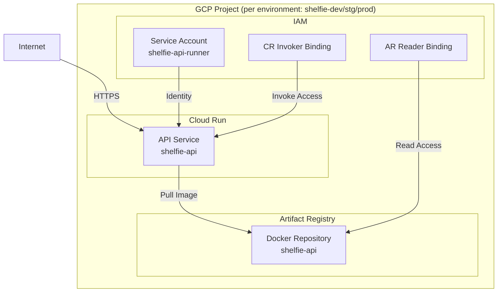
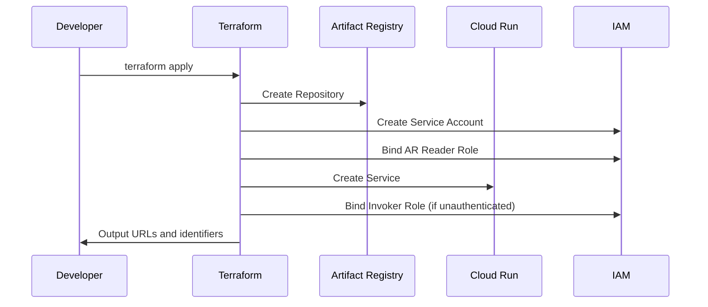

# Technical Design Document

## Overview

**Purpose**: 本機能は、Shelfie GraphQL API を Google Cloud Run 上でサーバーレスに運用するための Terraform インフラストラクチャを提供する。

**Users**: インフラ管理者および開発者が本構成を利用し、API の本番デプロイメント、スケーリング、セキュリティ設定を管理する。

**Impact**: 既存の Terraform 基盤 (`infra/terraform/main.tf`) を拡張し、Cloud Run サービス、Artifact Registry リポジトリ、専用サービスアカウント、IAM ポリシーを追加する。

### Goals
- Cloud Run v2 API を使用した API サービスのサーバーレスデプロイメント
- Artifact Registry による Docker イメージの一元管理
- 最小権限の原則に基づくセキュリティ設計
- 変数を通じた柔軟なリソース設定とスケーリング制御
- **development / staging / production 3環境での一貫したリソース構成**

### Non-Goals
- CI/CD パイプラインの構築（別途対応）
- カスタムドメインと SSL 証明書の設定
- VPC コネクタやプライベートネットワーク構成
- Secret Manager との統合（将来の拡張として検討）

## Architecture

### Existing Architecture Analysis

現在の Terraform 構成 (`infra/terraform/main.tf`) は以下の基盤を提供している:
- Terraform ~> 1.11.0、Google Provider ~> 7.0
- `project_id` と `region` (デフォルト: asia-northeast1) の変数定義
- Provider 設定のみで実リソースは未定義

本設計はこの基盤を拡張し、Cloud Run 関連リソースを追加する。

### Multi-Environment Architecture

本設計は **development / staging / production** の3環境で同一リソース構成を展開することを前提とする。

#### 環境分離パターン

**採用パターン: 環境別 tfvars + 共通モジュール**

```
infra/terraform/
├── modules/
│   └── api-cloud-run/        # 再利用可能なモジュール
│       ├── main.tf
│       ├── variables.tf
│       └── outputs.tf
├── environments/
│   ├── dev/
│   │   ├── main.tf           # モジュール呼び出し
│   │   ├── variables.tf
│   │   ├── terraform.tfvars  # 環境固有の値
│   │   └── backend.tf        # 環境別 state 管理
│   ├── stg/
│   │   └── ...
│   └── prod/
│       └── ...
└── main.tf                   # 既存（移行対象）
```

**選定理由**:
- 環境間の差異を tfvars で明確に管理
- モジュールにより DRY 原則を維持
- 環境ごとの state ファイル分離でリスク軽減
- Terraform Workspaces より明示的で可読性が高い

#### 環境分離戦略: GCP プロジェクト分離

**採用方式**: 環境ごとに独立した GCP プロジェクトを使用

| 環境 | GCP プロジェクト |
|------|-----------------|
| development | shelfie-dev |
| staging | shelfie-stg |
| production | shelfie-prod |

**メリット**:
- リソース名にサフィックス不要（プロジェクト内で一意）
- 完全な環境分離（IAM、課金、クォータ）
- 誤操作による本番影響リスクの低減
- 環境ごとの独立したアクセス制御

#### 環境別設定の差異

| 設定項目 | development | staging | production |
|---------|-------------|---------|------------|
| `project_id` | shelfie-dev | shelfie-stg | shelfie-prod |
| `min_instances` | 0 | 0 | 1 |
| `max_instances` | 2 | 5 | 10 |
| `cpu_limit` | "1" | "1" | "2" |
| `memory_limit` | "512Mi" | "512Mi" | "1Gi" |
| `allow_unauthenticated` | true | true | false (要検討) |

### Architecture Pattern & Boundary Map



**Architecture Integration**:
- **Selected pattern**: 環境別ディレクトリ + 共通モジュール（マルチ環境対応と保守性を両立）
- **Domain boundaries**: インフラリソース（Artifact Registry, Cloud Run, IAM）をモジュールとして論理的にグループ化
- **Existing patterns preserved**: 既存の provider 設定と変数パターンを維持
- **New components rationale**: 各リソースは要件に直接対応し、相互依存を明確化
- **Environment isolation**: 環境ごとに独立した state と tfvars で安全な運用を実現

### Technology Stack

| Layer | Choice / Version | Role in Feature | Notes |
|-------|------------------|-----------------|-------|
| Infrastructure / Runtime | Terraform >= 1.11.0 | IaC 定義 | 既存要件を維持 |
| Infrastructure / Runtime | hashicorp/google ~> 7.0 | GCP リソースプロビジョニング | v2 API サポート確認済み |
| Infrastructure / Runtime | Google Cloud Run v2 | API サーバーレス実行環境 | `google_cloud_run_v2_service` 使用 |
| Data / Storage | Google Artifact Registry | Docker イメージ保存 | `google_artifact_registry_repository` 使用 |

## Requirements Traceability

| Requirement | Summary | Components | Interfaces | Flows |
|-------------|---------|------------|------------|-------|
| 1.1, 1.2, 1.3, 1.4, 1.5 | Cloud Run サービス定義 | CloudRunService | Terraform Resource | Deploy Flow |
| 2.1, 2.2, 2.3, 2.4, 2.5 | リソース設定とスケーリング | CloudRunService, Variables | Terraform Variables | - |
| 3.1, 3.2, 3.3 | Artifact Registry リポジトリ | ArtifactRegistryRepository, IAM | Terraform Resource | Image Pull Flow |
| 4.1, 4.2, 4.3, 4.4 | IAM とサービスアカウント | ServiceAccount, IAM Bindings | Terraform Resource | - |
| 5.1, 5.2, 5.3 | ネットワークとアクセス設定 | CloudRunService, IAM, Outputs | Terraform Variables, Outputs | Access Flow |
| 6.1, 6.2, 6.3, 6.4 | 環境変数とシークレット管理 | CloudRunService, Variables | Terraform Variables | - |
| 7.1, 7.2, 7.3, 7.4 | Terraform 出力 | Outputs | Terraform Outputs | - |

## Components and Interfaces

| Component | Domain/Layer | Intent | Req Coverage | Key Dependencies | Contracts |
|-----------|--------------|--------|--------------|------------------|-----------|
| ArtifactRegistryRepository | Storage | API Docker イメージの保存 | 3.1, 3.2 | Google Provider (P0) | Terraform Resource |
| ServiceAccount | IAM | Cloud Run 実行 ID | 4.1, 4.2, 4.4 | Google Provider (P0) | Terraform Resource |
| CloudRunService | Runtime | API サーバーレス実行 | 1.1-1.5, 2.1-2.5, 5.1-5.3, 6.1-6.4 | ArtifactRegistry (P0), ServiceAccount (P0) | Terraform Resource |
| IAMBindings | IAM | アクセス制御 | 3.3, 4.3 | ServiceAccount (P1), CloudRunService (P1) | Terraform Resource |
| Variables | Configuration | 設定のカスタマイズ | 2.5, 4.4, 5.2, 6.3 | - | Terraform Variables |
| Outputs | Configuration | デプロイ情報の出力 | 7.1-7.4 | All Resources (P1) | Terraform Outputs |

### Storage Layer

#### ArtifactRegistryRepository

| Field | Detail |
|-------|--------|
| Intent | API コンテナイメージを保存する Docker リポジトリを提供する |
| Requirements | 3.1, 3.2 |

**Responsibilities & Constraints**
- Docker フォーマットのイメージリポジトリを作成
- Cloud Run と同一リージョン (asia-northeast1) に配置
- イメージの保存と取得を管理

**Dependencies**
- Outbound: Google Provider — リソースプロビジョニング (P0)
- External: GCP Artifact Registry API — レジストリサービス (P0)

**Contracts**: Terraform Resource [x]

##### Terraform Resource Definition

```hcl
resource "google_artifact_registry_repository" "api" {
  location      = var.region
  repository_id = "shelfie-api"
  description   = "Shelfie API Docker repository"
  format        = "DOCKER"

  docker_config {
    immutable_tags = var.environment == "prod" ? true : false
  }
}
```

**Attributes**:
- `location`: string — リポジトリのリージョン (var.region)
- `repository_id`: string — リポジトリ識別子 ("shelfie-api")
- `format`: string — アーティファクト形式 ("DOCKER")
- `docker_config.immutable_tags`: bool — タグ不変性 (prod: true, dev/stg: false)

**Implementation Notes**
- Integration: API が有効化されていることを前提 (`artifactregistry.googleapis.com`)
- Validation: repository_id は英数字とハイフンのみ
- Risks: 初期はイメージが存在しないため、Cloud Run デプロイ前にイメージ push が必要

---

### IAM Layer

#### ServiceAccount

| Field | Detail |
|-------|--------|
| Intent | Cloud Run サービスの実行 ID として最小権限で動作する専用アカウントを提供する |
| Requirements | 4.1, 4.2, 4.4 |

**Responsibilities & Constraints**
- Cloud Run サービス専用の実行 ID を提供
- 最小権限の原則に基づく権限付与
- 変数によるカスタマイズをサポート

**Dependencies**
- Outbound: Google Provider — リソースプロビジョニング (P0)

**Contracts**: Terraform Resource [x]

##### Terraform Resource Definition

```hcl
resource "google_service_account" "api_runner" {
  account_id   = var.service_account_id
  display_name = "Shelfie API Cloud Run Service Account"
  description  = "Service account for running Shelfie API on Cloud Run"
}
```

**Attributes**:
- `account_id`: string — サービスアカウント ID (var.service_account_id)
- `display_name`: string — 表示名
- `description`: string — 説明

**Implementation Notes**
- Integration: デフォルト ID は "shelfie-api-runner"
- Validation: account_id は 6-30 文字、英小文字・数字・ハイフン
- Risks: 権限不足時は Cloud Run 起動失敗、エラーログで確認可能

---

#### IAMBindings

| Field | Detail |
|-------|--------|
| Intent | Artifact Registry へのアクセス権と Cloud Run の呼び出し権限を制御する |
| Requirements | 3.3, 4.3 |

**Responsibilities & Constraints**
- サービスアカウントに Artifact Registry 読み取り権限を付与
- 外部公開時は未認証アクセスを許可する IAM ポリシーを設定
- 変数で認証要否を制御

**Dependencies**
- Inbound: ServiceAccount — 権限付与対象 (P0)
- Inbound: CloudRunService — IAM ポリシー対象 (P0)

**Contracts**: Terraform Resource [x]

##### Terraform Resource Definition

```hcl
# Artifact Registry Reader for Service Account
resource "google_artifact_registry_repository_iam_member" "api_reader" {
  location   = google_artifact_registry_repository.api.location
  repository = google_artifact_registry_repository.api.name
  role       = "roles/artifactregistry.reader"
  member     = "serviceAccount:${google_service_account.api_runner.email}"
}

# Cloud Run Invoker for unauthenticated access (conditional)
resource "google_cloud_run_v2_service_iam_member" "invoker" {
  count    = var.allow_unauthenticated ? 1 : 0
  location = google_cloud_run_v2_service.api.location
  name     = google_cloud_run_v2_service.api.name
  role     = "roles/run.invoker"
  member   = "allUsers"
}
```

**Implementation Notes**
- Integration: `allow_unauthenticated = true` で未認証アクセス許可
- Validation: IAM 変更は即座に反映
- Risks: 未認証アクセス許可時はセキュリティリスクを認識すること

---

### Runtime Layer

#### CloudRunService

| Field | Detail |
|-------|--------|
| Intent | API コンテナをサーバーレス環境で実行し、自動スケーリングを提供する |
| Requirements | 1.1, 1.2, 1.3, 1.4, 1.5, 2.1, 2.2, 2.3, 2.4, 2.5, 5.1, 5.2, 6.1, 6.2, 6.3, 6.4 |

**Responsibilities & Constraints**
- API コンテナをサーバーレスで実行
- Artifact Registry からイメージを取得
- リソース制限とスケーリングを管理
- 環境変数を設定

**Dependencies**
- Inbound: ArtifactRegistryRepository — イメージ取得元 (P0)
- Inbound: ServiceAccount — 実行 ID (P0)
- External: GCP Cloud Run API — 実行環境 (P0)

**Contracts**: Terraform Resource [x]

##### Terraform Resource Definition

```hcl
resource "google_cloud_run_v2_service" "api" {
  name     = var.service_name
  location = var.region
  ingress  = var.ingress

  template {
    service_account = google_service_account.api_runner.email
    timeout         = "${var.request_timeout}s"

    scaling {
      min_instance_count = var.min_instances
      max_instance_count = var.max_instances
    }

    containers {
      name  = "api"
      image = "${var.region}-docker.pkg.dev/${var.project_id}/${google_artifact_registry_repository.api.repository_id}/${var.image_name}:${var.image_tag}"

      ports {
        container_port = 4000
      }

      resources {
        limits = {
          cpu    = var.cpu_limit
          memory = var.memory_limit
        }
      }

      env {
        name  = "PORT"
        value = "4000"
      }

      dynamic "env" {
        for_each = var.environment_variables
        content {
          name  = env.key
          value = env.value
        }
      }
    }
  }

  lifecycle {
    ignore_changes = [
      template[0].containers[0].image,
    ]
  }
}
```

**Attributes**:
- `name`: string — サービス名 (var.service_name)
- `location`: string — デプロイリージョン (var.region)
- `ingress`: string — Ingress 設定 (var.ingress)
- `template.service_account`: string — 実行サービスアカウント
- `template.timeout`: string — リクエストタイムアウト
- `template.scaling.min_instance_count`: number — 最小インスタンス数
- `template.scaling.max_instance_count`: number — 最大インスタンス数
- `template.containers.image`: string — コンテナイメージ URI
- `template.containers.ports.container_port`: number — コンテナポート (4000)
- `template.containers.resources.limits`: map — CPU/メモリ制限
- `template.containers.env`: list — 環境変数

**Implementation Notes**
- Integration: イメージ URI は Artifact Registry の命名規則に従う
- Validation: timeout は "1s" - "3600s" の範囲
- Risks: lifecycle.ignore_changes でイメージ変更を無視（CI/CD での更新を想定）

---

### Configuration Layer

#### Variables

| Field | Detail |
|-------|--------|
| Intent | リソース設定をカスタマイズ可能にし、環境ごとの差異を吸収する |
| Requirements | 2.5, 4.4, 5.2, 6.3 |

**Contracts**: Terraform Variables [x]

##### Variable Definitions

```hcl
# =============================================================================
# Environment Configuration
# =============================================================================

variable "environment" {
  description = "Environment name (dev, stg, prod) - used for environment-specific settings like immutable_tags"
  type        = string

  validation {
    condition     = contains(["dev", "stg", "prod"], var.environment)
    error_message = "Environment must be one of: dev, stg, prod"
  }
}

# =============================================================================
# Cloud Run Service Configuration
# =============================================================================

variable "service_name" {
  description = "Name of the Cloud Run service (environment suffix will be appended)"
  type        = string
  default     = "shelfie-api"
}

variable "image_name" {
  description = "Name of the container image"
  type        = string
  default     = "api"
}

variable "image_tag" {
  description = "Tag of the container image"
  type        = string
  default     = "latest"
}

# =============================================================================
# Resource Limits and Scaling
# =============================================================================

variable "cpu_limit" {
  description = "CPU limit for the container (e.g., '1', '2', '1000m')"
  type        = string
  default     = "1"
}

variable "memory_limit" {
  description = "Memory limit for the container (e.g., '512Mi', '1Gi')"
  type        = string
  default     = "512Mi"
}

variable "min_instances" {
  description = "Minimum number of instances (0 for scale-to-zero)"
  type        = number
  default     = 0
}

variable "max_instances" {
  description = "Maximum number of instances"
  type        = number
  default     = 10
}

variable "request_timeout" {
  description = "Request timeout in seconds"
  type        = number
  default     = 300
}

# =============================================================================
# IAM and Service Account
# =============================================================================

variable "service_account_id" {
  description = "ID for the Cloud Run service account"
  type        = string
  default     = "shelfie-api-runner"
}

variable "allow_unauthenticated" {
  description = "Allow unauthenticated access to the Cloud Run service"
  type        = bool
  default     = true
}

# =============================================================================
# Network and Access
# =============================================================================

variable "ingress" {
  description = "Ingress setting: INGRESS_TRAFFIC_ALL, INGRESS_TRAFFIC_INTERNAL_ONLY, INGRESS_TRAFFIC_INTERNAL_LOAD_BALANCER"
  type        = string
  default     = "INGRESS_TRAFFIC_ALL"

  validation {
    condition = contains([
      "INGRESS_TRAFFIC_ALL",
      "INGRESS_TRAFFIC_INTERNAL_ONLY",
      "INGRESS_TRAFFIC_INTERNAL_LOAD_BALANCER"
    ], var.ingress)
    error_message = "Ingress must be one of: INGRESS_TRAFFIC_ALL, INGRESS_TRAFFIC_INTERNAL_ONLY, INGRESS_TRAFFIC_INTERNAL_LOAD_BALANCER"
  }
}

# =============================================================================
# Environment Variables
# =============================================================================

variable "environment_variables" {
  description = "Additional environment variables for the container"
  type        = map(string)
  default     = {}
}
```

---

#### Outputs

| Field | Detail |
|-------|--------|
| Intent | デプロイ後の重要情報を出力し、他システムとの連携を容易にする |
| Requirements | 7.1, 7.2, 7.3, 7.4 |

**Contracts**: Terraform Outputs [x]

##### Output Definitions

```hcl
output "cloud_run_service_url" {
  description = "URL of the deployed Cloud Run service"
  value       = google_cloud_run_v2_service.api.uri
}

output "cloud_run_service_name" {
  description = "Name of the Cloud Run service"
  value       = google_cloud_run_v2_service.api.name
}

output "artifact_registry_repository_url" {
  description = "URL of the Artifact Registry repository"
  value       = "${var.region}-docker.pkg.dev/${var.project_id}/${google_artifact_registry_repository.api.repository_id}"
}

output "service_account_email" {
  description = "Email of the Cloud Run service account"
  value       = google_service_account.api_runner.email
}
```

## System Flows

### Deploy Flow



**Key Decisions**:
- イメージは別プロセス（CI/CD）で push されることを前提とし、lifecycle.ignore_changes でイメージ変更を Terraform の管理外に置く
- 未認証アクセス許可は変数で制御し、セキュリティ要件に応じて切り替え可能

## Error Handling

### Error Strategy

Terraform 実行時のエラーは標準の Terraform エラーハンドリングに従う。

### Error Categories and Responses

**Infrastructure Errors**:
- API 未有効: `terraform apply` 前に必要な API を有効化（`run.googleapis.com`, `artifactregistry.googleapis.com`）
- 権限不足: Terraform 実行アカウントに必要なロールを付与
- イメージ不存在: Cloud Run サービス作成前にイメージを push

**Validation Errors**:
- 変数バリデーション: ingress 変数は定義済みの値のみ許可
- リソース名制約: 命名規則違反時は Terraform が明確なエラーを出力

### Monitoring

- Cloud Run サービスのログは Cloud Logging に自動出力
- Terraform state は GCS バックエンド推奨（将来の拡張）

## Testing Strategy

### Unit Tests
- Terraform validate: 構文検証
- Terraform fmt: フォーマット検証
- tflint: Terraform リンター

### Integration Tests
- terraform plan: リソース作成計画の検証
- terraform apply (dry-run with -target): 個別リソースの段階的検証

### E2E Tests
- API エンドポイントへの HTTP リクエスト検証
- Cloud Run サービス URL のヘルスチェック

## Environment-Specific Configuration

### Sample tfvars Files

#### environments/dev/terraform.tfvars
```hcl
environment           = "dev"
project_id            = "shelfie-dev"
region                = "asia-northeast1"
min_instances         = 0
max_instances         = 2
cpu_limit             = "1"
memory_limit          = "512Mi"
allow_unauthenticated = true
```

#### environments/stg/terraform.tfvars
```hcl
environment           = "stg"
project_id            = "shelfie-stg"
region                = "asia-northeast1"
min_instances         = 0
max_instances         = 5
cpu_limit             = "1"
memory_limit          = "512Mi"
allow_unauthenticated = true
```

#### environments/prod/terraform.tfvars
```hcl
environment           = "prod"
project_id            = "shelfie-prod"
region                = "asia-northeast1"
min_instances         = 1
max_instances         = 10
cpu_limit             = "2"
memory_limit          = "1Gi"
allow_unauthenticated = false
```

### Environment Module Call Example

```hcl
# environments/dev/main.tf
module "api_cloud_run" {
  source = "../../modules/api-cloud-run"

  environment           = var.environment
  project_id            = var.project_id
  region                = var.region
  min_instances         = var.min_instances
  max_instances         = var.max_instances
  cpu_limit             = var.cpu_limit
  memory_limit          = var.memory_limit
  allow_unauthenticated = var.allow_unauthenticated
  environment_variables = var.environment_variables
}
```

## Security Considerations

**Threat Modeling**:
- 未認証アクセス: `allow_unauthenticated` 変数で制御、本番では false 推奨
- サービスアカウント権限: 最小権限の原則を適用、必要なロールのみ付与

**Authentication and Authorization**:
- Cloud Run サービスは専用サービスアカウントで実行
- Artifact Registry へのアクセスは IAM で制限

**Data Protection**:
- 環境変数は Terraform state に保存されるため、state の適切な保護が必要
- Secret Manager 連携は将来の拡張として Non-Goals に記載

## Performance & Scalability

**Target Metrics**:
- コールドスタート: min_instances = 0 でコスト最適化、必要に応じて 1 以上に設定
- 最大スケール: max_instances = 10（デフォルト）で過剰スケールを防止

**Scaling Approaches**:
- Cloud Run の自動スケーリングを活用
- CPU/メモリ制限で個別インスタンスのリソース使用量を制御
