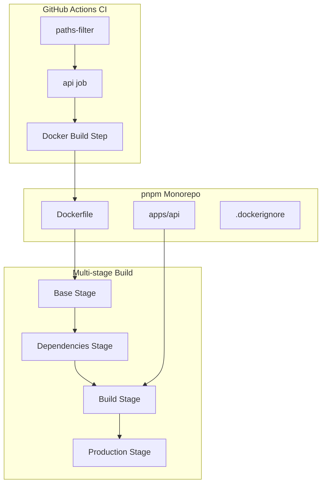
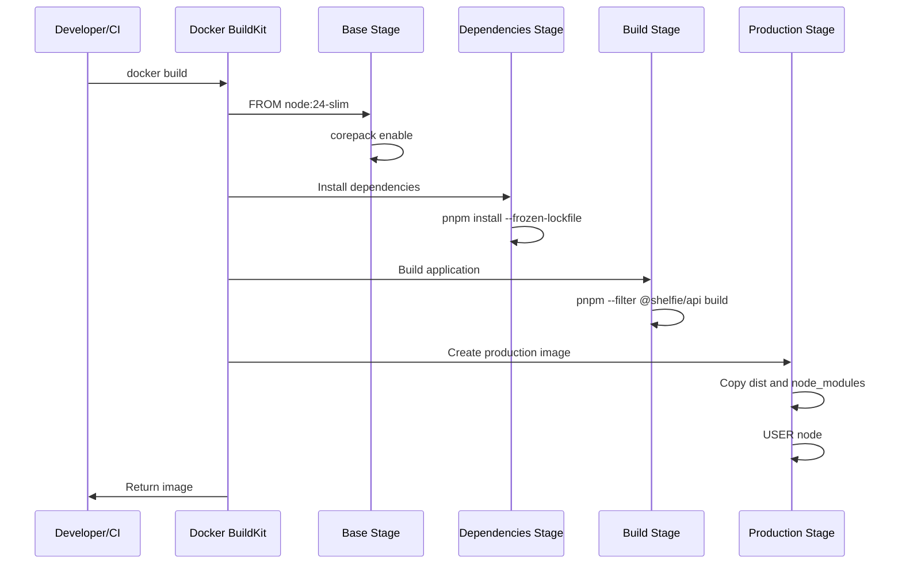
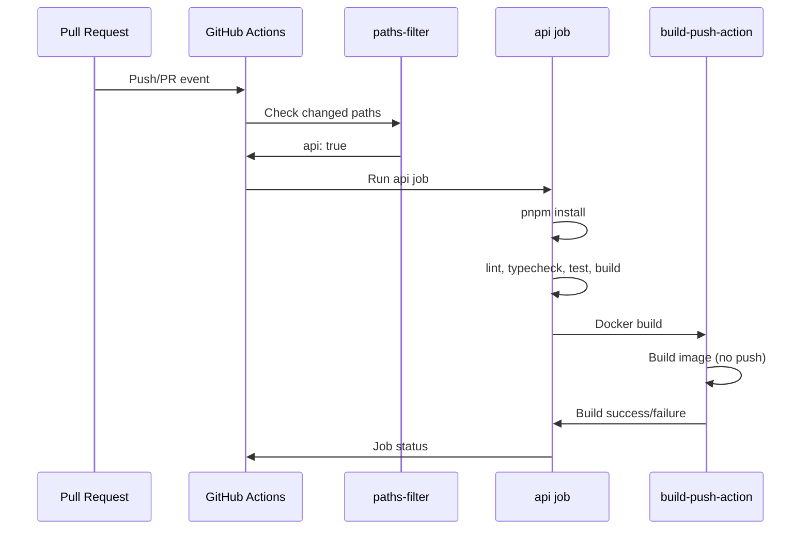

# Design Document

## Overview
**Purpose**: 本機能は apps/api のコンテナ化基盤を構築し、開発者が Cloud Run へのデプロイ準備を整えることを可能にする。
**Users**: 開発者およびCI/CDパイプラインが、Dockerイメージのビルドと検証を行う。
**Impact**: 既存の CI ワークフローに Docker ビルドステップを追加し、本番デプロイメントへの移行を支援する。

### Goals
- apps/api 用の最適化された Dockerfile を作成し、Cloud Run へのデプロイに対応する
- CI パイプラインで Docker イメージのビルド可否を継続的に検証する
- ローカル開発環境で本番同等のコンテナ実行を可能にする

### Non-Goals
- Docker イメージのレジストリへのプッシュ（本フェーズではビルド検証のみ）
- Cloud Run へのデプロイ自動化
- 本番環境の監視・ロギング設定
- ヘルスチェックエンドポイントの実装

## Architecture

### Existing Architecture Analysis
- **現在のCI構成**: GitHub Actions で paths-filter を使用した差分検知により、変更のあったパッケージのみビルドを実行
- **モノレポ構成**: pnpm workspaces で apps/api、apps/web を管理
- **ビルドシステム**: Vite を使用して TypeScript を Node.js 向けにビルド（dist/index.js を出力）
- **ランタイム**: Node.js 24、ポート 4000 で GraphQL エンドポイントを公開

### Architecture Pattern & Boundary Map

**Architecture Integration**:
- **Selected pattern**: マルチステージビルド - ビルド環境と実行環境を分離し、最終イメージサイズを最小化
- **Domain/feature boundaries**: Dockerfile は apps/api に配置し、API パッケージのビルドに特化
- **Existing patterns preserved**: 既存の CI パターン（paths-filter による差分検知）を維持
- **New components rationale**: Dockerfile と .dockerignore はコンテナ化に必須
- **Steering compliance**: モノレポ構成とビルドシステムの整合性を維持

### Technology Stack

| Layer | Choice / Version | Role in Feature | Notes |
|-------|------------------|-----------------|-------|
| Container Runtime | Docker | イメージビルド・実行環境 | BuildKit 対応 |
| Base Image | node:24-slim | Node.js 実行環境 | Debian ベース、glibc 互換性確保 |
| Package Manager | pnpm 10 (corepack) | 依存関係管理 | キャッシュマウント活用 |
| CI | GitHub Actions | ビルド検証 | docker/build-push-action 使用 |

## System Flows

### Docker Build Flow

### CI Docker Build Verification Flow

## Requirements Traceability

| Requirement | Summary | Components | Interfaces | Flows |
|-------------|---------|------------|------------|-------|
| 1.1 | Dockerfile 配置 | Dockerfile | - | Docker Build Flow |
| 1.2 | Node.js 24 ベースイメージ | Dockerfile | - | Docker Build Flow |
| 1.3 | pnpm 依存関係インストール | Dockerfile | - | Docker Build Flow |
| 1.4 | モノレポワークスペース対応 | Dockerfile | - | Docker Build Flow |
| 1.5 | ビルド成果物生成 | Dockerfile | - | Docker Build Flow |
| 1.6 | マルチステージビルド | Dockerfile | - | Docker Build Flow |
| 1.7 | 非 root ユーザー実行 | Dockerfile | - | Docker Build Flow |
| 1.8 | ポート 4000 EXPOSE | Dockerfile | - | Docker Build Flow |
| 2.1 | CI Docker ビルドトリガー | CI Workflow | paths-filter | CI Docker Build Flow |
| 2.2 | 既存 api ジョブへの追加 | CI Workflow | build-push-action | CI Docker Build Flow |
| 2.3 | ビルド失敗時のジョブ失敗 | CI Workflow | - | CI Docker Build Flow |
| 2.4 | レジストリプッシュなし | CI Workflow | build-push-action | CI Docker Build Flow |
| 3.1 | ローカル docker build | Dockerfile, .dockerignore | - | Docker Build Flow |
| 3.2 | ポート 4000 GraphQL 公開 | Dockerfile | - | - |
| 3.3 | .dockerignore 設定 | .dockerignore | - | - |

## Components and Interfaces

| Component | Domain/Layer | Intent | Req Coverage | Key Dependencies | Contracts |
|-----------|--------------|--------|--------------|------------------|-----------|
| Dockerfile | Infrastructure | API コンテナイメージのビルド定義 | 1.1-1.8, 3.1, 3.2 | node:24-slim (P0), pnpm (P0) | - |
| .dockerignore | Infrastructure | ビルドコンテキスト除外設定 | 3.3 | - | - |
| CI Workflow Update | CI/CD | Docker ビルド検証ステップ | 2.1-2.4 | docker/build-push-action (P0) | - |

### Infrastructure Layer

#### Dockerfile

| Field | Detail |
|-------|--------|
| Intent | apps/api の本番用 Docker イメージをマルチステージビルドで構築する |
| Requirements | 1.1, 1.2, 1.3, 1.4, 1.5, 1.6, 1.7, 1.8, 3.1, 3.2 |

**Responsibilities & Constraints**
- マルチステージビルドにより開発依存関係を本番イメージから除外
- pnpm workspaces のモノレポ構成に対応
- 非 root ユーザー（node）でアプリケーションを実行しセキュリティを確保
- BuildKit キャッシュマウントを活用しビルド時間を短縮

**Dependencies**
- External: node:24-slim Docker イメージ - ベースイメージ (P0)
- External: pnpm via corepack - パッケージマネージャ (P0)

**Stage Design**

| Stage | Purpose | Key Operations |
|-------|---------|----------------|
| base | 共通基盤 | Node.js 24-slim、corepack enable、作業ディレクトリ設定 |
| deps | 依存関係インストール | pnpm install --frozen-lockfile (キャッシュマウント使用) |
| build | アプリケーションビルド | pnpm --filter @shelfie/api build |
| production | 実行環境 | dist コピー、本番依存関係のみ、USER node、EXPOSE 4000 |

**Implementation Notes**
- Integration: pnpm-workspace.yaml を参照し、ワークスペース内の依存関係を解決
- Validation: `docker build` コマンドでビルド成功を検証
- Risks: 依存パッケージのビルドが必要な場合、ビルド順序の考慮が必要

#### .dockerignore

| Field | Detail |
|-------|--------|
| Intent | 不要なファイルをビルドコンテキストから除外しビルド効率を向上 |
| Requirements | 3.3 |

**Responsibilities & Constraints**
- node_modules、.git、IDE 設定などをビルドコンテキストから除外
- ビルドコンテキストサイズを最小化
- キャッシュ効率を向上

**Excluded Patterns**

| Pattern | Reason |
|---------|--------|
| node_modules | コンテナ内で再インストール |
| .git | バージョン管理情報不要 |
| dist | ビルド成果物は再生成 |
| *.md | ドキュメント不要 |
| .env* | 環境変数はランタイムで注入 |
| apps/mobile | モバイルアプリは不要 |
| apps/web | Web アプリは不要 |

### CI/CD Layer

#### CI Workflow Update

| Field | Detail |
|-------|--------|
| Intent | 既存の api ジョブに Docker ビルド検証ステップを追加 |
| Requirements | 2.1, 2.2, 2.3, 2.4 |

**Responsibilities & Constraints**
- 既存の api ジョブの最終ステップとして Docker ビルドを実行
- ビルド成功/失敗をジョブステータスに反映
- イメージをレジストリにプッシュしない（検証のみ）

**Dependencies**
- External: docker/build-push-action@v6 - Docker ビルドアクション (P0)
- Inbound: paths-filter - 差分検知による実行判定 (P0)

**Trigger Conditions**
- apps/api/** に変更がある場合
- apps/api/Dockerfile に変更がある場合（新規追加）

**Implementation Notes**
- Integration: 既存の api ジョブの `pnpm --filter @shelfie/api build` 後に Docker ビルドステップを追加
- Validation: `push: false` を設定しビルド検証のみ実行
- Risks: ビルド時間の増加（ただしキャッシュにより軽減）

## Data Models

本機能にはデータモデルの変更はない。

## Error Handling

### Error Strategy
Docker ビルドエラーは CI ジョブの失敗として伝播し、開発者に通知される。

### Error Categories and Responses

| Error Type | Cause | Response | Recovery |
|------------|-------|----------|----------|
| Dependency Resolution | pnpm-lock.yaml と package.json の不整合 | CI 失敗 | pnpm-lock.yaml を更新 |
| Build Failure | TypeScript コンパイルエラー | CI 失敗 | ソースコード修正 |
| Base Image Pull | ネットワークエラー、イメージ不存在 | CI 失敗 | リトライまたはイメージタグ確認 |
| Dockerfile Syntax | 構文エラー | CI 失敗 | Dockerfile 修正 |

### Monitoring
- GitHub Actions のジョブステータスで成功/失敗を確認
- PR のチェックステータスに反映

## Testing Strategy

### Unit Tests
- 本機能に単体テストは不要（インフラストラクチャ設定のため）

### Integration Tests
1. **ローカル Docker ビルドテスト**: `docker build -t shelfie-api .` がエラーなく完了
2. **コンテナ起動テスト**: ビルドしたイメージでコンテナが起動し、ポート 4000 で応答
3. **GraphQL エンドポイント検証**: `/graphql` エンドポイントへのリクエストが成功

### E2E Tests
- CI パイプラインで Docker ビルドステップが正常に実行されることを PR で検証

## Security Considerations

- **非 root 実行**: `USER node` ディレクティブにより、コンテナ内プロセスを非特権ユーザーで実行
- **最小イメージ**: slim ベースイメージとマルチステージビルドにより攻撃対象領域を削減
- **依存関係固定**: `--frozen-lockfile` により、検証済みの依存関係のみをインストール
- **環境変数分離**: .dockerignore で .env ファイルを除外し、ランタイムで注入

## Performance & Scalability

- **ビルドキャッシュ**: BuildKit キャッシュマウントにより、依存関係の再ダウンロードを回避
- **レイヤーキャッシュ**: Dockerfile の命令順序を最適化し、変更頻度の低いレイヤーを先に配置
- **イメージサイズ目標**: マルチステージビルドにより 200MB 以下を目指す
