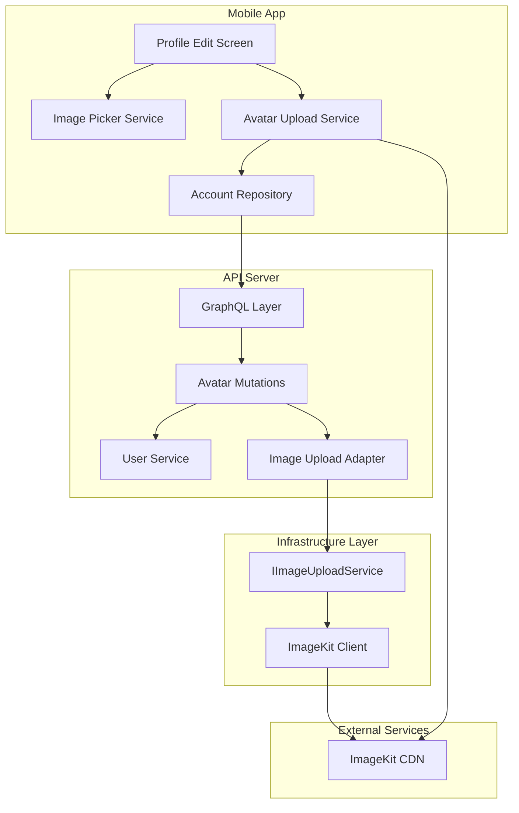
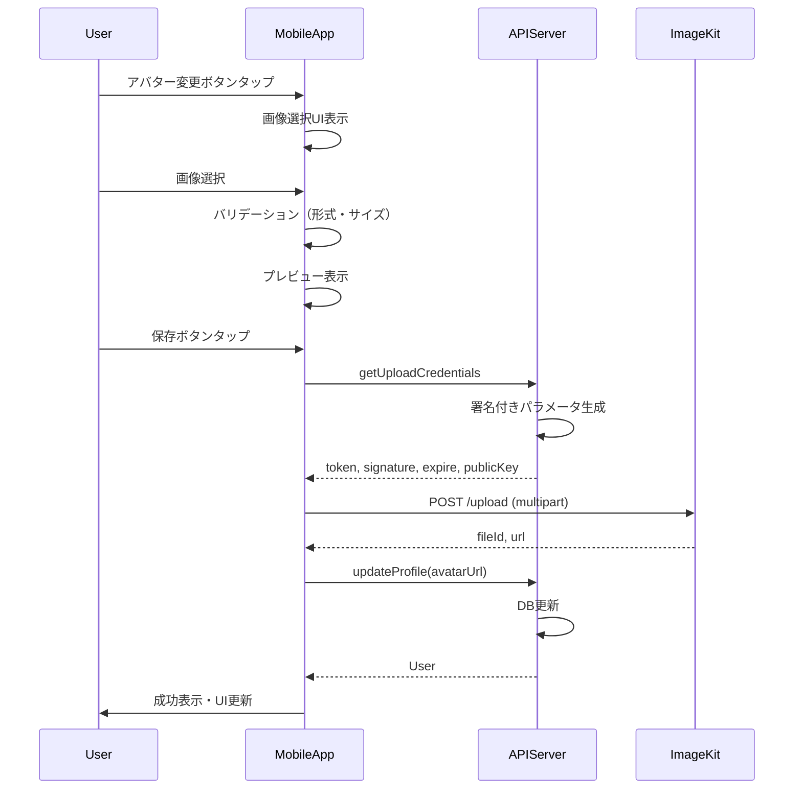

# Design Document: Avatar Upload

## Overview

**Purpose**: 本機能は、ユーザーがプロフィール画像（アバター）をカスタマイズできる機能を提供する。ImageKitを画像配信サービスとして使用し、モバイルアプリからクライアントサイドで直接アップロードする方式を採用する。

**Users**: Shelfieモバイルアプリのユーザーがプロフィール編集画面でアバター画像を変更する。

**Impact**: 既存のユーザープロフィール機能を拡張し、画像アップロードフローを追加する。サーバー側にはInfraレイヤを新設し、ImageKit連携を抽象化する。

### Goals

- ユーザーがモバイルアプリからアバター画像を選択・アップロードできる
- ImageKitのクライアントサイドアップロードAPIを使用した安全な画像アップロード
- 将来的なサービス差し替えを考慮したInfraレイヤの抽象化
- 画像配信の最適化（リサイズ、キャッシュ）

### Non-Goals

- 画像の加工・編集機能（クロップ、フィルタ等）
- 複数画像のアップロード
- Webアプリからのアバターアップロード（将来対応）
- 画像の削除機能（ImageKit上からの削除）

## Architecture

### Architecture Pattern & Boundary Map



**Architecture Integration**:
- **選択パターン**: Feature-first + Clean Architecture（既存アーキテクチャに準拠）
- **ドメイン境界**: Infraレイヤを新設し、外部サービス連携を抽象化
- **既存パターン維持**: Barrel Export、Result型エラーハンドリング、Riverpod Provider
- **新規コンポーネント**: ImageKit連携のためのInfraレイヤとアップロードサービス
- **Steering準拠**: Type Safety、ライブラリエコシステム活用

### Technology Stack

| Layer | Choice / Version | Role in Feature | Notes |
|-------|------------------|-----------------|-------|
| Mobile | Flutter 3.x / Dart 3.x | UI、画像選択、アップロード処理 | 既存スタック |
| Mobile | image_picker | デバイスからの画像選択 | 既存導入済み |
| Mobile | http package | ImageKitへのマルチパートアップロード | 新規追加 |
| Backend | Node.js 24+ / Express / Apollo Server | GraphQL API | 既存スタック |
| Backend | imagekit (npm) | 署名付きアップロードパラメータ生成 | 新規追加 |
| Data | PostgreSQL / Drizzle ORM | avatarUrl保存 | 既存usersテーブル |
| CDN | ImageKit | 画像配信・変換 | 新規外部サービス |

## System Flows

### アバターアップロードフロー



**Key Decisions**:
- クライアントサイドアップロードを採用し、サーバー負荷を軽減
- 署名付きパラメータにより、Private Keyをクライアントに露出しない
- アップロード成功後にプロフィール更新を実行し、トランザクション的な整合性を確保

## Requirements Traceability

| Requirement | Summary | Components | Interfaces | Flows |
|-------------|---------|------------|------------|-------|
| 1.1 | 画像選択UIの表示 | ImagePickerService, AvatarEditor | - | アップロードフロー |
| 1.2 | プレビュー表示 | AvatarEditor, ProfileFormState | - | アップロードフロー |
| 1.3, 1.4, 1.5 | ファイルバリデーション | AvatarUploadService | ImageValidationResult | アップロードフロー |
| 2.1, 2.2, 2.3, 2.4 | 署名付きURL取得 | ImageUploadAdapter, IImageUploadService | getUploadCredentials | アップロードフロー |
| 3.1, 3.2, 3.3, 3.4 | Infraレイヤ抽象化 | IImageUploadService, ImageKitClient | - | - |
| 4.1, 4.2, 4.3, 4.4 | 画像アップロード実行 | AvatarUploadService | uploadToImageKit | アップロードフロー |
| 5.1, 5.2, 5.3, 5.4 | プロフィール更新 | AccountRepository, UserService | updateProfile | アップロードフロー |
| 6.1, 6.2, 6.3, 6.4 | アバター表示 | UserAvatar | - | - |

## Components and Interfaces

### Summary

| Component | Domain/Layer | Intent | Req Coverage | Key Dependencies | Contracts |
|-----------|--------------|--------|--------------|------------------|-----------|
| AvatarUploadService | Mobile/Application | 画像アップロードのオーケストレーション | 1.3-1.5, 4.1-4.4 | AccountRepository (P0), http (P0) | Service |
| IImageUploadService | API/Infra | 画像アップロードサービスの抽象化 | 3.1, 3.2 | - | Service |
| ImageKitClient | API/Infra | ImageKit SDK連携 | 3.2, 3.3, 3.4 | imagekit npm (P0) | Service |
| ImageUploadAdapter | API/Feature | GraphQL Mutation実装 | 2.1-2.4 | IImageUploadService (P0) | API |
| UserAvatar | Mobile/Presentation | アバター画像表示 | 6.1-6.4 | - | State |

### API Server / Infrastructure Layer

#### IImageUploadService

| Field | Detail |
|-------|--------|
| Intent | 画像アップロードサービスの抽象インターフェース定義 |
| Requirements | 3.1, 3.2 |

**Responsibilities & Constraints**
- 画像アップロードサービスの共通インターフェースを定義
- 具体的な実装（ImageKit, Cloudinary等）に依存しない
- 将来的なサービス差し替えを容易にする

**Dependencies**
- Inbound: ImageUploadAdapter - 署名付きパラメータ取得 (P0)
- External: なし

**Contracts**: Service [x] / API [ ] / Event [ ] / Batch [ ] / State [ ]

##### Service Interface

```typescript
interface UploadCredentials {
  token: string;
  signature: string;
  expire: number;
  publicKey: string;
  uploadEndpoint: string;
}

interface ImageUploadServiceErrors =
  | { code: "CONFIGURATION_ERROR"; message: string }
  | { code: "SERVICE_UNAVAILABLE"; message: string };

interface IImageUploadService {
  getUploadCredentials(userId: number): Result<UploadCredentials, ImageUploadServiceErrors>;
}
```

- Preconditions: userId は有効な認証済みユーザーID
- Postconditions: 有効な署名付きパラメータを返却
- Invariants: Private Keyは外部に露出しない

**Implementation Notes**
- Integration: 環境変数から認証情報を取得（IMAGEKIT_PUBLIC_KEY, IMAGEKIT_PRIVATE_KEY, IMAGEKIT_URL_ENDPOINT）
- Validation: 環境変数の存在チェック、署名の有効期限設定（デフォルト30分）
- Risks: ImageKit SDKのバージョン互換性

---

#### ImageKitClient

| Field | Detail |
|-------|--------|
| Intent | ImageKit SDKを使用した署名付きパラメータ生成 |
| Requirements | 3.2, 3.3, 3.4 |

**Responsibilities & Constraints**
- ImageKit固有の実装をカプセル化
- imagekit npm パッケージを使用
- 環境変数から認証情報を取得

**Dependencies**
- Inbound: IImageUploadService経由でアクセス (P0)
- External: imagekit npm package - 署名生成 (P0)

**Contracts**: Service [x] / API [ ] / Event [ ] / Batch [ ] / State [ ]

##### Service Interface

```typescript
import ImageKit from "imagekit";

interface ImageKitConfig {
  publicKey: string;
  privateKey: string;
  urlEndpoint: string;
}

function createImageKitClient(config: ImageKitConfig): IImageUploadService {
  const imagekit = new ImageKit({
    publicKey: config.publicKey,
    privateKey: config.privateKey,
    urlEndpoint: config.urlEndpoint,
  });

  return {
    getUploadCredentials(userId: number): Result<UploadCredentials, ImageUploadServiceErrors> {
      const authParams = imagekit.getAuthenticationParameters();
      return ok({
        token: authParams.token,
        signature: authParams.signature,
        expire: authParams.expire,
        publicKey: config.publicKey,
        uploadEndpoint: "https://upload.imagekit.io/api/v1/files/upload",
      });
    },
  };
}
```

- Preconditions: 有効なImageKit認証情報が設定済み
- Postconditions: SDK経由で署名付きパラメータを生成
- Invariants: Private Keyはサーバー内部でのみ使用

**Implementation Notes**
- Integration: ConfigManagerからImageKit設定を取得
- Validation: SDK初期化時に認証情報の妥当性を検証
- Risks: ImageKit API変更、SDKバージョンアップ

---

### API Server / Feature Layer

#### ImageUploadAdapter (GraphQL)

| Field | Detail |
|-------|--------|
| Intent | 署名付きアップロードパラメータ取得のGraphQL Mutation |
| Requirements | 2.1, 2.2, 2.3, 2.4 |

**Responsibilities & Constraints**
- 認証チェック（loggedIn scope）
- IImageUploadServiceを呼び出して署名付きパラメータを返却
- エラーハンドリング

**Dependencies**
- Inbound: Mobile App - GraphQL経由 (P0)
- Outbound: IImageUploadService - 署名生成 (P0)

**Contracts**: Service [ ] / API [x] / Event [ ] / Batch [ ] / State [ ]

##### API Contract

| Method | Endpoint | Request | Response | Errors |
|--------|----------|---------|----------|--------|
| Query | getUploadCredentials | - | UploadCredentials | UNAUTHENTICATED, SERVICE_UNAVAILABLE |

**GraphQL Schema**:

```graphql
type UploadCredentials {
  "一意のアップロードトークン"
  token: String!
  "HMAC-SHA1署名"
  signature: String!
  "有効期限（Unix timestamp）"
  expire: Int!
  "ImageKit Public Key"
  publicKey: String!
  "アップロードエンドポイントURL"
  uploadEndpoint: String!
}

extend type Query {
  "署名付きアップロードパラメータを取得"
  getUploadCredentials: UploadCredentials!
}
```

**Implementation Notes**
- Integration: authScopes: { loggedIn: true } で認証を強制
- Validation: ユーザー認証状態の検証
- Risks: レート制限の考慮（将来的）

---

### Mobile / Application Layer

#### AvatarUploadService

| Field | Detail |
|-------|--------|
| Intent | 画像選択からアップロード、プロフィール更新までのオーケストレーション |
| Requirements | 1.3, 1.4, 1.5, 4.1, 4.2, 4.3, 4.4 |

**Responsibilities & Constraints**
- 画像ファイルのバリデーション（形式、サイズ）
- 署名付きパラメータの取得
- ImageKitへのマルチパートアップロード
- プロフィール更新の実行
- エラーハンドリングとリトライ

**Dependencies**
- Inbound: ProfileEditNotifier - アップロード開始 (P0)
- Outbound: AccountRepository - プロフィール更新 (P0)
- External: ImageKit Upload API - 画像アップロード (P0)
- External: http package - HTTP通信 (P0)

**Contracts**: Service [x] / API [ ] / Event [ ] / Batch [ ] / State [ ]

##### Service Interface

```dart
class ImageValidationResult {
  final bool isValid;
  final String? errorMessage;
  final ImageValidationErrorType? errorType;
}

enum ImageValidationErrorType {
  invalidFormat,
  fileTooLarge,
}

class AvatarUploadResult {
  final String fileId;
  final String url;
}

abstract class AvatarUploadService {
  ImageValidationResult validateImage(XFile file);

  Future<Either<Failure, UploadCredentials>> getUploadCredentials();

  Future<Either<Failure, AvatarUploadResult>> uploadToImageKit({
    required XFile file,
    required UploadCredentials credentials,
    void Function(double progress)? onProgress,
  });

  Future<Either<Failure, UserProfile>> uploadAndUpdateProfile({
    required XFile file,
    required String name,
    void Function(double progress)? onProgress,
  });
}
```

- Preconditions: 有効な画像ファイル、認証済みユーザー
- Postconditions: ImageKitへのアップロード完了、プロフィール更新完了
- Invariants: アップロード中は進捗を通知

**Implementation Notes**
- Integration: http.MultipartRequestを使用してImageKitにアップロード
- Validation: JPEG/PNG/WebP形式、最大5MBのファイルサイズ制限
- Risks: ネットワーク切断時のリトライ、アップロード失敗時のロールバック不要（冪等）

---

### Mobile / Presentation Layer

#### UserAvatar (既存拡張)

| Field | Detail |
|-------|--------|
| Intent | アバター画像の表示とImageKit URL変換 |
| Requirements | 6.1, 6.2, 6.3, 6.4 |

**Responsibilities & Constraints**
- ImageKitのURL変換機能を使用した最適サイズ取得
- ローディング中のプレースホルダー表示
- エラー時のデフォルトアバター表示

**Dependencies**
- Inbound: 各画面のUIコンポーネント (P1)
- External: ImageKit CDN - 画像配信 (P0)

**Contracts**: Service [ ] / API [ ] / Event [ ] / Batch [ ] / State [x]

##### State Management

- State model: avatarUrl (String?)、imageProvider (ImageProvider?)
- Persistence: なし（親コンポーネントから受け取る）
- Concurrency: Stateless widget

**Implementation Notes**
- Integration: ImageKitのURL変換パラメータを使用（tr=w-{size},h-{size},fo-face）
- Validation: null URLの場合はデフォルトアイコン表示
- Risks: ImageKit CDNの可用性

## Data Models

### Domain Model

既存の`User`エンティティに`avatarUrl`フィールドが存在（変更不要）。

**Entity: User**
- id: number (PK)
- email: string
- firebaseUid: string
- name: string | null
- avatarUrl: string | null (ImageKit配信URL)
- createdAt: Date
- updatedAt: Date

### Logical Data Model

既存の`users`テーブルの`avatar_url`カラムを使用。スキーマ変更不要。

```typescript
// 既存のusersテーブル定義（変更なし）
export const users = pgTable("users", {
  id: integer("id").primaryKey().generatedAlwaysAsIdentity(),
  email: text("email").notNull().unique(),
  firebaseUid: text("firebase_uid").notNull().unique(),
  name: text("name"),
  avatarUrl: text("avatar_url"),
  createdAt: timestamp("created_at").defaultNow().notNull(),
  updatedAt: timestamp("updated_at").defaultNow().notNull(),
});
```

### Data Contracts & Integration

**ImageKit Upload Request**:
```
POST https://upload.imagekit.io/api/v1/files/upload
Content-Type: multipart/form-data

Fields:
- file: binary (required)
- fileName: string (required)
- publicKey: string (required)
- signature: string (required)
- expire: number (required)
- token: string (required)
- folder: "/avatars" (optional)
- useUniqueFileName: true (optional)
```

**ImageKit Upload Response**:
```json
{
  "fileId": "string",
  "name": "string",
  "url": "https://ik.imagekit.io/...",
  "thumbnailUrl": "string",
  "height": 100,
  "width": 100,
  "size": 1234,
  "filePath": "/avatars/...",
  "fileType": "image"
}
```

## Error Handling

### Error Strategy

| Category | Error | User Message | Recovery |
|----------|-------|--------------|----------|
| Validation | 未対応形式 | JPEG、PNG、WebP形式の画像を選択してください | 再選択を促す |
| Validation | サイズ超過 | 画像サイズは5MB以下にしてください | 再選択を促す |
| Network | 接続エラー | ネットワーク接続を確認してください | リトライボタン表示 |
| Auth | 未認証 | 再度ログインしてください | ログイン画面へ遷移 |
| Server | ImageKit接続失敗 | サーバーエラーが発生しました | リトライボタン表示 |
| Server | プロフィール更新失敗 | 保存に失敗しました | リトライボタン表示 |

### Error Categories and Responses

**User Errors (4xx)**:
- 未対応形式選択 -> バリデーションエラーメッセージ表示
- サイズ超過 -> バリデーションエラーメッセージ表示
- 未認証 -> ログイン画面へ誘導

**System Errors (5xx)**:
- ImageKit接続失敗 -> サーバーエラーログ出力、ユーザーにリトライ促す
- プロフィール更新失敗 -> グレースフルデグラデーション（画像はImageKitにアップロード済み）

### Monitoring

- エラー発生時はサーバー側でPinoロガーでログ出力
- 本番環境では将来的にFirebase Crashlyticsへ報告

## Testing Strategy

### Unit Tests

- **IImageUploadService**: 署名付きパラメータ生成のテスト
- **ImageKitClient**: ImageKit SDK連携のモックテスト
- **AvatarUploadService.validateImage**: ファイル形式・サイズバリデーションのテスト
- **ProfileEditNotifier**: アップロード状態管理のテスト

### Integration Tests

- **getUploadCredentials Query**: 認証済み/未認証ユーザーでのテスト
- **updateProfile Mutation**: avatarUrl更新を含むテスト
- **AvatarUploadService.uploadAndUpdateProfile**: エンドツーエンドのモックテスト

### Widget Tests

- **AvatarEditor**: 画像選択UI、プレビュー表示のテスト
- **UserAvatar**: URL有無、ローディング、エラー状態のテスト

### E2E Tests (Manual)

- 画像選択からアップロード、表示までの完全フロー
- 各種エラーケース（形式エラー、サイズエラー、ネットワークエラー）

## Security Considerations

### Authentication

- 署名付きパラメータ取得はloggedIn scope必須
- ImageKit Private Keyはサーバー側のみで使用、クライアントに露出しない

### Data Protection

- 署名付きパラメータの有効期限設定（デフォルト30分）
- ImageKitのフォルダ構造でユーザーデータを分離（/avatars/）

### Input Validation

- ファイル形式のMIMEタイプ検証（image/jpeg, image/png, image/webp）
- ファイルサイズ制限（5MB）

## Performance & Scalability

### Target Metrics

- アップロード完了まで: 5秒以内（5MB画像、一般的なモバイル回線）
- 画像表示: ImageKitのCDNによる高速配信

### Optimization

- ImageKitのURL変換機能で表示サイズに最適化した画像を取得
- クライアントサイドアップロードによるサーバー負荷軽減
- 圧縮・リサイズはImageKitのTransformation機能で実行
