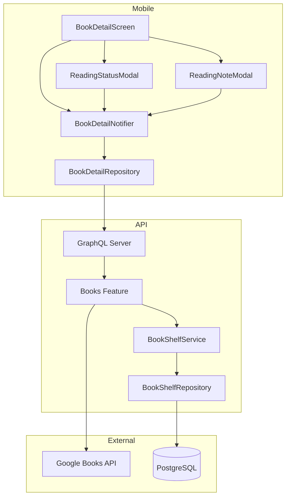
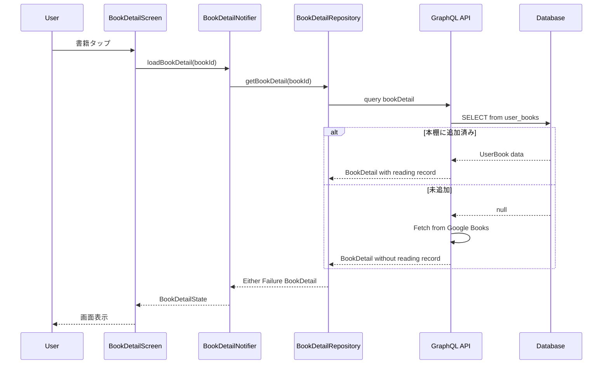
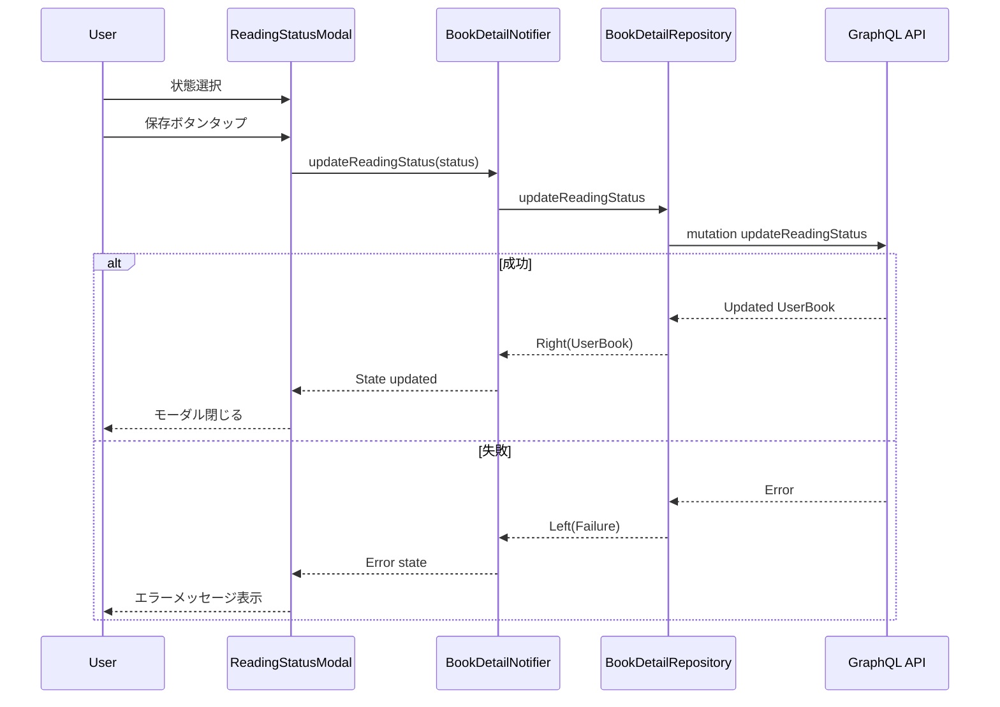
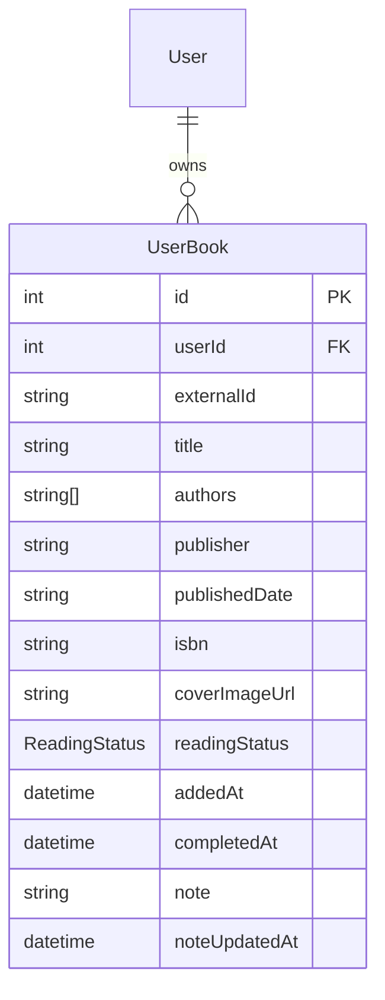

# Technical Design Document

## Overview

**Purpose**: 本詳細画面は、ユーザーが書籍検索結果からタップした書籍の詳細情報を表示し、本棚への追加・読書記録の管理機能を提供する。

**Users**: 読書記録を管理したいユーザーが、書籍の詳細確認、本棚追加、読書状態・メモの更新に利用する。

**Impact**: 既存の `userBooks` テーブルに読書状態・読了日・読書メモフィールドを追加し、モバイルアプリに新しい Feature モジュール `book_detail` を追加する。

### Goals

- 書籍の詳細情報（表紙、タイトル、著者、書誌情報、作品紹介）を表示
- 書籍の本棚追加状態に応じた動的な UI 表示
- 読書状態（積読/読書中/読了/読まない）の管理
- 読書メモの記録・編集
- 外部リンク（Amazon、公式サイト）への遷移

### Non-Goals

- 書籍のレビュー・評価機能
- 他ユーザーとの読書記録共有
- 読書統計・分析機能
- オフラインでの読書記録編集（将来検討）

## Architecture

### Existing Architecture Analysis

**現行パターン**:
- モバイル: Feature-first + Clean Architecture（Presentation/Application/Domain/Infrastructure）
- API: Feature モジュール + Barrel Export パターン
- データ: Drizzle ORM + PostgreSQL

**維持すべきパターン**:
- Riverpod による状態管理
- freezed によるイミュータブルデータモデル
- Ferry による型安全な GraphQL 通信
- fpdart の Either 型によるエラーハンドリング

**拡張ポイント**:
- 既存の `/books/:bookId` ルート（プレースホルダー）を実装に置き換え
- `userBooks` テーブルに `reading_status`、`completed_at`、`note`、`note_updated_at` カラムを追加
- 既存の `books` Feature に Query/Mutation を追加

### Architecture Pattern & Boundary Map



**Architecture Integration**:
- Selected pattern: Feature-first + Clean Architecture（既存パターン継承）
- Domain boundaries: `book_detail` Feature は `books` Feature の拡張として実装
- Existing patterns preserved: Riverpod、freezed、Ferry、go_router
- New components rationale: 本詳細画面専用の状態管理と UI コンポーネントが必要
- Steering compliance: mobile-tech.md のライブラリ選定に準拠

### Technology Stack

| Layer | Choice / Version | Role in Feature | Notes |
|-------|------------------|-----------------|-------|
| Mobile UI | Flutter 3.x | 本詳細画面、モーダルシート | Material 3 準拠 |
| Mobile State | Riverpod 2.5+ | BookDetailNotifier | @riverpod アノテーション使用 |
| Mobile Data | Ferry 0.16+ | GraphQL クライアント | 型安全なクエリ生成 |
| Backend | Apollo Server 5.x + Pothos 4.x | GraphQL API | 既存インフラ活用 |
| Database | PostgreSQL 16+ + Drizzle | データ永続化 | スキーマ拡張 |

## System Flows

### 本詳細画面表示フロー



### 読書状態更新フロー



## Requirements Traceability

| Requirement | Summary | Components | Interfaces | Flows |
|-------------|---------|------------|------------|-------|
| 1.1, 1.2, 1.3, 1.4, 1.5 | 書籍基本情報表示 | BookDetailScreen, BookInfoSection | BookDetail | 本詳細画面表示 |
| 2.1, 2.2, 2.3, 2.4 | 画面ナビゲーション | BookDetailScreen, AppBar | - | - |
| 3.1, 3.2, 3.3, 3.4 | 本棚への追加 | BookDetailScreen, BookDetailNotifier | addBookToShelf | - |
| 4.1, 4.2, 4.3, 4.4, 4.5, 4.6 | 読書記録表示 | ReadingRecordSection | BookDetail | 本詳細画面表示 |
| 5.1, 5.2, 5.3, 5.4, 5.5, 5.6 | 読書状態編集 | ReadingStatusModal, BookDetailNotifier | updateReadingStatus | 読書状態更新 |
| 6.1, 6.2, 6.3, 6.4, 6.5, 6.6, 6.7 | 読書メモ編集 | ReadingNoteModal, BookDetailNotifier | updateReadingNote | - |
| 7.1, 7.2, 7.3 | 外部リンク | ExternalLinksSection | - | - |

## Components and Interfaces

| Component | Domain/Layer | Intent | Req Coverage | Key Dependencies | Contracts |
|-----------|--------------|--------|--------------|------------------|-----------|
| BookDetailScreen | Mobile/Presentation | 本詳細画面の UI 表示 | 1.1-1.5, 2.1-2.4, 3.1-3.4, 4.1-4.6 | BookDetailNotifier (P0) | State |
| ReadingStatusModal | Mobile/Presentation | 読書状態編集モーダル | 5.1-5.6 | BookDetailNotifier (P0) | State |
| ReadingNoteModal | Mobile/Presentation | 読書メモ編集モーダル | 6.1-6.7 | BookDetailNotifier (P0) | State |
| BookDetailNotifier | Mobile/Application | 本詳細画面の状態管理 | All | BookDetailRepository (P0) | Service |
| BookDetailRepository | Mobile/Data | GraphQL 通信 | All | Ferry Client (P0) | Service |
| BookShelfService | API/Domain | 読書記録ビジネスロジック | 3.1-3.4, 5.1-5.6, 6.1-6.7 | BookShelfRepository (P0) | Service |
| userBooks Schema | API/Data | DB スキーマ | 4.1-4.6, 5.1-5.6, 6.1-6.7 | - | - |

### Mobile / Presentation Layer

#### BookDetailScreen

| Field | Detail |
|-------|--------|
| Intent | 書籍詳細情報と読書記録を表示し、ユーザーアクションをハンドリング |
| Requirements | 1.1, 1.2, 1.3, 1.4, 1.5, 2.1, 2.2, 2.3, 2.4, 3.1, 3.2, 3.3, 3.4, 4.1, 4.2, 4.3, 4.4, 4.5, 4.6 |

**Responsibilities & Constraints**
- 書籍基本情報（表紙、タイトル、著者、書誌情報、作品紹介）の表示
- 本棚追加状態に応じた UI 分岐（追加ボタン vs 読書記録）
- AppBar に閉じるボタン（x）と共有ボタンを配置
- データが存在しないフィールドの非表示処理

**Dependencies**
- Inbound: AppRouter - ルートパラメータ (P0)
- Outbound: BookDetailNotifier - 状態取得・更新 (P0)
- Outbound: ReadingStatusModal, ReadingNoteModal - モーダル表示 (P1)

**Contracts**: State [x]

##### State Management

```dart
@freezed
sealed class BookDetailState with _$BookDetailState {
  const factory BookDetailState.initial() = BookDetailInitial;
  const factory BookDetailState.loading() = BookDetailLoading;
  const factory BookDetailState.loaded({
    required BookDetail book,
    required bool isInShelf,
  }) = BookDetailLoaded;
  const factory BookDetailState.error({
    required Failure failure,
  }) = BookDetailError;
  const factory BookDetailState.adding() = BookDetailAdding;
}
```

**Implementation Notes**
- Integration: go_router の pathParameters から bookId を取得
- Validation: bookId が空の場合はエラー画面表示
- Risks: 大きな表紙画像のロード時間（cached_network_image で対応）

#### ReadingStatusModal

| Field | Detail |
|-------|--------|
| Intent | 読書状態の選択と保存を行う下部モーダル |
| Requirements | 5.1, 5.2, 5.3, 5.4, 5.5, 5.6 |

**Responsibilities & Constraints**
- 4 つの読書状態（積読/読書中/読了/読まない）をラジオボタンで表示
- 現在の状態を初期選択として表示
- 保存・キャンセルボタンのアクション処理
- 「読了」選択時は自動的に読了日を現在日時に設定

**Dependencies**
- Outbound: BookDetailNotifier - 状態更新 (P0)

**Contracts**: State [x]

##### State Management

```dart
@freezed
class ReadingStatusModalState with _$ReadingStatusModalState {
  const factory ReadingStatusModalState({
    required ReadingStatus selectedStatus,
    required ReadingStatus originalStatus,
    @Default(false) bool isSaving,
    Failure? error,
  }) = _ReadingStatusModalState;
}

enum ReadingStatus {
  backlog,    // 積読
  reading,    // 読書中
  completed,  // 読了
  dropped,    // 読まない
}
```

**Implementation Notes**
- Integration: showModalBottomSheet で表示、isScrollControlled: true
- Validation: 変更がない場合は保存ボタンを無効化

#### ReadingNoteModal

| Field | Detail |
|-------|--------|
| Intent | 読書メモの入力と保存を行う下部モーダル |
| Requirements | 6.1, 6.2, 6.3, 6.4, 6.5, 6.6, 6.7 |

**Responsibilities & Constraints**
- 複数行テキストエリアでメモ入力
- 既存メモがある場合は初期値として表示
- 保存・キャンセルボタンのアクション処理
- 文字数制限なし（API 側で制限する場合は別途対応）

**Dependencies**
- Outbound: BookDetailNotifier - メモ更新 (P0)

**Contracts**: State [x]

##### State Management

```dart
@freezed
class ReadingNoteModalState with _$ReadingNoteModalState {
  const factory ReadingNoteModalState({
    required String note,
    required String originalNote,
    @Default(false) bool isSaving,
    Failure? error,
  }) = _ReadingNoteModalState;
}
```

**Implementation Notes**
- Integration: showModalBottomSheet で表示、キーボード対応のため isScrollControlled: true
- Validation: 空文字での保存を許可（メモ削除として扱う）

### Mobile / Application Layer

#### BookDetailNotifier

| Field | Detail |
|-------|--------|
| Intent | 本詳細画面の状態管理とビジネスロジック |
| Requirements | All |

**Responsibilities & Constraints**
- 書籍詳細データの取得と状態管理
- 本棚追加/読書状態更新/メモ更新の処理
- エラーハンドリングと状態遷移

**Dependencies**
- Outbound: BookDetailRepository - データ取得・更新 (P0)

**Contracts**: Service [x]

##### Service Interface

```dart
@riverpod
class BookDetailNotifier extends _$BookDetailNotifier {
  Future<void> loadBookDetail(String bookId);
  Future<Either<Failure, UserBook>> addToShelf();
  Future<Either<Failure, UserBook>> updateReadingStatus(ReadingStatus status);
  Future<Either<Failure, UserBook>> updateReadingNote(String note);
}
```

- Preconditions: bookId は有効な Google Books ID
- Postconditions: 状態が適切に更新され UI に反映される
- Invariants: 認証済みユーザーのみ本棚追加・編集可能

### Mobile / Data Layer

#### BookDetailRepository

| Field | Detail |
|-------|--------|
| Intent | GraphQL API との通信を担当 |
| Requirements | All |

**Responsibilities & Constraints**
- Ferry クライアントを使用した型安全な GraphQL 通信
- Either 型によるエラーハンドリング
- ネットワークエラー・タイムアウトの適切な処理

**Dependencies**
- Outbound: Ferry Client - GraphQL 通信 (P0)

**Contracts**: Service [x]

##### Service Interface

```dart
@riverpod
BookDetailRepository bookDetailRepository(Ref ref);

class BookDetailRepository {
  Future<Either<Failure, BookDetail>> getBookDetail({
    required String bookId,
  });

  Future<Either<Failure, UserBook>> addBookToShelf({
    required String externalId,
    required String title,
    required List<String> authors,
    String? publisher,
    String? publishedDate,
    String? isbn,
    String? coverImageUrl,
    String? description,
  });

  Future<Either<Failure, UserBook>> updateReadingStatus({
    required int userBookId,
    required ReadingStatus status,
  });

  Future<Either<Failure, UserBook>> updateReadingNote({
    required int userBookId,
    required String note,
  });
}
```

### API / Domain Layer

#### BookShelfService (Extension)

| Field | Detail |
|-------|--------|
| Intent | 読書記録のビジネスロジック（既存サービスの拡張） |
| Requirements | 5.1-5.6, 6.1-6.7 |

**Responsibilities & Constraints**
- 読書状態更新時の読了日自動設定
- メモ更新時の最終更新日時記録

**Dependencies**
- Outbound: BookShelfRepository - データアクセス (P0)

**Contracts**: Service [x]

##### Service Interface

```typescript
export interface BookShelfService {
  // Existing
  addBookToShelf(input: AddBookToShelfInput): Promise<Result<UserBook, BookShelfErrors>>;

  // New
  updateReadingStatus(input: UpdateReadingStatusInput): Promise<Result<UserBook, BookShelfErrors>>;
  updateReadingNote(input: UpdateReadingNoteInput): Promise<Result<UserBook, BookShelfErrors>>;
  getUserBookByExternalId(userId: number, externalId: string): Promise<Result<UserBook | null, BookShelfErrors>>;
}

interface UpdateReadingStatusInput {
  userBookId: number;
  userId: number;
  status: ReadingStatus;
}

interface UpdateReadingNoteInput {
  userBookId: number;
  userId: number;
  note: string;
}

type ReadingStatus = 'backlog' | 'reading' | 'completed' | 'dropped';
```

- Preconditions: userBookId が存在し、userId が所有者である
- Postconditions: 読書状態/メモが更新され、関連日時が適切に設定される
- Invariants: 他ユーザーのデータは更新不可

### API / GraphQL Layer

#### GraphQL Schema Extensions

**Contracts**: API [x]

##### API Contract

| Method | Endpoint | Request | Response | Errors |
|--------|----------|---------|----------|--------|
| Query | bookDetail | bookId: String! | BookDetail | NOT_FOUND |
| Query | userBookByExternalId | externalId: String! | UserBook | UNAUTHENTICATED |
| Mutation | updateReadingStatus | userBookId: Int!, status: ReadingStatus! | UserBook | UNAUTHENTICATED, NOT_FOUND, FORBIDDEN |
| Mutation | updateReadingNote | userBookId: Int!, note: String! | UserBook | UNAUTHENTICATED, NOT_FOUND, FORBIDDEN |

```graphql
enum ReadingStatus {
  BACKLOG
  READING
  COMPLETED
  DROPPED
}

type BookDetail {
  id: String!
  title: String!
  authors: [String!]!
  publisher: String
  publishedDate: String
  pageCount: Int
  categories: [String!]
  description: String
  isbn: String
  coverImageUrl: String
  amazonUrl: String
  infoLink: String
}

extend type UserBook {
  readingStatus: ReadingStatus!
  completedAt: DateTime
  note: String
  noteUpdatedAt: DateTime
}

extend type Query {
  bookDetail(bookId: String!): BookDetail
  userBookByExternalId(externalId: String!): UserBook
}

extend type Mutation {
  updateReadingStatus(userBookId: Int!, status: ReadingStatus!): UserBook!
  updateReadingNote(userBookId: Int!, note: String!): UserBook!
}
```

## Data Models

### Domain Model



**Aggregates**: UserBook はユーザーの読書記録を管理する集約ルート

**Invariants**:
- `completedAt` は `readingStatus` が `completed` の場合のみ設定
- `noteUpdatedAt` は `note` が更新されたときのみ更新

### Physical Data Model

#### Schema Extension (Drizzle)

```typescript
import { pgEnum } from "drizzle-orm/pg-core";

export const readingStatusEnum = pgEnum('reading_status', [
  'backlog',
  'reading',
  'completed',
  'dropped',
]);

export const userBooks = pgTable(
  "user_books",
  {
    // Existing fields...
    id: integer("id").primaryKey().generatedAlwaysAsIdentity(),
    userId: integer("user_id").notNull().references(() => users.id, { onDelete: "cascade" }),
    externalId: text("external_id").notNull(),
    title: text("title").notNull(),
    authors: text("authors").array().notNull().default([]),
    publisher: text("publisher"),
    publishedDate: text("published_date"),
    isbn: text("isbn"),
    coverImageUrl: text("cover_image_url"),
    addedAt: timestamp("added_at", { withTimezone: true }).defaultNow().notNull(),

    // New fields
    readingStatus: readingStatusEnum("reading_status").notNull().default('backlog'),
    completedAt: timestamp("completed_at", { withTimezone: true }),
    note: text("note"),
    noteUpdatedAt: timestamp("note_updated_at", { withTimezone: true }),
  },
  // ...existing indexes
);
```

**Migration Strategy**:
- 既存レコードの `readingStatus` は `'backlog'` をデフォルト値として設定
- Nullable フィールド追加のため、ダウンタイム不要

## Error Handling

### Error Strategy

既存の Failure 型階層を活用し、本詳細画面固有のエラーを適切に分類する。

### Error Categories and Responses

**User Errors (4xx)**:
- `NOT_FOUND`: 書籍が見つからない場合 - 「書籍が見つかりませんでした」
- `FORBIDDEN`: 他ユーザーの読書記録を更新しようとした場合 - 「この操作は許可されていません」

**System Errors (5xx)**:
- `DATABASE_ERROR`: DB 操作失敗 - 「サーバーエラーが発生しました」
- `NETWORK_ERROR`: ネットワーク接続問題 - 「ネットワーク接続を確認してください」

**Business Logic Errors (422)**:
- `DUPLICATE_BOOK`: 既に本棚に追加済み - 「この書籍は既に本棚に追加されています」

### Monitoring

- エラー発生時は既存の ErrorHandler を使用してログ出力
- API 側は Pino ロガーで構造化ログを記録

## Testing Strategy

### Unit Tests
- `BookDetailNotifier`: 状態遷移、エラーハンドリング
- `BookDetailRepository`: GraphQL レスポンスマッピング
- `BookShelfService`: 読書状態更新ロジック、日時自動設定
- `ReadingStatus` enum のシリアライズ/デシリアライズ

### Widget Tests
- `BookDetailScreen`: 本棚追加済み/未追加の UI 分岐
- `ReadingStatusModal`: ステータス選択、保存/キャンセル
- `ReadingNoteModal`: テキスト入力、保存/キャンセル
- フィールド欠損時の表示処理

### Integration Tests
- 書籍検索から本詳細画面への遷移フロー
- 本棚追加から読書状態更新までのフロー
- 外部リンクタップ時のブラウザ起動

## Security Considerations

**Authorization**:
- すべての Mutation は `authScopes: { loggedIn: true }` で保護
- ユーザーは自身の読書記録のみ更新可能（userId 検証）

**Data Protection**:
- 読書メモは個人情報として扱い、他ユーザーには公開しない
- 外部リンクは `url_launcher` で安全に開く

## Performance & Scalability

**Target Metrics**:
- 本詳細画面表示: 1 秒以内
- 読書状態更新: 500ms 以内

**Optimization**:
- 表紙画像は `cached_network_image` でキャッシュ
- GraphQL クエリは必要なフィールドのみ取得
