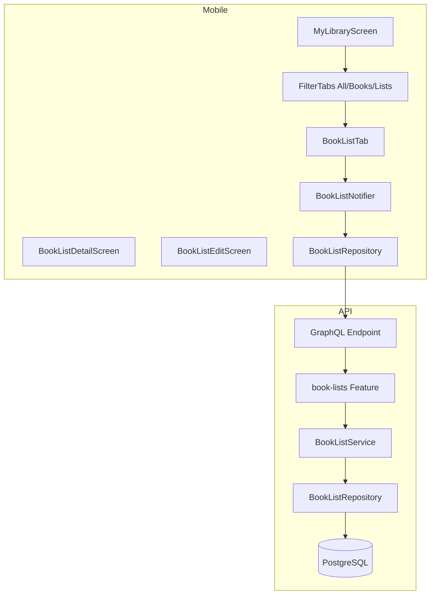
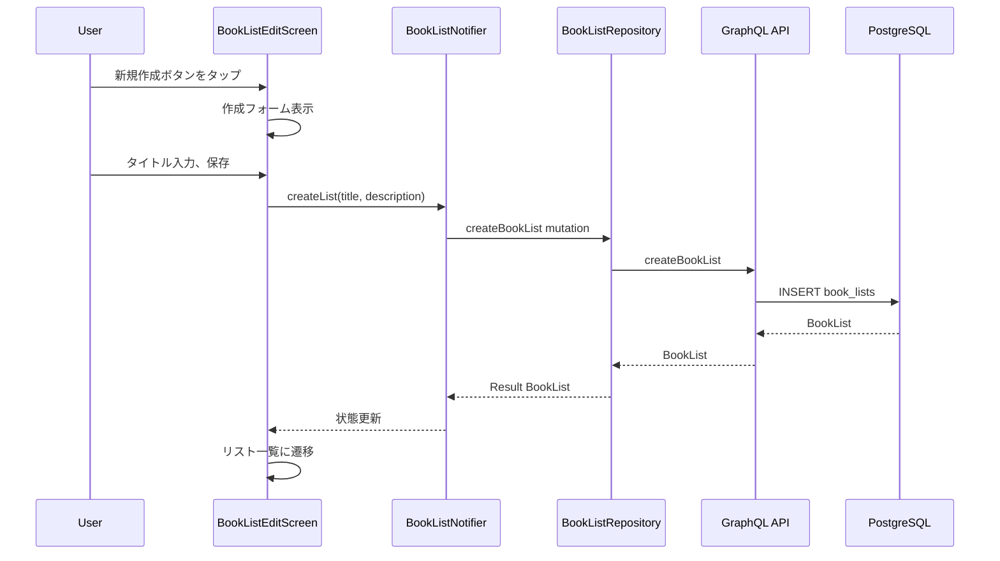
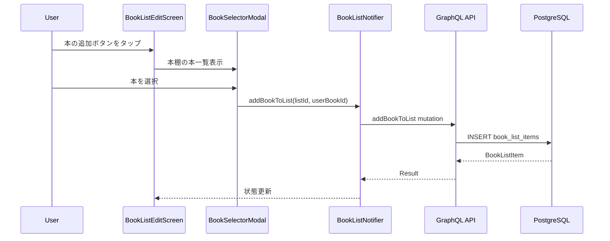
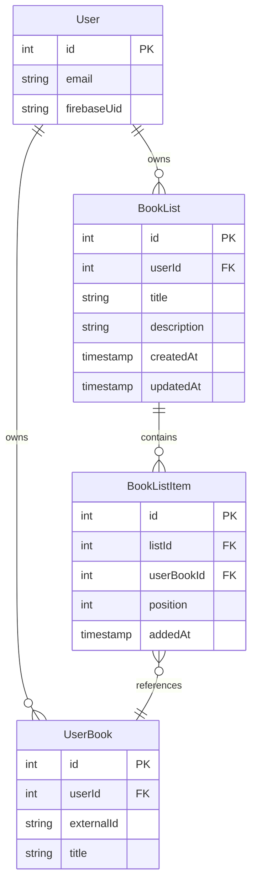

# Design Document: Book List

## Overview

**Purpose**: 本機能は、ユーザーが本棚の本を自由にカテゴリ分けして整理できる「リスト」機能を提供する。Spotify のプレイリストのようなコンセプトで、ユーザーは複数のリストを作成し、本を追加・削除・並べ替えできる。

**Users**: Shelfie アプリのユーザーがマイライブラリ画面でリストを作成・管理し、本を整理するために利用する。

**Impact**: 既存のマイライブラリ画面（BookShelfScreen）に「すべて/本/リスト」フィルタを追加し、新規 API エンドポイントと DB テーブル（BookList, BookListItem）を追加する。

### Goals

- ユーザーがリストを作成・編集・削除できる
- 本棚の本をリストに追加・削除・並べ替えできる
- マイライブラリ画面でリストと本を効率的に閲覧できる
- 既存の本棚機能（UserBook）との整合性を保つ

### Non-Goals

- リストのシェア機能（将来的な拡張として除外）
- リストの公開/非公開設定
- 他ユーザーのリストの閲覧・フォロー
- リストのエクスポート/インポート

## Architecture

### Existing Architecture Analysis

**現在の構成**:
- API: Pothos + Drizzle ORM による GraphQL API（Feature モジュールパターン）
- Mobile: Flutter + Riverpod + Ferry（Feature-first + Clean Architecture）
- 本棚: `user_books` テーブルで UserBook を管理、`ShelfEntry` でクライアント状態を SSOT 化

**統合ポイント**:
- `apps/api/src/features/books/` の既存 BookShelf 機能に隣接して `book-lists` Feature を新設
- `apps/mobile/lib/features/book_shelf/` に ListTab を追加、新規 `book_list/` Feature を作成
- 既存の `ShelfEntry` や `shelfStateProvider` とは独立した状態管理

### Architecture Pattern & Boundary Map



**Architecture Integration**:
- **Selected pattern**: Feature-first + Clean Architecture（既存パターン踏襲）
- **Domain boundaries**: `book-lists` は `books` Feature と分離、UserBook 参照のみ許可
- **Existing patterns preserved**: Barrel Export、Service/Repository 分離、Riverpod + freezed
- **New components rationale**: リスト固有のドメインロジックとUIを分離管理
- **Steering compliance**: library-ecosystem.md に従い既存ライブラリを活用

### Technology Stack

| Layer | Choice / Version | Role in Feature | Notes |
|-------|------------------|-----------------|-------|
| Frontend | Flutter 3.x + Riverpod 2.5.x | リスト UI・状態管理 | 既存スタック |
| Backend | Pothos 4.x + Drizzle 0.45+ | GraphQL API・ORM | 既存スタック |
| Data | PostgreSQL 16+ | BookList, BookListItem テーブル | 新規テーブル追加 |

## System Flows

### リスト作成フロー



### 本のリスト追加フロー



## Requirements Traceability

| Requirement | Summary | Components | Interfaces | Flows |
|-------------|---------|------------|------------|-------|
| 1.1-1.5 | リスト作成 | BookListEditScreen, BookListService | createBookList mutation | リスト作成フロー |
| 2.1-2.5 | リスト編集 | BookListEditScreen, BookListService | updateBookList mutation | - |
| 3.1-3.4 | リスト削除 | BookListService | deleteBookList mutation | - |
| 4.1-4.5 | 本の追加（編集画面から） | BookSelectorModal, BookListService | addBookToList mutation | 本の追加フロー |
| 4.6-4.8 | 本の追加（詳細/長押しから） | ListSelectorModal, BookDetailScreen, QuickActionSheet | addBookToList mutation | - |
| 5.1-5.3 | 本の削除 | BookListEditScreen, BookListService | removeBookFromList mutation | - |
| 6.1-6.3 | 本の並べ替え | BookListEditScreen, BookListService | reorderBookInList mutation | - |
| 7.1-7.5 | フィルタ機能 | MyLibraryScreen, FilterTabs | - | - |
| 7.6-7.7 | カードバリアント | BookListCard | - | - |
| 8.1-8.5 | リスト一覧 | BookListTab, BookListCard | myBookLists query | - |
| 9.1-9.4 | リスト詳細 | BookListDetailScreen | bookListDetail query | - |
| 10.1-10.6 | データモデル | DB Schema, Repository | - | - |

## Components and Interfaces

### Component Summary

| Component | Domain/Layer | Intent | Req Coverage | Key Dependencies | Contracts |
|-----------|--------------|--------|--------------|------------------|-----------|
| BookList Schema | API/Data | リストとアイテムのテーブル定義 | 10.1-10.6 | users, user_books (P0) | - |
| BookListRepository | API/Data | DB アクセス層 | 10.1-10.6 | Drizzle (P0) | Service |
| BookListService | API/Domain | ビジネスロジック | 1-6 | Repository (P0) | Service |
| BookListGraphQL | API/GraphQL | GraphQL 型・リゾルバ | 1-9 | Service (P0), Pothos (P0) | API |
| BookListNotifier | Mobile/Application | リスト状態管理 | 1-9 | Repository (P0) | State |
| BookListRepository | Mobile/Data | GraphQL 通信 | 1-9 | Ferry (P0) | - |
| BookListTab | Mobile/Presentation | リスト一覧 UI | 7.4, 8.1-8.5 | Notifier (P0) | - |
| BookListDetailScreen | Mobile/Presentation | リスト詳細 UI | 9.1-9.4 | Notifier (P0) | - |
| BookListEditScreen | Mobile/Presentation | 作成・編集 UI | 1, 2, 4-6 | Notifier (P0) | - |
| BookListCard | Mobile/Presentation | リストカード UI（縦長/横長バリアント） | 7.6-7.7, 8.2-8.4 | - | - |
| BookSelectorModal | Mobile/Presentation | リスト編集時の本選択 | 4.1-4.5 | ShelfNotifier (P0) | - |
| ListSelectorModal | Mobile/Presentation | 本からリストを選択 | 4.6-4.8 | BookListNotifier (P0) | - |
| MyLibraryScreen | Mobile/Presentation | フィルタ統合 | 7.1-7.7 | BookShelfNotifier (P1), BookListNotifier (P1) | - |
| BookDetailScreen | Mobile/Presentation | 「リストに追加」ボタン追加 | 4.6 | BookListNotifier (P1) | - |
| QuickActionSheet | Mobile/Presentation | 「リストに追加」アクション追加 | 4.7 | BookListNotifier (P1) | - |

### API Layer

#### BookListRepository (API)

| Field | Detail |
|-------|--------|
| Intent | BookList/BookListItem の CRUD 操作を提供 |
| Requirements | 10.1-10.6 |

**Responsibilities & Constraints**
- BookList, BookListItem テーブルへのデータアクセス
- トランザクション管理（カスケード削除）
- UserBook との外部キー整合性維持

**Dependencies**
- Outbound: Drizzle ORM (P0)
- External: PostgreSQL (P0)

**Contracts**: Service

##### Service Interface

```typescript
interface BookListRepository {
  createBookList(input: CreateBookListInput): Promise<BookList>;
  findBookListById(id: number): Promise<BookList | null>;
  findBookListsByUserId(userId: number): Promise<BookList[]>;
  updateBookList(id: number, input: UpdateBookListInput): Promise<BookList | null>;
  deleteBookList(id: number): Promise<boolean>;

  createBookListItem(input: CreateBookListItemInput): Promise<BookListItem>;
  findBookListItemsByListId(listId: number): Promise<BookListItem[]>;
  findBookListItemByListIdAndUserBookId(listId: number, userBookId: number): Promise<BookListItem | null>;
  deleteBookListItem(id: number): Promise<boolean>;
  updateBookListItemPosition(id: number, position: number): Promise<BookListItem | null>;
  reorderBookListItems(listId: number, itemId: number, newPosition: number): Promise<void>;
}

interface CreateBookListInput {
  userId: number;
  title: string;
  description: string | null;
}

interface UpdateBookListInput {
  title?: string;
  description?: string | null;
}

interface CreateBookListItemInput {
  listId: number;
  userBookId: number;
  position: number;
}
```

- Preconditions: userId, listId, userBookId は有効な外部キー
- Postconditions: 操作成功時に更新されたエンティティを返す
- Invariants: position は 0 以上の整数

#### BookListService

| Field | Detail |
|-------|--------|
| Intent | リスト機能のビジネスロジックを担当 |
| Requirements | 1.1-6.3 |

**Responsibilities & Constraints**
- リスト作成・編集・削除のバリデーション
- 本の追加時の重複チェック
- 並べ替え時の position 再計算
- 所有者チェック（FORBIDDEN エラー）

**Dependencies**
- Inbound: GraphQL Resolver (P0)
- Outbound: BookListRepository (P0)

**Contracts**: Service

##### Service Interface

```typescript
type BookListErrors =
  | { code: "LIST_NOT_FOUND"; message: string }
  | { code: "FORBIDDEN"; message: string }
  | { code: "DUPLICATE_BOOK"; message: string }
  | { code: "BOOK_NOT_IN_LIST"; message: string }
  | { code: "VALIDATION_ERROR"; message: string }
  | { code: "DATABASE_ERROR"; message: string };

interface BookListService {
  createBookList(input: CreateBookListServiceInput): Promise<Result<BookList, BookListErrors>>;
  getBookList(listId: number, userId: number): Promise<Result<BookListWithItems, BookListErrors>>;
  getUserBookLists(userId: number): Promise<Result<BookListSummary[], BookListErrors>>;
  updateBookList(input: UpdateBookListServiceInput): Promise<Result<BookList, BookListErrors>>;
  deleteBookList(listId: number, userId: number): Promise<Result<void, BookListErrors>>;

  addBookToList(input: AddBookToListInput): Promise<Result<BookListItem, BookListErrors>>;
  removeBookFromList(input: RemoveBookFromListInput): Promise<Result<void, BookListErrors>>;
  reorderBookInList(input: ReorderBookInput): Promise<Result<void, BookListErrors>>;
}

interface CreateBookListServiceInput {
  userId: number;
  title: string;
  description?: string | null;
}

interface UpdateBookListServiceInput {
  listId: number;
  userId: number;
  title?: string;
  description?: string | null;
}

interface AddBookToListInput {
  listId: number;
  userId: number;
  userBookId: number;
}

interface RemoveBookFromListInput {
  listId: number;
  userId: number;
  userBookId: number;
}

interface ReorderBookInput {
  listId: number;
  userId: number;
  itemId: number;
  newPosition: number;
}

interface BookListWithItems {
  id: number;
  userId: number;
  title: string;
  description: string | null;
  createdAt: Date;
  updatedAt: Date;
  items: BookListItemWithBook[];
}

interface BookListItemWithBook {
  id: number;
  position: number;
  addedAt: Date;
  userBook: UserBook;
}

interface BookListSummary {
  id: number;
  title: string;
  description: string | null;
  bookCount: number;
  coverImages: string[];
  createdAt: Date;
  updatedAt: Date;
}
```

- Preconditions: userId は認証済みユーザー
- Postconditions: 成功時は Result.ok、エラー時は適切なエラーコード
- Invariants: リストは所有者のみ操作可能

#### BookListGraphQL

| Field | Detail |
|-------|--------|
| Intent | GraphQL 型定義とリゾルバを提供 |
| Requirements | 1.1-9.4 |

**Responsibilities & Constraints**
- Pothos による型安全な GraphQL スキーマ定義
- 認証スコープ（loggedIn）の適用
- UserService との連携でユーザー特定

**Dependencies**
- Inbound: Apollo Server (P0)
- Outbound: BookListService (P0), UserService (P0)

**Contracts**: API

##### API Contract

| Method | Operation | Request | Response | Errors |
|--------|-----------|---------|----------|--------|
| Query | myBookLists | - | [BookListSummary!]! | UNAUTHENTICATED |
| Query | bookListDetail(listId: Int!) | listId | BookListDetail! | LIST_NOT_FOUND, FORBIDDEN |
| Mutation | createBookList(input: CreateBookListInput!) | title, description? | BookList! | VALIDATION_ERROR |
| Mutation | updateBookList(input: UpdateBookListInput!) | listId, title?, description? | BookList! | LIST_NOT_FOUND, FORBIDDEN |
| Mutation | deleteBookList(listId: Int!) | listId | Boolean! | LIST_NOT_FOUND, FORBIDDEN |
| Mutation | addBookToList(listId: Int!, userBookId: Int!) | listId, userBookId | BookListItem! | DUPLICATE_BOOK, LIST_NOT_FOUND |
| Mutation | removeBookFromList(listId: Int!, userBookId: Int!) | listId, userBookId | Boolean! | BOOK_NOT_IN_LIST |
| Mutation | reorderBookInList(listId: Int!, itemId: Int!, newPosition: Int!) | listId, itemId, position | Boolean! | LIST_NOT_FOUND |

### Mobile Layer

#### BookListNotifier

| Field | Detail |
|-------|--------|
| Intent | リスト機能の状態管理 |
| Requirements | 1.1-9.4 |

**Responsibilities & Constraints**
- リスト一覧・詳細の状態管理
- 楽観的更新（並べ替え時）
- エラーハンドリングと UI 状態の同期

**Dependencies**
- Inbound: Presentation Layer (P0)
- Outbound: BookListRepository (P0)

**Contracts**: State

##### State Management

```dart
@freezed
class BookListState with _$BookListState {
  const factory BookListState.initial() = BookListInitial;
  const factory BookListState.loading() = BookListLoading;
  const factory BookListState.loaded({
    required List<BookListSummary> lists,
  }) = BookListLoaded;
  const factory BookListState.error({
    required Failure failure,
  }) = BookListError;
}

@freezed
class BookListDetailState with _$BookListDetailState {
  const factory BookListDetailState.initial() = BookListDetailInitial;
  const factory BookListDetailState.loading() = BookListDetailLoading;
  const factory BookListDetailState.loaded({
    required BookListDetail list,
  }) = BookListDetailLoaded;
  const factory BookListDetailState.error({
    required Failure failure,
  }) = BookListDetailError;
}
```

#### BookListRepository (Mobile)

| Field | Detail |
|-------|--------|
| Intent | GraphQL API との通信 |
| Requirements | 1.1-9.4 |

**Responsibilities & Constraints**
- Ferry によるタイプセーフな GraphQL 通信
- Result 型によるエラーハンドリング
- Failure 型への変換

**Dependencies**
- Outbound: Ferry Client (P0)

**Contracts**: Service

##### Service Interface

```dart
abstract class BookListRepository {
  Future<Either<Failure, List<BookListSummary>>> getMyBookLists();
  Future<Either<Failure, BookListDetail>> getBookListDetail(int listId);
  Future<Either<Failure, BookList>> createBookList({
    required String title,
    String? description,
  });
  Future<Either<Failure, BookList>> updateBookList({
    required int listId,
    String? title,
    String? description,
  });
  Future<Either<Failure, void>> deleteBookList(int listId);
  Future<Either<Failure, BookListItem>> addBookToList({
    required int listId,
    required int userBookId,
  });
  Future<Either<Failure, void>> removeBookFromList({
    required int listId,
    required int userBookId,
  });
  Future<Either<Failure, void>> reorderBookInList({
    required int listId,
    required int itemId,
    required int newPosition,
  });
}
```

#### UI Components

**BookListTab**
- リスト一覧の表示
- 新規作成ボタン
- Requirements: 7.4, 8.1-8.5

**BookListCard**
- 2種類のレイアウトバリアント:
  - **縦長バリアント**（「すべて」タブ用）: 2x2 表紙コラージュ、タイトル、冊数、説明文
  - **横長バリアント**（「リスト」タブ用）: 単一表紙画像、タイトル、冊数+説明文（1行）、右矢印
- タップでリスト詳細へ遷移
- Requirements: 7.6, 7.7, 8.2-8.4

**BookListDetailScreen**
- リストヘッダー（タイトル、説明、編集ボタン）
- 本一覧（position 順）
- 本タップで詳細画面へ
- Requirements: 9.1-9.4

**BookListEditScreen**
- 作成/編集フォーム（タイトル必須、説明任意）
- 本の追加/削除/並べ替え
- 削除確認ダイアログ
- Requirements: 1.1-6.3

**BookSelectorModal**
- 本棚の本一覧表示
- 既にリストに追加済みの本はグレーアウト
- Requirements: 4.1-4.2, 4.5

**ListSelectorModal**
- ユーザーのリスト一覧表示
- 既に本が追加済みのリストはチェックマーク表示
- 新規リスト作成オプション
- Requirements: 4.6-4.8

**MyLibraryScreen（拡張）**
- フィルタタブ追加（すべて/本/リスト）
- 「すべて」タブ: リスト一覧（縦長カード） + 最近追加した本（水平スクロール） + 「すべて見る」リンク
- 「リスト」タブ: リスト一覧（横長カード） + 新規作成ボタン
- Requirements: 7.1-7.7

**BookDetailScreen（拡張）**
- 「リストに追加」ボタンを追加
- タップでListSelectorModalを表示
- Requirements: 4.6

**QuickActionSheet（拡張）**
- 「リストに追加」アクションを追加
- タップでListSelectorModalを表示
- Requirements: 4.7

## Data Models

### Domain Model



**Aggregates**:
- BookList: リストとその内容を管理する集約ルート
- UserBook: 既存の集約、BookListItem から参照のみ

**Business Rules & Invariants**:
- 1 つの UserBook は同一リスト内に 1 回のみ追加可能
- リスト削除時は関連 BookListItem をカスケード削除
- UserBook 削除時は関連 BookListItem も削除（外部キー制約）
- position は 0 以上の整数、リスト内で一意

### Physical Data Model

#### book_lists テーブル

```sql
CREATE TABLE book_lists (
  id INTEGER PRIMARY KEY GENERATED ALWAYS AS IDENTITY,
  user_id INTEGER NOT NULL REFERENCES users(id) ON DELETE CASCADE,
  title TEXT NOT NULL,
  description TEXT,
  created_at TIMESTAMP WITH TIME ZONE NOT NULL DEFAULT NOW(),
  updated_at TIMESTAMP WITH TIME ZONE NOT NULL DEFAULT NOW()
);

CREATE INDEX idx_book_lists_user_id ON book_lists(user_id);
```

#### book_list_items テーブル

```sql
CREATE TABLE book_list_items (
  id INTEGER PRIMARY KEY GENERATED ALWAYS AS IDENTITY,
  list_id INTEGER NOT NULL REFERENCES book_lists(id) ON DELETE CASCADE,
  user_book_id INTEGER NOT NULL REFERENCES user_books(id) ON DELETE CASCADE,
  position INTEGER NOT NULL DEFAULT 0,
  added_at TIMESTAMP WITH TIME ZONE NOT NULL DEFAULT NOW(),
  UNIQUE(list_id, user_book_id)
);

CREATE INDEX idx_book_list_items_list_id ON book_list_items(list_id);
CREATE INDEX idx_book_list_items_user_book_id ON book_list_items(user_book_id);
```

### Drizzle Schema Definition

```typescript
// apps/api/src/db/schema/book-lists.ts
import {
  index,
  integer,
  pgTable,
  text,
  timestamp,
  unique,
} from "drizzle-orm/pg-core";
import { users } from "./users";
import { userBooks } from "./books";

export const BOOK_LISTS_USER_ID_INDEX_NAME = "idx_book_lists_user_id";

export const bookLists = pgTable(
  "book_lists",
  {
    id: integer("id").primaryKey().generatedAlwaysAsIdentity(),
    userId: integer("user_id")
      .notNull()
      .references(() => users.id, { onDelete: "cascade" }),
    title: text("title").notNull(),
    description: text("description"),
    createdAt: timestamp("created_at", { withTimezone: true })
      .defaultNow()
      .notNull(),
    updatedAt: timestamp("updated_at", { withTimezone: true })
      .defaultNow()
      .notNull(),
  },
  (table) => [index(BOOK_LISTS_USER_ID_INDEX_NAME).on(table.userId)]
);

export type BookList = typeof bookLists.$inferSelect;
export type NewBookList = typeof bookLists.$inferInsert;

export const BOOK_LIST_ITEMS_LIST_ID_INDEX_NAME = "idx_book_list_items_list_id";
export const BOOK_LIST_ITEMS_USER_BOOK_ID_INDEX_NAME = "idx_book_list_items_user_book_id";
export const BOOK_LIST_ITEMS_UNIQUE_NAME = "book_list_items_list_id_user_book_id_unique";

export const bookListItems = pgTable(
  "book_list_items",
  {
    id: integer("id").primaryKey().generatedAlwaysAsIdentity(),
    listId: integer("list_id")
      .notNull()
      .references(() => bookLists.id, { onDelete: "cascade" }),
    userBookId: integer("user_book_id")
      .notNull()
      .references(() => userBooks.id, { onDelete: "cascade" }),
    position: integer("position").notNull().default(0),
    addedAt: timestamp("added_at", { withTimezone: true })
      .defaultNow()
      .notNull(),
  },
  (table) => [
    index(BOOK_LIST_ITEMS_LIST_ID_INDEX_NAME).on(table.listId),
    index(BOOK_LIST_ITEMS_USER_BOOK_ID_INDEX_NAME).on(table.userBookId),
    unique(BOOK_LIST_ITEMS_UNIQUE_NAME).on(table.listId, table.userBookId),
  ]
);

export type BookListItem = typeof bookListItems.$inferSelect;
export type NewBookListItem = typeof bookListItems.$inferInsert;
```

### Data Contracts & Integration

**GraphQL Types**:

```graphql
type BookList {
  id: Int!
  title: String!
  description: String
  createdAt: DateTime!
  updatedAt: DateTime!
}

type BookListItem {
  id: Int!
  position: Int!
  addedAt: DateTime!
  userBook: UserBook!
}

type BookListDetail {
  id: Int!
  title: String!
  description: String
  items: [BookListItem!]!
  createdAt: DateTime!
  updatedAt: DateTime!
}

type BookListSummary {
  id: Int!
  title: String!
  description: String
  bookCount: Int!
  coverImages: [String!]!
  createdAt: DateTime!
  updatedAt: DateTime!
}

input CreateBookListInput {
  title: String!
  description: String
}

input UpdateBookListInput {
  listId: Int!
  title: String
  description: String
}
```

## Error Handling

### Error Strategy

既存の Result 型パターン（`err`/`ok`）を踏襲し、GraphQL エラーは `GraphQLError` で伝播する。

### Error Categories and Responses

| Error Code | HTTP Status | Cause | User Message |
|------------|-------------|-------|--------------|
| UNAUTHENTICATED | 401 | 未認証 | 再度ログインしてください |
| LIST_NOT_FOUND | 404 | リストが存在しない | リストが見つかりません |
| FORBIDDEN | 403 | 所有者以外のアクセス | このリストにアクセスする権限がありません |
| DUPLICATE_BOOK | 409 | 重複追加 | この本は既にリストに追加されています |
| BOOK_NOT_IN_LIST | 404 | 本がリストにない | この本はリストに含まれていません |
| VALIDATION_ERROR | 400 | バリデーション失敗 | タイトルは必須です |
| DATABASE_ERROR | 500 | DB エラー | サーバーエラーが発生しました |

### Monitoring

- Pino ロガーでエラーログを出力
- feature: "book-lists" タグで識別

## Testing Strategy

### Unit Tests

**API**:
- BookListService: リスト作成・更新・削除のビジネスロジック
- BookListRepository: DB 操作のモック検証
- 所有者チェック、重複チェック、position 計算

**Mobile**:
- BookListNotifier: 状態遷移のテスト
- BookListRepository: GraphQL レスポンスのパース

### Integration Tests

**API**:
- リスト CRUD の E2E フロー
- 本の追加・削除・並べ替えフロー
- カスケード削除の検証

**Mobile**:
- BookListRepository と Mock GraphQL の統合
- UI 状態と API レスポンスの同期

### Widget Tests

- BookListCard: 表紙コラージュの表示
- BookListEditScreen: フォームバリデーション
- BookSelectorModal: 本の選択・重複表示
- FilterTabs: タブ切り替え
