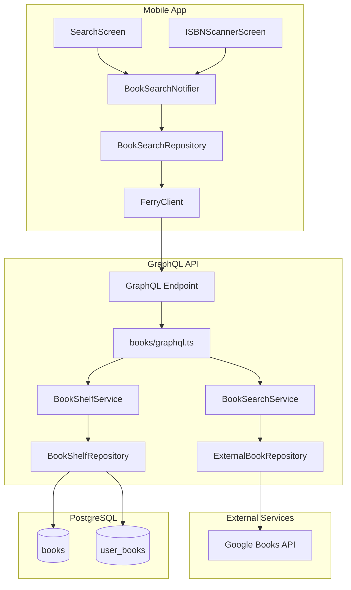
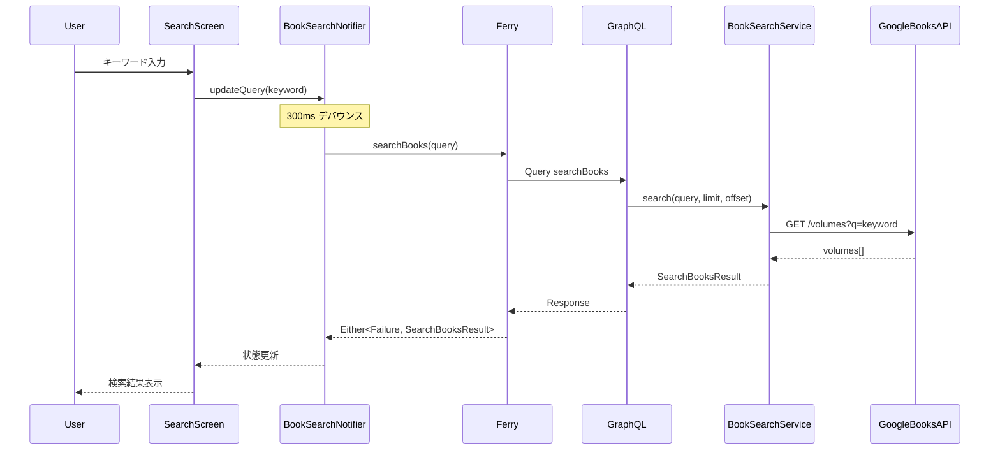
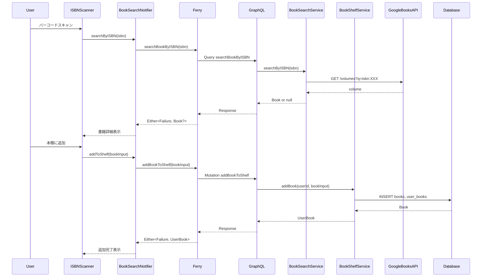
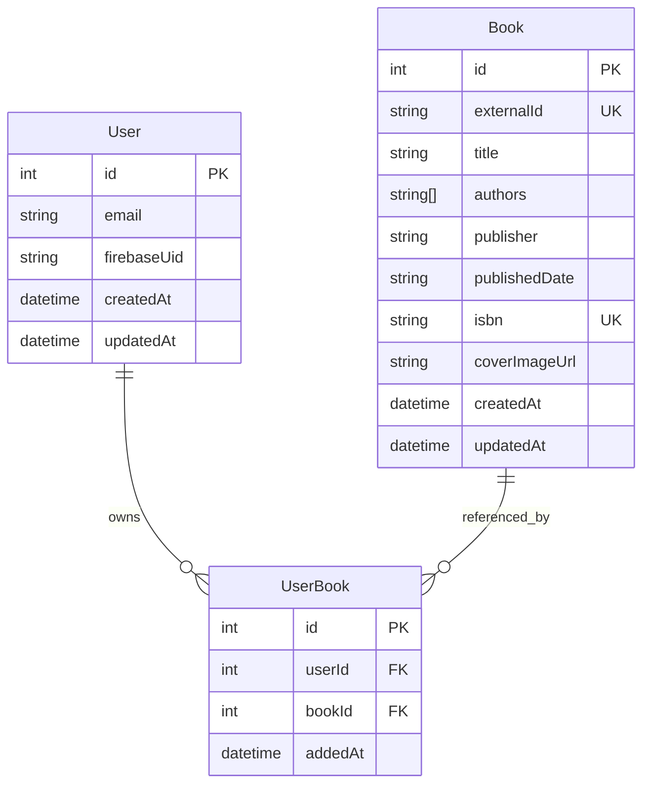

# Design Document: Book Search

## Overview

**Purpose**: 本機能は、Shelfie アプリにおける書籍検索と本棚管理機能を提供する。ユーザーはキーワード検索、ISBN バーコードスキャンを通じて書籍を検索し、自分の本棚に追加できる。

**Users**: 読書管理を行いたい一般ユーザーが、読みたい本を探し、自分のコレクションとして管理するために使用する。

**Impact**: 既存のプレースホルダー検索画面を実際の検索機能で置き換え、新規の books Feature モジュールと外部 API 連携を追加する。

### Goals
- キーワード、ISBN による書籍検索の提供
- Google Books API との連携による豊富な書籍データへのアクセス
- 検索結果から本棚への書籍追加フローの実現
- 300ms デバウンスによるリアルタイム検索体験

### Non-Goals
- 書籍のレビュー・評価機能（将来対応）
- 複数外部 API のフォールバック実装（初期リリースでは対象外）
- 書籍データのオフラインキャッシュ（検索結果のみ）
- 書籍推薦機能

## Architecture

### Existing Architecture Analysis

既存システムは以下のパターンに従う:
- **API**: Feature モジュール構成（graphql.ts, service.ts, repository.ts）
- **API**: Pothos による Code-first GraphQL スキーマ定義
- **API**: Result<T, E> 型による明示的エラーハンドリング
- **Mobile**: Feature-first + Clean Architecture
- **Mobile**: Riverpod + freezed + Ferry によるデータフロー

### Architecture Pattern & Boundary Map



**Architecture Integration**:
- **Selected pattern**: Feature モジュール + Repository パターン（既存パターンの継承）
- **Domain boundaries**: 検索機能（books Feature）と認証機能（auth Feature）を分離
- **Existing patterns preserved**: Pothos スキーマ定義、Result 型、Barrel Export
- **New components rationale**: 外部 API 連携のための ExternalBookRepository、本棚管理のための BookShelfRepository
- **Steering compliance**: library-ecosystem.md のプラグイン活用方針に従う

### Technology Stack

| Layer | Choice / Version | Role in Feature | Notes |
|-------|------------------|-----------------|-------|
| Mobile UI | Flutter 3.x + mobile_scanner | 検索 UI、ISBN スキャン | MLKit/AVFoundation 統合 |
| Mobile State | Riverpod 2.x + freezed | 検索状態管理、デバウンス | 既存パターン継承 |
| GraphQL Client | Ferry 0.16.x | GraphQL 通信 | 既存 Client 活用 |
| API Server | Express 4.x + Apollo Server 5.x | GraphQL エンドポイント | 既存構成 |
| GraphQL Schema | Pothos 4.x | Code-first スキーマ定義 | ErrorsPlugin 活用 |
| External API | Google Books API v1 | 書籍データ取得 | API キー認証 |
| Database | PostgreSQL 16 + Drizzle ORM | 本棚データ永続化 | 既存 DB 拡張 |

## System Flows

### 全文検索フロー



### ISBN スキャン・本棚追加フロー



## Requirements Traceability

| Requirement | Summary | Components | Interfaces | Flows |
|-------------|---------|------------|------------|-------|
| 1.1 | キーワード検索 API | BookSearchService, ExternalBookRepository | searchBooks Query | 全文検索フロー |
| 1.2 | 300ms デバウンス | BookSearchNotifier | - | 全文検索フロー |
| 1.3 | 検索結果表示 | SearchScreen, BookListItem | - | 全文検索フロー |
| 1.4 | ローディング表示 | SearchScreen, LoadingIndicator | - | 全文検索フロー |
| 1.5 | 空結果処理 | BookSearchService | searchBooks Query | 全文検索フロー |
| 1.6 | 外部 API エラー | BookSearchService | GraphQL Error | 全文検索フロー |
| 2.1 | カメラ起動 | ISBNScannerScreen | - | ISBN スキャンフロー |
| 2.2 | ISBN 抽出 | ISBNScannerScreen | - | ISBN スキャンフロー |
| 2.3 | ISBN 検索 API | BookSearchService | searchBookByISBN Query | ISBN スキャンフロー |
| 2.4 | ISBN 未検出 | BookSearchService | searchBookByISBN Query | ISBN スキャンフロー |
| 2.5 | 書籍詳細表示 | ISBNScannerScreen | - | ISBN スキャンフロー |
| 2.6 | カメラ権限拒否 | ISBNScannerScreen | - | - |
| 3.1 | 追加ボタン | BookListItem | - | 本棚追加フロー |
| 3.2 | 本棚追加 API | BookShelfService, BookShelfRepository | addBookToShelf Mutation | 本棚追加フロー |
| 3.3 | 追加完了表示 | SearchScreen | - | 本棚追加フロー |
| 3.4 | 重複エラー | BookShelfService | addBookToShelf Mutation | 本棚追加フロー |
| 3.5 | 認証エラー | BooksGraphQL | AuthScope | 本棚追加フロー |
| 4.1 | 外部 API 連携 | ExternalBookRepository | GoogleBooksClient | - |
| 4.2 | 書籍情報取得 | ExternalBookRepository | - | - |
| 4.3 | タイムアウト | ExternalBookRepository | - | - |
| 4.4 | レートリミット | ExternalBookRepository | - | - |
| 4.5 | レスポンスマッピング | ExternalBookRepository, BookMapper | - | - |
| 5.1 | Query 定義 | BooksGraphQL | searchBooks, searchBookByISBN | - |
| 5.2 | Mutation 定義 | BooksGraphQL | addBookToShelf | - |
| 5.3 | Book 型定義 | BooksGraphQL | Book type | - |
| 5.4 | ページネーション | BooksGraphQL | SearchBooksResult type | - |
| 5.5 | Pothos 使用 | BooksGraphQL | - | - |
| 6.1 | NetworkError | BookSearchService | GraphQL Error | - |
| 6.2 | ValidationError | BooksGraphQL | GraphQL Error | - |
| 6.3 | AuthenticationError | BooksGraphQL | GraphQL Error | - |
| 6.4 | エラーログ | BookSearchService, BookShelfService | - | - |
| 6.5 | ユーザーメッセージ | BookSearchNotifier, Failure | - | - |

## Components and Interfaces

| Component | Domain/Layer | Intent | Req Coverage | Key Dependencies | Contracts |
|-----------|--------------|--------|--------------|------------------|-----------|
| BooksGraphQL | API/GraphQL | GraphQL 型定義・Resolver | 5.1-5.5, 6.2-6.3 | BookSearchService, BookShelfService (P0) | Service, API |
| BookSearchService | API/Domain | 検索ビジネスロジック | 1.1, 1.5, 1.6, 2.3, 2.4, 4.5, 6.1, 6.4 | ExternalBookRepository (P0) | Service |
| BookShelfService | API/Domain | 本棚管理ロジック | 3.2, 3.4, 6.4 | BookShelfRepository (P0) | Service |
| ExternalBookRepository | API/Infrastructure | Google Books API 連携 | 4.1-4.5 | GoogleBooksClient (P0) | Service |
| BookShelfRepository | API/Data | 本棚データアクセス | 3.2, 3.4 | Drizzle ORM (P0) | Service |
| BookSearchNotifier | Mobile/Application | 検索状態管理 | 1.2, 6.5 | BookSearchRepository (P0) | State |
| BookSearchRepository | Mobile/Data | GraphQL 通信 | - | FerryClient (P0) | Service |
| SearchScreen | Mobile/Presentation | 検索 UI | 1.3, 1.4, 3.1, 3.3 | BookSearchNotifier (P0) | - |
| ISBNScannerScreen | Mobile/Presentation | バーコードスキャン UI | 2.1, 2.2, 2.5, 2.6 | BookSearchNotifier (P0), mobile_scanner (P0) | - |

### API / GraphQL Layer

#### BooksGraphQL

| Field | Detail |
|-------|--------|
| Intent | 書籍検索・本棚管理の GraphQL 型定義と Resolver |
| Requirements | 5.1, 5.2, 5.3, 5.4, 5.5, 6.2, 6.3 |

**Responsibilities & Constraints**
- Pothos による Book 型、SearchBooksResult 型の定義
- searchBooks, searchBookByISBN Query の実装
- addBookToShelf Mutation の実装（認証必須）
- 入力バリデーションエラーの GraphQL エラー変換

**Dependencies**
- Inbound: GraphQL Endpoint - Resolver 呼び出し (P0)
- Outbound: BookSearchService - 検索ロジック委譲 (P0)
- Outbound: BookShelfService - 本棚ロジック委譲 (P0)

**Contracts**: Service [x] / API [x] / Event [ ] / Batch [ ] / State [ ]

##### Service Interface

```typescript
interface BooksGraphQLTypes {
  Book: {
    id: string;
    title: string;
    authors: string[];
    publisher: string | null;
    publishedDate: string | null;
    isbn: string | null;
    coverImageUrl: string | null;
  };

  SearchBooksResult: {
    items: Book[];
    totalCount: number;
    hasMore: boolean;
  };

  AddBookInput: {
    externalId: string;
    title: string;
    authors: string[];
    publisher: string | null;
    publishedDate: string | null;
    isbn: string | null;
    coverImageUrl: string | null;
  };

  UserBook: {
    id: number;
    book: Book;
    addedAt: Date;
  };
}

// Pothos で定義する Query/Mutation
function registerBooksTypes(builder: Builder): void;
function registerBooksQueries(
  builder: Builder,
  searchService: BookSearchService
): void;
function registerBooksMutations(
  builder: Builder,
  shelfService: BookShelfService
): void;
```

##### API Contract

| Method | Endpoint | Request | Response | Errors |
|--------|----------|---------|----------|--------|
| Query | searchBooks | query: String!, limit: Int, offset: Int | SearchBooksResult | ValidationError |
| Query | searchBookByISBN | isbn: String! | Book | ValidationError, NotFoundError |
| Mutation | addBookToShelf | bookInput: AddBookInput! | UserBook | AuthenticationError, DuplicateError, ValidationError |

**Implementation Notes**
- Integration: 既存の builder.ts の SchemaTypes を拡張、schema.ts で Feature 登録
- Validation: Pothos plugin-validation または手動バリデーションで入力検証
- Risks: GraphQL エラー型の統一（ErrorsPlugin との整合性）

### API / Domain Layer

#### BookSearchService

| Field | Detail |
|-------|--------|
| Intent | 書籍検索のビジネスロジックを提供 |
| Requirements | 1.1, 1.5, 1.6, 2.3, 2.4, 4.5, 6.1, 6.4 |

**Responsibilities & Constraints**
- 外部 API からの検索結果を内部 Book 型にマッピング
- エラーの分類と適切な DomainError への変換
- 構造化ログ出力

**Dependencies**
- Inbound: BooksGraphQL - 検索リクエスト (P0)
- Outbound: ExternalBookRepository - 外部 API 呼び出し (P0)
- External: Pino Logger - ログ出力 (P1)

**Contracts**: Service [x] / API [ ] / Event [ ] / Batch [ ] / State [ ]

##### Service Interface

```typescript
type BookSearchErrors =
  | { code: "NETWORK_ERROR"; message: string }
  | { code: "EXTERNAL_API_ERROR"; message: string }
  | { code: "VALIDATION_ERROR"; message: string };

interface SearchBooksInput {
  query: string;
  limit?: number;
  offset?: number;
}

interface SearchByISBNInput {
  isbn: string;
}

interface BookSearchService {
  searchBooks(
    input: SearchBooksInput
  ): Promise<Result<SearchBooksResult, BookSearchErrors>>;

  searchBookByISBN(
    input: SearchByISBNInput
  ): Promise<Result<Book | null, BookSearchErrors>>;
}

function createBookSearchService(
  externalRepository: ExternalBookRepository,
  logger: Logger
): BookSearchService;
```

- Preconditions: query は空文字でないこと、limit は 1-40 の範囲
- Postconditions: 成功時は SearchBooksResult を返却、エラー時は適切な BookSearchErrors
- Invariants: 外部 API エラーは全て BookSearchErrors に変換される

**Implementation Notes**
- Integration: createBookSearchService で依存性注入、schema.ts でインスタンス化
- Validation: 入力パラメータの範囲チェック（limit, offset）
- Risks: Google Books API の応答形式変更

#### BookShelfService

| Field | Detail |
|-------|--------|
| Intent | 本棚管理のビジネスロジックを提供 |
| Requirements | 3.2, 3.4, 6.4 |

**Responsibilities & Constraints**
- 書籍の本棚追加処理
- 重複チェックとエラーハンドリング
- トランザクション境界の管理

**Dependencies**
- Inbound: BooksGraphQL - 本棚操作リクエスト (P0)
- Outbound: BookShelfRepository - データ永続化 (P0)
- External: Pino Logger - ログ出力 (P1)

**Contracts**: Service [x] / API [ ] / Event [ ] / Batch [ ] / State [ ]

##### Service Interface

```typescript
type BookShelfErrors =
  | { code: "DUPLICATE_BOOK"; message: string }
  | { code: "BOOK_NOT_FOUND"; message: string }
  | { code: "DATABASE_ERROR"; message: string };

interface AddBookToShelfInput {
  userId: number;
  bookInput: AddBookInput;
}

interface BookShelfService {
  addBookToShelf(
    input: AddBookToShelfInput
  ): Promise<Result<UserBook, BookShelfErrors>>;
}

function createBookShelfService(
  repository: BookShelfRepository,
  logger: Logger
): BookShelfService;
```

- Preconditions: userId は有効な認証済みユーザー ID
- Postconditions: 成功時は UserBook を返却、重複時は DUPLICATE_BOOK エラー
- Invariants: 同一ユーザーが同一 ISBN の書籍を複数回追加できない

### API / Infrastructure Layer

#### ExternalBookRepository

| Field | Detail |
|-------|--------|
| Intent | Google Books API との通信を抽象化 |
| Requirements | 4.1, 4.2, 4.3, 4.4, 4.5 |

**Responsibilities & Constraints**
- Google Books API への HTTP リクエスト
- 3 秒タイムアウトの設定
- レスポンスの内部型へのマッピング
- API エラーの抽象化

**Dependencies**
- Inbound: BookSearchService - 検索リクエスト (P0)
- External: Google Books API - 書籍データ取得 (P0)

**Contracts**: Service [x] / API [ ] / Event [ ] / Batch [ ] / State [ ]

##### Service Interface

```typescript
type ExternalApiErrors =
  | { code: "NETWORK_ERROR"; message: string }
  | { code: "TIMEOUT_ERROR"; message: string }
  | { code: "RATE_LIMIT_ERROR"; message: string }
  | { code: "API_ERROR"; message: string; statusCode: number };

interface GoogleBooksVolume {
  id: string;
  volumeInfo: {
    title: string;
    authors?: string[];
    publisher?: string;
    publishedDate?: string;
    industryIdentifiers?: Array<{ type: string; identifier: string }>;
    imageLinks?: { thumbnail?: string; smallThumbnail?: string };
    categories?: string[];
  };
}

interface ExternalBookRepository {
  searchByQuery(
    query: string,
    limit: number,
    offset: number
  ): Promise<Result<{ items: GoogleBooksVolume[]; totalItems: number }, ExternalApiErrors>>;

  searchByISBN(
    isbn: string
  ): Promise<Result<GoogleBooksVolume | null, ExternalApiErrors>>;
}

function createExternalBookRepository(
  apiKey: string,
  httpClient: HttpClient
): ExternalBookRepository;
```

- Preconditions: 有効な API キーが設定されていること
- Postconditions: 3 秒以内にレスポンスまたはタイムアウトエラー
- Invariants: HTTP エラーは全て ExternalApiErrors に変換

**Implementation Notes**
- Integration: ConfigManager から API キー取得
- Validation: ISBN 形式の検証（10桁または13桁）
- Risks: API キーの漏洩防止、レートリミット超過

### API / Data Layer

#### BookShelfRepository

| Field | Detail |
|-------|--------|
| Intent | 本棚データの永続化 |
| Requirements | 3.2, 3.4 |

**Responsibilities & Constraints**
- books テーブルへの書籍データ保存
- user_books テーブルへのユーザー-書籍関連付け
- 重複チェック（ISBN + userId）

**Dependencies**
- Inbound: BookShelfService - データ操作リクエスト (P0)
- External: Drizzle ORM - データベースアクセス (P0)

**Contracts**: Service [x] / API [ ] / Event [ ] / Batch [ ] / State [ ]

##### Service Interface

```typescript
interface BookShelfRepository {
  findBookByISBN(isbn: string): Promise<Book | null>;
  findUserBook(userId: number, bookId: number): Promise<UserBook | null>;
  createBook(book: NewBook): Promise<Book>;
  createUserBook(userBook: NewUserBook): Promise<UserBook>;
  findOrCreateBook(book: NewBook): Promise<Book>;
}

function createBookShelfRepository(db: DrizzleDb): BookShelfRepository;
```

### Mobile / Application Layer

#### BookSearchNotifier

| Field | Detail |
|-------|--------|
| Intent | 検索状態の管理と UI への提供 |
| Requirements | 1.2, 6.5 |

**Responsibilities & Constraints**
- 検索クエリの 300ms デバウンス
- 検索状態（loading, success, error）の管理
- エラーからユーザーメッセージへの変換

**Dependencies**
- Inbound: SearchScreen, ISBNScannerScreen - 状態監視 (P0)
- Outbound: BookSearchRepository - GraphQL 通信 (P0)

**Contracts**: Service [ ] / API [ ] / Event [ ] / Batch [ ] / State [x]

##### State Management

```dart
@freezed
sealed class BookSearchState with _$BookSearchState {
  const factory BookSearchState.initial() = BookSearchInitial;
  const factory BookSearchState.loading() = BookSearchLoading;
  const factory BookSearchState.success({
    required List<Book> books,
    required int totalCount,
    required bool hasMore,
  }) = BookSearchSuccess;
  const factory BookSearchState.empty() = BookSearchEmpty;
  const factory BookSearchState.error({required Failure failure}) = BookSearchError;
}

@riverpod
class BookSearchNotifier extends _$BookSearchNotifier {
  Timer? _debounceTimer;

  @override
  BookSearchState build() => const BookSearchState.initial();

  Future<void> searchBooks(String query);
  Future<void> searchByISBN(String isbn);
  Future<void> addToShelf(AddBookInput input);
  void loadMore();
}
```

- State model: sealed class による状態遷移（initial -> loading -> success/empty/error）
- Persistence: 状態は永続化しない（検索結果はキャッシュしない）
- Concurrency: デバウンスタイマーで同時リクエストを抑制

### Mobile / Presentation Layer

#### SearchScreen

| Field | Detail |
|-------|--------|
| Intent | 検索 UI の表示 |
| Requirements | 1.3, 1.4, 3.1, 3.3 |

**Implementation Notes**
- Integration: 既存の `_SearchScreen` プレースホルダーを実装で置き換え
- Validation: 検索クエリの空文字チェック
- Risks: 大量の検索結果でのパフォーマンス（ListView.builder で対応）

#### ISBNScannerScreen

| Field | Detail |
|-------|--------|
| Intent | バーコードスキャン UI |
| Requirements | 2.1, 2.2, 2.5, 2.6 |

**Implementation Notes**
- Integration: mobile_scanner パッケージを使用、go_router でモーダル表示
- Validation: スキャン結果の ISBN 形式検証
- Risks: カメラ権限拒否時の UX（設定画面誘導を実装）

## Data Models

### Domain Model



**Aggregates**: UserBook は User と Book の関連を管理。Book は外部 API のデータスナップショット。
**Business Rules**:
- 同一ユーザーが同一 ISBN の書籍を複数回追加できない（userId + bookId の一意制約）
- Book は ISBN または externalId で識別（両方 nullable だが少なくとも一方は必須）

### Physical Data Model

**books テーブル**

```sql
CREATE TABLE books (
  id SERIAL PRIMARY KEY,
  external_id TEXT UNIQUE,
  title TEXT NOT NULL,
  authors TEXT[] NOT NULL DEFAULT '{}',
  publisher TEXT,
  published_date TEXT,
  isbn TEXT UNIQUE,
  cover_image_url TEXT,
  created_at TIMESTAMP WITH TIME ZONE NOT NULL DEFAULT NOW(),
  updated_at TIMESTAMP WITH TIME ZONE NOT NULL DEFAULT NOW()
);

CREATE INDEX idx_books_isbn ON books(isbn);
CREATE INDEX idx_books_external_id ON books(external_id);
```

**user_books テーブル**

```sql
CREATE TABLE user_books (
  id SERIAL PRIMARY KEY,
  user_id INTEGER NOT NULL REFERENCES users(id) ON DELETE CASCADE,
  book_id INTEGER NOT NULL REFERENCES books(id) ON DELETE CASCADE,
  added_at TIMESTAMP WITH TIME ZONE NOT NULL DEFAULT NOW(),
  UNIQUE(user_id, book_id)
);

CREATE INDEX idx_user_books_user_id ON user_books(user_id);
```

### Data Contracts & Integration

**API Request/Response**

GraphQL スキーマで定義（BooksGraphQL セクション参照）。Ferry による型安全なコード生成。

**External API Response Mapping**

```typescript
// Google Books API -> 内部 Book 型
function mapGoogleBooksVolume(volume: GoogleBooksVolume): Book {
  const isbn = volume.volumeInfo.industryIdentifiers?.find(
    id => id.type === "ISBN_13" || id.type === "ISBN_10"
  )?.identifier;

  return {
    id: volume.id,
    title: volume.volumeInfo.title,
    authors: volume.volumeInfo.authors ?? [],
    publisher: volume.volumeInfo.publisher ?? null,
    publishedDate: volume.volumeInfo.publishedDate ?? null,
    isbn: isbn ?? null,
    coverImageUrl: volume.volumeInfo.imageLinks?.thumbnail ?? null,
  };
}
```

## Error Handling

### Error Strategy

既存の Result<T, E> パターン（API）と Either<Failure, T> パターン（Mobile）を継承。

### Error Categories and Responses

**User Errors (4xx)**:
- ValidationError: 検索クエリ空、ISBN 形式不正 -> フィールドレベルのエラーメッセージ
- AuthenticationError: 未認証での本棚追加 -> ログイン画面への誘導

**System Errors (5xx)**:
- NetworkError: 外部 API 通信失敗 -> リトライ案内、オフライン状態表示
- TimeoutError: 3秒タイムアウト -> 再試行ボタン表示

**Business Logic Errors**:
- DuplicateBookError: 既に本棚に存在 -> 「この本は既に追加されています」
- BookNotFoundError: ISBN 検索で未検出 -> 「書籍が見つかりませんでした」

### Monitoring

- Pino による構造化ログ出力（JSON 形式）
- エラー種別ごとのログレベル設定（NetworkError: warn, DuplicateBook: info）
- 外部 API レスポンスタイムのログ記録

## Testing Strategy

### Unit Tests
- BookSearchService: 検索ロジック、ジャンルマッピング、エラー変換
- BookShelfService: 重複チェック、トランザクション処理
- ExternalBookRepository: レスポンスマッピング、タイムアウト処理
- BookSearchNotifier: デバウンス動作、状態遷移

### Integration Tests
- GraphQL Query/Mutation: searchBooks, searchBooksByGenre, searchBookByISBN, addBookToShelf
- 認証フロー: 未認証での Mutation 拒否
- データベース操作: 書籍追加、重複エラー

### E2E/UI Tests
- 検索フロー: キーワード入力 -> 検索結果表示 -> 本棚追加
- ISBN スキャン: カメラ起動 -> スキャン -> 書籍表示 -> 追加
- エラー表示: ネットワークエラー、検索結果なし

## Security Considerations

- **API キー管理**: Google Books API キーは環境変数で管理、クライアントに露出しない
- **認証**: 本棚追加操作は認証必須（ScopeAuth で制御）
- **入力バリデーション**: SQL インジェクション防止（Drizzle ORM のパラメータ化クエリ）
- **カメラ権限**: 最小権限の原則、スキャン時のみカメラアクセス

## Performance & Scalability

- **検索デバウンス**: 300ms デバウンスで API 呼び出し削減
- **ページネーション**: 検索結果は 10 件ずつ取得（maxResults=10）
- **画像最適化**: Google Books API の thumbnail URL を使用（高解像度画像は要求しない）
- **タイムアウト**: 外部 API 呼び出しは 3 秒タイムアウト
