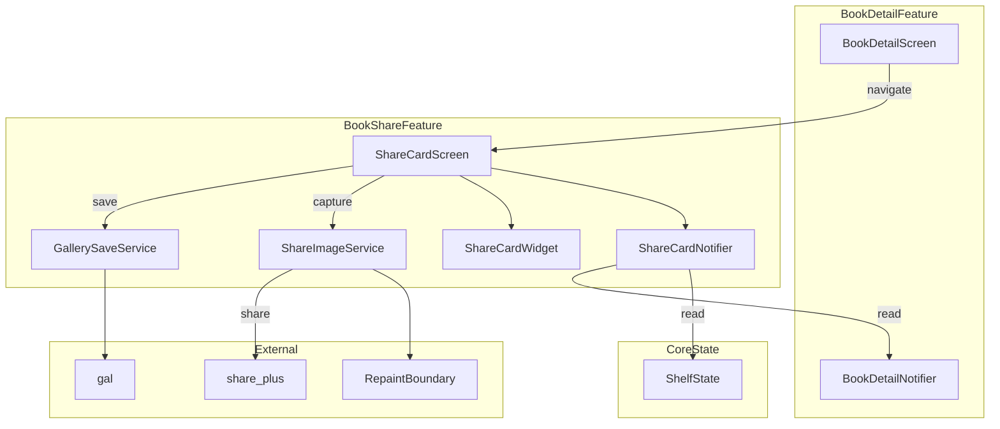
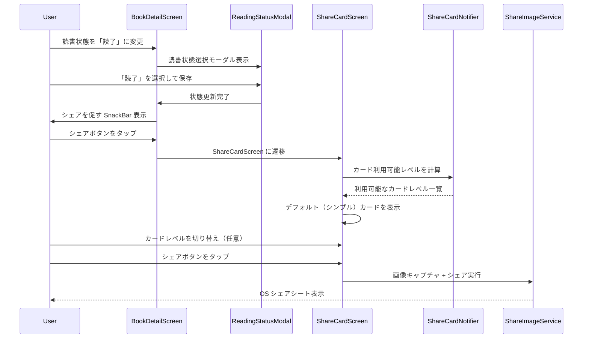
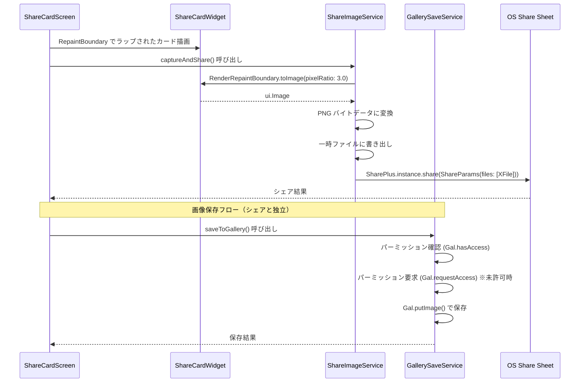

# Design Document

## Overview

本機能は、読了した本の情報を「読了カード」画像として生成し、SNS にシェアまたは端末に保存する機能を Shelfie モバイルアプリに追加する。Phase 1 の Go-to-Market 戦略として、ユーザーの「この本よかった」という自己表現欲求を満たしつつ、Shelfie のブランド認知をオーガニックに拡大することが目的である。

**Purpose**: 読了した本のシェア画像を生成し、SNS 共有またはフォトライブラリ保存によるブランド露出を実現する。
**Users**: 本を読了したユーザーが、書籍詳細画面から読了カードを生成・プレビューし、SNS にシェアまたは端末に保存する。
**Impact**: 書籍詳細画面にシェア導線を追加し、新規の `book_share` Feature モジュールを作成する。

### Goals

- 読了時の高いシェア動機を逃さない自然なシェア導線の提供
- プログレッシブデザイン（シンプル / プロフィール付き / 感想共有）によるカード生成
- OS シェアシートを通じた任意の SNS プラットフォームへのシェア
- フォトライブラリへの画像保存

### Non-Goals

- Web 版でのシェアページ（OGP 付き LP）の構築（Phase 2 以降）
- プロダクトシェア（ブックリスト、本棚全体のシェア）（Phase 2 以降）
- 複数アスペクト比（9:16 等）の同時対応（将来拡張）
- カードのカスタムテーマやカラー選択機能
- サーバーサイドでの画像生成やキャッシュ

## Architecture

### Existing Architecture Analysis

本機能は既存の Feature-first + Clean Architecture に準拠し、新規の `features/book_share/` モジュールとして構築する。主な連携ポイントは以下の通り。

- **ShelfState (SSOT)**: `readingStatus`, `rating`, `note`, `completedAt` を参照してカードレベルの利用可否を判定
- **BookDetail**: `title`, `authors`, `thumbnailUrl` を参照してカードコンテンツを構築
- **BookDetailScreen**: シェア導線（ボタン、読了時のプロンプト）の追加先
- **AppColors / AppSpacing**: カードの視覚デザインに既存のデザインシステムを適用

### Architecture Pattern & Boundary Map



**Architecture Integration**:
- **Selected pattern**: Feature-first + Clean Architecture（既存パターンの踏襲）
- **Domain/Feature boundaries**: `book_share` は `book_detail` と `core/state` からデータを読み取るのみ。書き込みは行わない
- **Existing patterns preserved**: Riverpod Notifier、freezed による immutable 状態、fpdart の Either によるエラーハンドリング
- **New components rationale**: 画像生成・シェア・保存のロジックは書籍詳細の責務と異なるため、独立した Feature として分離
- **Steering compliance**: Feature-first 構成、ライブラリエコシステム活用（share_plus 既存依存、gal 追加は最小限）

### Technology Stack

| Layer | Choice / Version | Role in Feature | Notes |
|-------|------------------|-----------------|-------|
| UI / Presentation | Flutter Widget + RepaintBoundary | カード描画、プレビュー画面 | 標準 API で画像キャプチャ |
| State Management | Riverpod ^2.5.1 | ShareCardNotifier でカードレベル管理 | 既存依存 |
| Image Sharing | share_plus ^10.1.3 | OS シェアシート呼び出し | 既存依存 |
| Image Saving | gal ^2.3.2 | フォトライブラリ保存 | **新規依存** |
| Temp File | path_provider (Flutter SDK) | 一時 PNG ファイル保存 | 既存依存（SDK 付属） |
| Image Cache | cached_network_image ^3.4.1 | 表紙画像のプリロード | 既存依存 |

## System Flows

### 読了時のシェア導線フロー



### 画像生成・保存フロー



## Requirements Traceability

| Requirement | Summary | Components | Interfaces | Flows |
|-------------|---------|------------|------------|-------|
| 1.1 | 読了変更時にシェアアクション表示 | BookDetailScreen (変更), ReadingStatusModal (変更) | -- | 読了時シェア導線フロー |
| 1.2 | 読了状態の書籍にシェアアクション表示 | BookDetailScreen (変更) | -- | -- |
| 1.3 | 読了でない書籍にはシェア非表示 | BookDetailScreen (変更) | -- | -- |
| 2.1 | シンプルカードをデフォルト生成 | ShareCardWidget, ShareCardNotifier | ShareCardNotifier.state | 読了時シェア導線フロー |
| 2.2 | プロフィール付きカードへの切り替え | ShareCardWidget, ShareCardNotifier | ShareCardNotifier.state | -- |
| 2.3 | 感想共有カードへの切り替え | ShareCardWidget, ShareCardNotifier | ShareCardNotifier.state | -- |
| 2.4 | 評価未設定時にプロフィール非表示 | ShareCardNotifier | ShareCardNotifier.availableLevels | -- |
| 2.5 | メモ未設定時に感想共有非表示 | ShareCardNotifier | ShareCardNotifier.availableLevels | -- |
| 2.6 | 全カードに Shelfie ロゴ | ShareCardWidget | -- | -- |
| 2.7 | 表紙なし時のプレースホルダー | ShareCardWidget | -- | -- |
| 3.1 | シェア前のプレビュー表示 | ShareCardScreen | -- | 読了時シェア導線フロー |
| 3.2 | シェア・保存・キャンセルアクション | ShareCardScreen | -- | 画像生成・保存フロー |
| 3.3 | カードレベル切り替え UI | ShareCardScreen, ShareCardNotifier | -- | -- |
| 3.4 | 切り替え時のプレビュー即時更新 | ShareCardScreen, ShareCardWidget | -- | -- |
| 4.1 | OS シェアシートでのシェア | ShareImageService | ShareImageService.captureAndShare() | 画像生成・保存フロー |
| 4.2 | PNG 形式での画像生成 | ShareImageService | -- | -- |
| 4.3 | SNS 適切なアスペクト比 | ShareCardWidget | -- | -- |
| 4.4 | シェアエラー時のリトライ | ShareCardScreen | -- | -- |
| 5.1 | フォトライブラリ保存アクション | GallerySaveService | GallerySaveService.saveToGallery() | 画像生成・保存フロー |
| 5.2 | 権限未許可時のダイアログ | GallerySaveService | GallerySaveService.requestPermission() | -- |
| 5.3 | 保存失敗時のエラー表示 | ShareCardScreen | -- | -- |
| 5.4 | 保存成功時の通知 | ShareCardScreen | -- | -- |

## Components and Interfaces

| Component | Domain/Layer | Intent | Req Coverage | Key Dependencies | Contracts |
|-----------|-------------|--------|--------------|------------------|-----------|
| ShareCardScreen | Presentation | プレビュー画面、カード切り替え UI、シェア・保存アクション | 3.1, 3.2, 3.3, 3.4, 4.4, 5.3, 5.4 | ShareCardNotifier (P0), ShareImageService (P0), GallerySaveService (P0) | State |
| ShareCardWidget | Presentation | 3段階の読了カード Widget 描画 | 2.1, 2.2, 2.3, 2.6, 2.7, 4.3 | AppColors (P1) | -- |
| ShareCardNotifier | Application | カードレベルの状態管理、利用可否判定 | 2.1, 2.2, 2.3, 2.4, 2.5, 3.3, 3.4 | ShelfState (P0), BookDetailNotifier (P0) | Service, State |
| ShareImageService | Infrastructure | Widget キャプチャ、PNG 変換、シェアシート呼び出し | 4.1, 4.2 | share_plus (P0), path_provider (P1) | Service |
| GallerySaveService | Infrastructure | フォトライブラリへの画像保存、パーミッション管理 | 5.1, 5.2, 5.3, 5.4 | gal (P0) | Service |
| BookDetailScreen (変更) | Presentation | シェア導線の追加 | 1.1, 1.2, 1.3 | ShelfState (P0) | -- |

### Application Layer

#### ShareCardNotifier

| Field | Detail |
|-------|--------|
| Intent | 読了カードのレベル管理と利用可否の判定を行う |
| Requirements | 2.1, 2.2, 2.3, 2.4, 2.5, 3.3, 3.4 |

**Responsibilities & Constraints**
- ユーザーのデータ状態（rating, note の有無）に基づいて利用可能なカードレベルを決定
- 現在選択中のカードレベルを保持
- ShelfEntry と BookDetail のデータを読み取り専用で参照（書き込みは行わない）

**Dependencies**
- Inbound: ShareCardScreen -- カードレベルの表示と切り替え (P0)
- Outbound: ShelfState -- rating, note, completedAt の取得 (P0)
- Outbound: BookDetailNotifier -- title, authors, thumbnailUrl の取得 (P0)
- Outbound: AccountNotifier -- userName, avatarUrl の取得 (P1)

**Contracts**: Service [x] / API [ ] / Event [ ] / Batch [ ] / State [x]

##### Service Interface

```dart
/// 読了カードのレベルを表す enum
enum ShareCardLevel {
  /// シンプル: 表紙 + タイトル + 著者名 + Shelfie ロゴ
  simple,

  /// プロフィール付き: シンプル + ユーザーアイコン + 星評価 + 読了日
  profile,

  /// 感想共有: プロフィール付き + 読書メモ
  review,
}

/// ShareCardNotifier の状態
@freezed
class ShareCardState with _$ShareCardState {
  const factory ShareCardState({
    /// 現在選択中のカードレベル
    required ShareCardLevel currentLevel,

    /// 利用可能なカードレベルのリスト
    required List<ShareCardLevel> availableLevels,

    /// カード描画に必要なデータ
    required ShareCardData cardData,
  }) = _ShareCardState;
}

/// カード描画に必要なデータを集約した型
@freezed
class ShareCardData with _$ShareCardData {
  const factory ShareCardData({
    /// 書籍タイトル
    required String title,

    /// 著者名リスト
    required List<String> authors,

    /// 表紙画像 URL（null の場合はプレースホルダー）
    String? thumbnailUrl,

    /// ユーザー名
    String? userName,

    /// ユーザーアバター URL
    String? avatarUrl,

    /// 星評価（1-5、null は未設定）
    int? rating,

    /// 読了日
    DateTime? completedAt,

    /// 読書メモ
    String? note,
  }) = _ShareCardData;
}
```

- Preconditions: BookDetail がロード済みであること、ShelfEntry が存在すること
- Postconditions: availableLevels は常に `[ShareCardLevel.simple]` を含む。currentLevel は availableLevels に含まれるレベルのみ
- Invariants: `availableLevels` は `simple` を必ず含み、`profile` は `rating != null` の場合のみ、`review` は `note != null && note.isNotEmpty` の場合のみ含まれる

##### State Management

- State model: `ShareCardState`（freezed immutable class）
- Persistence: 不要（画面遷移時に破棄）
- Concurrency: `@riverpod` で自動管理、画面離脱時に autoDispose

### Infrastructure Layer

#### ShareImageService

| Field | Detail |
|-------|--------|
| Intent | RepaintBoundary から Widget をキャプチャし、PNG 変換後に OS シェアシートを呼び出す |
| Requirements | 4.1, 4.2 |

**Responsibilities & Constraints**
- `GlobalKey<RepaintBoundary>` を受け取り、Widget を `ui.Image` にキャプチャ
- PNG バイトデータに変換し、一時ファイルに書き出し
- `SharePlus.instance.share()` で OS シェアシートを呼び出し
- iPad 対応のため `sharePositionOrigin` を必ず渡す

**Dependencies**
- Inbound: ShareCardScreen -- キャプチャとシェアの実行トリガー (P0)
- External: share_plus ^10.1.3 -- OS シェアシート連携 (P0)
- External: path_provider -- 一時ファイルディレクトリ取得 (P1)

**Contracts**: Service [x] / API [ ] / Event [ ] / Batch [ ] / State [ ]

##### Service Interface

```dart
abstract interface class ShareImageService {
  /// RepaintBoundary からキャプチャし、シェアシートを表示する
  ///
  /// [boundaryKey]: キャプチャ対象の RepaintBoundary の GlobalKey
  /// [pixelRatio]: 出力画像の pixel ratio（デフォルト 3.0 = 1080px）
  /// [sharePositionOrigin]: iPad 用のシェアシート表示位置
  Future<Either<Failure, void>> captureAndShare({
    required GlobalKey boundaryKey,
    double pixelRatio = 3.0,
    Rect? sharePositionOrigin,
  });

  /// RepaintBoundary からキャプチャし、PNG バイトデータを返す
  ///
  /// 画像保存用。シェアシートは表示しない。
  Future<Either<Failure, Uint8List>> captureAsBytes({
    required GlobalKey boundaryKey,
    double pixelRatio = 3.0,
  });
}
```

- Preconditions: boundaryKey に紐付く Widget がレンダリング済みであること
- Postconditions: 一時ファイルはシェア完了後に削除される
- Invariants: pixelRatio は 1.0 以上 5.0 以下

**Implementation Notes**
- Integration: `path_provider` で `getTemporaryDirectory()` を使用し、一時 PNG ファイルを `shelfie_share_<timestamp>.png` として保存
- Validation: `RenderRepaintBoundary` の `debugNeedsPaint` を確認し、レンダリング未完了の場合はエラーを返す
- Risks: 表紙画像が大きい場合のメモリ使用量。`pixelRatio: 3.0` に制限することで緩和

#### GallerySaveService

| Field | Detail |
|-------|--------|
| Intent | 生成した PNG 画像をフォトライブラリに保存し、パーミッション管理を行う |
| Requirements | 5.1, 5.2, 5.3, 5.4 |

**Responsibilities & Constraints**
- `gal` パッケージを使用してフォトライブラリに画像を保存
- パーミッションの確認と要求を管理
- 保存結果（成功 / 失敗 / パーミッション拒否）を呼び出し元に返す

**Dependencies**
- Inbound: ShareCardScreen -- 保存アクションのトリガー (P0)
- External: gal ^2.3.2 -- フォトライブラリ保存 (P0)

**Contracts**: Service [x] / API [ ] / Event [ ] / Batch [ ] / State [ ]

##### Service Interface

```dart
/// 画像保存の結果を表す型
sealed class GallerySaveResult {
  const GallerySaveResult();
}

class GallerySaveSuccess extends GallerySaveResult {
  const GallerySaveSuccess();
}

class GallerySavePermissionDenied extends GallerySaveResult {
  const GallerySavePermissionDenied();
}

class GallerySaveError extends GallerySaveResult {
  const GallerySaveError({required this.message});
  final String message;
}

abstract interface class GallerySaveService {
  /// PNG バイトデータをフォトライブラリに保存する
  ///
  /// パーミッション未許可の場合は自動的にリクエストを行う。
  Future<GallerySaveResult> saveToGallery({
    required Uint8List imageBytes,
    String? albumName,
  });

  /// フォトライブラリへのアクセス権限を確認する
  Future<bool> hasPermission();
}
```

- Preconditions: imageBytes が有効な PNG データであること
- Postconditions: 成功時、画像がフォトライブラリに保存され、アプリの「写真」から閲覧可能
- Invariants: albumName 未指定時は OS デフォルトのアルバムに保存

**Implementation Notes**
- Integration: iOS は `NSPhotoLibraryAddUsageDescription` を Info.plist に追加。Android SDK <= 29 は `WRITE_EXTERNAL_STORAGE` パーミッションを AndroidManifest.xml に追加
- Validation: `Gal.hasAccess()` でパーミッション確認後、未許可なら `Gal.requestAccess()` を呼び出し
- Risks: ユーザーがパーミッションを永続的に拒否した場合、`GallerySavePermissionDenied` を返し、UI 側で設定画面への誘導を行う

### Presentation Layer

#### ShareCardScreen

| Field | Detail |
|-------|--------|
| Intent | 読了カードのプレビュー表示、カードレベル切り替え、シェア・保存・キャンセルアクションの提供 |
| Requirements | 3.1, 3.2, 3.3, 3.4, 4.4, 5.3, 5.4 |

**Responsibilities & Constraints**
- ShareCardWidget をプレビューとして表示
- カードレベル切り替え用のセグメントコントロールまたはタブを提供
- シェアボタン（OS シェアシート呼び出し）、保存ボタン（フォトライブラリ保存）、戻るボタンを提供
- シェア・保存中のローディング状態を管理
- エラー発生時のスナックバー表示とリトライ対応

**Dependencies**
- Inbound: BookDetailScreen -- 画面遷移 (P0)
- Outbound: ShareCardNotifier -- カードレベル状態の取得と切り替え (P0)
- Outbound: ShareImageService -- 画像キャプチャとシェア (P0)
- Outbound: GallerySaveService -- 画像保存 (P0)

**Contracts**: Service [ ] / API [ ] / Event [ ] / Batch [ ] / State [x]

##### State Management

- State model: ローカル状態（`isSharing`, `isSaving` のフラグ）+ ShareCardNotifier の状態
- Persistence: 不要
- Concurrency: シェアと保存の同時実行を防ぐガード

**Implementation Notes**
- Integration: `go_router` でルートを追加。BookDetailScreen からのナビゲーション時に `externalId` と `source` をパラメータとして渡す
- Risks: 画像キャプチャ中にユーザーが画面を離脱した場合の `mounted` チェック

#### ShareCardWidget (Summary-only)

プログレッシブデザインの3段階カードを描画する純粋な Widget。`RepaintBoundary` でラップされ、`ShareCardLevel` と `ShareCardData` を受け取る。新しいインターフェースは導入しない。

**Implementation Note**: 論理サイズ 360x360（1:1）で構築。ダークモードのみ対応。表紙画像は `CachedNetworkImage` で表示し、null 時は書籍アイコンのプレースホルダーを使用。Shelfie ロゴは `assets/icons/app_icon.png` を使用。

#### BookDetailScreen (変更箇所, Summary-only)

既存の `BookDetailScreen` に対するシェア導線の追加。

**Implementation Note**:
- 読了状態の書籍に対し、AppBar の actions または本文中にシェアアイコンボタンを追加（1.2）
- 読了でない書籍にはシェアボタンを非表示にする条件分岐を追加（1.3）
- `ReadingStatusModal` で読了に変更完了後、シェアを促す SnackBar（アクション付き）を表示（1.1）

## Data Models

### Domain Model

本機能はデータの永続化を行わず、既存のドメインモデルを参照するのみ。新規のエンティティ定義は不要。

**参照する既存エンティティ**:

```
BookDetail (book_detail/domain)
  - id: String
  - title: String
  - authors: List<String>
  - thumbnailUrl: String?

ShelfEntry (core/state)
  - readingStatus: ReadingStatus
  - rating: int?
  - note: String?
  - completedAt: DateTime?

User Profile (account/data - GraphQL query)
  - name: String
  - avatarUrl: String?
```

**Business Rules & Invariants**:
- シンプルカードは常に利用可能（reading status が completed の場合）
- プロフィール付きカードは `rating != null` の場合のみ利用可能
- 感想共有カードは `note != null && note.trim().isNotEmpty` の場合のみ利用可能（ShelfEntry.hasNote と同等ロジック）
- シェア導線は `readingStatus == ReadingStatus.completed` の場合のみ表示

### Value Objects (新規)

```dart
/// カード描画に必要なデータを集約（Components の ShareCardData と同一）
ShareCardData
  - title: String
  - authors: List<String>
  - thumbnailUrl: String?
  - userName: String?
  - avatarUrl: String?
  - rating: int? (1-5)
  - completedAt: DateTime?
  - note: String?
```

## Error Handling

### Error Strategy

本機能のエラーは全てクライアントサイドで発生し、ユーザーに即座にフィードバックを返す。既存の `Failure` sealed class を活用し、新規エラー型は追加しない。

### Error Categories and Responses

**画像キャプチャエラー**:
- Widget 未レンダリング: `UnexpectedFailure` -- 「画像の生成に失敗しました。再度お試しください」
- メモリ不足: `UnexpectedFailure` -- 「画像の生成に失敗しました。アプリを再起動してお試しください」

**シェアエラー**:
- シェアシート呼び出し失敗: `UnexpectedFailure` -- 「シェアに失敗しました。再度お試しください」
- ユーザーキャンセル: エラーではない、何もしない

**画像保存エラー**:
- パーミッション拒否: `GallerySavePermissionDenied` -- 「写真ライブラリへのアクセスが許可されていません。設定から許可してください」
- 保存失敗: `GallerySaveError` -- 「画像の保存に失敗しました。再度お試しください」

### Monitoring

- エラー発生時は既存の `ErrorHandler` を通じてログ出力
- 本番環境では Sentry（`sentry_flutter`）に報告（既存インフラ）

## Testing Strategy

### Unit Tests

- `ShareCardNotifier`: カードレベルの利用可否判定ロジック
  - rating あり -> profile レベルが利用可能
  - rating なし -> profile レベルが利用不可
  - note あり -> review レベルが利用可能
  - note なし -> review レベルが利用不可
  - レベル切り替えが availableLevels の範囲内であることの検証
- `GallerySaveService`: パーミッション判定と保存結果のマッピング（gal をモック）

### Widget Tests

- `ShareCardWidget`: 各カードレベルでの表示要素の検証
  - simple: 表紙、タイトル、著者名、ロゴの表示
  - profile: 上記 + ユーザーアイコン、星評価、読了日
  - review: 上記 + 読書メモ
  - 表紙 null 時のプレースホルダー表示
- `ShareCardScreen`: シェア・保存ボタンの活性 / 非活性、ローディング状態

### Integration Tests

- 読了変更 -> シェア導線表示 -> シェア画面遷移 -> カードレベル切り替え -> シェア実行のフルフロー
- 画像保存のパーミッション要求フロー

## Feature Directory Structure

```
apps/mobile/lib/features/book_share/
├── application/
│   ├── share_card_notifier.dart       # ShareCardNotifier + ShareCardState
│   └── share_card_notifier.g.dart     # Riverpod code gen
├── domain/
│   ├── share_card_level.dart          # ShareCardLevel enum
│   └── share_card_data.dart           # ShareCardData freezed class
├── infrastructure/
│   ├── share_image_service.dart       # ShareImageService implementation
│   └── gallery_save_service.dart      # GallerySaveService implementation
└── presentation/
    ├── share_card_screen.dart         # プレビュー + アクション画面
    └── widgets/
        ├── share_card_widget.dart     # 3段階カード Widget
        ├── card_level_selector.dart   # カードレベル切り替え UI
        └── share_action_bar.dart     # シェア・保存・キャンセルボタン
```
