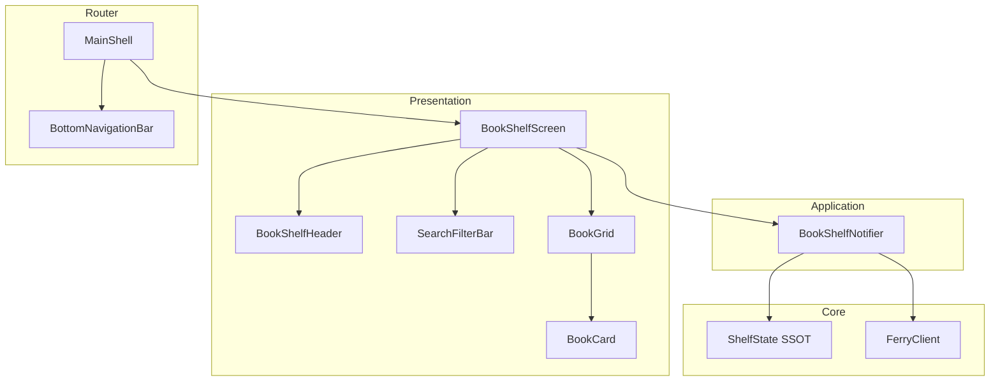
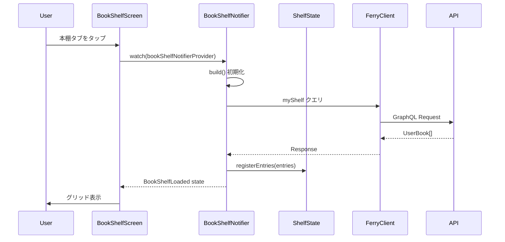

# Technical Design Document

## Overview

**Purpose**: 本棚画面は、ユーザーが登録した書籍を一覧表示し、検索・フィルタリング・ソート機能を通じて効率的に書籍を管理するための中核機能を提供する。

**Users**: Shelfie モバイルアプリのユーザーが、本棚の書籍を閲覧・検索・整理するために使用する。

**Impact**: 既存の `_HomeScreen` プレースホルダーを完全な本棚画面実装に置き換える。既存の `ShelfState`（SSOT）と `myShelf` GraphQL クエリを活用してデータを取得・表示する。

### Goals

- ユーザーの本棚にある書籍を視覚的に分かりやすいグリッド形式で表示する
- 検索・ソート・グループ化機能により効率的な書籍管理を実現する
- ローディング・エラー・空状態を適切にハンドリングし、良好な UX を提供する
- 既存のアーキテクチャパターン（Feature-first + Clean Architecture）に準拠する

### Non-Goals

- コレクション機能（タブ切り替え）は今回のスコープ外
- 本棚画面からの直接的な書籍追加機能（検索画面経由で追加）
- オフラインモードでの完全な書籍データ表示（キャッシュは Ferry の標準機能に依存）
- 評価（星）の編集機能（表示のみ）

## Architecture

### Existing Architecture Analysis

本棚画面は既存のアーキテクチャに統合される。

**活用する既存コンポーネント**:
- `ShelfState` (core/state): 本棚エントリの SSOT、externalId → ShelfEntry のマッピング
- `ShelfEntry`: 読書状態を含む本棚エントリモデル
- `myShelf` GraphQL クエリ: サーバーから本棚データを取得
- `ScreenHeader`: 画面ヘッダー（タイトル + プロフィールアイコン）
- `EmptyState`, `ErrorView`, `LoadingIndicator`: 共通 UI コンポーネント
- `go_router` + `ShellRoute`: ボトムナビゲーション統合

**既存パターンの踏襲**:
- Riverpod + `@riverpod` アノテーションによる状態管理
- freezed によるイミュータブルなデータモデル
- fpdart の Either 型によるエラーハンドリング
- Ferry による GraphQL クライアント

### Architecture Pattern & Boundary Map



**Architecture Integration**:
- **Selected pattern**: Feature-first + Clean Architecture（既存パターン継続）
- **Domain/feature boundaries**: `book_shelf` フィーチャーとして `features/` 配下に配置。`ShelfState` は `core/state/` の SSOT として共有。
- **Existing patterns preserved**: Riverpod Provider、freezed モデル、Ferry GraphQL
- **New components rationale**: 本棚画面固有の UI コンポーネント（BookCard、SearchFilterBar）と状態管理（BookShelfNotifier）を追加
- **Steering compliance**: mobile-tech.md のレイヤー構成に準拠

### Technology Stack

| Layer | Choice / Version | Role in Feature | Notes |
|-------|------------------|-----------------|-------|
| Frontend | Flutter 3.x | UI フレームワーク | 既存 |
| State Management | flutter_riverpod ^2.5.1, riverpod_annotation ^2.3.5 | Provider ベース状態管理 | 既存 |
| Data Modeling | freezed ^2.4.7, freezed_annotation ^2.4.4 | イミュータブルモデル | 既存 |
| GraphQL Client | ferry ^0.16.1+2, ferry_flutter ^0.9.1+1 | API 通信 | 既存 |
| Routing | go_router ^14.6.2 | ナビゲーション | 既存 |
| Error Handling | fpdart ^1.1.0 | Either 型 | 既存 |

## System Flows

### 本棚画面初期表示フロー



**Key Decisions**:
- 画面表示時に `myShelf` クエリを実行してサーバーから最新データを取得
- 取得したデータで `ShelfState` を更新し、SSOT を維持
- 検索・ソート・グループ化はクライアント側でフィルタリング（サーバー負荷軽減）

## Requirements Traceability

| Requirement | Summary | Components | Interfaces | Flows |
|-------------|---------|------------|------------|-------|
| 1.1, 1.2, 1.3 | ヘッダー表示・プロフィール遷移 | BookShelfScreen, ScreenHeader | onProfileTap callback | - |
| 3.1, 3.2, 3.3, 3.4 | 書籍検索 | SearchFilterBar, BookShelfNotifier | searchQuery state, filterBooks() | クライアント側フィルタ |
| 4.1, 4.2, 4.3, 4.4, 4.5 | ソート機能 | SearchFilterBar, BookShelfNotifier | SortOption enum, sortBooks() | - |
| 5.1, 5.2, 5.3, 5.4, 5.5 | グループ化フィルター | SearchFilterBar, BookShelfNotifier | GroupOption enum, groupBooks() | - |
| 6.1, 6.2, 6.3, 6.4, 6.5, 6.6, 6.7 | 書籍グリッド表示 | BookGrid, BookCard | ShelfBookItem model | - |
| 7.1 | 書籍詳細遷移 | BookCard | onTap callback | go_router push |
| 8.1, 8.2, 8.3, 8.4 | ボトムナビゲーション | MainShell (既存) | - | ShellRoute |
| 9.1, 9.2, 9.3 | デザインテーマ | All components | AppTheme, AppColors | - |
| 10.1, 10.2 | 空の本棚状態 | BookShelfScreen, EmptyState | - | - |
| 11.1, 11.2 | ローディング状態 | BookShelfScreen, LoadingIndicator | BookShelfLoading state | - |
| 12.1, 12.2, 12.3 | エラー状態 | BookShelfScreen, ErrorView | BookShelfError state, onRetry | - |

## Components and Interfaces

| Component | Domain/Layer | Intent | Req Coverage | Key Dependencies | Contracts |
|-----------|--------------|--------|--------------|------------------|-----------|
| BookShelfScreen | Presentation | 本棚画面のメインコンテナ | 1, 3-12 | BookShelfNotifier (P0), ScreenHeader (P1) | State |
| SearchFilterBar | Presentation | 検索バー・ソート・グループ化 UI | 3, 4, 5 | - | Service |
| BookGrid | Presentation | 書籍グリッドレイアウト | 6 | BookCard (P1) | - |
| BookCard | Presentation | 個別書籍カード | 6, 7 | - | Service |
| BookShelfNotifier | Application | 本棚画面の状態管理 | 3-12 | ShelfState (P0), FerryClient (P0) | Service, State |
| ShelfBookItem | Domain | 本棚表示用書籍モデル | 6 | - | - |

### Presentation Layer

#### BookShelfScreen

| Field | Detail |
|-------|--------|
| Intent | 本棚画面のメインコンテナ。ヘッダー、検索フィルターバー、書籍グリッドを統合 |
| Requirements | 1.1, 1.2, 1.3, 10.1, 10.2, 11.1, 11.2, 12.1, 12.2, 12.3 |

**Responsibilities & Constraints**
- 画面レイアウトの構成（SafeArea + Column）
- 状態に応じた UI 切り替え（Loading, Loaded, Empty, Error）
- プロフィール画面・書籍詳細画面への遷移トリガー

**Dependencies**
- Inbound: MainShell (ShellRoute) — ボトムナビゲーション統合 (P0)
- Outbound: BookShelfNotifier — 状態取得・操作 (P0)
- Outbound: go_router — 画面遷移 (P1)

**Contracts**: State [x]

##### State Management

```dart
/// BookShelfScreen は BookShelfNotifier の状態を watch し、
/// 状態に応じて適切な UI を表示する
class BookShelfScreen extends ConsumerWidget {
  @override
  Widget build(BuildContext context, WidgetRef ref) {
    final state = ref.watch(bookShelfNotifierProvider);

    return switch (state) {
      BookShelfInitial() => _buildInitialState(),
      BookShelfLoading() => const LoadingIndicator(fullScreen: true),
      BookShelfLoaded(:final displayBooks, :final isEmpty) =>
        isEmpty ? _buildEmptyState() : _buildLoadedState(displayBooks),
      BookShelfError(:final failure) => _buildErrorState(failure),
    };
  }
}
```

**Implementation Notes**
- Integration: `app_router.dart` の `_HomeScreen` を `BookShelfScreen` に置き換え
- Validation: 状態遷移のテストで全パターンをカバー
- Risks: 大量の書籍がある場合のスクロールパフォーマンス → GridView.builder で対応

#### SearchFilterBar

| Field | Detail |
|-------|--------|
| Intent | 検索バー、ソートドロップダウン、グループ化ドロップダウンを横並びで配置 |
| Requirements | 3.1, 3.2, 4.1, 4.2, 4.3, 5.1, 5.2, 5.3 |

**Responsibilities & Constraints**
- 検索キーワード入力の受付とデバウンス
- ソートオプション選択 UI
- グループ化オプション選択 UI

**Dependencies**
- Outbound: BookShelfNotifier — フィルター・ソート・グループ化操作 (P0)

**Contracts**: Service [x]

##### Service Interface

```dart
/// SearchFilterBar のコールバックインターフェース
abstract class SearchFilterBarCallbacks {
  void onSearchChanged(String query);
  void onSortChanged(SortOption option);
  void onGroupChanged(GroupOption option);
}

/// ソートオプション
enum SortOption {
  addedAtDesc,  // 追加日（新しい順）- デフォルト
  addedAtAsc,   // 追加日（古い順）
  titleAsc,     // タイトル（A→Z）
  authorAsc,    // 著者名（A→Z）
}

/// グループ化オプション
enum GroupOption {
  none,         // すべて（グループ化なし）- デフォルト
  byStatus,     // ステータス別
  byAuthor,     // 著者別
}
```

**Implementation Notes**
- Integration: 検索入力には 300ms のデバウンスを適用
- Validation: ドロップダウンの選択状態が正しく反映されることを確認

#### BookGrid

| Field | Detail |
|-------|--------|
| Intent | 書籍を 3 列のグリッドレイアウトで表示 |
| Requirements | 6.1 |

**Responsibilities & Constraints**
- 3 列固定のグリッドレイアウト
- グループ化時はセクションヘッダーを表示
- スクロール可能なリスト

**Dependencies**
- Inbound: BookShelfScreen — 表示データ受け渡し (P0)
- Outbound: BookCard — 個別書籍表示 (P1)

**Implementation Notes**
- Integration: `GridView.builder` + `SliverChildBuilderDelegate` でパフォーマンス最適化
- Risks: グループ化時のセクションヘッダー実装 → `SliverList` + `SliverGrid` の組み合わせ

#### BookCard

| Field | Detail |
|-------|--------|
| Intent | 個別書籍のカード表示（カバー画像、星評価、タイトル、著者名） |
| Requirements | 6.2, 6.3, 6.4, 6.5, 6.6, 6.7, 7.1 |

**Responsibilities & Constraints**
- カバー画像の表示（画像がない場合はプレースホルダー）
- 星評価の表示（未評価の場合は空表示）
- タイトル・著者名の省略表示（maxLines + ellipsis）

**Dependencies**
- Inbound: BookGrid — 書籍データ受け渡し (P0)
- External: cached_network_image — 画像キャッシュ (P2)

**Contracts**: Service [x]

##### Service Interface

```dart
/// BookCard のプロパティ
class BookCardProps {
  const BookCardProps({
    required this.book,
    required this.onTap,
  });

  final ShelfBookItem book;
  final VoidCallback onTap;
}
```

**Implementation Notes**
- Integration: タップ時に `context.push(AppRoutes.bookDetail(bookId: book.externalId))` で遷移
- Validation: 長いタイトル・著者名の省略表示をテスト

### Application Layer

#### BookShelfNotifier

| Field | Detail |
|-------|--------|
| Intent | 本棚画面の状態管理。データ取得、フィルタリング、ソート、グループ化を担当 |
| Requirements | 3.3, 3.4, 4.4, 4.5, 5.4, 5.5, 11.1, 12.1, 12.2, 12.3 |

**Responsibilities & Constraints**
- 初期化時に `myShelf` クエリを実行
- 検索クエリによるフィルタリング（タイトル・著者名の部分一致）
- ソートオプションによる並び替え
- グループ化オプションによるグルーピング
- ShelfState への同期

**Dependencies**
- Inbound: BookShelfScreen — 状態購読 (P0)
- Outbound: ShelfState — SSOT 更新 (P0)
- External: FerryClient — GraphQL API 呼び出し (P0)

**Contracts**: Service [x] / State [x]

##### Service Interface

```dart
@riverpod
class BookShelfNotifier extends _$BookShelfNotifier {
  @override
  Future<BookShelfState> build();

  /// 検索クエリを設定（デバウンス適用済み）
  void setSearchQuery(String query);

  /// ソートオプションを設定
  void setSortOption(SortOption option);

  /// グループ化オプションを設定
  void setGroupOption(GroupOption option);

  /// データを再取得
  Future<void> refresh();
}
```

- Preconditions: ユーザーが認証済みであること
- Postconditions: ShelfState が最新のサーバーデータと同期されること
- Invariants: displayBooks は常にフィルタ・ソート・グループ条件を反映

##### State Management

```dart
/// 本棚画面の状態
@freezed
sealed class BookShelfState with _$BookShelfState {
  /// 初期状態
  const factory BookShelfState.initial() = BookShelfInitial;

  /// ローディング中
  const factory BookShelfState.loading() = BookShelfLoading;

  /// 読み込み完了
  const factory BookShelfState.loaded({
    required List<ShelfBookItem> allBooks,
    required List<ShelfBookItem> displayBooks,
    required String searchQuery,
    required SortOption sortOption,
    required GroupOption groupOption,
    required Map<String, List<ShelfBookItem>> groupedBooks,
  }) = BookShelfLoaded;

  /// エラー
  const factory BookShelfState.error({
    required Failure failure,
  }) = BookShelfError;
}

extension BookShelfLoadedX on BookShelfLoaded {
  bool get isEmpty => allBooks.isEmpty;
  bool get isFiltered => displayBooks.length < allBooks.length;
}
```

**Implementation Notes**
- Integration: `build()` で自動的にデータ取得、`ref.invalidate()` で再取得
- Validation: 各フィルタ・ソート・グループ操作の結果をユニットテストで検証
- Risks: 大量データ時のフィルタリングパフォーマンス → 必要に応じて Isolate 検討

### Domain Layer

#### ShelfBookItem

| Field | Detail |
|-------|--------|
| Intent | 本棚画面表示用の書籍モデル。UserBook と Book の情報を統合 |
| Requirements | 6.2, 6.3, 6.4, 6.5, 6.6 |

**Responsibilities & Constraints**
- 表示に必要な全フィールドを保持
- イミュータブル

```dart
@freezed
class ShelfBookItem with _$ShelfBookItem {
  const factory ShelfBookItem({
    required int userBookId,
    required String externalId,
    required String title,
    required List<String> authors,
    String? coverImageUrl,
    required ReadingStatus readingStatus,
    int? rating,  // 将来の評価機能用（現在は常に null）
    required DateTime addedAt,
    DateTime? completedAt,
  }) = _ShelfBookItem;

  /// UserBook から生成
  factory ShelfBookItem.fromUserBook(GMyShelfData_myShelf userBook) {
    return ShelfBookItem(
      userBookId: userBook.id,
      externalId: userBook.externalId,
      title: userBook.title,
      authors: userBook.authors.toList(),
      coverImageUrl: null,  // myShelf クエリにはカバー画像なし
      readingStatus: _mapReadingStatus(userBook.readingStatus),
      rating: null,
      addedAt: userBook.addedAt,
      completedAt: userBook.completedAt,
    );
  }
}
```

## Data Models

### Domain Model

**Aggregates**:
- `ShelfState`: 本棚エントリの集約ルート（既存、変更なし）

**Entities**:
- `ShelfEntry`: 本棚エントリ（既存、変更なし）
- `ShelfBookItem`: 本棚画面表示用モデル（新規）

**Value Objects**:
- `SortOption`: ソートオプション（新規）
- `GroupOption`: グループ化オプション（新規）
- `ReadingStatus`: 読書状態（既存、変更なし）

**Business Rules & Invariants**:
- 検索は大文字小文字を区別しない
- ソートはロケール対応（日本語の場合は Unicode コードポイント順）
- グループ化の「著者別」は最初の著者でグループ化

### Logical Data Model

**GraphQL Query (既存)**:

```graphql
query MyShelf {
  myShelf {
    id
    externalId
    title
    authors
    readingStatus
    note
    noteUpdatedAt
    addedAt
    completedAt
  }
}
```

**Note**: 現在の `myShelf` クエリには `coverImageUrl` が含まれていない。カバー画像表示には以下のオプションがある:
1. クエリを拡張して `coverImageUrl` を追加（推奨）
2. `externalId` から別途取得（パフォーマンス懸念）

**Implementation Decision**: フェーズ1では `coverImageUrl` なしで実装し、プレースホルダー画像を表示。フェーズ2でクエリ拡張を検討。

## Error Handling

### Error Strategy

既存の `Failure` 型階層を使用し、エラータイプに応じた UI フィードバックを提供する。

### Error Categories and Responses

**Network Errors** (NetworkFailure):
- 表示: wifi_off アイコン + 「ネットワーク接続を確認してください」
- リカバリー: リトライボタン表示

**Server Errors** (ServerFailure):
- 表示: cloud_off アイコン + 「サーバーエラーが発生しました」
- リカバリー: リトライボタン表示

**Auth Errors** (AuthFailure):
- 表示: lock_outline アイコン + 「再度ログインしてください」
- リカバリー: ログイン画面へリダイレクト

### Monitoring

- 既存の `ConsoleLogger` でデバッグ出力
- 将来的に Firebase Crashlytics への報告を検討

## Testing Strategy

### Unit Tests

- `BookShelfNotifier`: 初期化、フィルタリング、ソート、グループ化のロジック
- `ShelfBookItem.fromUserBook`: GraphQL レスポンスからのマッピング
- `SortOption` / `GroupOption`: 各オプションの適用結果

### Widget Tests

- `BookShelfScreen`: 各状態（Loading, Loaded, Empty, Error）の UI 表示
- `SearchFilterBar`: 検索入力、ドロップダウン選択
- `BookCard`: タイトル省略、画像プレースホルダー、タップイベント
- `BookGrid`: グリッドレイアウト、グループ化時のセクションヘッダー

### Integration Tests

- 本棚画面表示 → 検索 → フィルタ結果表示
- 本棚画面表示 → ソート変更 → 並び順変更
- 本棚画面表示 → 書籍タップ → 詳細画面遷移
- エラー発生 → リトライ → 正常表示

## Performance & Scalability

### Target Metrics

- 初期表示: 500ms 以内（キャッシュヒット時）
- フィルタリング応答: 100ms 以内（100 冊まで）
- スクロール: 60fps 維持

### Optimization Techniques

- `GridView.builder` による遅延レンダリング
- 画像の遅延読み込み（`cached_network_image`）
- 検索入力のデバウンス（300ms）
- フィルタリング結果のメモ化（`select` または `computed`）
