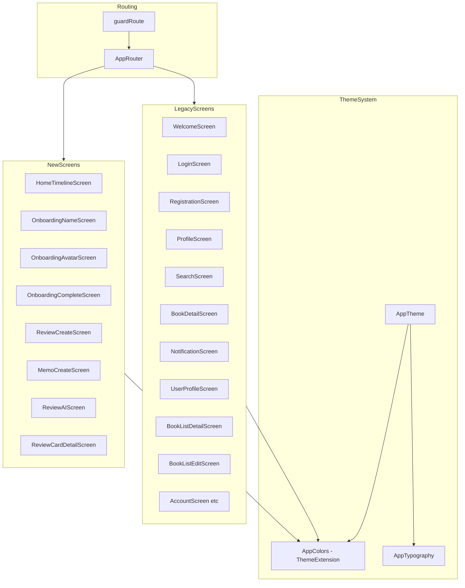
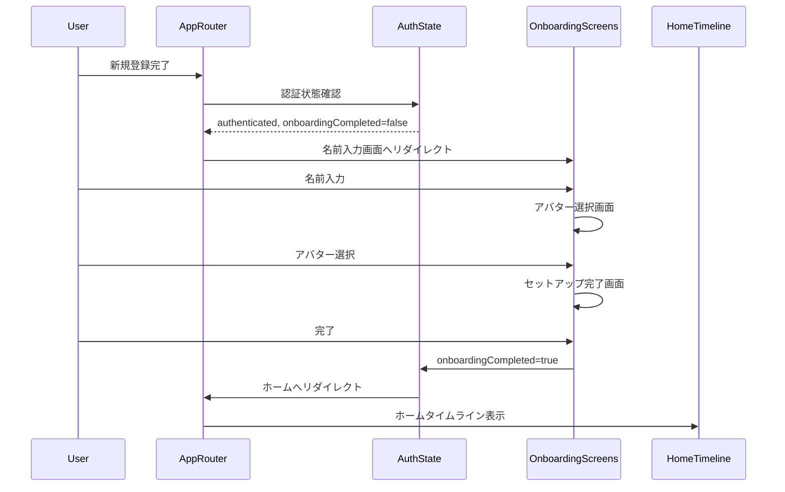
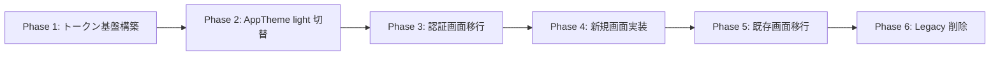
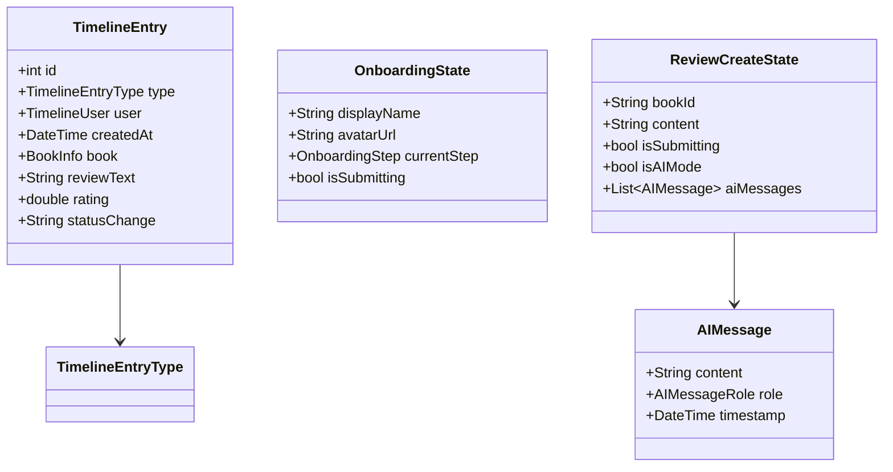
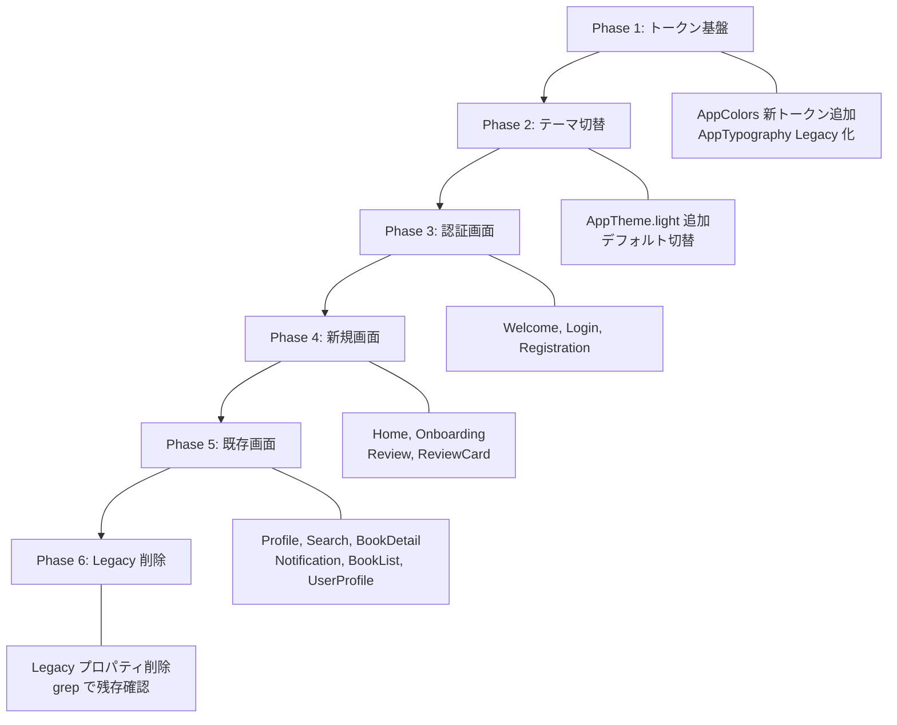

# Technical Design Document: design-system-refresh

## Overview

本機能は、Shelfie モバイルアプリケーション全画面のデザインシステムを Material Design 3 ベースのライトモードテーマに刷新する。design.pen の 33 フレームに基づき、既存 16 画面のデザイン更新と新規画面（ホームタイムライン、オンボーディング、レビュー・メモ作成、感想カード詳細）の追加を行う。

**Users**: 全ユーザーが対象。新規ユーザーはオンボーディングフローを経験し、既存ユーザーはライトモードの新デザインを利用する。

**Impact**: ダークモードからライトモードへの完全移行。`AppColors`（15 Legacy プロパティ + 新トークン）、`AppTypography`（Legacy + 新定義）、`AppTheme`（light メソッド追加）の再構築。78 ファイル 600 箇所の Legacy 参照を段階的に新トークンへ置換する。

### Goals
- Material Design 3 準拠の新カラー・タイポグラフィトークン体系を構築する
- 既存 16 画面を design.pen のデザインに合わせて刷新する
- 新規画面（ホームタイムライン、オンボーディング、レビュー・メモ、感想カード詳細）を追加する
- Legacy トークンと新トークンの共存による段階的移行を実現する

### Non-Goals
- ダークモードの維持・サポート（ライトモードのみに移行）
- API 側の変更（フロントエンドのみの変更）
- パフォーマンス最適化（本機能のスコープ外）
- アニメーション・トランジションの詳細設計

## Architecture

### Existing Architecture Analysis

現在のテーマシステムは以下の構成:

| コンポーネント | ファイル | 現状 |
|--------------|--------|------|
| `AppColors` | `core/theme/app_colors.dart` | 15 Legacy プロパティ、`ThemeExtension<AppColors>`、`dark` 定数のみ |
| `AppTypography` | `core/theme/app_typography.dart` | `abstract final class`、静的定数、Material 3 標準サイズ |
| `AppTheme` | `core/theme/app_theme.dart` | `dark()` メソッドのみ、`Brightness.dark` |
| `AppSpacing` | `core/theme/app_spacing.dart` | 4pt グリッド、変更不要 |
| `AppRadius` | `core/theme/app_radius.dart` | 6 段階、変更不要 |
| `AppIconSize` | `core/theme/app_icon_size.dart` | 3 段階、変更不要 |

ルーティングは `go_router` の `StatefulShellRoute` で 3 ブランチ（検索、通知、プロフィール）。`AppRoutes.home` (`/`) は現在プロフィール画面にマッピングされている。

### Architecture Pattern & Boundary Map



**Architecture Integration**:
- Selected pattern: 既存の Feature-first + Clean Architecture を維持。テーマ変更は `core/theme/` 層に集約
- Domain/feature boundaries: 新規画面は個別の Feature ディレクトリに配置（`home_timeline/`, `onboarding/`, `review/`）
- Existing patterns preserved: `ThemeExtension` によるカスタムカラー提供、`abstract final class` によるタイポグラフィ・スペーシング定数
- New components rationale: 新規 Feature は design.pen の新画面に対応。既存 Feature は presentation 層のみ変更
- Steering compliance: Feature-first 構成、Clean Architecture レイヤー分離、Riverpod 状態管理を維持

### Technology Stack

| Layer | Choice / Version | Role in Feature | Notes |
|-------|------------------|-----------------|-------|
| UI Framework | Flutter 3.x | 全画面の UI 実装 | 既存 |
| Theme System | Material Design 3 | カラー・タイポグラフィ基盤 | ライトモードに切替 |
| State Management | Riverpod 2.x | 新規画面の状態管理 | 既存パターン踏襲 |
| Routing | go_router 14.x | タブ構成変更・新規ルート追加 | ホームタブ追加 |
| Data Model | freezed 2.x | 新規エンティティの定義 | 既存パターン踏襲 |

## System Flows

### オンボーディングフロー



### テーマ切替・段階的移行フロー



- Phase 1: `AppColors` に新トークン追加、`AppTypography` Legacy 化
- Phase 2: `AppTheme.light()` 追加、デフォルトテーマを切替
- Phase 3: Welcome/Login/Registration 画面を新トークンに移行
- Phase 4: ホームタイムライン、オンボーディング、レビュー画面を新トークンで実装
- Phase 5: 残りの既存画面を順次移行
- Phase 6: Legacy プロパティを完全削除

## Requirements Traceability

| Requirement | Summary | Components | Interfaces | Flows |
|-------------|---------|------------|------------|-------|
| 1.1 | 新カラートークン定義 | AppColors | ThemeExtension | - |
| 1.2 | ColorScheme / ThemeExtension 提供 | AppColors, AppTheme | ThemeExtension | - |
| 1.3 | 新旧トークン共存 | AppColors | ThemeExtension | 段階的移行 |
| 1.4 | AppTypography Legacy 化・新定義 | AppTypography | TextTheme | - |
| 1.5 | NotoSansJP 維持 | AppTypography, AppTheme | TextTheme | - |
| 1.6 | Typography 新旧共存 | AppTypography | TextTheme | 段階的移行 |
| 1.7 | AppTheme ライトモード再構築 | AppTheme | ThemeData | - |
| 1.8 | Legacy 削除可能状態 | AppColors, AppTypography | - | Legacy 削除 |
| 2.1-2.4 | 認証画面刷新 | WelcomeScreen, LoginScreen, RegistrationScreen | - | - |
| 3.1-3.5 | オンボーディングフロー | OnboardingNameScreen, OnboardingAvatarScreen, OnboardingCompleteScreen, AppRouter | OnboardingState | オンボーディング |
| 4.1-4.4 | ホームタイムライン | HomeTimelineScreen, TimelineCard | TimelineState | - |
| 5.1-5.4 | レビュー・メモ作成 | ReviewCreateScreen, MemoCreateScreen, ReviewAIScreen | ReviewState | - |
| 6.1-6.3 | 感想カード詳細 | ReviewCardDetailScreen, ReputationSection | - | - |
| 7.1-7.6 | プロフィール画面刷新 | ProfileScreen | - | - |
| 8.1-8.6 | 検索画面刷新 | SearchScreen | - | - |
| 9.1-9.6 | 本詳細画面刷新 | BookDetailScreen | - | - |
| 10.1-10.3 | 他人プロフィール刷新 | UserProfileScreen | - | - |
| 11.1-11.2 | おしらせ画面刷新 | NotificationScreen | - | - |
| 12.1-12.4 | ブックリスト画面刷新 | BookListDetailScreen, BookListEditScreen | - | - |
| 13.1-13.4 | Legacy 完全除去 | AppColors, AppTypography, AppTheme | - | Legacy 削除 |

## Components and Interfaces

| Component | Domain/Layer | Intent | Req Coverage | Key Dependencies | Contracts |
|-----------|--------------|--------|--------------|------------------|-----------|
| AppColors（拡張） | Core/Theme | 新カラートークンの追加と Legacy 共存 | 1.1, 1.2, 1.3, 1.8, 13.1 | ThemeExtension (P0) | State |
| AppTypography（改修） | Core/Theme | Legacy 化と新タイポグラフィ定義 | 1.4, 1.5, 1.6, 13.2 | TextTheme (P0) | State |
| AppTheme（拡張） | Core/Theme | ライトモードテーマ構築 | 1.7 | AppColors (P0), AppTypography (P0) | State |
| OnboardingNameScreen | Feature/Onboarding | プロフィール名前入力 | 3.1, 3.4 | AppRouter (P0) | State |
| OnboardingAvatarScreen | Feature/Onboarding | アバター選択 | 3.2, 3.4 | AppRouter (P0) | State |
| OnboardingCompleteScreen | Feature/Onboarding | セットアップ完了 | 3.3, 3.5 | AppRouter (P0) | State |
| OnboardingNotifier | Feature/Onboarding | オンボーディング状態管理 | 3.4, 3.5 | AuthState (P0), AccountRepository (P1) | State |
| HomeTimelineScreen | Feature/HomeTimeline | タイムライン表示 | 4.1, 4.3, 4.4 | TimelineRepository (P0) | State |
| TimelineCard | Feature/HomeTimeline | タイムラインカード群 | 4.2 | - | - |
| ReviewCreateScreen | Feature/Review | レビュー作成 | 5.1, 5.4 | ReviewRepository (P1) | State |
| MemoCreateScreen | Feature/Review | メモ作成 | 5.2, 5.4 | ReviewRepository (P1) | State |
| ReviewAIScreen | Feature/Review | AI 対話レビュー | 5.3, 5.4 | AIService (P1) | State |
| ReviewCardDetailScreen | Feature/Review | 感想カード詳細表示 | 6.1, 6.3 | - | - |
| ReputationSection | Feature/Review | 外部評判セクション | 6.2 | - | - |
| AppRouter（拡張） | Core/Routing | タブ構成変更・オンボーディングガード | 3.4, 3.5, 4.1 | AuthState (P0) | - |

### Core/Theme Layer

#### AppColors（拡張）

| Field | Detail |
|-------|--------|
| Intent | Material Design 3 準拠の新カラートークンを定義し、Legacy トークンとの共存を実現する |
| Requirements | 1.1, 1.2, 1.3, 1.8, 13.1 |

**Responsibilities & Constraints**
- design.pen のカラー変数をすべて Dart の `Color` 定数として定義する
- `ThemeExtension<AppColors>` として `copyWith`/`lerp` を提供する
- Legacy プロパティと新プロパティを同一クラスに共存させる

**Dependencies**
- Outbound: Flutter `ThemeExtension` -- テーマ統合 (P0)

**Contracts**: State [x]

##### State Management

新トークン定義（`AppColors` に追加するプロパティ、design.pen の全 55 カラー変数に対応）:

```dart
// --- MD3 Core: Primary ---
final Color primary;                // #3D8A5A
final Color onPrimary;              // #FFFFFF
final Color primaryContainer;       // #EDF5F0
final Color onPrimaryContainer;     // #1A3D2A

// --- MD3 Core: Secondary ---
final Color secondary;              // #8B9F7B
final Color onSecondary;            // #FFFFFF
final Color secondaryContainer;     // #E0EDE5
final Color onSecondaryContainer;   // #2B4C3F

// --- MD3 Core: Tertiary ---
final Color tertiary;               // #D89575
final Color onTertiary;             // #FFFFFF
final Color tertiaryContainer;      // #FDF4EC
final Color onTertiaryContainer;    // #5A3A2A

// --- MD3 Core: Error ---
final Color error;                  // #E57373
final Color onError;                // #FFFFFF
final Color errorContainer;         // #FFF0F0
final Color onErrorContainer;       // #C84A5A

// --- MD3 Core: Surface ---
final Color surface;                // #FAFAF8
final Color onSurface;              // #1A1918
final Color surfaceContainerLowest; // #FFFFFF
final Color surfaceContainerLow;    // #F5F4F1
final Color surfaceContainer;       // #EDECEA
final Color surfaceContainerHigh;   // #E5E4E1
final Color surfaceContainerHighest;// #D1D0CD
final Color surfaceTint;            // #3D8A5A
final Color onSurfaceVariant;       // #6D6C6A
final Color inverseSurface;         // #1C1917
final Color inverseOnSurface;       // #FAFAF8

// --- MD3 Core: Outline / Scrim ---
final Color outline;                // #9C9B99
final Color outlineVariant;         // #E5E4E1
final Color scrim;                  // #00000040

// --- Semantic: Border ---
final Color borderSubtle;           // #E5E4E1
final Color borderStrong;           // #D1D0CD

// --- Semantic: Text ---
final Color textPrimary;            // #1A1918
final Color textSecondary;          // #6D6C6A
final Color textTertiary;           // #9C9B99

// --- Semantic: Background ---
final Color bgPrimary;              // #F5F4F1
final Color bgSurface;              // #FFFFFF
final Color bgMuted;                // #EDECEA
final Color bgHero;                 // #1C1917
final Color bgHeroGrad;             // #292524

// --- Semantic: Accent ---
final Color accentPrimary;          // #3D8A5A
final Color accentLink;             // #8B9F7B
final Color accentWarm;             // #D89575

// --- Semantic: Tab ---
final Color tabInactive;            // #A8A7A5

// --- Semantic: Tag ---
final Color tagAmber;               // #FFF8E1
final Color tagAmberText;           // #8B6914
final Color tagBlue;                // #EDF4FF
final Color tagBlueText;            // #4A7AC8
final Color tagPurple;              // #F0EDFF
final Color tagPurpleText;          // #6B4AC8
final Color tagRose;                // #F5E6E0
final Color tagRoseText;            // #A0614A
final Color tagTeal;                // #E8F0EC
final Color tagTealText;            // #3D7A5A

// --- Semantic: Status ---
final Color statusComplete;         // #A8D5BA
final Color statusReading;          // #D89575

// --- Semantic: Star ---
final Color starColor;              // #4CAF50
final Color starRating;             // #4CAF50

// --- Semantic: Match Badge ---
final Color matchBadge;             // #C8854A
final Color matchBadgeBg;           // #FFF8F0
```

`light` 定数を追加し、Legacy プロパティにはダークモード値をフォールバックとして残す:

```dart
static const light = AppColors(
  // MD3 Core: Primary
  primary: Color(0xFF3D8A5A),
  onPrimary: Color(0xFFFFFFFF),
  primaryContainer: Color(0xFFEDF5F0),
  onPrimaryContainer: Color(0xFF1A3D2A),
  // MD3 Core: Secondary
  secondary: Color(0xFF8B9F7B),
  onSecondary: Color(0xFFFFFFFF),
  secondaryContainer: Color(0xFFE0EDE5),
  onSecondaryContainer: Color(0xFF2B4C3F),
  // MD3 Core: Tertiary
  tertiary: Color(0xFFD89575),
  onTertiary: Color(0xFFFFFFFF),
  tertiaryContainer: Color(0xFFFDF4EC),
  onTertiaryContainer: Color(0xFF5A3A2A),
  // MD3 Core: Error
  error: Color(0xFFE57373),
  onError: Color(0xFFFFFFFF),
  errorContainer: Color(0xFFFFF0F0),
  onErrorContainer: Color(0xFFC84A5A),
  // MD3 Core: Surface
  surface: Color(0xFFFAFAF8),
  onSurface: Color(0xFF1A1918),
  surfaceContainerLowest: Color(0xFFFFFFFF),
  surfaceContainerLow: Color(0xFFF5F4F1),
  surfaceContainer: Color(0xFFEDECEA),
  surfaceContainerHigh: Color(0xFFE5E4E1),
  surfaceContainerHighest: Color(0xFFD1D0CD),
  surfaceTint: Color(0xFF3D8A5A),
  onSurfaceVariant: Color(0xFF6D6C6A),
  inverseSurface: Color(0xFF1C1917),
  inverseOnSurface: Color(0xFFFAFAF8),
  // MD3 Core: Outline / Scrim
  outline: Color(0xFF9C9B99),
  outlineVariant: Color(0xFFE5E4E1),
  scrim: Color(0x40000000),
  // Semantic: Border
  borderSubtle: Color(0xFFE5E4E1),
  borderStrong: Color(0xFFD1D0CD),
  // Semantic: Text
  textPrimary: Color(0xFF1A1918),
  textSecondary: Color(0xFF6D6C6A),
  textTertiary: Color(0xFF9C9B99),
  // Semantic: Background
  bgPrimary: Color(0xFFF5F4F1),
  bgSurface: Color(0xFFFFFFFF),
  bgMuted: Color(0xFFEDECEA),
  bgHero: Color(0xFF1C1917),
  bgHeroGrad: Color(0xFF292524),
  // Semantic: Accent
  accentPrimary: Color(0xFF3D8A5A),
  accentLink: Color(0xFF8B9F7B),
  accentWarm: Color(0xFFD89575),
  // Semantic: Tab
  tabInactive: Color(0xFFA8A7A5),
  // Semantic: Tag
  tagAmber: Color(0xFFFFF8E1),
  tagAmberText: Color(0xFF8B6914),
  tagBlue: Color(0xFFEDF4FF),
  tagBlueText: Color(0xFF4A7AC8),
  tagPurple: Color(0xFFF0EDFF),
  tagPurpleText: Color(0xFF6B4AC8),
  tagRose: Color(0xFFF5E6E0),
  tagRoseText: Color(0xFFA0614A),
  tagTeal: Color(0xFFE8F0EC),
  tagTealText: Color(0xFF3D7A5A),
  // Semantic: Status
  statusComplete: Color(0xFFA8D5BA),
  statusReading: Color(0xFFD89575),
  // Semantic: Star
  starColor: Color(0xFF4CAF50),
  starRating: Color(0xFF4CAF50),
  // Semantic: Match Badge
  matchBadge: Color(0xFFC8854A),
  matchBadgeBg: Color(0xFFFFF8F0),
  // Legacy tokens (dark values preserved)
  primaryLegacy: _primary,
  backgroundLegacy: _background,
  // ... 全 15 Legacy トークン
);
```

**Implementation Notes**
- `copyWith` と `lerp` に全 55 新プロパティを追加する
- Legacy プロパティは `light` 定数でもダーク値を保持（既存画面の互換性）
- MD3 Core カラーは `ColorScheme` にもマッピングする（`ColorScheme.fromSeed` のオーバーライド）
- Semantic カラーは `ThemeExtension` 経由でのみ提供する（`ColorScheme` には含めない）

---

#### AppTypography（改修）

| Field | Detail |
|-------|--------|
| Intent | 既存スタイルを Legacy 化し、design.pen に基づく新タイポグラフィトークンを定義する |
| Requirements | 1.4, 1.5, 1.6, 13.2 |

**Responsibilities & Constraints**
- 既存の静的定数を `Legacy` サフィックス付きにリネームする
- design.pen のフォントサイズ・ウェイト定義で新しい静的定数を定義する
- フォントファミリーは NotoSansJP を維持する

**Contracts**: State [x]

##### State Management

Legacy 化と新定義:

```dart
abstract final class AppTypography {
  // --- Legacy styles ---
  static const displayLargeLegacy = TextStyle(fontSize: 57, ...);
  static const displayMediumLegacy = TextStyle(fontSize: 45, ...);
  // ... 全既存スタイルを Legacy 化

  // --- New styles (design.pen) ---
  static const displayLarge = TextStyle(fontSize: 36, fontWeight: FontWeight.w700, height: 1.22);
  static const displayMedium = TextStyle(fontSize: 36, fontWeight: FontWeight.w600, height: 1.22);
  static const displaySmall = TextStyle(fontSize: 36, fontWeight: FontWeight.w400, height: 1.22);
  static const headlineLarge = TextStyle(fontSize: 32, fontWeight: FontWeight.w700, height: 1.25);
  static const headlineMedium = TextStyle(fontSize: 28, fontWeight: FontWeight.w600, height: 1.29);
  static const headlineSmall = TextStyle(fontSize: 24, fontWeight: FontWeight.w600, height: 1.33);
  static const titleLarge = TextStyle(fontSize: 22, fontWeight: FontWeight.w600, height: 1.27);
  static const titleMedium = TextStyle(fontSize: 16, fontWeight: FontWeight.w600, height: 1.50);
  static const titleSmall = TextStyle(fontSize: 14, fontWeight: FontWeight.w600, height: 1.43);
  static const bodyLarge = TextStyle(fontSize: 16, fontWeight: FontWeight.w400, height: 1.50);
  static const bodyMedium = TextStyle(fontSize: 14, fontWeight: FontWeight.w400, height: 1.43);
  static const bodySmall = TextStyle(fontSize: 12, fontWeight: FontWeight.w400, height: 1.33);
  static const labelLarge = TextStyle(fontSize: 14, fontWeight: FontWeight.w500, height: 1.43);
  static const labelMedium = TextStyle(fontSize: 12, fontWeight: FontWeight.w500, height: 1.33);
  static const labelSmall = TextStyle(fontSize: 11, fontWeight: FontWeight.w500, height: 1.45);

  // --- TextTheme generators ---
  static TextTheme get textTheme => const TextTheme(/* new styles */);
  static TextTheme get textThemeLegacy => const TextTheme(/* legacy styles */);
}
```

**Implementation Notes**
- `textTheme` ゲッターは新スタイルを返すように変更
- Legacy 用の `textThemeLegacy` ゲッターを追加（移行期間中の参照用）
- `letterSpacing` は design.pen で未指定の場合 0 とする

---

#### AppTheme（拡張）

| Field | Detail |
|-------|--------|
| Intent | ライトモードベースの新テーマを構築し、デフォルトテーマとして提供する |
| Requirements | 1.7 |

**Responsibilities & Constraints**
- `light()` メソッドを新規追加する
- `theme` ゲッターのデフォルトを `light()` に切替える
- `dark()` メソッドは移行期間中に残す

**Contracts**: State [x]

##### State Management

```dart
abstract final class AppTheme {
  static const seedColor = Color(0xFF3D8A5A); // 新プライマリカラー

  static ThemeData light() {
    final colorScheme = ColorScheme.fromSeed(
      seedColor: seedColor,
      brightness: Brightness.light,
      surface: AppColors.light.surface,
      onSurface: AppColors.light.onSurface,
      primary: AppColors.light.primary,
      onPrimary: AppColors.light.onPrimary,
      error: AppColors.light.error,
    );

    final textTheme = AppTypography.textTheme.apply(
      fontFamily: 'NotoSansJP',
      bodyColor: AppColors.light.onSurface,
      displayColor: AppColors.light.onSurface,
    );

    return ThemeData(
      useMaterial3: true,
      brightness: Brightness.light,
      colorScheme: colorScheme,
      scaffoldBackgroundColor: AppColors.light.surface,
      textTheme: textTheme,
      extensions: const [AppColors.light],
      // ... component themes
    );
  }

  static ThemeData dark() { /* 既存実装を維持 */ }

  static ThemeData get theme => light(); // デフォルト切替
}
```

**Implementation Notes**
- `SystemUiOverlayStyle` を `SystemUiOverlayStyle.dark` に変更（ライト背景にダークステータスバー）
- `FilledButton`、`OutlinedButton`、`InputDecoration` のスタイルを新カラートークンに合わせる
- `AppBarTheme` を新カラートークンで再定義する

---

### Core/Routing Layer

#### AppRouter（拡張）

| Field | Detail |
|-------|--------|
| Intent | ホームタイムラインタブの追加とオンボーディングガードの実装 |
| Requirements | 3.4, 3.5, 4.1 |

**Responsibilities & Constraints**
- `StatefulShellRoute` に ホームタイムラインブランチを追加する（4 ブランチ構成）
- `guardRoute` にオンボーディング完了チェックを追加する
- 新規画面のルートを定義する

**Dependencies**
- Inbound: AuthState -- 認証・オンボーディング状態 (P0)
- Outbound: 全画面 -- ルーティング先 (P0)

**Contracts**: State [x]

##### State Management

タブ構成変更:

```
現在: [検索(0), +追加(1:特殊), お知らせ(2), プロフィール(3)]
変更後: [ホーム(0), 検索(1), +追加(2:特殊), お知らせ(3), プロフィール(4)]
```

新規ルート定義:

```dart
// AppRoutes に追加
static const onboardingName = '/onboarding/name';
static const onboardingAvatar = '/onboarding/avatar';
static const onboardingComplete = '/onboarding/complete';
static const homeTab = '/';
static const reviewCreate = '/reviews/create';
static const memoCreate = '/memos/create';
static String reviewDetail({required int reviewId}) => '/reviews/$reviewId';
```

`guardRoute` の拡張:

```dart
// オンボーディング未完了チェック
if (isAuthenticated && !onboardingCompleted && !isOnboardingRoute) {
  return AppRoutes.onboardingName;
}
```

**Implementation Notes**
- `_addButtonIndex` を 2 に更新する
- `AppRoutes.home` (`/`) はホームタイムラインにマッピングする
- `AppRoutes.profileTab` は `/profile` のまま維持する

---

### Feature/Onboarding Layer

#### OnboardingNotifier

| Field | Detail |
|-------|--------|
| Intent | オンボーディングフローの状態管理と API 連携 |
| Requirements | 3.4, 3.5 |

**Responsibilities & Constraints**
- 名前入力・アバター選択の状態を管理する
- API を呼び出してプロフィール情報を保存する
- オンボーディング完了フラグを更新する

**Dependencies**
- Outbound: AccountRepository -- プロフィール更新 (P0)
- Outbound: AuthState -- オンボーディング完了状態の更新 (P0)

**Contracts**: State [x]

##### State Management

```dart
@freezed
class OnboardingState with _$OnboardingState {
  const factory OnboardingState({
    @Default('') String displayName,
    String? avatarUrl,
    @Default(false) bool isSubmitting,
    @Default(OnboardingStep.name) OnboardingStep currentStep,
  }) = _OnboardingState;
}

enum OnboardingStep { name, avatar, complete }
```

**Implementation Notes**
- `@riverpod` で Provider を生成する
- `AuthState` にオンボーディング完了フラグを追加する必要がある
- アバター選択はプリセットアバターのリストから選択（画像アップロードは既存の `AvatarEditor` を流用可能）

---

### Feature/HomeTimeline Layer

#### HomeTimelineScreen

| Field | Detail |
|-------|--------|
| Intent | フォロー中ユーザーの読書活動をタイムラインで表示する |
| Requirements | 4.1, 4.3, 4.4 |

**Responsibilities & Constraints**
- タイムラインフィードを無限スクロールで表示する
- 各タイムラインカードをタップして詳細画面に遷移する
- 新カラートークンのみを使用する

**Dependencies**
- Outbound: TimelineRepository -- タイムラインデータ取得 (P0)
- Outbound: AppRouter -- 画面遷移 (P1)

**Contracts**: State [x]

##### State Management

```dart
@freezed
class TimelineState with _$TimelineState {
  const factory TimelineState({
    @Default([]) List<TimelineEntry> entries,
    @Default(false) bool isLoading,
    @Default(false) bool hasMore,
    String? cursor,
  }) = _TimelineState;
}

@freezed
class TimelineEntry with _$TimelineEntry {
  const factory TimelineEntry({
    required int id,
    required TimelineEntryType type,
    required TimelineUser user,
    required DateTime createdAt,
    // type-specific data
    BookInfo? book,
    String? reviewText,
    double? rating,
    String? statusChange,
  }) = _TimelineEntry;
}

enum TimelineEntryType {
  addedToShelf,
  statusChanged,
  reviewed,
  rated,
  addedToList,
}
```

**Implementation Notes**
- API 側にタイムライン取得エンドポイントの追加が必要（別 spec で対応）
- 本 spec ではフロントエンドの UI コンポーネントとデータモデルのみを定義
- カーソルベースのページネーションを採用

#### TimelineCard

| Field | Detail |
|-------|--------|
| Intent | タイムラインの各エントリをカード形式で表示するコンポーネント群 |
| Requirements | 4.2 |

**Implementation Notes**
- `TimelineEntryType` ごとに異なるカードレイアウトを提供
- 共通の base widget を定義し、type ごとにコンテンツ部分を差し替える
- design.pen「タイムラインカード種別」の各バリエーションに対応

---

### Feature/Review Layer

#### ReviewCreateScreen / MemoCreateScreen / ReviewAIScreen

| Field | Detail |
|-------|--------|
| Intent | レビュー・メモ作成機能と AI 対話レビュー機能を提供する |
| Requirements | 5.1, 5.2, 5.3, 5.4 |

**Responsibilities & Constraints**
- テキスト入力 UI を提供する
- AI 対話モードでは会話形式で感想を引き出す
- 新カラートークンのみを使用する

**Dependencies**
- Outbound: ReviewRepository -- レビュー・メモ保存 (P1)
- Outbound: AIService -- AI 対話 (P1)

**Contracts**: State [x]

##### State Management

```dart
@freezed
class ReviewCreateState with _$ReviewCreateState {
  const factory ReviewCreateState({
    required String bookId,
    @Default('') String content,
    @Default(false) bool isSubmitting,
    @Default(false) bool isAIMode,
    @Default([]) List<AIMessage> aiMessages,
  }) = _ReviewCreateState;
}

@freezed
class AIMessage with _$AIMessage {
  const factory AIMessage({
    required String content,
    required AIMessageRole role,
    required DateTime timestamp,
  }) = _AIMessage;
}

enum AIMessageRole { user, assistant }
```

**Implementation Notes**
- ReviewCreateScreen と MemoCreateScreen は共通の base widget を共有し、ラベル・プレースホルダーテキストで差別化
- AI 対話モードは ReviewCreateScreen の拡張として実装（モード切替）
- API 側のレビュー・メモ・AI 対話エンドポイントは別 spec で対応

---

#### ReviewCardDetailScreen / ReputationSection

| Field | Detail |
|-------|--------|
| Intent | レビュー詳細表示と外部評判セクション |
| Requirements | 6.1, 6.2, 6.3 |

**Implementation Notes**
- ReviewCardDetailScreen はタイムラインカードの詳細表示画面
- ReputationSection は BookDetailScreen 内のコンポーネントとして実装
- 新カラートークンのみを使用

---

### 既存画面刷新（Summary）

以下の画面は presentation 層のウィジェットのみ変更。アーキテクチャ上の新しい境界は導入しない。

| Screen | Requirements | Migration Scope |
|--------|-------------|-----------------|
| WelcomeScreen | 2.1, 2.4 | カラー・レイアウト更新。ウィジェット群（WelcomeBackground, WelcomeButtons, WelcomeLogo 等）の Legacy 参照を新トークンに置換 |
| LoginScreen | 2.3, 2.4 | カラー・レイアウト更新。LoginForm, LoginBackground, LoginHeader 等 |
| RegistrationScreen | 2.2, 2.4 | カラー・レイアウト更新。RegistrationForm, RegistrationBackground 等 |
| ProfileScreen | 7.1-7.6 | タブ構成（本棚/いいね/ブックリスト）の UI 更新。グリッド表示追加。ProfileHeader, ProfileContentView, ProfileTabBar 等 |
| SearchScreen | 8.1-8.6 | 初期状態・入力中・検索結果の UI 更新。SearchBarWidget, RecentBooksSection 等 |
| BookDetailScreen | 9.1-9.6 | みんな/自分の記録/作品情報タブの UI 更新。空状態デザイン追加 |
| UserProfileScreen | 10.1-10.3 | プロフィール・本棚表示の UI 更新。ロングタップモーダル追加 |
| NotificationScreen | 11.1-11.2 | 通知一覧の UI 更新 |
| BookListDetailScreen | 12.1-12.2 | 自分/他人のリスト詳細 UI 更新 |
| BookListEditScreen | 12.3, 12.4 | リスト編集 UI 更新 |

---

### Legacy 削除コンポーネント

#### Legacy トークン除去（最終フェーズ）

| Field | Detail |
|-------|--------|
| Intent | 全画面移行完了後に Legacy プロパティを安全に削除する |
| Requirements | 13.1, 13.2, 13.3, 13.4 |

**Implementation Notes**
- `AppColors` から `*Legacy` プロパティ（15 個）を削除
- `AppTypography` から `*Legacy` スタイル（15 個）を削除
- `AppTheme.dark()` メソッドを削除
- プロジェクト全体で Legacy 参照が残っていないことを `grep` で確認
- 13.3 の保証は CI/CD でのコンパイルエラー検出で担保

## Data Models

### Domain Model

新規エンティティ:



これらのエンティティは freezed で生成されるイミュータブルデータクラスとして定義する。

### Feature Directory Structure

新規追加するディレクトリ:

```
apps/mobile/lib/features/
├── home_timeline/
│   ├── application/
│   │   └── timeline_notifier.dart
│   ├── data/
│   │   └── timeline_repository.dart
│   ├── domain/
│   │   ├── timeline_entry.dart
│   │   └── timeline_entry.freezed.dart
│   └── presentation/
│       ├── home_timeline_screen.dart
│       └── widgets/
│           ├── timeline_card.dart
│           ├── timeline_card_added.dart
│           ├── timeline_card_reviewed.dart
│           ├── timeline_card_rated.dart
│           └── timeline_card_status.dart
├── onboarding/
│   ├── application/
│   │   └── onboarding_notifier.dart
│   ├── domain/
│   │   ├── onboarding_state.dart
│   │   └── onboarding_state.freezed.dart
│   └── presentation/
│       ├── onboarding_name_screen.dart
│       ├── onboarding_avatar_screen.dart
│       └── onboarding_complete_screen.dart
└── review/
    ├── application/
    │   └── review_create_notifier.dart
    ├── data/
    │   └── review_repository.dart
    ├── domain/
    │   ├── review_create_state.dart
    │   └── review_create_state.freezed.dart
    └── presentation/
        ├── review_create_screen.dart
        ├── memo_create_screen.dart
        ├── review_ai_screen.dart
        ├── review_card_detail_screen.dart
        └── widgets/
            ├── review_text_editor.dart
            ├── ai_message_bubble.dart
            └── reputation_section.dart
```

## Error Handling

### Error Strategy

既存の `Failure` 型階層（NetworkFailure, ServerFailure, AuthFailure, ValidationFailure, UnexpectedFailure）を踏襲する。新規画面固有のエラーは追加しない。

### Error Categories and Responses

- **オンボーディング失敗**: プロフィール保存失敗時 → ValidationFailure でエラーメッセージ表示、リトライ可能
- **タイムライン取得失敗**: NetworkFailure → エラービューとリトライボタン表示
- **レビュー保存失敗**: ServerFailure → スナックバーでエラー通知、入力内容は保持

## Testing Strategy

### Unit Tests
- `AppColors.light` の全新トークン値が design.pen の定義と一致することを検証
- `AppTypography` の新スタイルのフォントサイズ・ウェイトが design.pen と一致することを検証
- `OnboardingNotifier` の状態遷移（name → avatar → complete）を検証
- `TimelineNotifier` のページネーション・データ取得を検証
- `guardRoute` のオンボーディングガード条件を検証

### Widget Tests
- 各新規画面が新カラートークンのみを使用していることを検証（Legacy 参照がないこと）
- オンボーディング画面の入力バリデーション・遷移を検証
- タイムラインカードの各バリエーションのレンダリングを検証
- 既存画面刷新後に視覚的リグレッションがないことを検証

### Integration Tests
- オンボーディングフロー全体（登録完了 → 名前入力 → アバター選択 → 完了 → ホーム）
- タブナビゲーション（ホーム → 検索 → 通知 → プロフィール）の正常動作

## Migration Strategy



### Phase 別のロールバック戦略

- **Phase 1-2**: `AppTheme.theme` のデフォルトを `dark()` に戻すだけでロールバック可能
- **Phase 3-5**: 各画面は独立して移行されるため、個別画面単位でのロールバックが可能
- **Phase 6**: Legacy 削除は全画面移行完了後にのみ実行。コンパイルエラーで未移行箇所を検出
