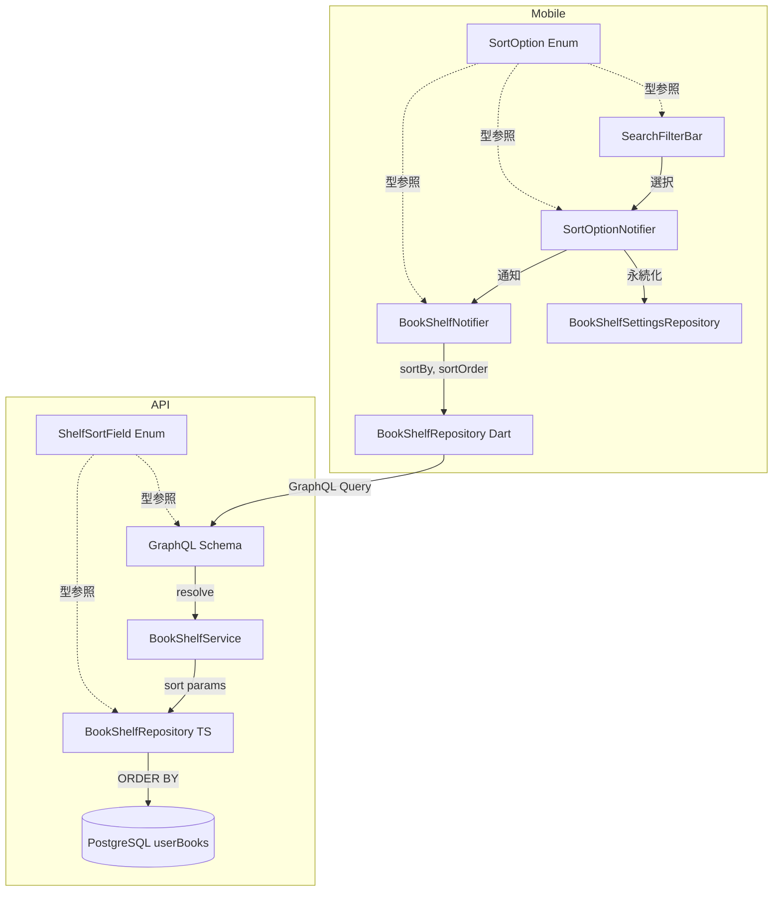
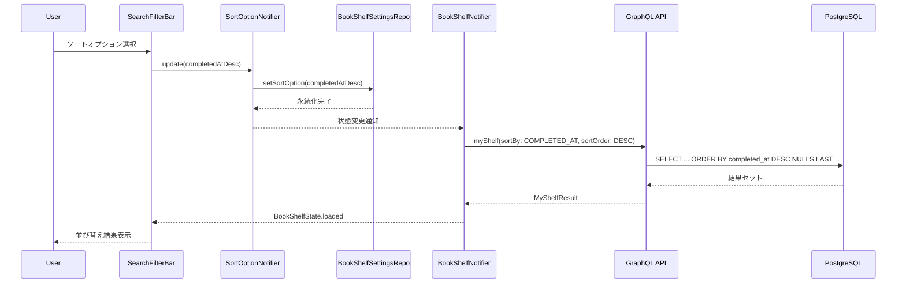

# Design Document

## Overview

**Purpose**: 本棚の書籍一覧に「読了日」と「発売日」によるソートオプションを追加し、ユーザーが書籍を時系列や発売時期で整理できるようにする。

**Users**: 本棚を利用する全ユーザーが、ソート選択 UI から新しい並び替え方法を選択して書籍一覧を閲覧する。

**Impact**: 既存の ShelfSortField enum（API 側）と SortOption enum（モバイル側）に新しい値を追加し、リポジトリのソートロジックを拡張する。既存のソートオプションへの影響はない。

### Goals

- 読了日（completedAt）による昇順/降順ソートの実現
- 発売日（publishedDate）による昇順/降順ソートの実現
- null 値を持つ書籍のソート結果末尾配置
- モバイル UI での新ソートオプション表示と永続化
- 既存ソート機能との完全な後方互換性

### Non-Goals

- ソートオプションのカスタム順序設定（ユーザーが表示順を並べ替える機能）
- 複数フィールドによる複合ソート
- ソートパフォーマンスのためのデータベースインデックス追加（現時点のデータ量では不要）
- publishedDate の text 型から date 型へのマイグレーション

## Architecture

### Existing Architecture Analysis

現在のソート機能は以下の構成で動作している。

- **API 層**: `ShelfSortField` enum（`ADDED_AT | TITLE | AUTHOR`）と `SortOrder` enum（`ASC | DESC`）が GraphQL スキーマで定義されている。`book-shelf-repository.ts` 内の `sortColumn` マッピングオブジェクトが enum 値をDrizzle カラム参照に変換し、`orderByClause` を構築する。
- **モバイル層**: `SortOption` enum が `displayName`、`GShelfSortField`、`GSortOrder` の3つのプロパティを持つ。`SortOptionNotifier` が状態管理し、`BookShelfSettingsRepository` が Hive 経由でローカルストレージに永続化する。`BookShelfNotifier` がソートパラメータをサーバーに送信してデータを取得する。
- **GraphQL スキーマ**: `schema.graphql` に `ShelfSortField` と `SortOrder` enum が定義されており、Ferry のコード生成で `GShelfSortField` と `GSortOrder` の Dart enum が自動生成される。

本機能は既存のパターンを踏襲して enum 値とマッピングを追加するのみであり、アーキテクチャの変更は不要。

### Architecture Pattern & Boundary Map



**Architecture Integration**:
- 選定パターン: 既存の Feature-first + Clean Architecture を維持
- ドメイン境界: API 側の enum 拡張とモバイル側の enum 拡張を独立して実施し、GraphQL スキーマがインターフェース契約として機能する
- 既存パターン: sortColumn マッピングオブジェクト、SortOption enum のプロパティパターン、Hive による永続化パターンを踏襲
- Steering 準拠: ライブラリエコシステム活用（Drizzle の sql テンプレート、Ferry コード生成）

### Technology Stack

| Layer | Choice / Version | Role in Feature | Notes |
|-------|------------------|-----------------|-------|
| Backend | Drizzle ORM 0.45+ | ソートクエリ構築 | `sql` テンプレートで NULLS LAST を実現 |
| Backend | Pothos 4.x | GraphQL enum 定義 | ShelfSortField への値追加 |
| Mobile | Ferry 0.16.x | GraphQL コード生成 | GShelfSortField の自動生成 |
| Mobile | Hive | ソートオプション永続化 | 既存の BookShelfSettingsRepository を使用 |
| Data | PostgreSQL 16+ | ORDER BY 実行 | text 型 publishedDate の辞書順ソート |

## System Flows

### ソートオプション変更フロー



### NULL 値ソート処理

completedAt と publishedDate のソートでは、null 値を持つ書籍をソート結果の末尾に配置する。Drizzle ORM は `asc()` / `desc()` で NULLS LAST をネイティブにサポートしないため、`sql` テンプレートを使用する。

## Requirements Traceability

| Requirement | Summary | Components | Interfaces | Flows |
|-------------|---------|------------|------------|-------|
| 1.1 | completedAt 降順ソート | BSR_A, ENUM | BookShelfRepository.getUserBooksWithPagination | ソートオプション変更フロー |
| 1.2 | completedAt 昇順ソート | BSR_A, ENUM | BookShelfRepository.getUserBooksWithPagination | ソートオプション変更フロー |
| 1.3 | completedAt null 末尾配置 | BSR_A | SQL NULLS LAST | NULL 値ソート処理 |
| 1.4 | GraphQL enum に COMPLETED_AT 追加 | ENUM, GQL | ShelfSortField enum | - |
| 1.5 | Dart enum に completedAtDesc/Asc 追加 | SO | SortOption enum | - |
| 2.1 | publishedDate 降順ソート | BSR_A, ENUM | BookShelfRepository.getUserBooksWithPagination | ソートオプション変更フロー |
| 2.2 | publishedDate 昇順ソート | BSR_A, ENUM | BookShelfRepository.getUserBooksWithPagination | ソートオプション変更フロー |
| 2.3 | publishedDate 文字列辞書順ソート | BSR_A | SQL ORDER BY | - |
| 2.4 | publishedDate null/空文字 末尾配置 | BSR_A | SQL NULLS LAST + CASE | NULL 値ソート処理 |
| 2.5 | GraphQL enum に PUBLISHED_DATE 追加 | ENUM, GQL | ShelfSortField enum | - |
| 2.6 | Dart enum に publishedDateDesc/Asc 追加 | SO | SortOption enum | - |
| 3.1 | UI に 4 つの新ソートオプション表示 | UI, SO | SearchFilterBar | - |
| 3.2 | 新ソートオプションの状態保持と永続化 | SON, BSSR | SortOptionNotifier.update | ソートオプション変更フロー |
| 3.3 | ソート変更時の書籍一覧再取得 | BSN | BookShelfNotifier.setSortOption | ソートオプション変更フロー |
| 4.1 | 既存ソートの動作維持 | BSR_A, ENUM | - | - |
| 4.2 | デフォルトソートの維持 | BSR_A | - | - |
| 4.3 | 既存ソートオプションの復元互換性 | BSSR | BookShelfSettingsRepository.getSortOption | - |

## Components and Interfaces

| Component | Domain/Layer | Intent | Req Coverage | Key Dependencies | Contracts |
|-----------|--------------|--------|--------------|-----------------|-----------|
| ShelfSortField Enum (API) | API / GraphQL | ソートフィールド enum の拡張 | 1.4, 2.5, 4.1 | Pothos (P0) | API |
| BookShelfRepository (API) | API / Data | ソートクエリロジックの拡張 | 1.1, 1.2, 1.3, 2.1, 2.2, 2.3, 2.4, 4.1, 4.2 | Drizzle (P0), PostgreSQL (P0) | Service |
| SortOption Enum (Mobile) | Mobile / Domain | ソートオプション enum の拡張 | 1.5, 2.6, 3.1 | Ferry Generated Types (P0) | - |
| SearchFilterBar (Mobile) | Mobile / Presentation | 新ソートオプションの UI 表示 | 3.1 | SortOption (P0) | - |
| SortOptionNotifier (Mobile) | Mobile / Application | ソート状態の管理と永続化 | 3.2 | BookShelfSettingsRepository (P0) | State |
| BookShelfSettingsRepository (Mobile) | Mobile / Data | ソートオプションのローカル永続化 | 3.2, 4.3 | Hive (P0) | State |
| GraphQL Schema (Mobile) | Mobile / Data | スキーマ定義と Ferry コード生成 | 1.4, 2.5 | Ferry Generator (P0) | API |

### API / GraphQL

#### ShelfSortField Enum

| Field | Detail |
|-------|--------|
| Intent | GraphQL ShelfSortField enum に COMPLETED_AT と PUBLISHED_DATE を追加 |
| Requirements | 1.4, 2.5, 4.1 |

**Responsibilities & Constraints**
- ShelfSortField enum に 2 つの新しい値を追加する
- 既存の 3 値（ADDED_AT, TITLE, AUTHOR）は変更しない
- ShelfSortFieldValue 型も同様に拡張する

**Dependencies**
- Outbound: Pothos builder -- enum 定義 (P0)

**Contracts**: API [x]

##### API Contract

ShelfSortField enum の拡張後の値。

| Value | Description |
|-------|-------------|
| ADDED_AT | 追加日でソート（既存） |
| TITLE | タイトルでソート（既存） |
| AUTHOR | 著者名でソート（既存） |
| COMPLETED_AT | 読了日でソート（新規） |
| PUBLISHED_DATE | 発売日でソート（新規） |

TypeScript 型定義:

```typescript
type ShelfSortFieldValue =
  | "ADDED_AT"
  | "TITLE"
  | "AUTHOR"
  | "COMPLETED_AT"
  | "PUBLISHED_DATE";
```

**Implementation Notes**
- Integration: `createShelfSortFieldEnumRef` 関数内の `values` オブジェクトに 2 つのエントリを追加する
- Validation: Pothos が GraphQL スキーマの enum 値を自動検証するため追加の検証は不要
- Risks: なし。enum への値追加は後方互換性がある（既存クライアントが新しい値を送信しない限り影響なし）

### API / Data

#### BookShelfRepository (API)

| Field | Detail |
|-------|--------|
| Intent | sortColumn マッピングと orderBy ロジックを拡張し、新ソートフィールドの SQL クエリを構築する |
| Requirements | 1.1, 1.2, 1.3, 2.1, 2.2, 2.3, 2.4, 4.1, 4.2 |

**Responsibilities & Constraints**
- `ShelfSortField` 型に `COMPLETED_AT` と `PUBLISHED_DATE` を追加する
- `sortColumn` マッピングオブジェクトに新フィールドのカラム参照を追加する
- completedAt が null の書籍を末尾に配置する（NULLS LAST）
- publishedDate が null または空文字の書籍を末尾に配置する（CASE 式 + NULLS LAST）
- 既存の ADDED_AT、TITLE、AUTHOR のソートロジックは変更しない
- デフォルトソート（ADDED_AT DESC）は変更しない

**Dependencies**
- Inbound: BookShelfService -- ソートパラメータ受け渡し (P0)
- External: Drizzle ORM -- `sql` テンプレート、`asc`、`desc` 関数 (P0)
- External: PostgreSQL -- ORDER BY、NULLS LAST、CASE 式 (P0)

**Contracts**: Service [x]

##### Service Interface

```typescript
interface GetUserBooksInput {
  query?: string;
  sortBy?: ShelfSortField;
  sortOrder?: SortOrder;
  limit?: number;
  offset?: number;
  readingStatus?: ReadingStatusValue;
}

type ShelfSortField =
  | "ADDED_AT"
  | "TITLE"
  | "AUTHOR"
  | "COMPLETED_AT"
  | "PUBLISHED_DATE";
```

- Preconditions: sortBy は ShelfSortField のいずれかの値、未指定時は "ADDED_AT"
- Postconditions: 指定フィールドで正しくソートされた結果が返却される。null 値は末尾に配置される。
- Invariants: 既存ソートフィールドの動作は変更されない

**NULL 値ハンドリング戦略**

COMPLETED_AT のソート:

```sql
-- DESC（新しい順）
ORDER BY completed_at DESC NULLS LAST

-- ASC（古い順）
ORDER BY completed_at ASC NULLS LAST
```

PUBLISHED_DATE のソート（null と空文字の両方を末尾に配置）:

```sql
-- DESC（新しい順）
ORDER BY
  CASE WHEN published_date IS NULL OR published_date = '' THEN 1 ELSE 0 END,
  published_date DESC

-- ASC（古い順）
ORDER BY
  CASE WHEN published_date IS NULL OR published_date = '' THEN 1 ELSE 0 END,
  published_date ASC
```

Drizzle ORM では `sql` テンプレートを使用してこれらのクエリを構築する。`asc()` / `desc()` は NULLS LAST をネイティブにサポートしないため、`sql` テンプレートが必要。

**Implementation Notes**
- Integration: `getUserBooksWithPagination` メソッド内の `sortColumn` マッピングと `orderByClause` 構築を拡張する。COMPLETED_AT と PUBLISHED_DATE の場合は `sql` テンプレートで ORDER BY 句全体を構築する。
- Validation: sortBy のデフォルト値が "ADDED_AT" であることを維持する
- Risks: publishedDate が text 型のため、日付フォーマットが "YYYY-MM-DD" 以外の場合に辞書順ソートが正確な日付順にならない可能性がある。ただし、Rakuten API / Google Books API から取得される publishedDate は ISO 8601 形式であるため実際の影響は限定的。

### Mobile / Domain

#### SortOption Enum

| Field | Detail |
|-------|--------|
| Intent | Dart SortOption enum に読了日・発売日の 4 つの新オプションを追加する |
| Requirements | 1.5, 2.6, 3.1 |

**Responsibilities & Constraints**
- completedAtDesc、completedAtAsc、publishedDateDesc、publishedDateAsc の 4 値を追加する
- 各値に日本語の `displayName`、対応する `GShelfSortField`、`GSortOrder` を設定する
- 既存の 4 値は変更しない
- `defaultOption` は `addedAtDesc` のまま維持する

**Dependencies**
- External: Ferry Generated Types (`GShelfSortField`, `GSortOrder`) -- enum 値参照 (P0)

**Contracts**: なし（enum 値の追加のみ）

**Implementation Notes**
- Integration: Ferry コード生成後に `GShelfSortField.COMPLETED_AT` と `GShelfSortField.PUBLISHED_DATE` が利用可能になるため、先に API 側の GraphQL スキーマ変更とモバイル側の `schema.graphql` 更新、Ferry コード生成が必要
- Risks: なし

#### SortOption Enum 拡張後の全値

| Value | displayName | sortField | sortOrder |
|-------|-------------|-----------|-----------|
| addedAtDesc | 追加日（新しい順） | ADDED_AT | DESC |
| addedAtAsc | 追加日（古い順） | ADDED_AT | ASC |
| titleAsc | タイトル（A->Z） | TITLE | ASC |
| authorAsc | 著者名（A->Z） | AUTHOR | ASC |
| completedAtDesc | 読了日（新しい順） | COMPLETED_AT | DESC |
| completedAtAsc | 読了日（古い順） | COMPLETED_AT | ASC |
| publishedDateDesc | 発売日（新しい順） | PUBLISHED_DATE | DESC |
| publishedDateAsc | 発売日（古い順） | PUBLISHED_DATE | ASC |

### Mobile / Presentation

#### SearchFilterBar

| Field | Detail |
|-------|--------|
| Intent | ソート選択ボトムシートに新しい 4 つのオプションを表示する |
| Requirements | 3.1 |

変更不要。`_SortBottomSheet` は `SortOption.values` を動的にイテレートしているため、SortOption enum に値を追加すれば自動的に UI に反映される。

### Mobile / Application

#### SortOptionNotifier

| Field | Detail |
|-------|--------|
| Intent | 新ソートオプションの状態管理と永続化を行う |
| Requirements | 3.2 |

変更不要。既存のロジックが SortOption enum の任意の値に対して汎用的に動作する。`update` メソッドは受け取った `SortOption` の `name` を Hive に保存し、`build` メソッドは `SortOption.values.asNameMap()` で復元する。

### Mobile / Data

#### BookShelfSettingsRepository

| Field | Detail |
|-------|--------|
| Intent | 新ソートオプションのローカルストレージ永続化と復元を行う |
| Requirements | 3.2, 4.3 |

**Contracts**: State [x]

##### State Management

- State model: Hive Box<String> に SortOption.name（文字列）として保存
- Persistence: `SortOption.values.asNameMap()` による名前ベースの復元。新しい enum 値の名前が追加されるだけなので、既存の保存済み値は影響を受けない。
- Concurrency: 単一スレッドの UI 操作のため考慮不要

**Implementation Notes**
- Integration: 変更不要。`asNameMap()` は enum の全値を動的に含むため、新しい値は自動的に復元対象になる。
- Risks: なし。未知の値が保存されている場合は `SortOption.defaultOption` にフォールバックする既存ロジックが安全に動作する。

### Mobile / Data (GraphQL Schema)

#### GraphQL Schema ファイル更新

| Field | Detail |
|-------|--------|
| Intent | schema.graphql を API 側の変更に合わせて更新し、Ferry コード生成を実行する |
| Requirements | 1.4, 2.5 |

**Contracts**: API [x]

##### API Contract

ShelfSortField enum に以下の値を追加。

```graphql
enum ShelfSortField {
  ADDED_AT
  AUTHOR
  COMPLETED_AT
  PUBLISHED_DATE
  TITLE
}
```

**Implementation Notes**
- Integration: API サーバーからスキーマをダウンロードするか、手動で `schema.graphql` を更新した後、`dart run build_runner build` で Ferry のコード生成を実行する。`GShelfSortField` に `COMPLETED_AT` と `PUBLISHED_DATE` が自動生成される。
- Risks: なし

## Data Models

### Domain Model

本機能で新しいエンティティやテーブルの追加は不要。既存の `userBooks` テーブルの `completedAt`（timestamp）と `publishedDate`（text）カラムをソートキーとして使用する。

### Logical Data Model

**ソート対象カラムの特性**:

| Column | Type | Nullable | Format | Notes |
|--------|------|----------|--------|-------|
| completedAt | timestamp with timezone | Yes | ISO 8601 | readingStatus が completed に変更された時刻 |
| publishedDate | text | Yes | "YYYY-MM-DD" 形式の文字列 | 書籍の出版日。一部 "YYYY" のみの場合あり |
| addedAt | timestamp with timezone | No | ISO 8601 | 本棚に追加された時刻（既存ソート用、参考） |

**publishedDate の辞書順ソートの妥当性**:
- "YYYY-MM-DD" 形式の文字列は辞書順 = 日付順となる
- "YYYY" のみの場合も、辞書順で年の順序は保たれる
- 異なるフォーマットが混在する場合、厳密な日付順にならない可能性があるが、外部 API から取得されるデータは一貫したフォーマットであるため実運用上の問題は少ない

## Error Handling

### Error Strategy

本機能では新しいエラーパターンは発生しない。既存のエラーハンドリングがそのまま適用される。

- **無効なソートフィールド**: GraphQL の enum 型バリデーションにより、無効な値はリクエスト時に拒否される
- **データ取得失敗**: 既存の BookShelfNotifier のエラーハンドリング（`BookShelfState.error`）で処理される
- **ローカルストレージ復元失敗**: `SortOption.defaultOption` へのフォールバックが既に実装済み

## Testing Strategy

### Unit Tests (API)

- `getUserBooksWithPagination` で `sortBy: "COMPLETED_AT"`, `sortOrder: "DESC"` を指定した場合、completedAt の降順で結果が返却されること
- `getUserBooksWithPagination` で `sortBy: "COMPLETED_AT"` を指定した場合、completedAt が null の書籍が末尾に配置されること
- `getUserBooksWithPagination` で `sortBy: "PUBLISHED_DATE"`, `sortOrder: "ASC"` を指定した場合、publishedDate の昇順で結果が返却されること
- `getUserBooksWithPagination` で `sortBy: "PUBLISHED_DATE"` を指定した場合、publishedDate が null または空文字の書籍が末尾に配置されること
- 既存の ADDED_AT, TITLE, AUTHOR ソートが変更されていないこと

### Unit Tests (Mobile)

- `SortOption.completedAtDesc` の `sortField` が `GShelfSortField.COMPLETED_AT`、`sortOrder` が `GSortOrder.DESC` であること
- `SortOption.publishedDateAsc` の `sortField` が `GShelfSortField.PUBLISHED_DATE`、`sortOrder` が `GSortOrder.ASC` であること
- `BookShelfSettingsRepository` で新しいソートオプションの保存と復元が正しく動作すること
- 既存のソートオプション名がローカルストレージから正しく復元されること

### Integration Tests (API)

- GraphQL `myShelf` クエリで `sortBy: COMPLETED_AT` を送信し、正しくソートされたレスポンスが返却されること
- GraphQL `myShelf` クエリで `sortBy: PUBLISHED_DATE` を送信し、正しくソートされたレスポンスが返却されること
- GraphQL スキーマの introspection で ShelfSortField enum に COMPLETED_AT と PUBLISHED_DATE が含まれること
