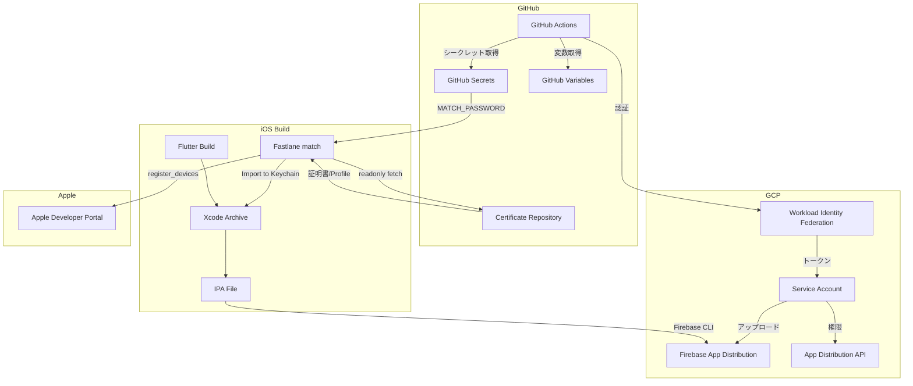
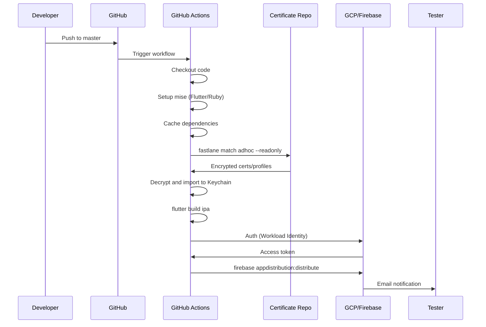
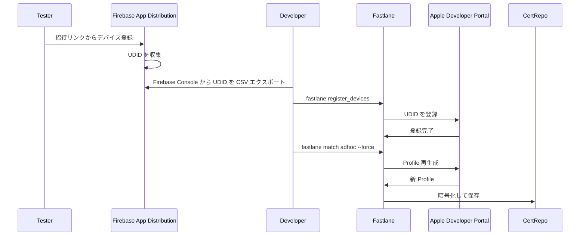

# Technical Design Document

## Overview

**Purpose**: Firebase App Distribution を用いた iOS アプリ (Shelfie) の自動配信機能を提供し、開発チームに迅速なテストビルド配布を実現する。

**Users**: 開発者およびテスターが、master ブランチへのプッシュまたは手動トリガーによって iOS テストビルドを受け取る。

**Impact**: 既存の GitHub Actions CI/CD パイプラインに iOS ビルドと Firebase App Distribution へのアップロード機能を追加し、Terraform で管理するインフラに Firebase App Distribution API の有効化と IAM 権限を追加する。Fastlane match による証明書/Provisioning Profile の Git リポジトリ管理を導入し、将来の App Store 配信への拡張を容易にする。

### Goals

- master ブランチへのプッシュ時に iOS アプリを自動ビルドし Firebase App Distribution に配信
- Workload Identity Federation を使用したセキュアな GCP 認証（Firebase 配信用）
- Fastlane match による証明書/Provisioning Profile の Git リポジトリ管理
- 手動トリガーによる任意ブランチからのビルドと配信
- デバイス登録の半自動化フロー

### Non-Goals

- Android アプリの配信（別スペックで対応予定）
- TestFlight や App Store への配信（将来対応可能な設計）
- Firebase App Distribution のテスターグループの Terraform 管理（API 未サポート）
- 完全自動デバイス登録（Firebase のデバイス収集機能と Fastlane の組み合わせによる半自動化フローを提供）

## Architecture

### Existing Architecture Analysis

現在のインフラ構成:

- **GCP プロジェクト**: `infra/terraform/environments/dev` で Terraform 管理
- **GitHub Actions Workload Identity Federation**: `github-actions-wif` モジュールで Cloud Run デプロイ用に設定済み
- **Firebase Auth**: `firebase-auth` モジュールで iOS アプリ（Bundle ID: `app.shelfie.shelfie`）登録済み
- **CI ワークフロー**: `ci.yml` で Flutter の analyze と test を実行（Ubuntu ランナー）
- **デプロイワークフロー**: `deploy-api.yml` で API の Cloud Run デプロイを実行

### Architecture Pattern & Boundary Map



**Architecture Integration**:

- **Selected pattern**: ハイブリッド構成 - Fastlane match（ビルド・署名）+ Firebase CLI（配信）
- **Domain/feature boundaries**: CI/CD（GitHub Actions）、証明書管理（Fastlane match）、インフラ（Terraform）、モバイルビルド（Flutter/Xcode）の4層で責務分離
- **Existing patterns preserved**: Workload Identity Federation 認証（Firebase 配信用）、paths-filter による差分検知
- **New components rationale**:
  - Fastlane match: 証明書/Profile の Git リポジトリ管理、サービスアカウントキー不要
  - Firebase CLI: WIF 対応のアップロード
  - 将来の App Store 配信は Fastlane deliver で対応可能
- **Steering compliance**: mise によるツール管理、Biome によるコード品質管理を維持

### Technology Stack

| Layer | Choice / Version | Role in Feature | Notes |
|-------|------------------|-----------------|-------|
| CI/CD | GitHub Actions | iOS ビルドと配信の自動化 | macOS ランナー使用 |
| Certificate Management | Fastlane match | 証明書/Profile の Git 管理 | 暗号化して Git リポジトリに保存 |
| Device Registration | Fastlane register_devices | デバイス登録自動化 | CSV ファイルから UDID を登録 |
| iOS Build | flutter build ipa | IPA ビルド | Fastlane gym も使用可能 |
| Firebase Upload | Firebase CLI (npm) | WIF 対応アップロード | `firebase appdistribution:distribute` |
| Flutter | 3.x (mise 管理) | iOS アプリビルド | `flutter build ipa` |
| Infrastructure | Terraform ~> 7.0 | API 有効化、IAM 管理 | google / google-beta provider |

## System Flows

### iOS ビルドと配信フロー



**Key Decisions**:

- Fastlane match で証明書/Profile を Git リポジトリ管理（サービスアカウントキー不要）
- Workload Identity Federation で Firebase CLI 認証（サービスアカウントキー不要）
- ビルドと配信を同一 macOS ジョブで実行（アーティファクト転送によるコスト増加を回避）
- リリースノートに PR タイトルまたはコミットメッセージを自動挿入

### デバイス登録フロー



**Key Decisions**:

- Firebase App Distribution のテスターデバイス収集機能を活用
- Fastlane register_devices で Apple Developer Portal への登録を自動化
- `--force` オプションで既存 Profile を再生成し、新規デバイスを含める

## Requirements Traceability

| Requirement | Summary | Components | Interfaces | Flows |
|-------------|---------|------------|------------|-------|
| 1.1, 1.2, 1.3 | Firebase App Distribution 有効化 | TerraformAppDistribution | Terraform Resource | - |
| 2.1, 2.2, 2.3, 2.4 | iOS コード署名 | FastlaneConfig, ExportOptionsPlist | Fastlane match | iOS Build Flow |
| 3.1, 3.2, 3.3, 3.4, 3.5, 3.6 | CI/CD パイプライン | DeployIOSWorkflow | GitHub Actions YAML | iOS Build Flow |
| 4.1, 4.2, 4.3, 4.4, 4.5 | シークレット管理 | GitHubSecretsConfig, FastlaneConfig | Fastlane match | iOS Build Flow |
| 5.1, 5.2, 5.3, 5.4 | テスターグループ管理 | FirebaseConsoleConfig, DeployIOSWorkflow | Firebase CLI | Device Registration Flow |
| 6.1, 6.2, 6.3, 6.4 | ビルドメタデータ | DeployIOSWorkflow | Firebase CLI | iOS Build Flow |
| 7.1, 7.2, 7.3, 7.4 | Terraform 管理範囲 | TerraformAppDistribution, TerraformIAM | Terraform Resource | - |
| 8.1, 8.2, 8.3 | 手動配信オプション | DeployIOSWorkflow | workflow_dispatch | - |

## Components and Interfaces

| Component | Domain/Layer | Intent | Req Coverage | Key Dependencies | Contracts |
|-----------|--------------|--------|--------------|------------------|-----------|
| TerraformAppDistribution | Infrastructure | Firebase App Distribution API を有効化 | 1.1, 1.2, 7.1 | google_project_service (P0) | Terraform |
| TerraformIAM | Infrastructure | サービスアカウントに IAM 権限を付与 | 7.2, 7.3 | github-actions-wif module (P0) | Terraform |
| FastlaneConfig | CI/CD | Fastlane match による証明書/Profile 管理 | 2.1-2.4, 4.1-4.5 | Fastlane, Certificate Repo (P0) | Fastlane |
| DeployIOSWorkflow | CI/CD | iOS ビルドと配信を自動化 | 3.1-3.6, 5.2, 6.1-6.4, 8.1-8.3 | Fastlane, Flutter, Firebase CLI (P0) | GitHub Actions |
| GitHubSecretsConfig | CI/CD | Fastlane match 用シークレットの設定ガイド | 4.1-4.3 | GitHub Secrets (P0) | Configuration |
| ExportOptionsPlist | Mobile Build | Ad Hoc 配布用エクスポート設定 | 2.1, 2.2 | Xcode (P0) | Configuration |
| FirebaseConsoleConfig | Infrastructure | テスターグループの手動設定ガイド | 5.1, 5.3, 5.4, 7.4 | Firebase Console (P1) | Manual |
| DeviceRegistrationWorkflow | CI/CD | デバイス登録の半自動化 | 2.4 | Fastlane register_devices (P1) | Manual + Fastlane |

### Infrastructure Layer

#### TerraformAppDistribution

| Field | Detail |
|-------|--------|
| Intent | Firebase App Distribution API を GCP プロジェクトで有効化 |
| Requirements | 1.1, 1.2, 7.1 |

**Responsibilities & Constraints**

- Firebase App Distribution API (`firebaseappdistribution.googleapis.com`) の有効化
- firebase-auth モジュールの依存関係として配置（Firebase プロジェクト初期化後に実行）
- API 無効化時のリソース保護（`disable_on_destroy = false`）

**Dependencies**

- Inbound: firebase-auth module - Firebase プロジェクト初期化 (P0)
- External: google_project_service - Terraform リソース (P0)

**Contracts**: Terraform

##### Terraform Resource

```hcl
resource "google_project_service" "firebase_app_distribution" {
  project            = var.project_id
  service            = "firebaseappdistribution.googleapis.com"
  disable_on_destroy = false

  depends_on = [google_firebase_project.default]
}
```

**Implementation Notes**

- Integration: firebase-auth モジュール内の既存 API 有効化リストに追加
- Validation: `terraform plan` で API 有効化を確認
- Risks: API 有効化に数分かかる場合あり

---

#### TerraformIAM

| Field | Detail |
|-------|--------|
| Intent | GitHub Actions サービスアカウントに Firebase App Distribution 管理権限を付与 |
| Requirements | 7.2, 7.3 |

**Responsibilities & Constraints**

- `roles/firebaseappdistro.admin` ロールの付与
- 既存サービスアカウント（github-actions-deployer）への権限追加
- 最小権限の原則を維持

**Dependencies**

- Inbound: github-actions-wif module - サービスアカウント定義 (P0)
- External: google_project_iam_member - Terraform リソース (P0)

**Contracts**: Terraform

##### Terraform Resource

```hcl
resource "google_project_iam_member" "github_actions_appdistro_admin" {
  project = var.project_id
  role    = "roles/firebaseappdistro.admin"
  member  = "serviceAccount:${google_service_account.github_actions.email}"
}
```

**Implementation Notes**

- Integration: github-actions-wif モジュールに追加
- Validation: `gcloud projects get-iam-policy` で権限確認
- Risks: 権限伝播に最大7分かかる場合あり

---

### CI/CD Layer

#### FastlaneConfig

| Field | Detail |
|-------|--------|
| Intent | Fastlane match による証明書/Provisioning Profile の Git リポジトリ管理 |
| Requirements | 2.1, 2.2, 2.3, 2.4, 4.1, 4.2, 4.3, 4.4, 4.5 |

**Responsibilities & Constraints**

- 証明書と Provisioning Profile を暗号化して Git リポジトリに保存
- CI では `--readonly` モードで取得（証明書の上書き防止）
- デバイス追加時は `--force` で Profile を再生成
- Apple Developer Portal との連携（証明書作成、デバイス登録、Profile 生成）

**Dependencies**

- Inbound: DeployIOSWorkflow - 証明書/Profile 取得 (P0)
- Outbound: Certificate Repository - 暗号化された証明書/Profile 保存 (P0)
- External: Fastlane - match, register_devices (P0)
- External: Apple Developer Portal - 証明書/Profile 管理 (P0)

**Contracts**: Fastlane

##### Fastfile

```ruby
# apps/mobile/ios/fastlane/Fastfile
default_platform(:ios)

platform :ios do
  desc "Fetch certificates and provisioning profiles (readonly)"
  lane :fetch_certificates do
    match(
      type: "adhoc",
      readonly: true
    )
  end

  desc "Register new devices and regenerate profiles"
  lane :register_new_devices do |options|
    register_devices(
      devices_file: options[:devices_file] || "./devices.txt"
    )
    match(
      type: "adhoc",
      force: true
    )
  end

  desc "Build and distribute to Firebase App Distribution"
  lane :distribute do |options|
    fetch_certificates

    # Build IPA using Flutter
    sh("cd ../.. && flutter build ipa --export-options-plist=ios/ExportOptions.plist --build-number=#{options[:build_number]}")
  end
end
```

##### Matchfile

```ruby
# apps/mobile/ios/fastlane/Matchfile
git_url("https://github.com/sora-ichigo/shelfie-certificates")
storage_mode("git")

type("adhoc")
app_identifier("app.shelfie.shelfie")
username(ENV["APPLE_ID"]) # ローカル開発時のみ使用

# CI環境ではGitHub PATで認証
git_basic_authorization(ENV["MATCH_GIT_BASIC_AUTHORIZATION"])
```

##### Appfile

```ruby
# apps/mobile/ios/fastlane/Appfile
app_identifier("app.shelfie.shelfie")
# team_id は match で自動検出
```

**Implementation Notes**

- Integration: `apps/mobile/ios/fastlane/` ディレクトリに配置
- Validation: `fastlane match adhoc --readonly` で証明書取得を確認
- Risks: MATCH_PASSWORD の漏洩で全証明書が復号可能（定期的なパスワード変更を推奨）

---

#### DeployIOSWorkflow

| Field | Detail |
|-------|--------|
| Intent | iOS アプリのビルドと Firebase App Distribution への配信を自動化 |
| Requirements | 3.1, 3.2, 3.3, 3.4, 3.5, 3.6, 5.2, 6.1, 6.2, 6.3, 6.4, 8.1, 8.2, 8.3 |

**Responsibilities & Constraints**

- master ブランチへのプッシュ時に自動実行
- workflow_dispatch による手動実行（ブランチ選択、カスタムリリースノート入力）
- macOS ランナーでの iOS ビルド実行
- Fastlane match による証明書/Profile 取得
- Workload Identity Federation による GCP 認証（Firebase 配信用）
- Firebase CLI による App Distribution アップロード

**Dependencies**

- Inbound: GitHub push/workflow_dispatch events - トリガー (P0)
- Outbound: Firebase App Distribution - アップロード先 (P0)
- External: jdx/mise-action - Flutter/Ruby セットアップ (P0)
- External: google-github-actions/auth - GCP 認証 (P0)
- External: Fastlane match - 証明書/Profile 取得 (P0)

**Contracts**: GitHub Actions YAML

##### GitHub Actions Workflow Interface

```yaml
name: Deploy iOS to Firebase App Distribution

on:
  push:
    branches: [master]
    paths:
      - 'apps/mobile/**'
      - '.github/workflows/deploy-ios.yml'
  workflow_dispatch:
    inputs:
      release_notes:
        description: 'Release notes for this build'
        required: false
        type: string
        default: ''

env:
  FIREBASE_APP_ID: ${{ vars.FIREBASE_IOS_APP_ID }}
  TESTER_GROUPS: ${{ vars.FIREBASE_TESTER_GROUPS }}
  MATCH_PASSWORD: ${{ secrets.MATCH_PASSWORD }}
  MATCH_GIT_BASIC_AUTHORIZATION: ${{ secrets.MATCH_GIT_BASIC_AUTHORIZATION }}

jobs:
  build-and-distribute:
    runs-on: macos-latest
    permissions:
      contents: read
      id-token: write
    defaults:
      run:
        working-directory: apps/mobile
    steps:
      - uses: actions/checkout@v4

      - name: Setup mise
        uses: jdx/mise-action@v2

      - name: Setup Ruby
        uses: ruby/setup-ruby@v1
        with:
          ruby-version: '3.2'
          bundler-cache: true
          working-directory: apps/mobile/ios

      - name: Cache Flutter dependencies
        uses: actions/cache@v4
        with:
          path: |
            ~/.pub-cache
            .dart_tool
          key: flutter-${{ hashFiles('**/pubspec.lock') }}

      - name: Install dependencies
        run: flutter pub get

      - name: Fetch certificates with Fastlane match
        working-directory: apps/mobile/ios
        run: bundle exec fastlane match adhoc --readonly

      - name: Build IPA
        run: |
          flutter build ipa \
            --export-options-plist=ios/ExportOptions.plist \
            --build-number=${{ github.run_number }}

      - name: Authenticate to Google Cloud
        uses: google-github-actions/auth@v2
        with:
          workload_identity_provider: ${{ vars.DEV_GCP_WORKLOAD_IDENTITY_PROVIDER }}
          service_account: ${{ vars.DEV_GCP_SERVICE_ACCOUNT }}

      - name: Setup Firebase CLI
        run: npm install -g firebase-tools

      - name: Distribute to Firebase App Distribution
        run: |
          firebase appdistribution:distribute build/ios/ipa/*.ipa \
            --app "$FIREBASE_APP_ID" \
            --groups "$TESTER_GROUPS" \
            --release-notes "${{ inputs.release_notes || github.event.head_commit.message }}"
```

**Implementation Notes**

- Integration: 既存 ci.yml の mobile-analyze/mobile-test ジョブパターンを参考に構築
- Validation: ワークフロー実行後、Firebase Console でリリースを確認
- Risks: macOS ランナーのコスト（Linux の10倍）、ビルド時間最適化が重要

---

#### GitHubSecretsConfig

| Field | Detail |
|-------|--------|
| Intent | Fastlane match 用シークレットの設定ガイドライン |
| Requirements | 4.1, 4.2, 4.3 |

**Responsibilities & Constraints**

- Fastlane match の暗号化パスワード管理
- Certificate Repository へのアクセス認証
- 将来の App Store Connect API キー（オプション）

**Dependencies**

- External: GitHub Repository Secrets - シークレット保存 (P0)
- External: Certificate Repository - 証明書/Profile Git リポジトリ (P0)

**Contracts**: Configuration

##### Required GitHub Secrets

| Secret Name | Description | Format | Notes |
|-------------|-------------|--------|-------|
| `MATCH_PASSWORD` | match 暗号化パスワード | Plain text | 証明書/Profile の暗号化に使用 |
| `MATCH_GIT_BASIC_AUTHORIZATION` | GitHub PAT for certificates repo | Base64 encoded | `echo -n "username:PAT" \| base64` |

##### Optional GitHub Secrets (将来の App Store 配信用)

| Secret Name | Description | Format | Notes |
|-------------|-------------|--------|-------|
| `APP_STORE_CONNECT_API_KEY_ID` | API Key ID | Plain text | オプション |
| `APP_STORE_CONNECT_API_ISSUER_ID` | Issuer ID | Plain text | オプション |
| `APP_STORE_CONNECT_API_KEY_CONTENT` | API Key (.p8 内容) | Plain text | オプション |

##### Required GitHub Variables

| Variable Name | Description | Example |
|---------------|-------------|---------|
| `DEV_GCP_WORKLOAD_IDENTITY_PROVIDER` | Workload Identity Provider | `projects/123/locations/global/...` |
| `DEV_GCP_SERVICE_ACCOUNT` | サービスアカウントメール | `github-actions-deployer@project.iam.gserviceaccount.com` |
| `DEV_GCP_PROJECT_ID` | GCP プロジェクト ID | `shelfie-dev` |
| `FIREBASE_IOS_APP_ID` | Firebase iOS アプリ ID | `1:123456789:ios:abc123` |
| `FIREBASE_TESTER_GROUPS` | テスターグループエイリアス | `internal-testers` |

**Implementation Notes**

- Integration: 既存の `DEV_GCP_*` 変数パターンに従う
- Validation: `fastlane match adhoc --readonly` で証明書取得を確認
- Risks: MATCH_PASSWORD の漏洩で全証明書が復号可能（定期的なパスワード変更を推奨）

**Migration from Previous Design**

以前の GitHub Secrets から Fastlane match への移行:

| Before | After | Notes |
|--------|-------|-------|
| `IOS_DISTRIBUTION_CERTIFICATE_BASE64` | 削除 | match で管理 |
| `IOS_DISTRIBUTION_CERTIFICATE_PASSWORD` | 削除 | match で管理 |
| `IOS_PROVISIONING_PROFILE_BASE64` | 削除 | match で管理 |
| `KEYCHAIN_PASSWORD` | 削除 | match が自動管理 |
| - | `MATCH_PASSWORD` | 新規追加 |
| - | `MATCH_GIT_BASIC_AUTHORIZATION` | 新規追加 |

---

### Mobile Build Layer

#### ExportOptionsPlist

| Field | Detail |
|-------|--------|
| Intent | Ad Hoc 配布用の IPA エクスポート設定 |
| Requirements | 2.1, 2.2 |

**Responsibilities & Constraints**

- Ad Hoc 配布方式の指定
- 署名スタイルの指定（manual）
- Provisioning Profile の指定

**Dependencies**

- External: Xcode - エクスポートツール (P0)

**Contracts**: Configuration

##### ExportOptions.plist Structure

```xml
<?xml version="1.0" encoding="UTF-8"?>
<!DOCTYPE plist PUBLIC "-//Apple//DTD PLIST 1.0//EN" "http://www.apple.com/DTDs/PropertyList-1.0.dtd">
<plist version="1.0">
<dict>
    <key>method</key>
    <string>ad-hoc</string>
    <key>signingStyle</key>
    <string>manual</string>
    <key>teamID</key>
    <string>$(DEVELOPMENT_TEAM)</string>
    <key>provisioningProfiles</key>
    <dict>
        <key>app.shelfie.shelfie</key>
        <string>$(PROVISIONING_PROFILE_SPECIFIER)</string>
    </dict>
    <key>compileBitcode</key>
    <false/>
</dict>
</plist>
```

**Implementation Notes**

- Integration: `apps/mobile/ios/` ディレクトリに配置
- Validation: ローカルビルドで IPA 生成を確認
- Risks: Provisioning Profile 名の変更時に更新が必要

---

### Manual Configuration Layer

#### FirebaseConsoleConfig

| Field | Detail |
|-------|--------|
| Intent | Firebase Console でのテスターグループ設定ガイドライン |
| Requirements | 5.1, 5.3, 5.4, 7.4 |

**Responsibilities & Constraints**

- テスターグループの作成と管理
- テスターのメールアドレス追加
- グループエイリアスの命名規則

**Dependencies**

- External: Firebase Console - 管理 UI (P1)

**Contracts**: Manual Configuration

##### Tester Group Configuration

| Setting | Value | Description |
|---------|-------|-------------|
| Group Name | Internal Testers | グループ表示名 |
| Group Alias | `internal-testers` | GitHub Variables で使用 |
| Notification | Email enabled | 新規ビルド配信時にメール通知 |

##### Setup Steps

1. Firebase Console > App Distribution > Testers & Groups
2. "Add group" でグループ作成
3. テスターのメールアドレスを追加
4. グループエイリアスを `FIREBASE_TESTER_GROUPS` 変数に設定

**Implementation Notes**

- Integration: グループエイリアスを GitHub Variables に設定
- Validation: Firebase Console でグループとテスターが表示されることを確認
- Risks: テスター追加は手動のため、オンボーディングプロセスの文書化が必要

---

#### DeviceRegistrationWorkflow

| Field | Detail |
|-------|--------|
| Intent | Firebase App Distribution のデバイス収集機能と Fastlane を組み合わせたデバイス登録半自動化 |
| Requirements | 2.4 |

**Responsibilities & Constraints**

- Firebase App Distribution からテスターデバイス UDID を CSV エクスポート
- Fastlane register_devices で Apple Developer Portal に登録
- Fastlane match --force で Provisioning Profile を再生成

**Dependencies**

- Inbound: Firebase Console - デバイス UDID CSV (P1)
- Outbound: Apple Developer Portal - デバイス登録 (P0)
- Outbound: Certificate Repository - 更新された Profile (P0)
- External: Fastlane - register_devices, match (P0)

**Contracts**: Manual + Fastlane

##### デバイス登録手順

1. **テスターがデバイスを登録**:
   - Firebase App Distribution の招待リンクからアプリをインストール
   - デバイス UDID が自動的に Firebase に収集される

2. **管理者がデバイスをエクスポート**:
   - Firebase Console > App Distribution > Testers & Groups
   - 「Export device UDIDs」で CSV をダウンロード

3. **デバイスを Apple Developer Portal に登録**:
   ```bash
   # devices.txt 形式に変換（Device ID<tab>Device Name）
   # Firebase CSV から変換スクリプトを実行

   cd apps/mobile/ios
   bundle exec fastlane register_new_devices devices_file:./devices.txt
   ```

4. **Provisioning Profile を再生成**:
   ```bash
   # register_new_devices lane 内で自動実行されるが、手動で実行する場合:
   bundle exec fastlane match adhoc --force
   ```

##### devices.txt 形式

```text
Device ID	Device Name
00008020-001234567890002E	John's iPhone 14
00008030-009876543210001A	Jane's iPhone 15
```

**Implementation Notes**

- Integration: 新規テスターのオンボーディング時に実行
- Validation: Apple Developer Portal でデバイス登録を確認、ビルド後にテスターがインストール可能
- Risks: デバイス登録数の上限（100台/年）、登録済みデバイスの重複チェックが必要

## Data Models

### Domain Model

本機能は CI/CD パイプラインの拡張であり、永続的なデータモデルは追加しない。

主要なデータフロー:

- **Input**: ソースコード、コード署名シークレット、ビルド設定
- **Processing**: Flutter ビルド、Xcode アーカイブ、IPA エクスポート
- **Output**: IPA ファイル（Firebase App Distribution にアップロード）

### Data Contracts & Integration

#### Firebase CLI Upload Payload

```bash
firebase appdistribution:distribute build/ios/ipa/shelfie.ipa \
  --app "$FIREBASE_APP_ID" \
  --groups "$TESTER_GROUPS" \
  --release-notes "$RELEASE_NOTES"
```

| Parameter | Source | Description |
|-----------|--------|-------------|
| IPA Path | Build output | `build/ios/ipa/*.ipa` |
| App ID | GitHub Variable | Firebase iOS App ID |
| Groups | GitHub Variable | テスターグループエイリアス |
| Release Notes | Git/Input | コミットメッセージまたはカスタム入力 |

## Error Handling

### Error Strategy

CI/CD パイプラインにおけるエラーは早期検出とクリアなフィードバックを重視する。

### Error Categories and Responses

**Build Errors**:

- Flutter 依存関係エラー -> `flutter pub get` 再実行、キャッシュクリア
- コード署名エラー -> 証明書/Profile の有効期限確認、Secrets 設定確認
- Xcode ビルドエラー -> ローカルビルドで再現、Xcode バージョン確認

**Authentication Errors**:

- Workload Identity 認証失敗 -> IAM 権限確認、Provider 設定確認
- Firebase CLI 認証失敗 -> ADC 設定確認、サービスアカウント権限確認

**Upload Errors**:

- Firebase App Distribution アップロード失敗 -> API 有効化確認、App ID 確認
- ネットワークタイムアウト -> リトライ実装、タイムアウト値調整

### Monitoring

- GitHub Actions ワークフロー実行履歴
- Firebase Console のリリース履歴
- GCP Cloud Logging（認証エラー）

## Testing Strategy

### Unit Tests

- Terraform: `terraform validate` でモジュール構文検証
- ExportOptions.plist: ローカルビルドで IPA 生成確認

### Integration Tests

- GitHub Actions ワークフロー: 手動トリガーで全ステップ実行
- Workload Identity Federation: 認証フローの E2E 確認
- Firebase App Distribution: アップロードとテスター通知の確認

### Manual Tests

- テスターデバイスでのインストールと起動確認
- Firebase Console でのリリースメタデータ確認

## Security Considerations

### Secrets Management

- **Fastlane match**: 証明書と Provisioning Profile は暗号化されて Git リポジトリに保存
  - `MATCH_PASSWORD` で AES-256 暗号化
  - Certificate Repository へのアクセスは GitHub PAT で制御
- **Workload Identity Federation**: サービスアカウントキー不要で Firebase CLI 認証
- **Keychain**: Fastlane match が自動的に一時 Keychain を作成・管理・削除

### Certificate Repository Security

- リポジトリは Private に設定
- アクセス権限は最小限のメンバーに限定
- GitHub PAT は `repo` スコープのみ付与
- 定期的な MATCH_PASSWORD のローテーションを推奨

### IAM Permissions

- サービスアカウントには `roles/firebaseappdistro.admin` のみ付与（最小権限）
- Workload Identity Pool は特定リポジトリのみに制限

### Audit

- GitHub Actions の実行ログで認証とアップロードを追跡
- Firebase Console でリリース履歴を確認
- Certificate Repository の Git ログで証明書変更を追跡
- GCP IAM Policy Analyzer で権限を定期的に監査

## Performance & Scalability

### Build Time Optimization

- Flutter 依存関係のキャッシュ（`~/.pub-cache`, `.dart_tool`）
- CocoaPods キャッシュ（`Pods` ディレクトリ）
- 並列実行制限（`concurrency` 設定でビルドの重複防止）

### Cost Optimization

- paths-filter で mobile 関連の変更時のみビルド実行
- ビルドとアップロードを同一ジョブで実行（アーティファクト転送回避）
- macOS ランナーの使用時間を最小化

### Target Metrics

| Metric | Target | Measurement |
|--------|--------|-------------|
| Build Time | < 15 min | GitHub Actions duration |
| Upload Time | < 2 min | Firebase CLI output |
| Total Pipeline | < 20 min | Workflow completion |
