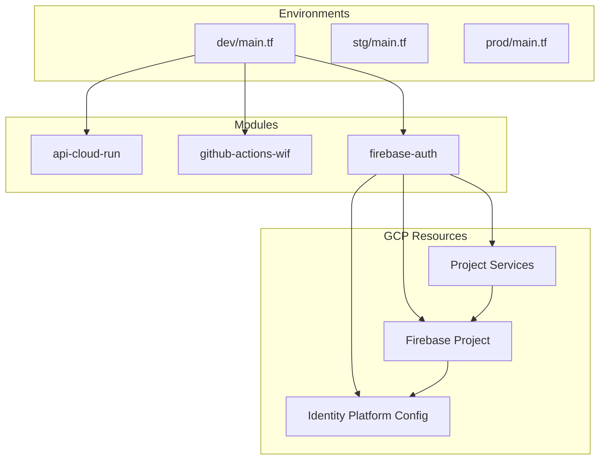

# Design Document

## Overview

**Purpose**: 本機能は、Shelfie プロジェクトの開発環境（dev）において Firebase Authentication を利用可能にするための Terraform インフラストラクチャを提供する。

**Users**: インフラ管理者は、Terraform を通じて Firebase Authentication リソースをプロビジョニングする。開発者は、プロビジョニングされた認証基盤を使用してメールアドレス/パスワード認証機能を実装する。

**Impact**: 既存の GCP/Terraform インフラ構成（`infra/terraform/`）に Firebase プロジェクトと Identity Platform の設定を追加する。

### Goals

- Terraform で Firebase プロジェクトと Identity Platform を有効化する
- メールアドレス/パスワード認証とメール確認機能を設定する
- 再利用可能なモジュールとして stg/prod 展開に備える
- 既存の Cloud Run API との連携を確保する

### Non-Goals

- Firebase Authentication の UI コンポーネント実装（モバイル/Web アプリ側の実装は別スコープ）
- Firebase Hosting や Firestore 等の他の Firebase サービス設定
- カスタム認証プロバイダ（Google, Apple 等）の設定
- Firebase Functions の設定

## Architecture

### Existing Architecture Analysis

現在の Terraform 構成:

- **モジュール構成**: `infra/terraform/modules/` に再利用可能なモジュール（`api-cloud-run`, `github-actions-wif`）
- **環境構成**: `infra/terraform/environments/{dev,stg,prod}/` に環境固有の設定
- **プロバイダ**: `hashicorp/google ~> 7.0` を使用
- **パターン**: モジュールは `main.tf`, `variables.tf`, `outputs.tf` の 3 ファイル構成

### Architecture Pattern & Boundary Map



**Architecture Integration**:

- **Selected pattern**: モジュラー Terraform 構成 - 既存パターンに従い、`firebase-auth` モジュールを追加
- **Domain/feature boundaries**: Firebase 認証設定は独立モジュールとして分離し、環境固有の設定は変数で外部化
- **Existing patterns preserved**: 3 ファイル構成、変数バリデーション、依存関係の明示
- **New components rationale**: `firebase-auth` モジュールは Firebase/Identity Platform 固有のリソースを管理し、Cloud Run モジュールとは分離
- **Steering compliance**: 既存の Terraform パターンとモジュール構成ガイドラインに準拠

### Technology Stack

| Layer | Choice / Version | Role in Feature | Notes |
|-------|------------------|-----------------|-------|
| Infrastructure / Runtime | Terraform >= 1.11.0 | IaC ツール | 既存バージョン要件を維持 |
| Infrastructure / Runtime | hashicorp/google ~> 7.0 | 既存 GCP リソース管理 | 変更なし |
| Infrastructure / Runtime | hashicorp/google-beta ~> 7.0 | Firebase/Identity Platform リソース管理 | **新規追加** - Firebase サポートがベータ版のため必要 |
| Backend / Services | Identity Platform API | 認証バックエンド | `identitytoolkit.googleapis.com` |
| Backend / Services | Firebase API | Firebase プロジェクト管理 | `firebase.googleapis.com` |

## Requirements Traceability

| Requirement | Summary | Components | Interfaces | Flows |
|-------------|---------|------------|------------|-------|
| 1.1, 1.2, 1.3 | Firebase プロジェクト有効化 | firebase-auth module | google_project_service, google_firebase_project | API 有効化 → Firebase 有効化 |
| 2.1, 2.2 | Identity Platform API 有効化 | firebase-auth module | google_project_service, google_identity_platform_config | API 有効化 → Identity Platform 設定 |
| 3.1, 3.2, 3.3 | メール/パスワード認証設定 | firebase-auth module | google_identity_platform_config.sign_in.email | Identity Platform 設定 |
| 4.1, 4.2, 4.3 | メール確認設定 | firebase-auth module | google_identity_platform_config | Identity Platform 設定 |
| 5.1, 5.2, 5.3, 5.4 | モジュール構成 | firebase-auth module | variables.tf, outputs.tf | モジュール参照 |
| 6.1, 6.2, 6.3 | 既存インフラ統合 | firebase-auth module, dev/main.tf | outputs | モジュール出力 → 環境変数 |

## Components and Interfaces

| Component | Domain/Layer | Intent | Req Coverage | Key Dependencies (P0/P1) | Contracts |
|-----------|--------------|--------|--------------|--------------------------|-----------|
| firebase-auth module | Infrastructure | Firebase Authentication の Terraform 設定を提供 | 1.1-1.3, 2.1-2.2, 3.1-3.3, 4.1-4.3, 5.1-5.4, 6.3 | google-beta provider (P0) | Service, State |
| dev/main.tf 更新 | Environment | firebase-auth モジュールの参照と環境固有設定 | 5.3, 6.1, 6.2, 6.3 | firebase-auth module (P0), api-cloud-run module (P1) | Service |

### Infrastructure Layer

#### firebase-auth module

| Field | Detail |
|-------|--------|
| Intent | Firebase Authentication 用の GCP リソースを Terraform で管理 |
| Requirements | 1.1, 1.2, 1.3, 2.1, 2.2, 3.1, 3.2, 3.3, 4.1, 4.2, 4.3, 5.1, 5.2, 5.3, 5.4, 6.3 |

**Responsibilities & Constraints**

- Firebase API および Identity Platform API の有効化
- Firebase プロジェクトの有効化
- Identity Platform の認証設定（メール/パスワード、メール確認）
- API サーバーが必要とする設定値の出力

**Dependencies**

- Inbound: dev/main.tf - モジュール変数の注入 (P0)
- External: hashicorp/google-beta provider - Firebase/Identity Platform リソース管理 (P0)
- External: GCP Project - 既存のプロジェクト (P0)

**Contracts**: Service [x] / API [ ] / Event [ ] / Batch [ ] / State [x]

##### Service Interface

```hcl
# main.tf - Terraform リソース定義

# Required APIs
resource "google_project_service" "firebase_apis" {
  for_each = toset([
    "firebase.googleapis.com",
    "identitytoolkit.googleapis.com",
  ])
  project            = var.project_id
  service            = each.key
  disable_on_destroy = false
}

# Firebase Project
resource "google_firebase_project" "default" {
  provider = google-beta
  project  = var.project_id
  depends_on = [google_project_service.firebase_apis]
}

# Identity Platform Configuration
resource "google_identity_platform_config" "default" {
  provider = google-beta
  project  = var.project_id

  autodelete_anonymous_users = var.autodelete_anonymous_users

  sign_in {
    allow_duplicate_emails = var.allow_duplicate_emails

    email {
      enabled           = true
      password_required = true
    }

    anonymous {
      enabled = var.enable_anonymous_auth
    }
  }

  authorized_domains = var.authorized_domains

  depends_on = [google_firebase_project.default]
}
```

- Preconditions: GCP プロジェクトが存在し、課金が有効（Blaze プラン）
- Postconditions: Firebase Authentication が有効化され、メール/パスワード認証が利用可能
- Invariants: Identity Platform 設定は Firebase プロジェクト有効化後にのみ適用

##### State Management

- State model: Terraform state で管理
- Persistence & consistency: リモート state backend（既存の GCS バケット）
- Concurrency strategy: Terraform の state lock 機構を使用

**Implementation Notes**

- Integration: `google-beta` プロバイダを環境の `main.tf` に追加する必要がある
- Validation: `terraform plan` で変更内容を確認後、`terraform apply` を実行
- Risks: Identity Platform 有効化により Firebase Auth が GCIP 版にアップグレードされる（コスト影響は dev 環境では軽微）

#### dev/main.tf 更新

| Field | Detail |
|-------|--------|
| Intent | firebase-auth モジュールを dev 環境で参照し、環境固有の設定を注入 |
| Requirements | 5.3, 6.1, 6.2, 6.3 |

**Responsibilities & Constraints**

- firebase-auth モジュールの参照
- 環境固有の変数設定（authorized_domains 等）
- 出力値の受け渡し

**Dependencies**

- Outbound: firebase-auth module - モジュール参照 (P0)
- Outbound: api-cloud-run module - 環境変数の受け渡し (P1)

**Contracts**: Service [x] / API [ ] / Event [ ] / Batch [ ] / State [ ]

##### Service Interface

```hcl
# dev/main.tf への追加

# Google Beta Provider for Firebase
provider "google-beta" {
  project = var.project_id
  region  = var.region
}

# Firebase Authentication Module
module "firebase_auth" {
  source = "../../modules/firebase-auth"

  providers = {
    google-beta = google-beta
  }

  project_id         = var.project_id
  environment        = var.environment
  authorized_domains = ["localhost", "${var.project_id}.firebaseapp.com"]

  depends_on = [module.api_cloud_run]
}

# Outputs
output "firebase_project_id" {
  description = "Firebase Project ID"
  value       = module.firebase_auth.firebase_project_id
}

output "firebase_api_key" {
  description = "Firebase API Key (for client SDK)"
  value       = module.firebase_auth.firebase_api_key
  sensitive   = true
}
```

**Implementation Notes**

- Integration: `required_providers` ブロックに `google-beta` を追加
- Validation: 既存リソースへの影響がないことを `terraform plan` で確認
- Risks: プロバイダ追加による既存リソースへの影響（想定なし）

## Data Models

### Logical Data Model

本機能は Terraform リソース定義のみであり、アプリケーションレベルのデータモデルは含まない。

**Terraform Variables Schema**:

| Variable | Type | Description | Default |
|----------|------|-------------|---------|
| project_id | string | GCP Project ID | - (required) |
| environment | string | Environment name (dev, stg, prod) | - (required) |
| authorized_domains | list(string) | Authorized domains for authentication | ["localhost"] |
| allow_duplicate_emails | bool | Allow duplicate email addresses | false |
| enable_anonymous_auth | bool | Enable anonymous authentication | false |
| autodelete_anonymous_users | bool | Auto-delete anonymous users | true |

**Terraform Outputs Schema**:

| Output | Type | Description |
|--------|------|-------------|
| firebase_project_id | string | Firebase Project ID |
| firebase_api_key | string | Firebase Web API Key |
| identity_platform_authorized_domains | list(string) | Configured authorized domains |

## Error Handling

### Error Strategy

Terraform エラーは `terraform plan` / `terraform apply` 実行時に検出される。

### Error Categories and Responses

**User Errors (Validation)**:

- 無効な `environment` 値 → validation ブロックでエラーメッセージを表示
- 必須変数の欠落 → Terraform の標準エラーメッセージ

**System Errors (API)**:

- API 有効化の失敗 → GCP コンソールで API を手動有効化し、再実行
- 権限不足 → サービスアカウントに必要なロールを付与

**Business Logic Errors**:

- 既に Firebase が有効化されている → `terraform import` で既存リソースをインポート
- Identity Platform が既に有効 → リソースのインポートまたは state からの除外

### Monitoring

- Terraform 実行ログで変更内容を確認
- GCP Console の Identity Platform ダッシュボードで設定状態を確認

## Testing Strategy

### Unit Tests

- Terraform validation: `terraform validate` で構文エラーを検出
- Variable validation: validation ブロックのテスト

### Integration Tests

- `terraform plan` による変更内容の確認
- dev 環境への適用後、Firebase Console で設定確認
- API サーバーでの Firebase Auth トークン検証テスト

### E2E Tests

- モバイルアプリからのメール/パスワード認証テスト
- メール確認フローのテスト

## Security Considerations

### Authentication & Authorization

- Terraform 実行には適切な GCP IAM 権限が必要
- Firebase API Key はクライアント側で使用されるが、ドメイン制限（`authorized_domains`）で保護

### Data Protection

- Firebase Auth ユーザーデータは GCP/Firebase の標準セキュリティで保護
- パスワードは Firebase によりハッシュ化されて保存

### Compliance

- Firebase Authentication は SOC 2, ISO 27001 等の認証を取得済み
- GDPR 対応はアプリケーション側での実装が必要（ユーザーデータ削除等）
