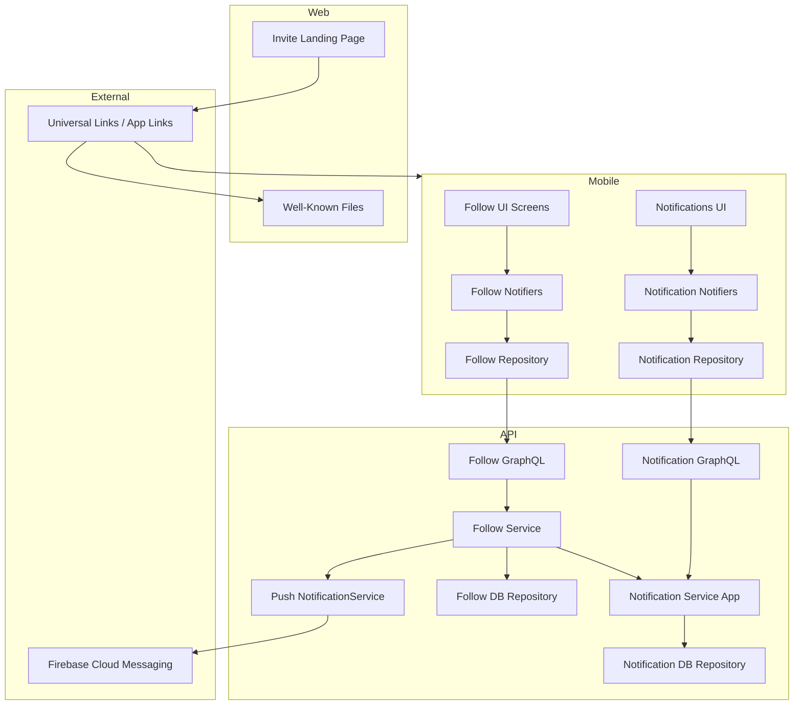
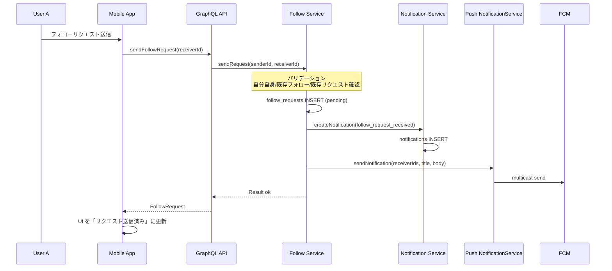
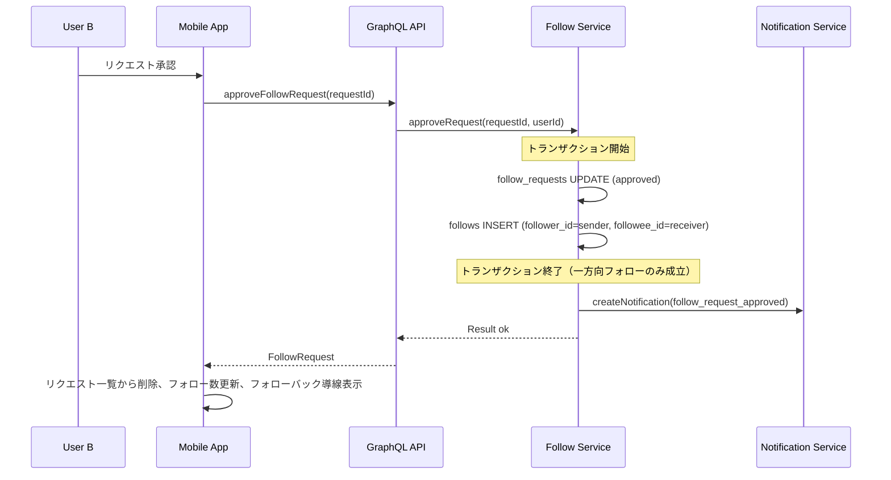
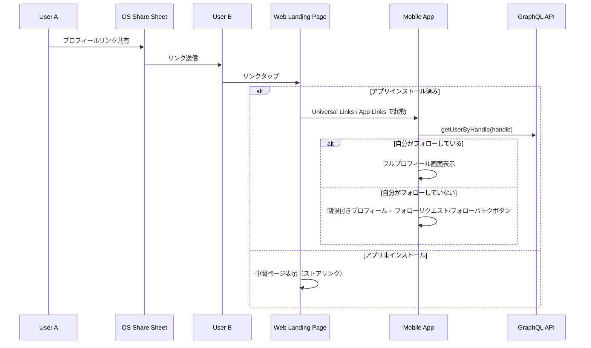
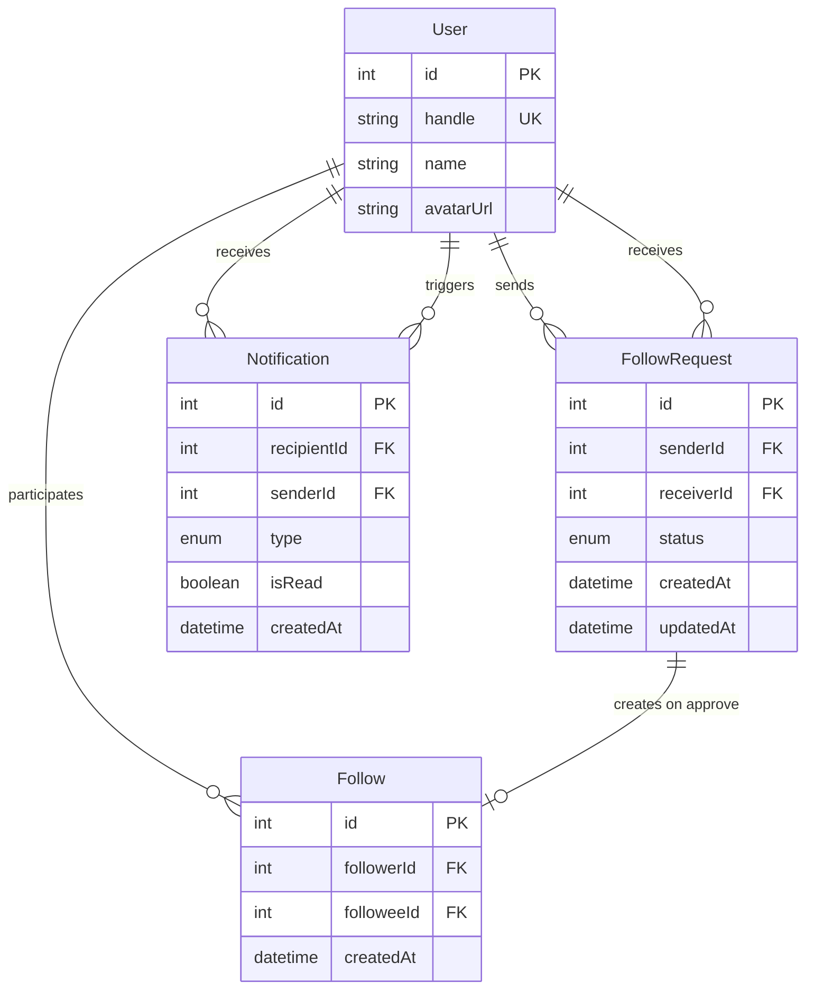

# Technical Design: フォローシステム

## Overview

本機能は、Shelfie アプリケーションに承認制の一方向フォローシステムを導入する。ユーザーが招待リンクを通じて他ユーザーにフォローリクエストを送信し、相手が承認した場合に送信者から受信者への一方向のフォロー関係が成立する。Instagram や X（Twitter）と同様に、相互フォローは自動では成立せず、双方がそれぞれ個別にフォローする必要がある。自分がフォローしているユーザーの本棚のみ閲覧でき、プライベートな友人ネットワーク（Phase 2）を実現する。

本機能はバックエンド（GraphQL API）、モバイルアプリ（Flutter）、Webアプリ（Next.js）の3レイヤーにまたがる。プッシュ通知（既存 NotificationService 活用）とアプリ内通知（お知らせタブ新設）により、フォロー関連イベントをユーザーに通知する。

### Goals

- 承認制の一方向フォローリクエストの送信・承認・拒否・解除の完全なライフサイクルを実装する
- 一方向フォロー関係に基づくプロフィール閲覧のアクセス制御を実現する（自分がフォローしている相手のみフル情報表示）
- 招待リンク（Universal Links / App Links）によるユーザー発見・フォロー導線を構築する
- アプリ内通知（お知らせタブ）とプッシュ通知でフォロー関連イベントを通知する
- 既存アーキテクチャパターン（Feature Module、Version Provider、Result 型）に完全に準拠する

### Non-Goals

- QRコードによるユーザー発見（将来対応）
- ディファードディープリンク（アプリ未インストール → インストール後に自動遷移）
- ユーザー検索機能（Phase 3）
- 本棚の公開/非公開設定（Phase 3）
- フォロー数のカウンタキャッシュ（初期スコープではCOUNTクエリで十分）

## Architecture

### Existing Architecture Analysis

現在のシステムは以下のパターンで構成されている。

- **API**: Feature Module パターン（`features/{name}/internal/` に repository.ts, service.ts, graphql.ts を配置し、`index.ts` で barrel export）
- **GraphQL**: Pothos による Code-first スキーマ。ScopeAuthPlugin（認証）と ErrorsPlugin（Result 型エラー）を使用
- **Mobile**: Feature-first + Clean Architecture。Riverpod + freezed + Ferry + fpdart。Version Provider による状態伝播パターン
- **Web**: Next.js 14+ の App Router。現在は最小限のランディングページのみ
- **通知基盤**: FCM によるプッシュ通知。NotificationService + FCMAdapter が既存。アプリ内通知履歴の仕組みは未実装

### Architecture Pattern & Boundary Map



**Architecture Integration**:
- 選定パターン: Feature Module パターン（既存踏襲）。follows と notifications を独立 Feature として実装
- ドメイン境界: Follow Feature がフォロー関係のライフサイクルを管理し、Notification Feature がアプリ内通知の CRUD を担当。Follow Feature は Notification Feature の公開 API を呼び出す
- 既存パターン維持: Repository → Service → GraphQL のレイヤー構成、Result 型によるエラーハンドリング、Version Provider による状態伝播
- 新規コンポーネント理由: follows/notifications のデータ管理と、お知らせ UI が必要なため
- Steering 準拠: Feature 間直接依存禁止（公開 API 経由のみ）、型安全性、Barrel Export パターン

### Technology Stack

| Layer | Choice / Version | Role in Feature | Notes |
|-------|------------------|-----------------|-------|
| Mobile | Flutter 3.x / Dart 3.x | フォロー UI、お知らせタブ、ディープリンク処理 | 既存 |
| Mobile State | Riverpod 2.x / freezed 2.x | 状態管理、データモデル | FollowVersion Provider 新設 |
| Mobile GraphQL | Ferry 0.16.x | API 通信 | 新規 GraphQL オペレーション追加 |
| Mobile Deep Link | go_router 14.x / app_links | Universal Links / App Links 処理 | go_router のディープリンク対応 |
| Mobile Share | share_plus | OS シェアシート表示 | 新規依存追加 |
| Backend | Node.js 24+ / Express 4.x / Apollo Server 5.x | GraphQL API | 既存 |
| Backend Schema | Pothos 4.x | GraphQL 型定義 | 新規型追加 |
| Backend ORM | Drizzle ORM 0.45+ | DB アクセス | 新規テーブル定義 |
| Data | PostgreSQL 16+ | フォロー関係・通知データ永続化 | 3テーブル新設 |
| Push Notification | firebase-admin / FCM | フォローリクエスト通知 | 既存 NotificationService 活用 |
| Web | Next.js 14+ | 招待リンク中間ページ、Well-Known ファイル | 既存 Web アプリ拡張 |
| Infrastructure | Vercel | Web アプリホスティング | カスタムドメイン設定 |

## System Flows

### フォローリクエスト送信フロー



### フォローリクエスト承認フロー



### 招待リンクフロー



## Requirements Traceability

| Requirement | Summary | Components | Interfaces | Flows |
|-------------|---------|------------|------------|-------|
| 1.1-1.5 | フォローリクエスト送信 | FollowService, FollowRepository, FollowGraphQL, FollowRequestNotifier | sendRequest | 送信フロー |
| 2.1-2.5 | フォローリクエスト承認・拒否 | FollowService, FollowRepository, FollowGraphQL, FollowRequestListNotifier | approveRequest, rejectRequest | 承認フロー |
| 3.1-3.6 | フォローリクエスト一覧表示 | FollowRequestListScreen, FollowRequestListNotifier, FollowRepository | getPendingRequests | - |
| 4.1-4.4 | フォロー解除 | FollowService, FollowRepository, FollowGraphQL, UserProfileNotifier | unfollow | - |
| 5.1-5.4 | フォロー/フォロワー一覧 | FollowListScreen, FollowListNotifier, FollowRepository | getFollowers, getFollowing | - |
| 6.1-6.3 | フォロー数表示 | ProfileHeader, AccountNotifier, FollowRepository | getFollowCounts | - |
| 7.1-7.6 | 招待リンク | InviteProfileScreen, WebLandingPage, WellKnownFiles | getUserByHandle | 招待リンクフロー |
| 8.1-8.6 | プロフィール閲覧制御 | UserProfileScreen, FollowService, UserGraphQL | getProfile, getFollowStatus | - |
| 9.1-9.5 | データ管理 | FollowRepository, follow_requests table, follows table | - | - |
| 10.1-10.6 | エラーハンドリング | 全 Notifier, ErrorView | Failure 型 | - |
| 11.1-11.4 | プッシュ通知 | FollowService, PushNotificationService | sendNotification | 送信フロー |
| 12.1-12.8 | お知らせタブ | NotificationScreen, NotificationListNotifier, NotificationRepository | getNotifications, markAsRead | - |
| 13.1-13.5 | お知らせデータ管理 | NotificationAppService, NotificationRepository, notifications table | - | - |
| 14.1-14.6 | Web中間ページとインフラ | WebLandingPage, WellKnownFiles, Vercel | - | 招待リンクフロー |

## Components and Interfaces

| Component | Domain/Layer | Intent | Req Coverage | Key Dependencies | Contracts |
|-----------|-------------|--------|--------------|------------------|-----------|
| FollowRepository | API/Data | フォローリクエスト・関係の CRUD | 1, 2, 4, 9 | PostgreSQL (P0) | Service |
| FollowService | API/Domain | フォロー操作のビジネスロジック | 1, 2, 4, 8, 11 | FollowRepository (P0), NotificationAppService (P1), PushNotificationService (P1) | Service |
| FollowGraphQL | API/GraphQL | フォロー関連 Query/Mutation | 1, 2, 3, 4, 5, 6, 8 | FollowService (P0), UserService (P0) | API |
| NotificationRepository | API/Data | お知らせレコードの CRUD | 13 | PostgreSQL (P0) | Service |
| NotificationAppService | API/Domain | お知らせ管理ビジネスロジック | 12, 13 | NotificationRepository (P0) | Service |
| NotificationGraphQL | API/GraphQL | お知らせ関連 Query/Mutation | 12, 13 | NotificationAppService (P0), UserService (P0) | API |
| FollowRequestNotifier | Mobile/Application | フォローリクエスト送信状態管理 | 1, 10 | FollowMobileRepository (P0) | State |
| FollowRequestListNotifier | Mobile/Application | 受信リクエスト一覧の状態管理 | 2, 3, 10 | FollowMobileRepository (P0) | State |
| FollowListNotifier | Mobile/Application | フォロー/フォロワー一覧の状態管理 | 5, 10 | FollowMobileRepository (P0) | State |
| NotificationListNotifier | Mobile/Application | お知らせ一覧の状態管理 | 12, 10 | NotificationMobileRepository (P0) | State |
| FollowMobileRepository | Mobile/Data | フォロー関連 GraphQL リクエスト | 1, 2, 3, 4, 5, 6, 8 | Ferry Client (P0) | Service |
| NotificationMobileRepository | Mobile/Data | お知らせ関連 GraphQL リクエスト | 12, 13 | Ferry Client (P0) | Service |
| UserProfileScreen | Mobile/Presentation | 他ユーザープロフィール表示 | 7, 8 | FollowRequestNotifier (P0) | - |
| FollowRequestListScreen | Mobile/Presentation | 受信リクエスト一覧 UI | 3 | FollowRequestListNotifier (P0) | - |
| FollowListScreen | Mobile/Presentation | フォロー/フォロワー一覧 UI | 5 | FollowListNotifier (P0) | - |
| NotificationScreen | Mobile/Presentation | お知らせ一覧 UI | 12 | NotificationListNotifier (P0) | - |
| WebLandingPage | Web/Page | 招待リンク中間ページ | 14 | - | - |
| WellKnownFiles | Web/Static | AASA / AssetLinks 配信 | 14 | Vercel (P0) | - |

### API / Data Layer

#### FollowRepository

| Field | Detail |
|-------|--------|
| Intent | フォローリクエストとフォロー関係の永続化・検索 |
| Requirements | 1.1, 1.2, 1.3, 1.4, 2.1, 2.2, 2.3, 2.5, 4.1, 4.2, 4.4, 9.1, 9.2, 9.3, 9.5 |

**Responsibilities & Constraints**
- follow_requests テーブルと follows テーブルの CRUD 操作
- ページネーション付きクエリ（カーソルベース）
- follows テーブルは (follower_id, followee_id) の方向付きモデル。正規化不要

**Dependencies**
- External: PostgreSQL / Drizzle ORM -- データ永続化 (P0)

**Contracts**: Service [x]

##### Service Interface

```typescript
interface FollowRepository {
  // フォローリクエスト
  createRequest(data: NewFollowRequest): Promise<FollowRequest>;
  findRequestById(id: number): Promise<FollowRequest | null>;
  findRequestBySenderAndReceiver(
    senderId: number,
    receiverId: number,
  ): Promise<FollowRequest | null>;
  findPendingRequestsByReceiver(
    receiverId: number,
    cursor: number | null,
    limit: number,
  ): Promise<FollowRequest[]>;
  countPendingRequestsByReceiver(receiverId: number): Promise<number>;
  updateRequestStatus(
    id: number,
    status: FollowRequestStatus,
  ): Promise<FollowRequest>;

  // フォロー関係（方向付き）
  createFollow(followerId: number, followeeId: number): Promise<Follow>;
  deleteFollow(followerId: number, followeeId: number): Promise<void>;
  findFollow(followerId: number, followeeId: number): Promise<Follow | null>;
  findFollowing(
    userId: number,
    cursor: number | null,
    limit: number,
  ): Promise<FollowWithUser[]>;
  findFollowers(
    userId: number,
    cursor: number | null,
    limit: number,
  ): Promise<FollowWithUser[]>;
  countFollowing(userId: number): Promise<number>;
  countFollowers(userId: number): Promise<number>;
}
```

- Preconditions: DB 接続が確立されていること
- Postconditions: トランザクション外の操作は各メソッド単位で完結
- Invariants: follows テーブルは (follower_id, followee_id) の方向付きモデル。自己フォロー防止は CHECK 制約で保証

**Implementation Notes**
- Integration: `createFollow(followerId, followeeId)` は引数をそのまま方向付きで INSERT する（正規化不要）
- Validation: UNIQUE 制約違反は Drizzle のエラーとして伝播し、Service 層でハンドリング
- Performance: `findFollowing` は `WHERE follower_id = ?`、`findFollowers` は `WHERE followee_id = ?` の単純クエリ。OR 条件不要

#### NotificationRepository

| Field | Detail |
|-------|--------|
| Intent | アプリ内通知（お知らせ）レコードの永続化・検索 |
| Requirements | 13.1, 13.4, 13.5 |

**Responsibilities & Constraints**
- notifications テーブルの CRUD 操作
- 未読件数の効率的な取得
- ユーザー削除時のカスケード削除は FK 制約で自動処理

**Dependencies**
- External: PostgreSQL / Drizzle ORM -- データ永続化 (P0)

**Contracts**: Service [x]

##### Service Interface

```typescript
interface NotificationRepository {
  create(data: NewNotification): Promise<AppNotification>;
  findByRecipient(
    recipientId: number,
    cursor: number | null,
    limit: number,
  ): Promise<NotificationWithSender[]>;
  countUnreadByRecipient(recipientId: number): Promise<number>;
  markAsReadByRecipient(recipientId: number): Promise<void>;
}
```

- Preconditions: DB 接続が確立されていること
- Postconditions: markAsReadByRecipient は対象ユーザーの全未読を既読に更新
- Invariants: created_at の降順でソート

### API / Domain Layer

#### FollowService

| Field | Detail |
|-------|--------|
| Intent | フォロー操作のビジネスルール適用とワークフロー実行 |
| Requirements | 1.1-1.5, 2.1-2.5, 4.1-4.4, 8.1-8.4, 9.3, 11.1-11.4 |

**Responsibilities & Constraints**
- フォローリクエスト送信時のバリデーション（自分自身、既存フォロー、既存リクエスト）
- 承認時のトランザクション管理（request 更新 + follow 作成を原子的に実行）
- フォロー解除時の一方向削除（指定方向のみ削除、逆方向は維持）
- 承認/送信時のアプリ内通知作成とプッシュ通知送信

**Dependencies**
- Inbound: FollowGraphQL -- GraphQL リゾルバから呼び出し (P0)
- Outbound: FollowRepository -- データアクセス (P0)
- Outbound: NotificationAppService -- アプリ内通知作成 (P1)
- Outbound: PushNotificationService (既存) -- プッシュ通知送信 (P1)

**Contracts**: Service [x]

##### Service Interface

```typescript
type FollowServiceErrors =
  | { code: "SELF_FOLLOW"; message: string }
  | { code: "ALREADY_FOLLOWING"; message: string }
  | { code: "REQUEST_ALREADY_SENT"; message: string }
  | { code: "REQUEST_NOT_FOUND"; message: string }
  | { code: "REQUEST_NOT_YOURS"; message: string }
  | { code: "REQUEST_ALREADY_PROCESSED"; message: string }
  | { code: "NOT_FOLLOWING"; message: string }
  | { code: "USER_NOT_FOUND"; message: string };

interface FollowService {
  sendRequest(
    senderId: number,
    receiverId: number,
  ): Promise<Result<FollowRequest, FollowServiceErrors>>;

  approveRequest(
    requestId: number,
    userId: number,
  ): Promise<Result<FollowRequest, FollowServiceErrors>>;

  rejectRequest(
    requestId: number,
    userId: number,
  ): Promise<Result<FollowRequest, FollowServiceErrors>>;

  unfollow(
    userId: number,
    targetUserId: number,
  ): Promise<Result<void, FollowServiceErrors>>;

  getFollowStatus(
    userId: number,
    targetUserId: number,
  ): Promise<{ outgoing: FollowStatus; incoming: FollowStatus }>;

  getFollowCounts(
    userId: number,
  ): Promise<{ followingCount: number; followerCount: number }>;
}
```

- Preconditions: senderId / userId は認証済みユーザーの ID
- Postconditions: sendRequest 成功後、アプリ内通知レコードが作成され、プッシュ通知が送信される（プッシュ通知失敗はリクエスト作成に影響しない）
- Invariants: フォロー関係は一方向。承認により送信者→受信者のフォローのみ成立。逆方向は別途フォローリクエストが必要

**Implementation Notes**
- Integration: approveRequest はトランザクション内で follow_requests UPDATE と follows INSERT（sender→receiver の一方向）を原子的に実行
- Validation: sendRequest は自分自身チェック → 既存フォローチェック → 既存リクエストチェック の順序で検証
- Risks: プッシュ通知送信の失敗がレスポンスレイテンシに影響する可能性 → 通知送信は非同期（fire-and-forget）で実行し、エラーはログに記録

#### NotificationAppService

| Field | Detail |
|-------|--------|
| Intent | アプリ内通知の作成・取得・既読管理 |
| Requirements | 12.2-12.7, 13.1-13.4 |

**Responsibilities & Constraints**
- 通知レコードの作成（Follow Feature から呼び出される）
- 未読件数の取得
- 既読一括更新

**Dependencies**
- Inbound: FollowService -- 通知作成呼び出し (P0)
- Inbound: NotificationGraphQL -- GraphQL リゾルバから呼び出し (P0)
- Outbound: NotificationRepository -- データアクセス (P0)

**Contracts**: Service [x]

##### Service Interface

```typescript
type NotificationType =
  | "follow_request_received"
  | "follow_request_approved";

interface CreateNotificationInput {
  recipientId: number;
  senderId: number;
  type: NotificationType;
}

type NotificationServiceErrors =
  | { code: "INVALID_INPUT"; message: string };

interface NotificationAppService {
  createNotification(
    input: CreateNotificationInput,
  ): Promise<Result<AppNotification, NotificationServiceErrors>>;

  getNotifications(
    recipientId: number,
    cursor: number | null,
    limit: number,
  ): Promise<NotificationWithSender[]>;

  getUnreadCount(recipientId: number): Promise<number>;

  markAllAsRead(recipientId: number): Promise<void>;
}
```

- Preconditions: recipientId / senderId は有効なユーザー ID
- Postconditions: createNotification は通知レコードを1件作成
- Invariants: 通知は created_at 降順で返却

### API / GraphQL Layer

#### FollowGraphQL

| Field | Detail |
|-------|--------|
| Intent | フォロー関連の GraphQL 型定義・Query・Mutation |
| Requirements | 1.1-1.5, 2.1-2.5, 3.1-3.5, 4.1-4.4, 5.1-5.4, 6.1-6.3, 8.1-8.5 |

**Responsibilities & Constraints**
- Pothos による GraphQL 型定義（FollowRequest, Follow, FollowStatus, UserProfile 拡張）
- 認証スコープ（loggedIn）の適用
- ページネーション引数（cursor, limit）の標準化

**Dependencies**
- Outbound: FollowService -- ビジネスロジック (P0)
- Outbound: UserService (既存) -- ユーザー情報取得 (P0)

**Contracts**: API [x]

##### API Contract

**Types**:

```graphql
enum FollowRequestStatus {
  PENDING
  APPROVED
  REJECTED
}

enum FollowStatus {
  NONE
  PENDING
  FOLLOWING
}

type FollowRequest {
  id: Int!
  sender: User!
  receiver: User!
  status: FollowRequestStatus!
  createdAt: DateTime!
}

type FollowCounts {
  followingCount: Int!
  followerCount: Int!
}

type UserProfile {
  user: User!
  outgoingFollowStatus: FollowStatus!
  incomingFollowStatus: FollowStatus!
  followCounts: FollowCounts!
  isOwnProfile: Boolean!
}
```

**Queries**:

| Query | Args | Response | Auth | Description |
|-------|------|----------|------|-------------|
| pendingFollowRequests | cursor: Int, limit: Int | [FollowRequest!]! | loggedIn | 受信した未処理リクエスト一覧 |
| pendingFollowRequestCount | - | Int! | loggedIn | 未処理リクエスト件数 |
| following | userId: Int!, cursor: Int, limit: Int | [User!]! | loggedIn | フォロー中ユーザー一覧 |
| followers | userId: Int!, cursor: Int, limit: Int | [User!]! | loggedIn | フォロワー一覧 |
| followCounts | userId: Int! | FollowCounts! | loggedIn | フォロー数・フォロワー数 |
| userProfile | handle: String! | UserProfile | loggedIn | ハンドルでユーザープロフィール取得（outgoing/incoming の2方向ステータスを返す） |

**Mutations**:

| Mutation | Args | Response | Auth | Errors | Description |
|----------|------|----------|------|--------|-------------|
| sendFollowRequest | receiverId: Int! | FollowRequest | loggedIn | SELF_FOLLOW, ALREADY_FOLLOWING, REQUEST_ALREADY_SENT | リクエスト送信 |
| approveFollowRequest | requestId: Int! | FollowRequest | loggedIn | REQUEST_NOT_FOUND, REQUEST_NOT_YOURS, REQUEST_ALREADY_PROCESSED | リクエスト承認 |
| rejectFollowRequest | requestId: Int! | FollowRequest | loggedIn | REQUEST_NOT_FOUND, REQUEST_NOT_YOURS, REQUEST_ALREADY_PROCESSED | リクエスト拒否 |
| unfollow | targetUserId: Int! | Boolean | loggedIn | NOT_FOLLOWING | フォロー解除 |

#### NotificationGraphQL

| Field | Detail |
|-------|--------|
| Intent | お知らせ関連の GraphQL 型定義・Query・Mutation |
| Requirements | 12.1-12.8, 13.1-13.4 |

**Responsibilities & Constraints**
- Pothos による通知型定義
- 認証スコープの適用
- ページネーション対応

**Dependencies**
- Outbound: NotificationAppService -- ビジネスロジック (P0)
- Outbound: UserService (既存) -- 送信者情報取得 (P0)

**Contracts**: API [x]

##### API Contract

**Types**:

```graphql
enum NotificationType {
  FOLLOW_REQUEST_RECEIVED
  FOLLOW_REQUEST_APPROVED
}

type AppNotification {
  id: Int!
  sender: User!
  type: NotificationType!
  isRead: Boolean!
  createdAt: DateTime!
}
```

**Queries**:

| Query | Args | Response | Auth | Description |
|-------|------|----------|------|-------------|
| notifications | cursor: Int, limit: Int | [AppNotification!]! | loggedIn | お知らせ一覧 |
| unreadNotificationCount | - | Int! | loggedIn | 未読件数 |

**Mutations**:

| Mutation | Args | Response | Auth | Description |
|----------|------|----------|------|-------------|
| markNotificationsAsRead | - | Boolean | loggedIn | 未読を一括既読 |

### Mobile / Data Layer

#### FollowMobileRepository

| Field | Detail |
|-------|--------|
| Intent | フォロー関連の GraphQL リクエスト送信とレスポンス変換 |
| Requirements | 1, 2, 3, 4, 5, 6, 8 |

**Responsibilities & Constraints**
- Ferry Client を使用した GraphQL オペレーション実行
- GraphQL レスポンスから Domain モデルへの変換
- `Either<Failure, T>` 型でのエラーハンドリング
- Mutation 系は `FetchPolicy.NetworkOnly` を使用

**Dependencies**
- External: Ferry Client -- GraphQL 通信 (P0)

**Contracts**: Service [x]

##### Service Interface

```dart
abstract interface class FollowMobileRepository {
  Future<Either<Failure, FollowRequestModel>> sendFollowRequest({
    required int receiverId,
  });
  Future<Either<Failure, FollowRequestModel>> approveFollowRequest({
    required int requestId,
  });
  Future<Either<Failure, FollowRequestModel>> rejectFollowRequest({
    required int requestId,
  });
  Future<Either<Failure, void>> unfollow({required int targetUserId});
  Future<Either<Failure, List<FollowRequestModel>>> getPendingRequests({
    int? cursor,
    int limit = 20,
  });
  Future<Either<Failure, int>> getPendingRequestCount();
  Future<Either<Failure, List<UserSummary>>> getFollowing({
    required int userId,
    int? cursor,
    int limit = 20,
  });
  Future<Either<Failure, List<UserSummary>>> getFollowers({
    required int userId,
    int? cursor,
    int limit = 20,
  });
  Future<Either<Failure, FollowCounts>> getFollowCounts({
    required int userId,
  });
  Future<Either<Failure, UserProfileModel>> getUserProfile({
    required String handle,
  });
}
```

**Implementation Notes**
- Integration: 既存 `AccountRepository` と同じパターンで Ferry Client を使用。Riverpod Provider で DI
- Risks: なし

#### NotificationMobileRepository

| Field | Detail |
|-------|--------|
| Intent | お知らせ関連の GraphQL リクエスト送信とレスポンス変換 |
| Requirements | 12, 13 |

**Responsibilities & Constraints**
- お知らせ一覧取得、未読件数取得、既読更新の API 通信
- ページネーション対応（カーソルベース）

**Dependencies**
- External: Ferry Client -- GraphQL 通信 (P0)

**Contracts**: Service [x]

##### Service Interface

```dart
abstract interface class NotificationMobileRepository {
  Future<Either<Failure, List<NotificationModel>>> getNotifications({
    int? cursor,
    int limit = 20,
  });
  Future<Either<Failure, int>> getUnreadCount();
  Future<Either<Failure, void>> markAllAsRead();
}
```

### Mobile / Application Layer

#### FollowVersion Provider

| Field | Detail |
|-------|--------|
| Intent | フォロー操作後の画面更新を自動伝播 |
| Requirements | 6.2, 6.3 |

ShelfVersion / BookListVersion と同じパターンで、フォロー関連の状態変更を関連 Notifier に伝播する。

- increment するタイミング: sendFollowRequest 成功、approveFollowRequest 成功、rejectFollowRequest 成功、unfollow 成功

**Contracts**: State [x]

#### FollowRequestNotifier

| Field | Detail |
|-------|--------|
| Intent | フォローリクエスト送信・フォロー解除の操作と Optimistic UI |
| Requirements | 1.5, 4.3, 10.1, 10.3 |

**Responsibilities & Constraints**
- フォローリクエスト送信時の楽観的 UI 更新（即座にボタン状態を変更し、失敗時にロールバック）
- フォロー解除時の楽観的 UI 更新
- FollowVersion の increment

**Dependencies**
- Outbound: FollowMobileRepository (P0)
- Outbound: FollowVersion Provider (P1)

**Contracts**: State [x]

##### State Management

- State model: `AsyncValue<({FollowStatusType outgoing, FollowStatusType incoming})>` -- ターゲットユーザーとの双方向フォロー状態
- Persistence: メモリのみ（API から都度取得）
- Concurrency: 重複操作防止（isLoading 中は操作無効化）

#### FollowRequestListNotifier

| Field | Detail |
|-------|--------|
| Intent | 受信フォローリクエスト一覧の状態管理 |
| Requirements | 2.1, 2.2, 3.1-3.6, 10.2 |

**Responsibilities & Constraints**
- 受信リクエスト一覧のページネーション管理
- 承認/拒否操作の実行と一覧からの即時削除
- FollowVersion の increment

**Dependencies**
- Outbound: FollowMobileRepository (P0)
- Outbound: FollowVersion Provider (P1)

**Contracts**: State [x]

##### State Management

- State model: `AsyncValue<List<FollowRequestModel>>` + hasMore フラグ
- Persistence: メモリのみ
- Concurrency: ページネーション中の重複リクエスト防止

#### FollowListNotifier

| Field | Detail |
|-------|--------|
| Intent | フォロー中/フォロワー一覧の状態管理 |
| Requirements | 5.1-5.4, 10.4 |

**Responsibilities & Constraints**
- ユーザーIDをパラメータとしたフォロー/フォロワー一覧取得
- 無限スクロールのページネーション管理
- FollowVersion を listen して一覧を自動更新

**Dependencies**
- Outbound: FollowMobileRepository (P0)

**Contracts**: State [x]

#### NotificationListNotifier

| Field | Detail |
|-------|--------|
| Intent | お知らせ一覧と未読件数の状態管理 |
| Requirements | 12.2-12.8, 10.4 |

**Responsibilities & Constraints**
- お知らせ一覧のページネーション管理
- 未読件数の管理とバッジ表示連携
- 画面表示時の自動既読更新

**Dependencies**
- Outbound: NotificationMobileRepository (P0)

**Contracts**: State [x]

##### State Management

- State model: `AsyncValue<List<NotificationModel>>` + unreadCount
- Persistence: メモリのみ
- Concurrency: 既読更新は画面表示のたびに1回のみ実行

#### UnreadNotificationCount Provider

| Field | Detail |
|-------|--------|
| Intent | ボトムナビゲーションバーのバッジ表示用未読件数 |
| Requirements | 12.6 |

`keepAlive: true` の Provider として未読件数を保持。FollowVersion を listen し、フォロー操作後に未読件数を自動再取得する。

**Contracts**: State [x]

### Mobile / Presentation Layer

UI コンポーネントは既存のデザインシステム（Material 3 ダークモード、AppColors、AppSpacing）に従う。

#### NotificationScreen (お知らせ画面)

- お知らせ一覧を時系列で表示。各項目は通知種別アイコン、送信者アバター、通知テキスト、経過時間を含む
- 上部にフォローリクエスト導線（未処理件数バッジ付き）を表示。未処理0件の場合は非表示
- 無限スクロールでページネーション
- 空状態メッセージ対応
- Requirements: 3.1, 3.2, 3.6, 12.2-12.8

#### FollowRequestListScreen (フォローリクエスト一覧画面)

- 受信リクエスト一覧。各項目にアバター、表示名、ハンドル、承認/拒否ボタン
- 無限スクロールでページネーション
- Requirements: 3.3, 3.4, 3.5

#### FollowListScreen (フォロー/フォロワー一覧画面)

- フォロー中 or フォロワーのユーザー一覧。各項目にアバター、表示名、ハンドル
- タップで対象ユーザーのプロフィール画面に遷移
- 無限スクロールでページネーション
- Requirements: 5.1-5.4

#### UserProfileScreen (他ユーザープロフィール画面)

- outgoingFollowStatus に基づく表示切替（FOLLOWING → フル表示 / それ以外 → 制限付き表示）
- outgoing/incoming の組み合わせに応じたアクションボタン:
  - outgoing=NONE, incoming=NONE → 「フォローリクエスト送信」
  - outgoing=NONE, incoming=FOLLOWING → 「フォローバックする」
  - outgoing=PENDING → 「リクエスト送信済み」（キャンセル可能）
  - outgoing=FOLLOWING → 「フォロー中」（フォロー解除可能）
- 自分のプロフィール場合はアクションボタン非表示
- Requirements: 7.3, 7.5, 7.6, 8.1-8.6

#### ProfileHeader 拡張

- 既存の ProfileHeader にフォロー数・フォロワー数を追加
- タップで FollowListScreen に遷移
- 招待リンク共有ボタン（share_plus で OS シェアシート表示）
- Requirements: 5.1, 5.2, 6.1, 7.1, 7.2

#### MainShell 拡張

- ボトムナビゲーションに「お知らせ」タブ（ベルアイコン）を追加
- 未読件数のバッジ表示
- タブ構成: [本棚, 検索, +追加, お知らせ, プロフィール]
- Requirements: 12.1, 12.6

### Web Layer

#### WellKnownFiles

| Field | Detail |
|-------|--------|
| Intent | Universal Links / App Links の Well-Known ファイル配信 |
| Requirements | 14.3, 14.4 |

**Implementation Notes**
- `public/.well-known/apple-app-site-association`: iOS Universal Links 用 AASA ファイル。`applinks` セクションに `/u/*` パスパターンを定義
- `public/.well-known/assetlinks.json`: Android App Links 用。パッケージ名と署名フィンガープリントを記載
- Content-Type は `application/json` で配信（Next.js のデフォルト動作で対応可能）

#### WebLandingPage (`/u/[handle]`)

| Field | Detail |
|-------|--------|
| Intent | 招待リンクの Web 中間ページ |
| Requirements | 14.1, 14.2, 14.5 |

**Implementation Notes**
- Next.js の App Router で `/u/[handle]/page.tsx` として実装
- アプリで開くボタン（Universal Links / App Links スキーム）
- App Store / Google Play へのダウンロードリンク
- OGP メタタグ（シェア時のプレビュー表示用）
- Vercel にデプロイ（GitHub 連携自動デプロイ）

## Data Models

### Domain Model



**Business Rules & Invariants**:
- FollowRequest: 同一方向の pending リクエストは1件のみ存在可能
- Follow: (follower_id, followee_id) の方向付きモデル。A→BとB→Aは独立したレコード
- FollowRequest が approved になると、送信者→受信者の一方向 Follow レコードが作成される（トランザクション）。受信者→送信者のフォローは自動では成立しない
- unfollow 時は指定方向の Follow レコードのみ削除。逆方向のフォロー関係には影響しない
- FollowRequest はそのまま残る（履歴として）
- Notification: Follow Feature のイベントに応じて自動作成

### Physical Data Model

#### follow_requests テーブル

```sql
CREATE TABLE follow_requests (
  id          INTEGER PRIMARY KEY GENERATED ALWAYS AS IDENTITY,
  sender_id   INTEGER NOT NULL REFERENCES users(id) ON DELETE CASCADE,
  receiver_id INTEGER NOT NULL REFERENCES users(id) ON DELETE CASCADE,
  status      TEXT NOT NULL DEFAULT 'pending',
  created_at  TIMESTAMP NOT NULL DEFAULT NOW(),
  updated_at  TIMESTAMP NOT NULL DEFAULT NOW(),
  CONSTRAINT uq_follow_request UNIQUE (sender_id, receiver_id),
  CONSTRAINT chk_no_self_request CHECK (sender_id != receiver_id)
);

CREATE INDEX idx_follow_requests_receiver_status
  ON follow_requests (receiver_id, status);
CREATE INDEX idx_follow_requests_sender
  ON follow_requests (sender_id);
```

- `status`: 'pending' | 'approved' | 'rejected'
- UNIQUE(sender_id, receiver_id) で同一ペアの重複リクエストを DB レベルで防止
- CHECK 制約で自分自身へのリクエストを防止
- receiver_id + status の複合インデックスで未処理リクエスト一覧の高速取得

#### follows テーブル

```sql
CREATE TABLE follows (
  id          INTEGER PRIMARY KEY GENERATED ALWAYS AS IDENTITY,
  follower_id INTEGER NOT NULL REFERENCES users(id) ON DELETE CASCADE,
  followee_id INTEGER NOT NULL REFERENCES users(id) ON DELETE CASCADE,
  created_at  TIMESTAMP NOT NULL DEFAULT NOW(),
  CONSTRAINT uq_follow UNIQUE (follower_id, followee_id),
  CONSTRAINT chk_no_self_follow CHECK (follower_id != followee_id)
);

CREATE INDEX idx_follows_follower ON follows (follower_id);
CREATE INDEX idx_follows_followee ON follows (followee_id);
```

- 方向付きモデル: `(follower_id, followee_id)` で一方向フォローを表現。A→BとB→Aは別レコード
- UNIQUE(follower_id, followee_id) で同方向の重複を防止
- CHECK 制約で自分自身へのフォローを防止
- 各カラムに個別インデックスを設定（フォロー中一覧: `WHERE follower_id = ?`、フォロワー一覧: `WHERE followee_id = ?`）
- ON DELETE CASCADE でユーザー削除時に自動削除

#### notifications テーブル

```sql
CREATE TABLE notifications (
  id           INTEGER PRIMARY KEY GENERATED ALWAYS AS IDENTITY,
  recipient_id INTEGER NOT NULL REFERENCES users(id) ON DELETE CASCADE,
  sender_id    INTEGER NOT NULL REFERENCES users(id) ON DELETE CASCADE,
  type         TEXT NOT NULL,
  is_read      BOOLEAN NOT NULL DEFAULT FALSE,
  created_at   TIMESTAMP NOT NULL DEFAULT NOW()
);

CREATE INDEX idx_notifications_recipient_read
  ON notifications (recipient_id, is_read);
CREATE INDEX idx_notifications_recipient_created
  ON notifications (recipient_id, created_at DESC);
```

- `type`: 'follow_request_received' | 'follow_request_approved'
- recipient_id + is_read の複合インデックスで未読件数の高速取得
- recipient_id + created_at DESC のインデックスで時系列一覧の高速取得

### Drizzle スキーマ定義

```typescript
// db/schema/follow-requests.ts
export const followRequests = pgTable(
  "follow_requests",
  {
    id: integer("id").primaryKey().generatedAlwaysAsIdentity(),
    senderId: integer("sender_id").notNull().references(() => users.id, { onDelete: "cascade" }),
    receiverId: integer("receiver_id").notNull().references(() => users.id, { onDelete: "cascade" }),
    status: text("status").notNull().default("pending"),
    createdAt: timestamp("created_at").defaultNow().notNull(),
    updatedAt: timestamp("updated_at").defaultNow().notNull(),
  },
  (table) => [
    unique("uq_follow_request").on(table.senderId, table.receiverId),
    index("idx_follow_requests_receiver_status").on(table.receiverId, table.status),
    index("idx_follow_requests_sender").on(table.senderId),
    check("chk_no_self_request", sql`${table.senderId} != ${table.receiverId}`),
  ],
);

// db/schema/follows.ts
export const follows = pgTable(
  "follows",
  {
    id: integer("id").primaryKey().generatedAlwaysAsIdentity(),
    followerId: integer("follower_id").notNull().references(() => users.id, { onDelete: "cascade" }),
    followeeId: integer("followee_id").notNull().references(() => users.id, { onDelete: "cascade" }),
    createdAt: timestamp("created_at").defaultNow().notNull(),
  },
  (table) => [
    unique("uq_follow").on(table.followerId, table.followeeId),
    index("idx_follows_follower").on(table.followerId),
    index("idx_follows_followee").on(table.followeeId),
    check("chk_no_self_follow", sql`${table.followerId} != ${table.followeeId}`),
  ],
);

// db/schema/notifications.ts
export const notifications = pgTable(
  "notifications",
  {
    id: integer("id").primaryKey().generatedAlwaysAsIdentity(),
    recipientId: integer("recipient_id").notNull().references(() => users.id, { onDelete: "cascade" }),
    senderId: integer("sender_id").notNull().references(() => users.id, { onDelete: "cascade" }),
    type: text("type").notNull(),
    isRead: boolean("is_read").notNull().default(false),
    createdAt: timestamp("created_at").defaultNow().notNull(),
  },
  (table) => [
    index("idx_notifications_recipient_read").on(table.recipientId, table.isRead),
    index("idx_notifications_recipient_created").on(table.recipientId, table.createdAt),
  ],
);
```

### Mobile Domain Models

```dart
// FollowRequestModel
@freezed
class FollowRequestModel with _$FollowRequestModel {
  const factory FollowRequestModel({
    required int id,
    required UserSummary sender,
    required UserSummary receiver,
    required FollowRequestStatus status,
    required DateTime createdAt,
  }) = _FollowRequestModel;
}

enum FollowRequestStatus { pending, approved, rejected }

// UserSummary (フォロー一覧等で使用する簡易ユーザーモデル)
@freezed
class UserSummary with _$UserSummary {
  const factory UserSummary({
    required int id,
    required String? name,
    required String? avatarUrl,
    required String? handle,
  }) = _UserSummary;
}

// FollowStatus（一方向の状態）
enum FollowStatusType { none, pending, following }

// FollowCounts
@freezed
class FollowCounts with _$FollowCounts {
  const factory FollowCounts({
    required int followingCount,
    required int followerCount,
  }) = _FollowCounts;
}

// UserProfileModel
@freezed
class UserProfileModel with _$UserProfileModel {
  const factory UserProfileModel({
    required UserSummary user,
    required FollowStatusType outgoingFollowStatus,
    required FollowStatusType incomingFollowStatus,
    required FollowCounts followCounts,
    required bool isOwnProfile,
    // フォロー中の場合のみ表示される追加情報
    String? bio,
    String? instagramHandle,
    int? bookCount,
  }) = _UserProfileModel;
}

// NotificationModel
@freezed
class NotificationModel with _$NotificationModel {
  const factory NotificationModel({
    required int id,
    required UserSummary sender,
    required NotificationType type,
    required bool isRead,
    required DateTime createdAt,
  }) = _NotificationModel;
}

enum NotificationType { followRequestReceived, followRequestApproved }
```

## Error Handling

### Error Strategy

既存の Result 型パターン（API: `Result<T, E>`、Mobile: `Either<Failure, T>`）を踏襲する。

### Error Categories and Responses

**User Errors (4xx)**:
- `SELF_FOLLOW` → 「自分自身にフォローリクエストは送信できません」
- `ALREADY_FOLLOWING` → 「既にフォロー中です」
- `REQUEST_ALREADY_SENT` → 「フォローリクエストは送信済みです」
- `REQUEST_NOT_FOUND` → 「リクエストが見つかりません」
- `REQUEST_NOT_YOURS` → 「このリクエストは操作できません」
- `REQUEST_ALREADY_PROCESSED` → 「このリクエストは既に処理済みです」
- `NOT_FOLLOWING` → 「フォロー関係が存在しません」

**Network Errors**:
- 操作前の状態にロールバック（Optimistic UI のリバート）
- `NetworkFailure` → 「ネットワーク接続を確認してください」

**System Errors**:
- `ServerFailure` → 「サーバーエラーが発生しました」
- ログ記録（Pino / Sentry）

### Monitoring

- API: Pino による構造化ログ。エラー時にリクエストID、ユーザーID、操作種別を記録
- Mobile: Sentry によるエラー報告（本番環境）

## Testing Strategy

### API Unit Tests

- **FollowRepository**: CRUD 操作、ユニーク制約違反、カスケード削除の検証
- **FollowService**: 全バリデーションパス（自分自身、既存フォロー、既存リクエスト、存在しないリクエスト、処理済みリクエスト）のテスト。トランザクション内の原子性検証
- **NotificationRepository**: 作成、一覧取得（ページネーション）、未読カウント、一括既読更新
- **NotificationAppService**: 通知作成、取得、既読更新のロジック検証
- **FollowGraphQL**: Mutation の認証スコープ、入力バリデーション、エラーレスポンス形式

### API Integration Tests

- フォローリクエスト送信 → 承認 → フォロー関係成立 → フォロー解除の完全フロー
- フォローリクエスト送信 → 通知レコード作成 → プッシュ通知送信（FCM モック）の連携フロー
- ユーザー削除時のカスケード削除（フォロー関係、リクエスト、通知の全削除）

### Mobile Unit Tests

- **FollowMobileRepository**: GraphQL レスポンスの変換、エラーハンドリング
- **FollowRequestNotifier**: 楽観的 UI 更新とロールバック、FollowVersion increment
- **FollowRequestListNotifier**: ページネーション、承認/拒否後の一覧更新
- **NotificationListNotifier**: ページネーション、既読更新

### Mobile Widget Tests

- **NotificationScreen**: 空状態表示、リクエスト導線の表示/非表示
- **FollowRequestListScreen**: 承認/拒否ボタンの動作
- **UserProfileScreen**: フォロー状態に応じた表示切替

## Security Considerations

- 全 GraphQL Query/Mutation に `authScopes: { loggedIn: true }` を適用
- フォローリクエストの承認/拒否は receiver 本人のみ実行可能（Service 層で検証）
- フォロー解除は当事者のみ実行可能
- プロフィール閲覧のアクセス制御: 自分がフォローしていない場合は制限付き情報のみ返却（handle, name, avatarUrl のみ）
- 招待リンクの handle は公開情報。制限付きプロフィールのみ表示されるためプライバシーリスクは限定的

## Performance & Scalability

- **フォロー数取得**: follows テーブルの COUNT クエリ。follower_id / followee_id の個別インデックスにより O(log n)。OR 条件不要で旧モデルよりクエリ効率が向上。ユーザー数万規模では十分な性能
- **通知一覧**: recipient_id + created_at DESC インデックスによるカーソルベースページネーション。O(log n + k)（k = limit）
- **未読件数**: recipient_id + is_read 複合インデックスによる COUNT。O(log n)
- **将来の最適化**: ユーザー規模拡大時にフォロー数のカウンタキャッシュ（users テーブルに following_count / follower_count カラム追加）を検討
