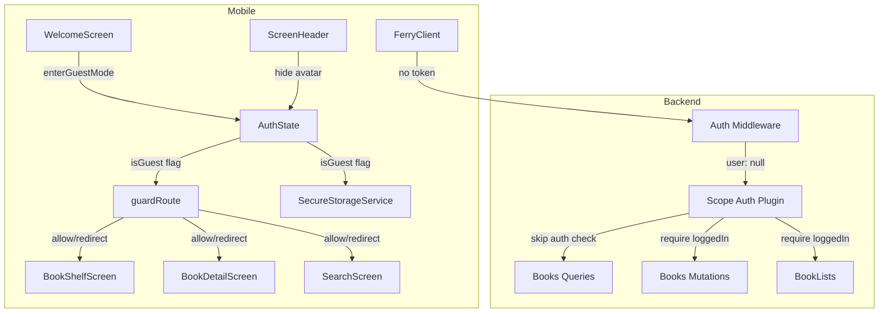
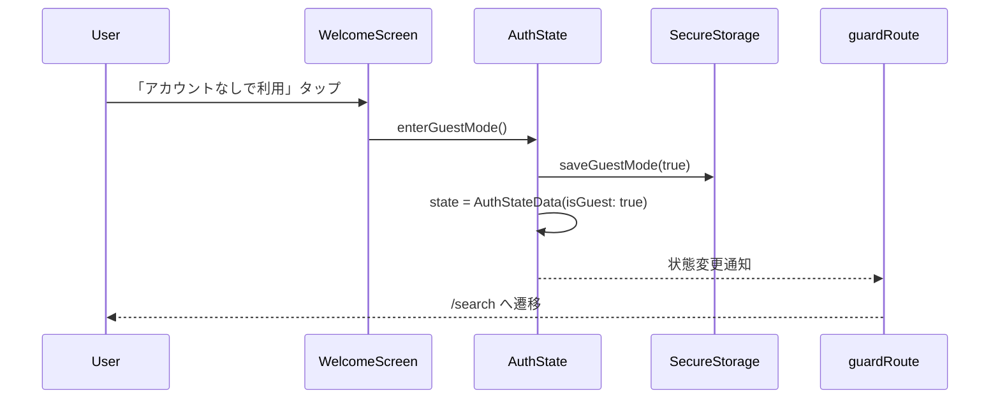
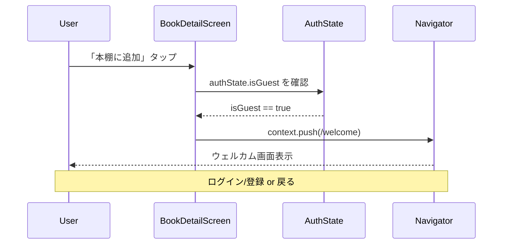
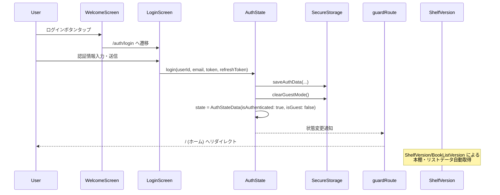
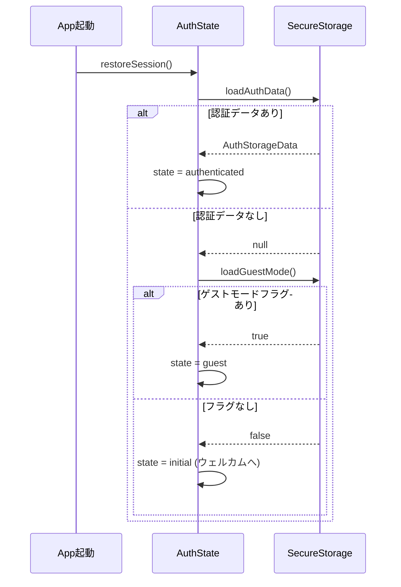

# Design Document: Guest Mode

## Overview

**Purpose**: ゲストモード機能は、未登録ユーザーがアカウントなしで本検索と本詳細閲覧を体験できる仕組みを提供する。これにより、ユーザーがアプリの価値を登録前に判断できるようになる。

**Users**: 未登録ユーザーがウェルカム画面から「アカウントなしで利用」リンクを経由して、検索タブと本詳細画面にアクセスする。本棚への追加やリスト操作などリソース変更操作はログイン必須を維持する。

**Impact**: バックエンドの認可レイヤー（3 クエリの公開化）、モバイルの認証状態管理（isGuest フラグ追加）、ルーティングガード（ゲスト許可ルートの定義）、UI コンポーネント（ゲスト向け制限表示）を横断的に変更する。

### Goals
- 未登録ユーザーが本検索・本詳細閲覧を認証なしで利用できる
- リソース変更操作（本棚追加、ステータス変更、リスト操作）のログイン必須を維持する
- ゲストユーザーが保護された操作を試みた際にウェルカム画面へ自然に誘導する
- ゲストモードから認証済み状態へのスムーズな移行を実現する

### Non-Goals
- ゲストユーザーのサーバーサイドでの識別（Firebase Anonymous Auth は使用しない）
- ゲストユーザー向けのレコメンデーション機能
- ゲストモード中のオフラインキャッシュ最適化
- ゲストモード利用統計のアナリティクス収集（将来検討）

## Architecture

### Existing Architecture Analysis

**バックエンド認可レイヤー**:
- Pothos scope-auth プラグインで `loggedIn` / `emailVerified` の 2 スコープを定義
- `GraphQLContext.user` は `AuthenticatedUser | null` 型であり、null 許容が既に組み込まれている
- 全クエリ・ミューテーションに `authScopes: { loggedIn: true }` が設定されている
- Express ミドルウェアの `createAuthContext` はトークンがなければ `user: null` を返す

**モバイル認証レイヤー**:
- `AuthStateData` は `isAuthenticated`、`userId`、`email`、`token`、`refreshToken` を保持
- `guardRoute` は `isAuthenticated` の二値判定でルートをリダイレクト
- Ferry クライアントの `_AuthLink` は `token` が `null` の場合 Authorization ヘッダーを省略する
- `TokenService.ensureValidToken()` は `isAuthenticated == false` で早期リターンする

**技術的制約**:
- 既存のルーティングガードは `isAuthenticated` のみで判定しており、ゲストモード判定が存在しない
- `SecureStorageService` は認証データのみを管理しており、ゲスト状態の永続化機能がない

### Architecture Pattern & Boundary Map



**Architecture Integration**:
- **Selected pattern**: 既存の AuthState 拡張パターン。`AuthStateData` に `isGuest` フラグを追加し、認証状態を一元管理する
- **Domain/feature boundaries**: バックエンドの認可変更は `books/internal/graphql.ts` に閉じる。モバイルの変更は `core/auth`、`routing`、各 feature の presentation レイヤーに分散するが、ゲスト判定のロジックは `AuthState` に集約する
- **Existing patterns preserved**: ShelfVersion / BookListVersion による状態伝播、Barrel Export パターン、Feature-first 構成
- **New components rationale**: 新規コンポーネントはなし。既存コンポーネントの拡張のみ
- **Steering compliance**: Feature-first + Clean Architecture、Riverpod による状態管理、SSOT 原則を維持

### Technology Stack

| Layer | Choice / Version | Role in Feature | Notes |
|-------|------------------|-----------------|-------|
| Backend | Pothos scope-auth 4.x | 3 クエリの authScopes 削除による公開化 | 既存プラグインの設定変更のみ |
| Mobile State | Riverpod 2.x | AuthStateData に isGuest フラグ追加 | keepAlive Provider |
| Mobile Routing | go_router 14.x | guardRoute にゲストモード分岐追加 | redirect 関数の拡張 |
| Mobile Storage | flutter_secure_storage | ゲストモード状態の永続化 | 既存 SecureStorageService の拡張 |
| Mobile GraphQL | Ferry 0.16.x | トークンなしリクエスト送信 | 既存の _AuthLink が自動対応 |

## System Flows

### ゲストモード開始フロー



### ゲスト操作制限フロー



### ゲスト -> 認証済み移行フロー



### セッション復元フロー



## Requirements Traceability

| Requirement | Summary | Components | Interfaces | Flows |
|-------------|---------|------------|------------|-------|
| 1.1 | ウェルカム画面に「アカウントなしで利用」リンク表示 | WelcomeButtons, WelcomeContent, WelcomeScreen | onGuestModePressed callback | ゲストモード開始フロー |
| 1.2 | リンクタップでゲスト状態設定、検索タブへ遷移 | AuthState, WelcomeScreen, guardRoute | enterGuestMode(), guardRoute() | ゲストモード開始フロー |
| 1.3 | リンクは控えめなテキストリンクスタイル | WelcomeButtons | -- | -- |
| 2.1 | AuthStateData に isGuest フラグ保持 | AuthStateData | isGuest: bool | -- |
| 2.2 | ゲストモード時 isAuthenticated=false, isGuest=true | AuthState | AuthStateData | -- |
| 2.3 | アプリ再起動時にゲストセッション復元 | AuthState, SecureStorageService | restoreSession(), loadGuestMode() | セッション復元フロー |
| 2.4 | ログイン/登録完了時にゲストモード解除 | AuthState | login() | ゲスト -> 認証済み移行フロー |
| 3.1 | ゲスト時に /search アクセス許可 | guardRoute | guardRoute() | -- |
| 3.2 | ゲスト時に /books/:bookId アクセス許可 | guardRoute | guardRoute() | -- |
| 3.3 | ゲスト時に /home, / アクセス許可 | guardRoute | guardRoute() | -- |
| 3.4 | ゲスト時に /welcome, /auth/* アクセス許可 | guardRoute | guardRoute() | -- |
| 3.5 | ゲスト時に /account, /account/* をリダイレクト | guardRoute | guardRoute() | -- |
| 3.6 | ゲスト時に /lists/* をリダイレクト | guardRoute | guardRoute() | -- |
| 4.1 | searchBooks の authScopes 解除 | registerBooksQueries | -- | -- |
| 4.2 | searchBookByISBN の authScopes 解除 | registerBooksQueries | -- | -- |
| 4.3 | bookDetail の authScopes 解除 | registerBooksQueries | -- | -- |
| 4.4 | 未認証時 bookDetail の userBook を null 返却 | bookDetail resolver | -- | -- |
| 5.1-5.8 | 保護対象操作の loggedIn 維持 | registerBooksMutations 等 | -- | -- |
| 6.1 | 本棚追加タップでウェルカム画面表示 | BookDetailScreen | -- | ゲスト操作制限フロー |
| 6.2 | 読書ステータス変更タップでウェルカム画面表示 | BookDetailScreen | -- | ゲスト操作制限フロー |
| 6.3 | 評価・メモ操作タップでウェルカム画面表示 | BookDetailScreen | -- | ゲスト操作制限フロー |
| 6.4 | ホームタブでログイン促進メッセージ表示 | BookShelfScreen | -- | -- |
| 6.5 | ISBN スキャンタップでウェルカム画面表示 | SearchScreen | -- | ゲスト操作制限フロー |
| 7.1 | ナビゲーションバーのホームタブ表示、タップ時ログイン促進 | _MainShell | -- | -- |
| 7.2 | アカウントアイコン/導線の非表示 | ScreenHeader | showAvatar: bool | -- |
| 7.3 | リスト作成・リスト詳細への導線非表示 | BookShelfScreen | -- | -- |
| 8.1 | ウェルカム画面でログイン・登録ボタン通常表示 | WelcomeScreen | -- | ゲスト -> 認証済み移行フロー |
| 8.2 | ログイン完了時にゲストフラグ解除、認証済み更新 | AuthState | login() | ゲスト -> 認証済み移行フロー |
| 8.3 | 新規登録完了時にゲストフラグ解除、認証済み更新 | AuthState | login() | ゲスト -> 認証済み移行フロー |
| 8.4 | 認証済み移行後に全ルートアクセス通常許可 | guardRoute | guardRoute() | ゲスト -> 認証済み移行フロー |
| 8.5 | ゲスト中にウェルカムで「アカウントなしで利用」タップ時は検索タブへ戻る | WelcomeScreen, AuthState | -- | -- |
| 9.1 | ゲスト時に本棚データをロードしない | BookShelfScreen, ShelfState | -- | -- |
| 9.2 | ゲスト時にリストデータをロードしない | BookShelfScreen, BookListNotifier | -- | -- |
| 9.3 | ゲスト時に認証トークンなしで GraphQL リクエスト | _AuthLink, AuthState | authTokenProvider | -- |
| 9.4 | 認証済み移行時に本棚・リストデータをロード | AuthState, ShelfVersion, BookListVersion | -- | ゲスト -> 認証済み移行フロー |

## Components and Interfaces

| Component | Domain/Layer | Intent | Req Coverage | Key Dependencies | Contracts |
|-----------|-------------|--------|--------------|------------------|-----------|
| AuthStateData | Core/Auth | ゲストモードフラグの保持 | 2.1, 2.2 | -- | State |
| AuthState | Core/Auth | ゲストモードの開始・復元・解除 | 1.2, 2.2, 2.3, 2.4, 8.2, 8.3, 9.4 | SecureStorageService (P0), ShelfVersion (P1) | Service, State |
| SecureStorageService | Core/Storage | ゲストモード状態の永続化 | 2.3 | FlutterSecureStorage (P0) | Service |
| guardRoute | Routing | ゲストモード時のアクセス制御 | 3.1-3.6, 8.4 | AuthStateData (P0) | Service |
| WelcomeButtons | Welcome/UI | 「アカウントなしで利用」リンク表示 | 1.1, 1.3 | -- | -- |
| WelcomeScreen | Welcome/UI | ゲストモード開始のオーケストレーション | 1.2, 8.1, 8.5 | AuthState (P0) | -- |
| registerBooksQueries | Backend/Books | 3 クエリの公開化 | 4.1-4.4 | scope-auth plugin (P0) | API |
| BookDetailScreen | BookDetail/UI | ゲスト時の操作制限 | 6.1-6.3 | AuthState (P0) | -- |
| BookShelfScreen | BookShelf/UI | ゲスト時のログイン促進 | 6.4, 7.3, 9.1, 9.2 | AuthState (P0), ShelfState (P1) | -- |
| SearchScreen | BookSearch/UI | ゲスト時の ISBN スキャン制限 | 6.5 | AuthState (P0) | -- |
| ScreenHeader | Core/Widget | ゲスト時のアカウントアイコン非表示 | 7.2 | -- | -- |
| _MainShell | Routing/UI | ゲスト時のナビゲーション制御 | 7.1 | AuthState (P0) | -- |

### Core/Auth

#### AuthStateData

| Field | Detail |
|-------|--------|
| Intent | ゲストモード状態を含む認証状態データの保持 |
| Requirements | 2.1, 2.2 |

**Responsibilities & Constraints**
- 認証状態とゲスト状態を一元的に表現するイミュータブルデータクラス
- `isAuthenticated` と `isGuest` は排他的: 両方 `true` にはならない
- `isGuest: true` の場合、`userId`、`email`、`token`、`refreshToken` は全て `null`

**Contracts**: State [x]

##### State Management
- State model:
  ```dart
  class AuthStateData {
    final bool isAuthenticated;
    final bool isGuest;
    final String? userId;
    final String? email;
    final String? token;
    final String? refreshToken;
  }
  ```
- 状態遷移パターン:
  - `initial` -> `guest`: `enterGuestMode()`
  - `initial` -> `authenticated`: `login()`
  - `guest` -> `authenticated`: `login()`（isGuest を false に設定）
  - `authenticated` -> `initial`: `logout()`
  - `guest` -> `initial`: `logout()`
- Invariant: `isAuthenticated == true` の場合 `isGuest == false`

#### AuthState

| Field | Detail |
|-------|--------|
| Intent | ゲストモードの開始・復元・解除を含む認証状態の管理 |
| Requirements | 1.2, 2.2, 2.3, 2.4, 8.2, 8.3, 9.4 |

**Responsibilities & Constraints**
- ゲストモード開始時に `isGuest: true` を設定し、`SecureStorageService` に永続化する
- セッション復元時に認証データを優先的に確認し、なければゲストモードを確認する
- ログイン/登録完了時にゲストモードフラグをクリアする
- ログアウト時にゲストモードフラグとシェルフデータの両方をクリアする

**Dependencies**
- Outbound: SecureStorageService -- ゲストモード状態の永続化 (P0)
- Outbound: ShelfState -- ログアウト時のデータクリア (P1)
- Outbound: ShelfVersion -- 認証済み移行時のデータ再取得トリガー (P1)

**Contracts**: Service [x] / State [x]

##### Service Interface
```dart
abstract class AuthStateService {
  Future<void> enterGuestMode();
  Future<void> login({
    required String userId,
    required String email,
    required String token,
    required String refreshToken,
  });
  Future<void> logout();
  Future<bool> restoreSession();
}
```
- Preconditions:
  - `enterGuestMode()`: 現在の状態が `initial` であること
  - `login()`: 有効な認証情報が提供されること
- Postconditions:
  - `enterGuestMode()`: `state.isGuest == true`, `state.isAuthenticated == false`
  - `login()`: `state.isAuthenticated == true`, `state.isGuest == false`, ゲストモードフラグがストレージからクリアされている
  - `logout()`: `state == AuthStateData.initial()`, 認証データとゲストモードフラグの両方がストレージからクリアされている
  - `restoreSession()`: 認証データがあれば `isAuthenticated == true`、なくゲストフラグがあれば `isGuest == true`、いずれもなければ `initial` のまま
- Invariants: `isAuthenticated` と `isGuest` は排他的

**Implementation Notes**
- Integration: `login()` 内で `clearGuestMode()` を呼び出し、ゲスト -> 認証済み移行を確実にする
- Validation: `restoreSession()` で認証データ復元を優先し、失敗時のみゲストモードを確認する
- Risks: セッション復元順序の誤りによるゲストモード残留。テストで両方のパスを検証する

#### SecureStorageService

| Field | Detail |
|-------|--------|
| Intent | ゲストモード状態の永続化機能を既存サービスに追加 |
| Requirements | 2.3 |

**Responsibilities & Constraints**
- `isGuest` フラグの保存・読み込み・クリアメソッドを提供する
- 既存の認証データ管理メソッドには影響を与えない

**Dependencies**
- External: FlutterSecureStorage -- キー・バリューストレージ (P0)

**Contracts**: Service [x]

##### Service Interface
```dart
abstract class GuestStorageService {
  Future<void> saveGuestMode({required bool isGuest});
  Future<bool> loadGuestMode();
  Future<void> clearGuestMode();
}
```
- Preconditions: なし
- Postconditions:
  - `saveGuestMode(isGuest: true)`: ストレージに `isGuest = true` が保存されている
  - `loadGuestMode()`: ストレージに `isGuest` フラグがあれば `true`、なければ `false` を返す
  - `clearGuestMode()`: ストレージから `isGuest` フラグが削除されている

### Routing

#### guardRoute

| Field | Detail |
|-------|--------|
| Intent | ゲストモード時のルートアクセス制御 |
| Requirements | 3.1, 3.2, 3.3, 3.4, 3.5, 3.6, 8.4 |

**Responsibilities & Constraints**
- ゲストユーザーに検索タブ、本詳細、ホームタブ、ウェルカム画面、認証ルートへのアクセスを許可する
- ゲストユーザーのアカウント画面、リスト画面へのアクセスをウェルカム画面にリダイレクトする
- 認証済みユーザーの既存のリダイレクトルールを維持する
- テスト可能なピュア関数として維持する

**Dependencies**
- Inbound: AuthStateData -- 認証・ゲスト状態の判定 (P0)

**Contracts**: Service [x]

##### Service Interface
```dart
String? guardRoute({
  required AuthStateData authState,
  required GoRouterState state,
});
```
- ゲストモードルート判定ロジック:
  - **ゲスト許可ルート**: `/`, `/home`, `/search`, `/books/*`, `/welcome`, `/auth/*`
  - **ゲスト不可ルート**: `/account`, `/account/*`, `/lists/*`, `/search/isbn-scan`
  - ゲスト不可ルートへのアクセスは `/welcome` へリダイレクト
- 判定優先順位:
  1. 認証済み + (認証ルート or ウェルカム) -> `/` へリダイレクト（既存ロジック維持）
  2. ゲスト + ゲスト許可ルート -> `null`（リダイレクトなし）
  3. ゲスト + ゲスト不可ルート -> `/welcome` へリダイレクト
  4. 未認証 + 非ゲスト + 非認証ルート + 非ウェルカム -> `/welcome` へリダイレクト（既存ロジック維持）

**Implementation Notes**
- Integration: `AuthChangeNotifier` が `authStateProvider` の変更を監視しており、`isGuest` の変更も自動的にルーター更新をトリガーする
- Validation: 全ルートパターンの組み合わせをユニットテストでカバーする
- Risks: ルートパターンの追加漏れ。ゲスト不可ルートの定数化で漏れを防止する

### Backend/Books

#### registerBooksQueries（公開化対象）

| Field | Detail |
|-------|--------|
| Intent | searchBooks、searchBookByISBN、bookDetail の 3 クエリから authScopes を削除し公開化する |
| Requirements | 4.1, 4.2, 4.3, 4.4 |

**Responsibilities & Constraints**
- 3 クエリの `authScopes: { loggedIn: true }` を削除する
- bookDetail resolver は `context.user` が null の場合 `userBook: null` を返す（既存ロジックで対応済み）
- 他のクエリ・ミューテーションの `authScopes` は変更しない

**Dependencies**
- External: Pothos scope-auth plugin -- `authScopes` 省略時にスコープチェックをスキップ (P0)

**Contracts**: API [x]

##### API Contract

| Operation | Type | Auth Required | Change |
|-----------|------|---------------|--------|
| searchBooks | Query | No (変更) | `authScopes` 削除 |
| searchBookByISBN | Query | No (変更) | `authScopes` 削除 |
| bookDetail | Query | No (変更) | `authScopes` 削除、userBook は未認証時 null |
| myShelfPaginated | Query | Yes (維持) | 変更なし |
| userBookByExternalId | Query | Yes (維持) | 変更なし |
| addBookToShelf | Mutation | Yes (維持) | 変更なし |
| updateReadingStatus | Mutation | Yes (維持) | 変更なし |
| updateReadingNote | Mutation | Yes (維持) | 変更なし |
| updateBookRating | Mutation | Yes (維持) | 変更なし |
| removeFromShelf | Mutation | Yes (維持) | 変更なし |

**Implementation Notes**
- Integration: `authScopes` 行を削除するだけで公開化が完了する。GraphQL スキーマの構造変更は不要
- Validation: 統合テストで未認証リクエストが成功することを検証する
- Risks: 誤って保護対象クエリの authScopes を削除するリスク。要件 5 のテストで防止する

### Welcome/UI

#### WelcomeButtons

| Field | Detail |
|-------|--------|
| Intent | 「アカウントなしで利用」リンクの追加表示 |
| Requirements | 1.1, 1.3 |

**Responsibilities & Constraints**
- ログインボタン・新規登録ボタンの下に「アカウントなしで利用」テキストリンクを表示する
- テキストリンクはボタンよりも控えめなスタイル（TextButton またはプレーンテキスト + InkWell）

**Dependencies**
- Inbound: WelcomeContent -- `onGuestModePressed` コールバック (P0)

**Implementation Notes**
- `onGuestModePressed: VoidCallback` パラメータを追加し、WelcomeContent -> WelcomeScreen まで伝播する

#### WelcomeScreen

| Field | Detail |
|-------|--------|
| Intent | ゲストモード開始のオーケストレーション |
| Requirements | 1.2, 8.1, 8.5 |

**Responsibilities & Constraints**
- 「アカウントなしで利用」タップ時に `AuthState.enterGuestMode()` を呼び出す
- 既にゲストモード中の場合は `context.pop()` で元の画面に戻る
- ログイン・登録ボタンは通常通り表示する

**Implementation Notes**
- `authStateProvider` の `isGuest` を確認し、既にゲストモード中であれば `pop()`、そうでなければ `enterGuestMode()` を呼ぶ

### Feature/UI（Summary-only コンポーネント）

#### BookDetailScreen

| Field | Detail |
|-------|--------|
| Intent | ゲストモード時の本棚追加・ステータス変更・評価メモ操作の制限 |
| Requirements | 6.1, 6.2, 6.3 |

**Implementation Notes**
- `authStateProvider` の `isGuest` を確認し、`true` の場合は操作コールバック内で `context.push(AppRoutes.welcome)` を呼ぶ
- ゲストモード時は `shelfStateProvider` の watch をスキップし、`isInShelf` を常に `false` として扱う

#### BookShelfScreen

| Field | Detail |
|-------|--------|
| Intent | ゲストモード時のログイン促進メッセージ表示とデータロードスキップ |
| Requirements | 6.4, 7.3, 9.1, 9.2 |

**Implementation Notes**
- ゲストモード時は `initState` の `statusSectionNotifierProvider` / `bookListNotifierProvider` 初期化をスキップする
- 代わりにログインを促すメッセージウィジェットを表示する（ログインボタン付き）
- リスト作成・リスト詳細への導線を非表示にする

#### SearchScreen

| Field | Detail |
|-------|--------|
| Intent | ゲストモード時の ISBN スキャン制限 |
| Requirements | 6.5 |

**Implementation Notes**
- ISBN スキャンボタンのタップ時に `isGuest` を確認し、`true` の場合は `context.push(AppRoutes.welcome)` を呼ぶ

#### ScreenHeader

| Field | Detail |
|-------|--------|
| Intent | ゲストモード時のアカウントアイコン非表示 |
| Requirements | 7.2 |

**Implementation Notes**
- `showAvatar` パラメータ（デフォルト `true`）を追加し、`false` の場合はアバターアイコン領域を非表示にする
- 呼び出し元（BookShelfScreen、SearchScreen）でゲスト判定を行い `showAvatar: !isGuest` を渡す

#### _MainShell

| Field | Detail |
|-------|--------|
| Intent | ゲストモード時のナビゲーションバー制御 |
| Requirements | 7.1 |

**Implementation Notes**
- ホームタブ（ライブラリ）のアイコンとラベルは表示を維持する
- ホームタブタップ時にゲストモードであればホーム画面内でログイン促進を表示する（guardRoute 側ではリダイレクトしない）

## Error Handling

### Error Strategy

ゲストモード固有のエラーシナリオは限定的であり、既存のエラーハンドリング戦略で対応する。

### Error Categories and Responses

**API 認可エラー（既存動作の維持）**:
- ゲストユーザーが保護された Mutation を直接呼び出した場合、バックエンドは `UNAUTHENTICATED` エラーを返す
- クライアント側は既存の `AuthFailure` ハンドリングで対応可能
- モバイル UI 側でゲスト判定を行い、保護された操作のタップ時にウェルカム画面へ遷移することで、API エラーの発生自体を防止する

**セッション復元エラー**:
- ゲストモードフラグの読み込みに失敗した場合は `false` を返し、未認証状態（ウェルカム画面表示）にフォールバックする
- データの破損やストレージエラーは既存の SecureStorageService のエラーハンドリングに委譲する

## Testing Strategy

### Unit Tests
- `AuthStateData`: `isGuest` フラグの各状態パターン（initial, guest, authenticated）の遷移検証
- `AuthState.enterGuestMode()`: ゲストモード開始時の状態変更とストレージ保存の検証
- `AuthState.restoreSession()`: 認証データ優先、ゲストモードフォールバック、初期状態の 3 パターン検証
- `AuthState.login()`: ゲストモードからの認証済み移行時の isGuest クリア検証
- `guardRoute()`: ゲスト + 各ルートパターンの組み合わせテスト（許可ルート / 不可ルート / 認証済み / 未認証）
- `SecureStorageService`: ゲストモードフラグの save/load/clear の検証

### Integration Tests (Backend)
- 未認証リクエストで searchBooks が成功することの検証
- 未認証リクエストで searchBookByISBN が成功することの検証
- 未認証リクエストで bookDetail が成功し、userBook が null であることの検証
- 未認証リクエストで addBookToShelf が UNAUTHENTICATED エラーを返すことの検証
- 未認証リクエストで myShelfPaginated が UNAUTHENTICATED エラーを返すことの検証

### Widget Tests
- WelcomeButtons: 「アカウントなしで利用」リンクの表示と onGuestModePressed コールバックの発火検証
- BookShelfScreen: ゲストモード時のログイン促進メッセージ表示とデータロードスキップの検証
- BookDetailScreen: ゲストモード時の操作ボタンタップでウェルカム画面遷移が発生することの検証
- ScreenHeader: `showAvatar: false` 時にアバターアイコンが非表示になることの検証

## Security Considerations

- **認可の変更範囲の限定**: 公開化するのは読み取り専用の 3 クエリ（searchBooks、searchBookByISBN、bookDetail）のみ。全ミューテーション、myShelf 系クエリ、bookLists 系クエリは `loggedIn` スコープを維持する
- **データ漏洩の防止**: bookDetail の userBook フィールドは未認証時に null を返す。ユーザー固有のデータはゲストユーザーに露出しない
- **クライアントサイドの制限は UI ガイダンス**: クライアント側のゲスト判定はあくまでUXの改善であり、セキュリティの最終防衛線はバックエンドの authScopes にある
- **セッション状態の安全性**: ゲストモードフラグは `FlutterSecureStorage` に保存され、暗号化される。ゲストモード状態が漏洩してもセキュリティリスクはない（保護すべきデータを持たないため）
