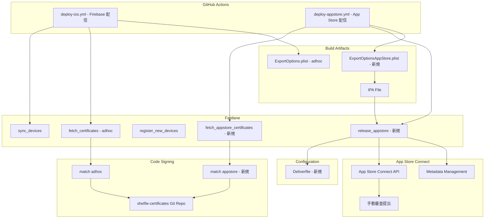
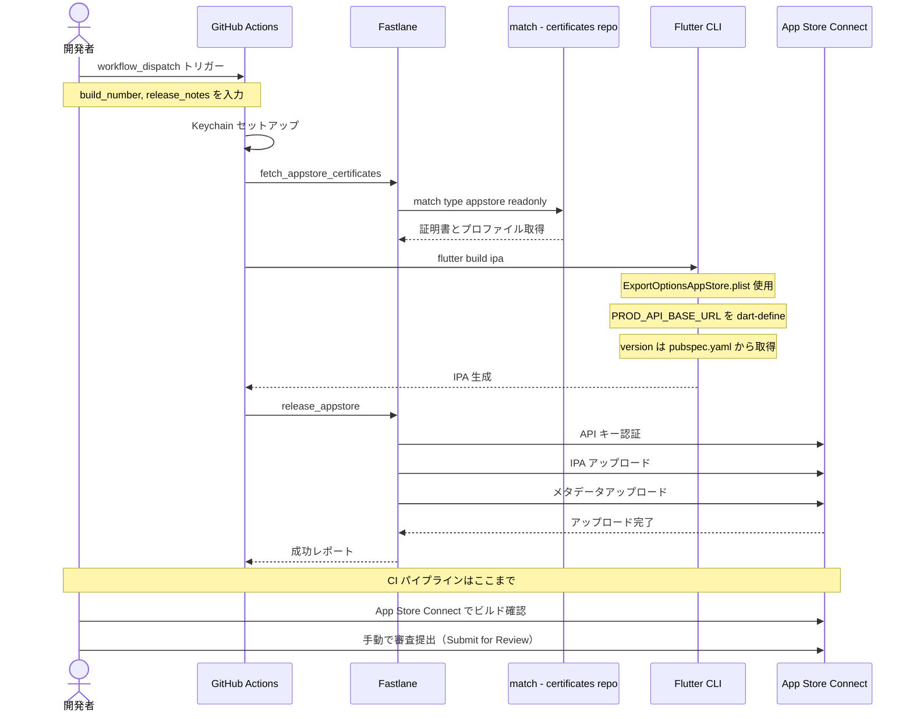

# Design Document

## Overview

本設計は、Shelfie iOS アプリの Apple App Store 公開配信を実現する。現在 Firebase App Distribution（Ad-hoc）で配信しているアプリに対し、App Store 配信用のコード署名、Fastlane レーン、GitHub Actions ワークフロー、メタデータ管理を追加する。

**Purpose**: 一般ユーザーが Apple App Store から Shelfie アプリをダウンロードできる配信チャネルを確立する。
**Users**: 開発者が CI/CD パイプラインを通じて App Store への提出を自動化する。App Store 経由で一般ユーザーがアプリを取得する。
**Impact**: 既存の Firebase App Distribution（テスト配信）に影響を与えず、本番配信チャネルとして App Store を追加する。

### Goals
- App Store Distribution 用のコード署名を Fastlane match で管理する
- Fastlane `deliver` を使用した App Store Connect への IPA アップロードとメタデータ提出を自動化する
- GitHub Actions で手動トリガーの App Store 提出ワークフローを構築する
- メタデータをリポジトリ内でバージョン管理する

### Non-Goals
- TestFlight 配信（本スコープ外）
- スクリーンショットの自動生成（`snapshot` の導入は将来検討）
- 既存の Firebase App Distribution ワークフローの変更
- App Store Connect 上での手動操作の完全排除（初回アプリ登録等は手動）
- CI からの審査自動提出（IPA アップロードまでを自動化し、審査提出は App Store Connect 上で手動実行）

## Architecture

### Existing Architecture Analysis

現在のシステムは以下の構成で iOS アプリのテスト配信を行っている。

- **Fastlane match**: `adhoc` タイプの証明書とプロビジョニングプロファイルを Git リポジトリ（`shelfie-certificates`）で管理
- **Matchfile**: `type("adhoc")` をデフォルト、`app_identifier("app.shelfie.shelfie")` を設定
- **Fastfile**: `fetch_certificates`、`register_new_devices`、`sync_devices` の3レーンを定義
- **ExportOptions.plist**: `method: ad-hoc`、`match AdHoc app.shelfie.shelfie` を指定
- **deploy-ios.yml**: master ブランチへのプッシュまたは手動トリガーで Firebase App Distribution へ配信（`macos-latest` ランナー使用）
- **App Store Connect API キー**: `sync_devices` レーンで既に使用中（GitHub Secrets に設定済み）

### Architecture Pattern & Boundary Map



**Architecture Integration**:
- **Selected pattern**: レーン分離パターン。既存の Fastfile に App Store 用レーンを追加し、ワークフローを分離
- **Domain/feature boundaries**: Firebase 配信と App Store 配信は完全に独立したワークフローとレーンで管理。証明書リポジトリのみ共有
- **Existing patterns preserved**: Fastlane match による Git ベースの証明書管理、App Store Connect API キー認証、GitHub Actions の concurrency 制御
- **New components rationale**: App Store 固有の署名方式、メタデータ管理、`deliver` によるアップロードが必要なため、専用の設定ファイルとレーンを追加
- **Upload / Submit の分離**: IPA アップロードとメタデータ送信は CI で自動化するが、審査提出（Submit for Review）は App Store Connect 上で手動実行する。意図しないビルドの審査提出を防止するためのベストプラクティス
- **Steering compliance**: 既存のツールチェーン（Fastlane、GitHub Actions）を活用し、新たな外部依存を最小化

### Technology Stack

| Layer | Choice / Version | Role in Feature | Notes |
|-------|------------------|-----------------|-------|
| CI/CD | GitHub Actions | App Store 配信ワークフロー | `workflow_dispatch` トリガー |
| Build | Flutter CLI | IPA ビルド | `flutter build ipa --export-options-plist` |
| Signing | Fastlane match | App Store 証明書管理 | `type: "appstore"` をレーンで指定 |
| Upload | Fastlane deliver | IPA / メタデータアップロード | `Deliverfile` で設定管理 |
| Auth | App Store Connect API | 認証 | 既存の API キー Secrets を再利用 |
| Metadata | Fastlane deliver | メタデータファイル管理 | `metadata/ja/` ディレクトリ構造 |

## System Flows

### App Store 提出フロー



## Requirements Traceability

| Requirement | Summary | Components | Interfaces | Flows |
|-------------|---------|------------|------------|-------|
| 1.1 | match で App Store 証明書取得 | Matchfile, Fastfile | `fetch_appstore_certificates` レーン | App Store 提出フロー |
| 1.2 | appstore タイプを読み取り専用で取得 | Fastfile | `match(type: "appstore", readonly: true)` | App Store 提出フロー |
| 1.3 | adhoc と appstore の両サポート | Matchfile | 既存 Matchfile + Fastfile でのオーバーライド | -- |
| 1.4 | App Store 用 ExportOptions.plist | ExportOptionsAppStore.plist | `method: app-store` | App Store 提出フロー |
| 1.5 | 既存 Ad-hoc 設定の維持 | 既存ファイル群 | 変更なし | -- |
| 2.1 | deliver による IPA とメタデータアップロード | Fastfile, Deliverfile | `release_appstore` レーン | App Store 提出フロー |
| 2.2 | App Store Connect API キー認証 | Fastfile | `app_store_connect_api_key` アクション | App Store 提出フロー |
| 2.3 | IPA アップロード（審査提出は手動） | Fastfile | `deliver` の `submit_for_review: false` | App Store 提出フロー |
| 2.4 | エラー時の明示的出力と中断 | Fastfile | Fastlane 標準エラーハンドリング + `error` ブロック | -- |
| 2.5 | ビルド番号の自動/手動対応 | deploy-appstore.yml | `build_number` 入力パラメータ | App Store 提出フロー |
| 3.1 | workflow_dispatch トリガー | deploy-appstore.yml | `workflow_dispatch` イベント | App Store 提出フロー |
| 3.2 | リリースノートとビルド番号入力 | deploy-appstore.yml | `inputs: build_number, release_notes` | App Store 提出フロー |
| 3.3 | match で App Store 証明書取得 | deploy-appstore.yml | `fetch_appstore_certificates` ステップ | App Store 提出フロー |
| 3.4 | API キーを Secrets から取得 | deploy-appstore.yml | 既存の `APP_STORE_CONNECT_API_KEY_*` Secrets | App Store 提出フロー |
| 3.5 | concurrency 制御 | deploy-appstore.yml | `concurrency.group` 設定 | -- |
| 3.6 | 既存 Firebase 配信の独立動作 | deploy-ios.yml | 変更なし | -- |
| 3.7 | 本番 API URL の dart-define | deploy-appstore.yml | `--dart-define=API_BASE_URL` | App Store 提出フロー |
| 4.1 | メタデータのローカル管理 | metadata ディレクトリ | `deliver` のメタデータ読み込み | -- |
| 4.2 | 日本語ロケール | metadata/ja/ | ローカライズファイル群 | -- |
| 4.3 | deliver でメタデータアップロード | Fastfile, Deliverfile | `release_appstore` の `metadata_path` | App Store 提出フロー |
| 4.4 | metadata ディレクトリの格納場所 | metadata/ | `apps/mobile/ios/fastlane/metadata/` | -- |
| 4.5 | review_information 管理 | metadata/review_information/ | 審査用メモ、連絡先ファイル | -- |
| 5.1 | 既存 Ad-hoc フローの維持 | 既存ファイル群 | 変更なし | -- |
| 5.2 | Firebase 配信の独立実行 | deploy-ios.yml | 変更なし | -- |
| 5.3 | レーンの明確な分離 | Fastfile | adhoc / appstore レーンの分離 | -- |
| 5.4 | 証明書リポジトリの共有 | Matchfile | 同一 Git リポジトリで adhoc / appstore 管理 | -- |

## Components and Interfaces

| Component | Domain/Layer | Intent | Req Coverage | Key Dependencies | Contracts |
|-----------|-------------|--------|--------------|------------------|-----------|
| ExportOptionsAppStore.plist | Code Signing | App Store 用ビルドエクスポート設定 | 1.4 | match AppStore profile (P0) | -- |
| Deliverfile | Configuration | deliver 設定の一元管理 | 2.1, 4.3 | metadata ディレクトリ (P0) | -- |
| Fastfile App Store レーン群 | Build/Deploy | App Store 署名取得とアップロード | 1.1, 1.2, 2.1-2.5 | match (P0), deliver (P0), ASC API (P0) | Service |
| deploy-appstore.yml | CI/CD | App Store 提出ワークフロー | 3.1-3.7 | Fastlane (P0), Flutter CLI (P0), GitHub Secrets (P0) | Batch |
| metadata ディレクトリ | Metadata | App Store メタデータ管理 | 4.1-4.5 | deliver (P1) | -- |

### Code Signing

#### ExportOptionsAppStore.plist

| Field | Detail |
|-------|--------|
| Intent | App Store 配信用の IPA エクスポート設定を定義する |
| Requirements | 1.4 |

**Responsibilities & Constraints**
- App Store 配信メソッド（`app-store`）と手動署名スタイルを指定
- `match AppStore app.shelfie.shelfie` プロビジョニングプロファイルを参照
- 既存の `ExportOptions.plist`（Ad-hoc 用）とは独立したファイルとして管理

**Dependencies**
- External: Fastlane match appstore プロファイル -- 署名に使用 (P0)

**Contracts**: 該当なし（静的設定ファイル）

**Implementation Notes**
- Integration: `flutter build ipa --export-options-plist=ios/ExportOptionsAppStore.plist` で参照
- Validation: ビルド成功と IPA 生成を確認
- Risks: プロファイル名の不一致による署名エラー。match で生成されるプロファイル名との整合性を確認する

### Configuration

#### Deliverfile

| Field | Detail |
|-------|--------|
| Intent | deliver の設定を一元管理し、Fastfile のレーン定義をシンプルに保つ |
| Requirements | 2.1, 4.3 |

**Responsibilities & Constraints**
- `deliver` の共通設定（`metadata_path`、`force`、`precheck_include_in_app_purchases`、`submit_for_review` 等）を定義
- `apps/mobile/ios/fastlane/Deliverfile` に配置
- `submit_for_review` は `false` に固定（審査提出は App Store Connect 上で手動実行）

**Dependencies**
- Outbound: metadata ディレクトリ -- メタデータファイル参照 (P0)

**Contracts**: 該当なし（静的設定ファイル）

**Implementation Notes**
- Integration: Fastlane が自動的に `fastlane/Deliverfile` を読み込む。レーン内で個別パラメータのオーバーライドも可能
- Validation: `bundle exec fastlane deliver --validate_only` で設定の検証を実行

### Build / Deploy

#### Fastfile App Store レーン群

| Field | Detail |
|-------|--------|
| Intent | App Store 用の証明書取得と IPA / メタデータのアップロードを提供する |
| Requirements | 1.1, 1.2, 2.1, 2.2, 2.3, 2.4, 2.5, 5.3 |

**Responsibilities & Constraints**
- `fetch_appstore_certificates` レーン: App Store Distribution 用の証明書とプロファイルを readonly モードで取得
- `release_appstore` レーン: App Store Connect API キーで認証し、IPA とメタデータを App Store Connect にアップロード（審査提出は行わない）
- 既存の adhoc 用レーン（`fetch_certificates`、`sync_devices`、`register_new_devices`）に変更を加えない
- エラー発生時は Fastlane 標準のエラーハンドリング（`error` ブロック）でメッセージを出力して中断

**Dependencies**
- Outbound: Fastlane match -- 証明書取得 (P0)
- Outbound: Fastlane deliver -- IPA / メタデータアップロード (P0)
- External: App Store Connect API -- 認証とアップロード (P0)
- External: shelfie-certificates Git リポジトリ -- 証明書ストレージ (P0)

**Contracts**: Service [x]

##### Service Interface

```ruby
# fetch_appstore_certificates レーン
# 入力: keychain_name (String, optional), keychain_password (String, optional)
# 出力: App Store Distribution 証明書とプロファイルがキーチェーンにインストールされた状態
# エラー: 証明書リポジトリへのアクセス失敗、プロファイル未生成
lane :fetch_appstore_certificates do |options|
  api_key = app_store_connect_api_key(
    key_id: ENV["APP_STORE_CONNECT_API_KEY_KEY_ID"],
    issuer_id: ENV["APP_STORE_CONNECT_API_KEY_ISSUER_ID"],
    key_content: ENV["APP_STORE_CONNECT_API_KEY_KEY"]
  )

  match(
    type: "appstore",
    readonly: true,
    keychain_name: options[:keychain_name],
    keychain_password: options[:keychain_password],
    api_key: api_key
  )
end

# release_appstore レーン
# 入力: なし（IPA パスは Flutter ビルドの出力から取得、メタデータは metadata/ から読み込み）
# 出力: App Store Connect へ IPA とメタデータがアップロードされた状態（審査提出は行わない）
# エラー: API 認証失敗、IPA アップロード失敗、メタデータ検証エラー
lane :release_appstore do
  api_key = app_store_connect_api_key(
    key_id: ENV["APP_STORE_CONNECT_API_KEY_KEY_ID"],
    issuer_id: ENV["APP_STORE_CONNECT_API_KEY_ISSUER_ID"],
    key_content: ENV["APP_STORE_CONNECT_API_KEY_KEY"]
  )

  deliver(
    api_key: api_key,
    ipa: Dir.glob("../../build/ios/ipa/*.ipa").first,
    submit_for_review: false,
    force: true
  )
end
```

- Preconditions: App Store 用証明書が match で生成済み、IPA がビルド済み、API キー環境変数が設定済み
- Postconditions: IPA とメタデータが App Store Connect にアップロードされた状態。審査提出は開発者が App Store Connect 上で手動実行
- Invariants: 既存の adhoc レーンは変更されない

**Implementation Notes**
- Integration: `deliver` の設定は `Deliverfile` で管理し、レーン内ではオーバーライドが必要なパラメータ（`api_key`、`ipa`）のみ指定
- Validation: `deliver` の `run_precheck_before_submit: true` でメタデータの事前検証を実行
- Risks: `deliver` が iTunes Transporter を内部使用するため、CI ランナーの Xcode バージョンとの互換性に注意
- レーン名 `release_appstore` は Fastlane 組み込みアクション名（`upload_to_app_store`）との衝突を避けるために採用

### CI/CD

#### deploy-appstore.yml

| Field | Detail |
|-------|--------|
| Intent | GitHub Actions で App Store への提出ワークフローを提供する |
| Requirements | 3.1, 3.2, 3.3, 3.4, 3.5, 3.6, 3.7 |

**Responsibilities & Constraints**
- `workflow_dispatch` による手動トリガーのみ（自動トリガーなし）
- 入力パラメータ: `build_number`（ビルド番号、デフォルト: `github.run_number`）、`release_notes`（リリースノート）
- アプリバージョンは `pubspec.yaml` の `version` フィールドを Single Source of Truth とする（ワークフロー入力では受け付けない）
- `PROD_API_BASE_URL` を `--dart-define` でビルドに注入
- `concurrency` グループで同一ブランチの重複実行を防止
- 既存の `deploy-ios.yml` に一切変更を加えない
- ランナーは `macos-15` にバージョン固定する。本番リリースビルドの再現性を確保し、GitHub による予告なしの Xcode バージョン更新によるビルド失敗を防止する

**Dependencies**
- Outbound: Fastlane -- 証明書取得とアップロード (P0)
- Outbound: Flutter CLI -- IPA ビルド (P0)
- External: GitHub Secrets -- API キー、match パスワード (P0)
- External: macOS ランナー -- Xcode ビルド環境 (P0)

**Contracts**: Batch [x]

##### Batch / Job Contract

- **Trigger**: `workflow_dispatch`（手動実行）
- **Input / validation**:
  - `build_number`: string, optional（デフォルト: `github.run_number`）
  - `release_notes`: string, optional（デフォルト: 空文字）
- **Output / destination**: App Store Connect へ IPA とメタデータがアップロードされる（審査提出は手動）
- **Idempotency & recovery**: 同一バージョン+ビルド番号の再提出は App Store Connect 側で拒否される。ビルド番号を変更して再実行可能

**Implementation Notes**
- Integration: 既存の `deploy-ios.yml` のステップ構成（mise セットアップ、Ruby セットアップ、Flutter キャッシュ、Keychain セットアップ）を踏襲する。`PROD_API_BASE_URL` は GitHub Variables から取得
- Version: `pubspec.yaml` の `version` フィールドからビルドバージョンを取得。リリース前に `pubspec.yaml` を更新してコミットする運用フロー
- Validation: ワークフロー完了後、App Store Connect でビルドを確認し、手動で審査提出
- Risks: macOS ランナーの EOL によるバージョン変更が必要になる可能性あり。GitHub の公式ドキュメントで対応状況を確認する

### Metadata

#### metadata ディレクトリ

| Field | Detail |
|-------|--------|
| Intent | App Store Connect メタデータをリポジトリ内でバージョン管理する |
| Requirements | 4.1, 4.2, 4.3, 4.4, 4.5 |

**Responsibilities & Constraints**
- `apps/mobile/ios/fastlane/metadata/` に Fastlane deliver 標準のディレクトリ構造を配置
- 日本語（`ja`）ロケールのメタデータファイルを含む
- `review_information/` に App Store 審査用の情報を管理。ただし機密情報（`demo_user`、`demo_password`）はリポジトリにコミットせず、環境変数で管理する
- メタデータの変更は Git で差分管理しレビュー可能

**Dependencies**
- Outbound: Fastlane deliver -- メタデータアップロード (P1)

**Contracts**: 該当なし（静的ファイル構造）

**Implementation Notes**
- Integration: `Deliverfile` の `metadata_path` で参照される。初期メタデータはプレースホルダーとして作成し、リリース前に実際の内容を記入
- Risks: メタデータの不備による審査リジェクト。`deliver` の precheck 機能で事前検証を実施

## Data Models

### Domain Model

本機能にエンティティやドメインオブジェクトの追加はない。扱うデータは以下の設定ファイルとメタデータファイルに限定される。

**設定ファイル（静的構成）**:
- `ExportOptionsAppStore.plist`: ビルドエクスポート設定
- `Deliverfile`: deliver 設定
- `Matchfile`: 証明書管理設定（変更なし）
- `Appfile`: アプリ識別子設定（変更なし）

**メタデータファイル（バージョン管理対象）**:

```
apps/mobile/ios/fastlane/metadata/
├── copyright.txt
├── primary_category.txt
├── ja/
│   ├── name.txt
│   ├── subtitle.txt
│   ├── description.txt
│   ├── keywords.txt
│   ├── privacy_url.txt
│   ├── support_url.txt
│   ├── marketing_url.txt
│   ├── release_notes.txt
│   └── promotional_text.txt
└── review_information/
    ├── email_address.txt
    ├── first_name.txt
    ├── last_name.txt
    ├── notes.txt
    └── phone_number.txt
```

※ `demo_user`、`demo_password` は機密情報のためリポジトリには含めず、`Deliverfile` 内で環境変数（`APP_REVIEW_DEMO_USER`、`APP_REVIEW_DEMO_PASSWORD`）から読み込む。

**ワークフロー入力パラメータ**:

| Parameter | Type | Required | Default | Description |
|-----------|------|----------|---------|-------------|
| build_number | string | no | `github.run_number` | ビルド番号 |
| release_notes | string | no | 空文字 | リリースノート |

※ アプリバージョンは `pubspec.yaml` の `version` フィールドが Single Source of Truth。ワークフロー入力では管理しない。

**GitHub Secrets / Variables（新規追加）**:

| Name | Type | Description |
|------|------|-------------|
| `PROD_API_BASE_URL` | Variable | 本番環境 API のベース URL |
| `APP_REVIEW_DEMO_USER` | Secret | App Store 審査用のデモアカウントユーザー名 |
| `APP_REVIEW_DEMO_PASSWORD` | Secret | App Store 審査用のデモアカウントパスワード |

既存の Secrets（`APP_STORE_CONNECT_API_KEY_KEY_ID`、`APP_STORE_CONNECT_API_KEY_ISSUER_ID`、`APP_STORE_CONNECT_API_KEY_KEY`、`MATCH_PASSWORD`、`MATCH_GIT_BASIC_AUTHORIZATION`）はそのまま再利用する。

## Error Handling

### Error Strategy

本機能のエラーハンドリングは Fastlane と GitHub Actions の標準機構に依存する。

### Error Categories and Responses

**証明書取得エラー（match）**:
- 証明書リポジトリへのアクセス失敗 --> `MATCH_GIT_BASIC_AUTHORIZATION` の値を確認
- プロファイル未生成 --> `bundle exec fastlane match appstore` でローカルから初回生成を実行
- 復号化失敗 --> `MATCH_PASSWORD` の値を確認

**IPA アップロードエラー（deliver）**:
- App Store Connect API 認証失敗 --> API キーのロール（App Manager 以上）と有効期限を確認
- IPA 署名不正 --> ExportOptionsAppStore.plist のプロファイル名と match の出力を照合
- メタデータ検証エラー --> `deliver` の precheck 出力を確認し、該当ファイルを修正

**ビルドエラー（Flutter）**:
- 署名プロファイル未発見 --> Keychain セットアップと match の実行順序を確認
- dart-define 未設定 --> ワークフロー内の環境変数設定を確認

**ワークフローエラー（GitHub Actions）**:
- concurrency による待機 --> 先行実行の完了を待つか、キャンセル後に再実行
- ランナータイムアウト --> ビルドキャッシュの活用とステップの最適化を検討

### Monitoring

- GitHub Actions のワークフロー実行ログで各ステップの成否を確認
- Fastlane の出力ログで `deliver` のアップロード結果を確認
- App Store Connect のアプリ管理画面でビルドのステータスと審査結果を確認

## Testing Strategy

### 手動検証項目

本機能は CI/CD パイプラインと設定ファイルの構築が主であり、自動テストの対象は限定的である。以下の手動検証項目で品質を担保する。

1. **証明書取得テスト**: ローカル環境で `bundle exec fastlane fetch_appstore_certificates` を実行し、App Store 用証明書とプロファイルが正常に取得されることを確認
2. **IPA ビルドテスト**: `flutter build ipa --export-options-plist=ios/ExportOptionsAppStore.plist` でビルドが成功し、App Store 用 IPA が生成されることを確認
3. **メタデータ検証テスト**: `bundle exec fastlane deliver --validate_only` でメタデータの検証を実行し、precheck が通過することを確認
4. **ワークフロー実行テスト**: GitHub Actions で `deploy-appstore.yml` を手動トリガーし、全ステップが正常に完了することを確認
5. **既存フロー非干渉テスト**: `deploy-ios.yml`（Firebase 配信）を実行し、App Store 配信の追加後も変更なく動作することを確認

## Security Considerations

- **App Store Connect API キー**: 既存の GitHub Secrets で管理。API キーのロールは最小権限（App Manager）を維持
- **証明書リポジトリ**: Private リポジトリ（`shelfie-certificates`）で管理。`MATCH_PASSWORD` による暗号化を継続
- **match readonly モード**: CI 環境では `readonly: true` で動作し、意図しない証明書の再生成を防止
- **本番 API URL**: `PROD_API_BASE_URL` は GitHub Variables（非暗号化）で管理。機密性は低いが、外部からのアクセスは制限済み
- **審査用デモアカウント**: `APP_REVIEW_DEMO_USER`、`APP_REVIEW_DEMO_PASSWORD` は GitHub Secrets で管理。リポジトリにはコミットしない
