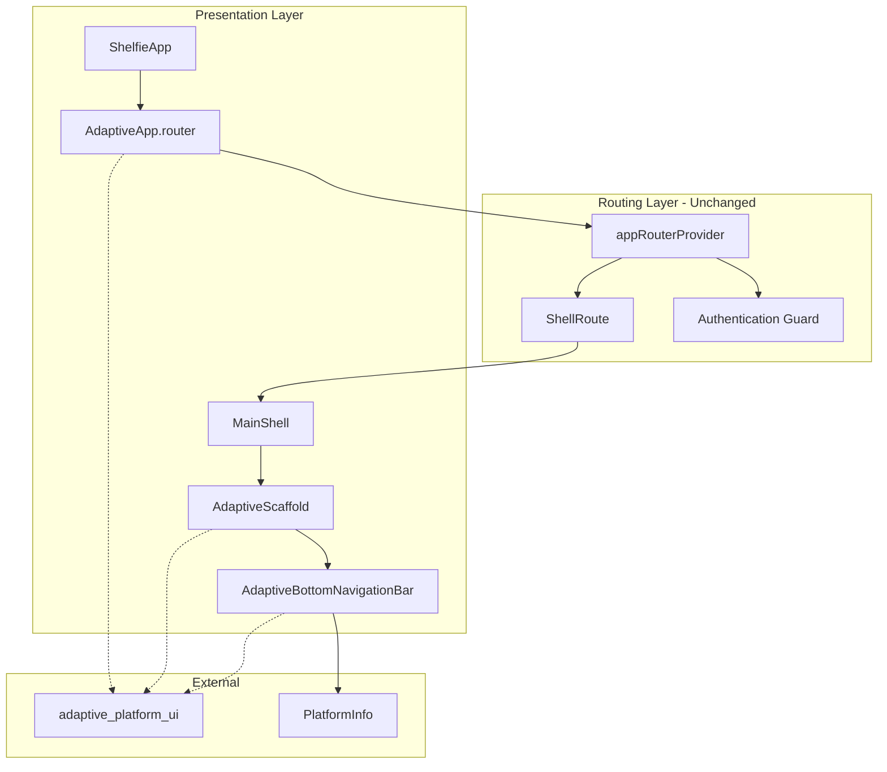
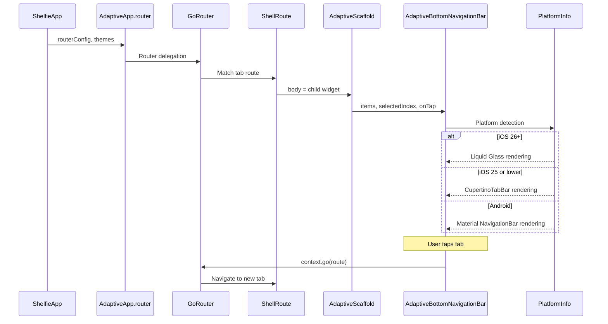

# Technical Design: Liquid Glass Navigation

## Overview

**Purpose**: 本機能は Shelfie モバイルアプリのナビゲーション UI レイヤーを adaptive_platform_ui パッケージに移行し、iOS 26 の Liquid Glass デザインをボトムナビゲーションバーに導入する。

**Users**: iOS/Android のエンドユーザーが、プラットフォームに最適化されたネイティブ体験のナビゲーションを使用する。開発者は、プラットフォーム分岐のない統一的な UI コードを通じてメンテナンス性を向上させる。

**Impact**: 既存の MaterialApp.router、Scaffold、カスタムタブバーウィジェットを AdaptiveApp.router、AdaptiveScaffold、AdaptiveBottomNavigationBar に置き換える。go_router のルーティングロジックは変更しない。

### Goals
- MaterialApp.router を AdaptiveApp.router に移行し、プラットフォーム適応型 UI 基盤を有効化する
- カスタム _AppTabBar を AdaptiveBottomNavigationBar に置き換え、プラットフォーム最適化されたナビゲーションを提供する
- Scaffold を AdaptiveScaffold に変更し、適応型レイアウト構造を導入する
- 既存の go_router ルーティングロジック、認証ガード、ディープリンクを完全に維持する

### Non-Goals
- go_router のルーティング定義やリダイレクトロジックの変更
- ナビゲーションバー以外の画面（個別 Feature 画面）のアダプティブ対応
- ライトモードのテーマ実装（将来検討事項として維持）
- IOS26NativeSearchTabBar の導入（実験的機能のため除外）
- AdaptiveAppBar の導入（現行画面にはグローバル AppBar がないため不要）

## Architecture

### Existing Architecture Analysis

現行のナビゲーションアーキテクチャは以下の構成で動作している:

- **ShelfieApp（app.dart）**: ConsumerWidget として MaterialApp.router を構築し、AppTheme.theme と appRouterProvider を統合
- **appRouterProvider（app_router.dart）**: GoRouter インスタンスを提供。認証ガード、ShellRoute によるタブナビゲーション、全ルート定義を含む
- **_MainShell**: ShellRoute の builder。Scaffold + _AppTabBar でタブナビゲーションを構成
- **_AppTabBar / _TabItem**: カスタムボトムナビゲーションバー。Container + Row + GestureDetector で独自実装

変更の影響範囲は Presentation レイヤーに限定される。Domain、Application、Infrastructure レイヤーは影響を受けない。

### Architecture Pattern & Boundary Map

**Architecture Integration**:
- **Selected pattern**: UI レイヤー差し替え。既存の Feature-first + Clean Architecture を維持し、Presentation レイヤーのウィジェットのみを置換する
- **Domain/feature boundaries**: ナビゲーション UI の変更は app/ と routing/ ディレクトリに閉じる。Feature 固有の画面ウィジェットは変更しない
- **Existing patterns preserved**: Riverpod による状態管理、go_router による宣言的ルーティング、ConsumerWidget パターン
- **New components rationale**: adaptive_platform_ui のウィジェットは既存のカスタムウィジェット（_AppTabBar, _TabItem）を置き換え、プラットフォーム検出とネイティブ UI レンダリングを委譲する
- **Steering compliance**: 「車輪の再発明を避ける」原則に従い、パッケージのエコシステムを活用。Feature-first + Clean Architecture のレイヤー分離を維持

### Technology Stack

| Layer | Choice / Version | Role in Feature | Notes |
|-------|------------------|-----------------|-------|
| UI Framework | adaptive_platform_ui ^0.1.101 | プラットフォーム適応型ウィジェット | 新規依存。Dart SDK ^3.9.2 要求 |
| Routing | go_router ^14.6.2 | 宣言的ルーティング（変更なし） | 既存依存 |
| State Management | flutter_riverpod ^2.5.1 | Provider パターン（変更なし） | 既存依存 |

Dart SDK 制約を `>=3.9.2 <4.0.0` に引き上げる必要がある。詳細な互換性調査は `research.md` を参照。

## System Flows

### プラットフォーム適応型ナビゲーション描画フロー

タブ選択時のルーティングロジック（context.go によるルート切り替え）は既存実装と同一。AdaptiveBottomNavigationBar の onTap コールバックを通じて同じ navigate 処理を実行する。

## Requirements Traceability

| Requirement | Summary | Components | Interfaces | Flows |
|-------------|---------|------------|------------|-------|
| 1.1 | AdaptiveApp.router をルートウィジェットとして使用 | ShelfieApp | AdaptiveApp.router API | App initialization |
| 1.2 | 既存の routerConfig を保持 | ShelfieApp | GoRouter routerConfig | Router delegation |
| 1.3 | 既存テーマ設定を維持 | ShelfieApp, AppTheme | materialDarkTheme, cupertinoDarkTheme | - |
| 1.4 | 既存 Localization 設定を維持 | ShelfieApp | localizationsDelegates | - |
| 2.1 | _AppTabBar を AdaptiveBottomNavigationBar に置換 | MainShell | AdaptiveBottomNavigationBar API | Tab rendering |
| 2.2 | 全タブ項目を同一順序で表示 | MainShell | AdaptiveNavigationDestination | Tab rendering |
| 2.3 | タブ選択時に go_router で画面遷移 | MainShell | onTap callback | Tab selection |
| 2.4 | 選択タブの視覚的ハイライト | MainShell | selectedIndex | Tab rendering |
| 3.1 | シェル画面で AdaptiveScaffold を使用 | MainShell | AdaptiveScaffold API | Shell rendering |
| 3.2 | body 領域に go_router 子ウィジェットを表示 | MainShell | AdaptiveScaffold.body | Shell rendering |
| 3.3 | AdaptiveScaffold と AdaptiveBottomNavigationBar の統合 | MainShell | bottomNavigationBar | Shell rendering |
| 4.1 | iOS 26+ で Liquid Glass エフェクト適用 | AdaptiveBottomNavigationBar | PlatformInfo | Platform detection |
| 4.2 | iOS 26 未満で Cupertino フォールバック | AdaptiveBottomNavigationBar | PlatformInfo | Platform detection |
| 4.3 | Android で Material Design 表示 | AdaptiveBottomNavigationBar | PlatformInfo | Platform detection |
| 4.4 | プラットフォーム判定をパッケージに委譲 | ShelfieApp, MainShell | PlatformInfo | Platform detection |
| 5.1 | go_router 全ルート定義を維持 | - (変更なし) | - | - |
| 5.2 | StatefulShellRoute の状態保持を維持 | - (変更なし) | - | - |
| 5.3 | ディープリンクの動作維持 | - (変更なし) | - | - |
| 5.4 | 認証ガードの動作維持 | - (変更なし) | - | - |
| 5.5 | ルーティング層のコード変更禁止 | - (変更なし) | - | - |
| 6.1 | 全画面の表示・操作の正常動作 | 全コンポーネント | - | All flows |
| 6.2 | 既存テストの維持または更新 | テストファイル群 | - | - |
| 6.3 | 新ウィジェット構造に対応するテスト提供 | テストファイル群 | - | - |

## Components and Interfaces

| Component | Domain/Layer | Intent | Req Coverage | Key Dependencies (P0/P1) | Contracts |
|-----------|--------------|--------|--------------|--------------------------|-----------|
| ShelfieApp | App / Presentation | AdaptiveApp.router へのルートウィジェット移行 | 1.1, 1.2, 1.3, 1.4 | appRouterProvider (P0), adaptive_platform_ui (P0) | State |
| MainShell | Routing / Presentation | AdaptiveScaffold + AdaptiveBottomNavigationBar によるタブシェル構築 | 2.1, 2.2, 2.3, 2.4, 3.1, 3.2, 3.3, 4.1, 4.2, 4.3, 4.4 | GoRouter (P0), adaptive_platform_ui (P0) | State |
| AppTheme (拡張) | Core / Theme | Cupertino テーマの追加定義 | 1.3 | AppColors (P1) | - |
| pubspec.yaml | Config | 依存関係と SDK 制約の更新 | - | adaptive_platform_ui (P0) | - |
| テストファイル群 | Test | 新ウィジェット構造への対応 | 6.1, 6.2, 6.3 | - | - |

### App / Presentation

#### ShelfieApp

| Field | Detail |
|-------|--------|
| Intent | MaterialApp.router を AdaptiveApp.router に置き換え、プラットフォーム適応型 UI 基盤を有効化する |
| Requirements | 1.1, 1.2, 1.3, 1.4 |

**Responsibilities & Constraints**
- AdaptiveApp.router をルートウィジェットとして構築する
- 既存の GoRouter（appRouterProvider）を routerConfig として渡す
- Material ダークテーマ（既存 AppTheme.theme）と Cupertino ダークテーマを設定する
- Localization delegates を AdaptiveApp.router に渡す（現行 MaterialApp の設定を移行）
- ConsumerWidget パターンを維持する

**Dependencies**
- Inbound: main.dart _AppInitializer -- アプリルートとして構築 (P0)
- Outbound: appRouterProvider -- GoRouter インスタンスの取得 (P0)
- External: adaptive_platform_ui -- AdaptiveApp.router ウィジェット (P0)

**Contracts**: State [x]

##### State Management
- State model: appRouterProvider を ref.watch で監視し、GoRouter インスタンスを取得。現行と同一のリアクティブパターン
- Persistence & consistency: ルーターの状態は GoRouter が管理（変更なし）
- Concurrency strategy: 単一の GoRouter インスタンス（変更なし）

**Implementation Notes**
- Integration: MaterialApp.router の全パラメータ（title, theme, debugShowCheckedModeBanner, routerConfig）を AdaptiveApp.router の対応パラメータにマッピングする。materialDarkTheme に既存の AppTheme.theme を設定し、cupertinoDarkTheme に新規作成する最小限の CupertinoThemeData を設定する
- Validation: AdaptiveApp.router が GoRouter の routerConfig を正しく受け入れることを検証する。ウェルカム画面 → 認証 → ホーム画面のフローが維持されることを確認する
- Risks: AdaptiveApp.router 内部で CupertinoApp.router と MaterialApp.router を切り替える際に、テーマ拡張（ThemeExtension<AppColors>）が iOS 環境で正しく伝播するか検証が必要。iOS 側で Theme.of(context).extension<AppColors>() が null を返す可能性がある

### Routing / Presentation

#### MainShell

| Field | Detail |
|-------|--------|
| Intent | ShellRoute の builder として AdaptiveScaffold + AdaptiveBottomNavigationBar を統合し、プラットフォーム適応型タブナビゲーションを提供する |
| Requirements | 2.1, 2.2, 2.3, 2.4, 3.1, 3.2, 3.3, 4.1, 4.2, 4.3, 4.4 |

**Responsibilities & Constraints**
- 既存の _MainShell を更新し、Scaffold を AdaptiveScaffold に置き換える
- _AppTabBar と _TabItem を削除し、AdaptiveBottomNavigationBar + AdaptiveNavigationDestination に置き換える
- タブ項目の定義: ライブラリ（`book.fill`）、検索（`magnifyingglass`）を AdaptiveNavigationDestination として構成
- 現行の _calculateSelectedIndex ロジックを維持し、selectedIndex として AdaptiveBottomNavigationBar に渡す
- onTap コールバックで既存の context.go() によるタブ切り替えを実行する
- プラットフォーム判定は adaptive_platform_ui に完全に委譲し、アプリコード内での手動分岐を行わない

**Dependencies**
- Inbound: ShellRoute builder -- Go_router が child ウィジェットを提供 (P0)
- Outbound: GoRouter -- context.go() によるタブ遷移 (P0)
- External: adaptive_platform_ui -- AdaptiveScaffold, AdaptiveBottomNavigationBar, AdaptiveNavigationDestination (P0)

**Contracts**: State [x]

##### State Management
- State model: selectedIndex は GoRouterState.of(context).matchedLocation から算出（既存ロジック維持）
- Persistence & consistency: タブ選択状態は URL パスに紐づく（go_router 管理、変更なし）
- Concurrency strategy: 同期的な状態算出（変更なし）

**Implementation Notes**
- Integration: _MainShell の build メソッド内で Scaffold を AdaptiveScaffold に、bottomNavigationBar を AdaptiveBottomNavigationBar に置き換える。_AppTabBar と _TabItem クラスは削除する。AdaptiveScaffold の body に ShellRoute の child を渡す
- Validation: 2 タブ（ライブラリ、検索）が正しい順序で表示されること、タブ切り替えで対応する画面が表示されること、選択状態のハイライトが正しく動作することを確認する
- Risks: AdaptiveNavigationDestination の icon が dynamic 型であるため、SF Symbol 文字列の誤りがコンパイル時に検出されない。定数として定義し、テストでカバーする

### Core / Theme

#### AppTheme（拡張）

| Field | Detail |
|-------|--------|
| Intent | AdaptiveApp.router に渡す CupertinoThemeData を提供する |
| Requirements | 1.3 |

**Summary-only component**. 既存の AppTheme に CupertinoThemeData のゲッターを追加する。brightness: Brightness.dark のみ設定し、詳細なスタイリングは AdaptiveApp のデフォルト派生に委ねる。

**Implementation Notes**
- Integration: AppTheme に `static CupertinoThemeData get cupertinoTheme` を追加。ShelfieApp から参照する
- Risks: Cupertino 環境で AppColors ThemeExtension が利用できなくなる可能性がある。CupertinoTheme は ThemeExtension をサポートしないため、iOS プラットフォームでの AppColors アクセス方法を検証する必要がある

### Config

#### pubspec.yaml（更新）

**Summary-only component**. adaptive_platform_ui パッケージの追加と SDK 制約の更新を行う。

**Implementation Notes**
- `adaptive_platform_ui: ^0.1.101` を dependencies に追加
- `environment.sdk` を `>=3.9.2 <4.0.0` に更新（パッケージの Dart SDK 要件）
- Flutter SDK バージョンが Dart 3.9.2 以上を含むことを CI 環境で確認する

### Test

#### テストファイル群

| Field | Detail |
|-------|--------|
| Intent | UI 置き換え後のテスト互換性を確保する |
| Requirements | 6.1, 6.2, 6.3 |

**Responsibilities & Constraints**
- shelfie_app_test.dart: MaterialApp → AdaptiveApp へのアサーション変更。routerConfig、テーマ、タイトルの検証を維持
- test_helpers.dart: buildTestWidget / buildTestWidgetWithRouter 内の MaterialApp を更新。テスト環境で AdaptiveApp が使用されるか、または純粋な Material/Cupertino テスト用にラッパーを調整
- app_router_test.dart: ルーティングロジック自体は変更しないため、既存テストの大部分は維持。ShellRoute 内の Scaffold → AdaptiveScaffold の変更に伴うウィジェット検索の更新

**Implementation Notes**
- Integration: テストヘルパーの buildTestWidget は MaterialApp を引き続き使用する（テスト環境での AdaptiveApp の挙動は不確定なため）。ShelfieApp のテストは AdaptiveApp の型チェックに更新。find.byType(Scaffold) は find.byType(AdaptiveScaffold) に更新するか、セマンティクスベースの検索に切り替える
- Risks: adaptive_platform_ui が flutter_test 環境で正しく動作しない場合、テスト実行時にエラーが発生する可能性がある。その場合、テスト用のウィジェットラッパーで Material ベースのフォールバックを提供する

## Error Handling

### Error Strategy

本機能はナビゲーション UI の置き換えのみで、新たなエラーフローは導入しない。既存のエラーハンドリング（ErrorHandler、Failure 型階層）は変更なし。

### Error Categories and Responses

**パッケージ互換性エラー**: adaptive_platform_ui のバージョンが SDK バージョンと不整合の場合、ビルドエラーとして検出される。pubspec.yaml の制約で防止する。

**プラットフォーム検出エラー**: PlatformInfo の検出に失敗した場合、パッケージ内部で Material Design にフォールバックされる（パッケージの仕様）。アプリコード側での追加対応は不要。

**テーマ拡張アクセスエラー**: iOS 環境で Theme.of(context).extension<AppColors>() が null を返す場合、NullCheckOperator エラーが発生する。AppColors のアクセスを null 安全にするか、AdaptiveApp が Material テーマの extensions を iOS 環境でも伝播することを検証する。

## Testing Strategy

### Unit Tests
- AppTheme.cupertinoTheme が CupertinoThemeData(brightness: Brightness.dark) を返すこと
- _calculateSelectedIndex のロジック検証（既存テスト維持）
- guardRoute の認証ガードロジック検証（既存テスト維持）

### Widget Tests
- ShelfieApp が AdaptiveApp.router（または内部的に使用される MaterialApp/CupertinoApp）をビルドすること
- ShelfieApp が routerConfig として GoRouter を使用していること
- ShelfieApp のテーマが Brightness.dark であること
- MainShell が AdaptiveScaffold を使用していること
- MainShell の AdaptiveBottomNavigationBar に 2 タブ（ライブラリ、検索）が表示されること
- タブ選択時に対応する画面に遷移すること
- 既存テスト（shelfie_app_test.dart）の MaterialApp 型チェックを更新

### Integration Tests
- 未認証状態でウェルカム画面が表示されること（既存フロー維持）
- 認証後にホーム画面 + ナビゲーションバーが表示されること
- タブ間の遷移で画面状態が保持されること
- ディープリンクによるナビゲーションが正常に動作すること

## Security Considerations

本機能はナビゲーション UI の視覚的な変更のみであり、認証・認可ロジック、データ保護に変更はない。既存の認証ガード（guardRoute）は go_router レベルで維持される。

## Performance & Scalability

- AdaptiveScaffold は iOS 26+ でネイティブ UIKit コンポーネントを使用するため、Flutter のカスタムペイントより低オーバーヘッドが期待される
- Android では Material NavigationBar に変換されるため、既存の Material レンダリングパスと同等のパフォーマンス
- パッケージ追加によるアプリバンドルサイズの増加は adaptive_platform_ui のサイズに依存するが、ネイティブ UIKit ビューの利用であり追加アセットは最小限
