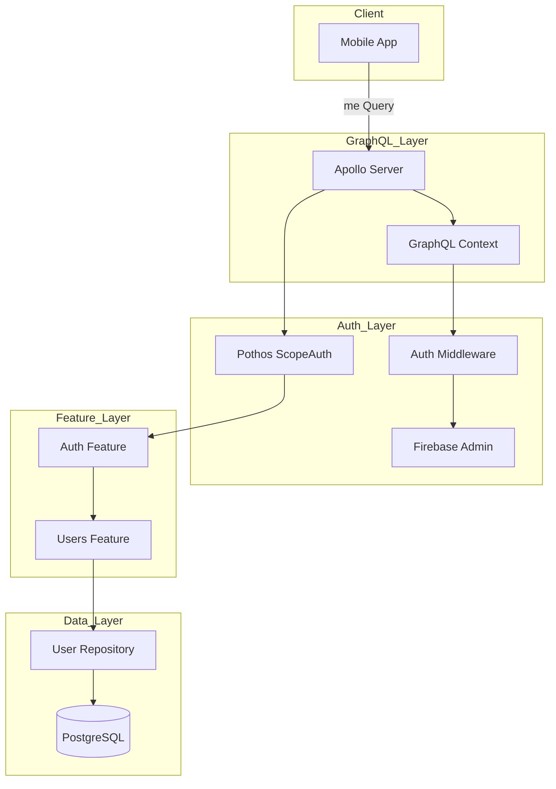
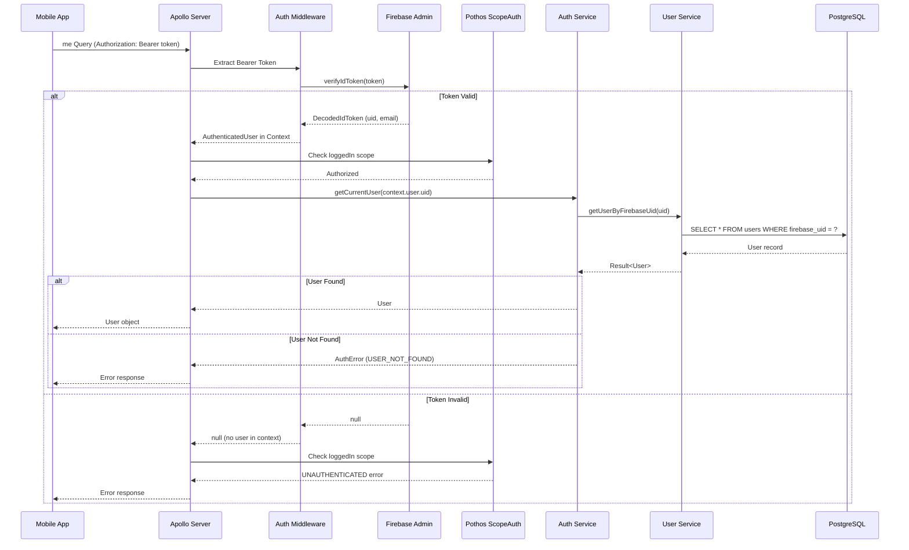

# Technical Design Document

## Overview

**Purpose**: ログイン機能バックエンドは、Firebase Authentication で認証済みユーザーが自身のユーザー情報を取得するための GraphQL Query を提供する。

**Users**: モバイルアプリユーザーが、ログイン後にアプリ内でユーザー情報を表示・利用するために使用する。

**Impact**: 既存の認証基盤（Firebase ID Token 検証、GraphQL Context）を活用し、新規の `me` Query を追加する。既存の `registerUser` mutation とエラーハンドリングパターンを踏襲する。

### Goals

- Firebase ID Token から認証済みユーザーの情報を取得する `me` Query を提供する
- 既存の認証・認可パターン（Pothos ScopeAuth）を活用した一貫性のある実装
- 明確なエラーコード体系によるクライアント側でのエラーハンドリング容易化

### Non-Goals

- 新規の認証方式（OAuth、SSO 等）の追加
- パスワードリセット、メール認証フローの実装
- セッション管理やトークンリフレッシュのサーバーサイド実装
- ユーザープロファイル更新機能

## Architecture

### Existing Architecture Analysis

現在のシステムは以下の認証基盤を持つ:

- **Firebase Admin SDK**: ID Token の検証（`auth/firebase.ts`）
- **認証ミドルウェア**: Bearer Token 抽出とコンテキスト作成（`auth/middleware.ts`）
- **GraphQL Context**: `user` プロパティに `AuthenticatedUser` を格納（`graphql/context.ts`）
- **Pothos ScopeAuth**: `loggedIn` スコープによる認可制御（`graphql/builder.ts`）
- **UserService**: `getUserByFirebaseUid()` メソッドが既に存在（`features/users/internal/service.ts`）

### Architecture Pattern & Boundary Map



**Architecture Integration**:
- Selected pattern: Feature モジュールパターン（既存パターンの踏襲）
- Domain boundaries: Auth Feature がログイン関連ロジックを担当、Users Feature がユーザーデータアクセスを担当
- Existing patterns preserved: Barrel Export、Result 型、GraphQL Context による認証情報伝播
- New components rationale: 既存コンポーネントの拡張のみ、新規コンポーネントは不要
- Steering compliance: Feature モジュール構成、型安全性、エラーハンドリングパターンを維持

### Technology Stack

| Layer | Choice / Version | Role in Feature | Notes |
|-------|------------------|-----------------|-------|
| Backend | Pothos + ScopeAuth Plugin | `me` Query の定義と認可制御 | 既存設定を活用 |
| Backend | Firebase Admin SDK | ID Token 検証（既存） | 変更なし |
| Data | Drizzle ORM | ユーザーデータ取得（既存） | 変更なし |
| Data | PostgreSQL | ユーザーテーブル（既存） | 変更なし |

## System Flows

### Login Query Flow



**Key Decisions**:
- 認証コンテキストの構築は既存ミドルウェアで実施済みのため、Resolver では ScopeAuth による認可チェックのみ実行
- `me` Query は認証必須（`loggedIn` スコープ）として定義

## Requirements Traceability

| Requirement | Summary | Components | Interfaces | Flows |
|-------------|---------|------------|------------|-------|
| 1.1 | 有効なトークンでユーザー情報取得 | AuthService, UserService | AuthService.getCurrentUser() | Login Query Flow |
| 1.2 | ユーザー未存在時のエラー | AuthService | AuthServiceError (USER_NOT_FOUND) | Login Query Flow |
| 1.3 | 無効トークン時のエラー | Pothos ScopeAuth | GraphQL Error (INVALID_TOKEN) | Login Query Flow |
| 1.4 | ヘッダー未存在時のエラー | Pothos ScopeAuth | GraphQL Error (UNAUTHENTICATED) | Login Query Flow |
| 2.1 | me Query の提供 | Auth Feature GraphQL | me Query | Login Query Flow |
| 2.2 | 認証コンテキストからのユーザー取得 | AuthService | getCurrentUser() | Login Query Flow |
| 2.3 | 認証必須スコープ設定 | Pothos ScopeAuth | loggedIn scope | Login Query Flow |
| 3.1 | エラーコード定義 | Auth Feature GraphQL | AuthErrorCode enum | - |
| 3.2 | エラーオブジェクト構造 | Auth Feature GraphQL | AuthError type | - |
| 3.3 | TOKEN_EXPIRED の再試行可能フラグ | Auth Feature GraphQL | AuthError.retryable | - |
| 4.1 | Firebase UID によるユーザー検索 | UserService | getUserByFirebaseUid() | Login Query Flow |
| 4.2 | ユーザー検索機能 | UserService | getUserByFirebaseUid() | Login Query Flow |
| 4.3 | 重複 UID 時のエラー | AuthService | INTERNAL_ERROR | - |
| 5.1 | Firebase Admin SDK での検証 | Auth Middleware | verifyIdToken() | Login Query Flow |
| 5.2 | 認証操作のログ記録 | AuthService | Logger integration | Login Query Flow |
| 5.3 | issuer/audience 検証 | Firebase Admin SDK | verifyIdToken() | Login Query Flow |
| 5.4 | 詳細エラー情報の非公開 | Auth Feature GraphQL | AuthError | - |

## Components and Interfaces

| Component | Domain/Layer | Intent | Req Coverage | Key Dependencies (P0/P1) | Contracts |
|-----------|--------------|--------|--------------|--------------------------|-----------|
| Auth Feature GraphQL | GraphQL | me Query と認証エラー型の定義 | 1.1-1.4, 2.1-2.3, 3.1-3.3, 5.4 | Pothos Builder (P0), AuthService (P0), UserRef (P1) | Service |
| AuthService | Domain | ログインユーザー取得ロジック | 1.1, 1.2, 4.3, 5.2 | UserService (P0), Logger (P1) | Service |
| UserService | Domain | Firebase UID によるユーザー検索 | 4.1, 4.2 | UserRepository (P0) | Service |

### GraphQL Layer

#### Auth Feature GraphQL (Extension)

| Field | Detail |
|-------|--------|
| Intent | `me` Query の定義と認証エラー型の拡張 |
| Requirements | 1.1, 1.2, 1.3, 1.4, 2.1, 2.2, 2.3, 3.1, 3.2, 3.3, 5.4 |

**Responsibilities & Constraints**
- `me` Query の定義と `loggedIn` スコープによる認可
- 認証関連エラーコードの拡張（INVALID_TOKEN, TOKEN_EXPIRED, USER_NOT_FOUND, UNAUTHENTICATED）
- 既存の AuthError 型を拡張して新規エラーコードに対応

**Dependencies**
- Inbound: Apollo Server - GraphQL リクエスト処理 (P0)
- Outbound: AuthService - ユーザー取得ロジック (P0)
- Outbound: UserRef - User 型参照 (P1)

**Contracts**: Service [x] / API [ ] / Event [ ] / Batch [ ] / State [ ]

##### Service Interface

```typescript
// エラーコード拡張（既存の AUTH_ERROR_CODES に追加）
export const LOGIN_ERROR_CODES = [
  "INVALID_TOKEN",
  "TOKEN_EXPIRED",
  "USER_NOT_FOUND",
  "UNAUTHENTICATED",
] as const;

export type LoginErrorCode = (typeof LOGIN_ERROR_CODES)[number];

// me Query の登録関数
export function registerAuthQueries(
  builder: Builder,
  authService: AuthService,
): void;
```

- Preconditions: AuthService が初期化済み、UserRef が登録済み
- Postconditions: `me` Query がスキーマに追加される
- Invariants: `me` Query は `loggedIn` スコープで保護される

**Implementation Notes**
- Integration: 既存の `registerAuthTypes` に新規エラーコードを追加、`registerAuthQueries` を新規作成
- Validation: Pothos ScopeAuth による認可チェック
- Risks: エラーコード追加時の既存クライアントとの互換性（新規コードは追加のみのため問題なし）

### Domain Layer

#### AuthService (Extension)

| Field | Detail |
|-------|--------|
| Intent | ログインユーザー取得のビジネスロジック |
| Requirements | 1.1, 1.2, 4.3, 5.2 |

**Responsibilities & Constraints**
- Firebase UID からローカルユーザーの取得
- ユーザー未存在時のエラーハンドリング
- 認証操作のログ記録（トークン自体は記録しない）

**Dependencies**
- Inbound: Auth Feature GraphQL - Query Resolver (P0)
- Outbound: UserService - ユーザー検索 (P0)
- Outbound: LoggerService - ログ記録 (P1)

**Contracts**: Service [x] / API [ ] / Event [ ] / Batch [ ] / State [ ]

##### Service Interface

```typescript
export type LoginServiceError =
  | { code: "USER_NOT_FOUND"; message: string }
  | { code: "INTERNAL_ERROR"; message: string };

export interface AuthService {
  // 既存メソッド
  register(input: RegisterUserInput): Promise<Result<RegisterUserOutput, AuthServiceError>>;

  // 新規メソッド
  getCurrentUser(firebaseUid: string): Promise<Result<User, LoginServiceError>>;
}
```

- Preconditions: `firebaseUid` は Firebase Admin SDK で検証済みの有効な UID
- Postconditions: ユーザーが存在する場合は User オブジェクトを返却、存在しない場合は USER_NOT_FOUND エラー
- Invariants: ログ記録時に firebaseUid は含めるが、トークン自体は含めない

**Implementation Notes**
- Integration: 既存の `createAuthService` を拡張して `getCurrentUser` メソッドを追加
- Validation: firebaseUid の存在チェックは呼び出し元（GraphQL Resolver）で実施済み
- Risks: 複数ユーザーが同一 Firebase UID を持つ異常ケースへの対応（INTERNAL_ERROR で処理）

#### UserService (Existing)

| Field | Detail |
|-------|--------|
| Intent | Firebase UID によるユーザー検索（既存機能） |
| Requirements | 4.1, 4.2 |

**Note**: `getUserByFirebaseUid()` メソッドは既に実装済み。変更不要。

## Data Models

### Domain Model

本機能はデータモデルの変更を伴わない。既存の `users` テーブルをそのまま使用する。

**Entities**:
- User: id, email, firebaseUid, createdAt, updatedAt

**Invariants**:
- firebaseUid は一意制約により重複しない
- firebaseUid にはインデックスが設定済み

### Data Contracts & Integration

**GraphQL Response Schema**:

```graphql
type Query {
  me: MeResult!
}

union MeResult = User | AuthError

type User {
  id: Int!
  email: String!
  createdAt: DateTime!
  updatedAt: DateTime!
}

type AuthError {
  code: AuthErrorCode!
  message: String!
  field: String
  retryable: Boolean!
}

enum AuthErrorCode {
  EMAIL_ALREADY_EXISTS
  INVALID_PASSWORD
  NETWORK_ERROR
  INTERNAL_ERROR
  # 新規追加
  INVALID_TOKEN
  TOKEN_EXPIRED
  USER_NOT_FOUND
  UNAUTHENTICATED
}
```

## Error Handling

### Error Strategy

認証・ログイン関連のエラーは、クライアントが適切にハンドリングできるよう、明確なエラーコードと再試行可能フラグを提供する。

### Error Categories and Responses

| Error Code | Category | HTTP Status | Message | Retryable | Client Action |
|------------|----------|-------------|---------|-----------|---------------|
| UNAUTHENTICATED | Auth | 401 | Authentication required | false | ログイン画面へ遷移 |
| INVALID_TOKEN | Auth | 401 | Invalid token | false | トークン再取得後に再試行 |
| TOKEN_EXPIRED | Auth | 401 | Token expired | true | トークンリフレッシュ後に再試行 |
| USER_NOT_FOUND | Business | 404 | User not found | false | 新規登録画面へ遷移 |
| INTERNAL_ERROR | System | 500 | Internal error | false | サポートへ問い合わせ |

**Error Mapping**:
- Firebase Admin SDK の `verifyIdToken` が null を返す場合 → INVALID_TOKEN または UNAUTHENTICATED
- Firebase Admin SDK が `auth/id-token-expired` を返す場合 → TOKEN_EXPIRED
- `getUserByFirebaseUid` が USER_NOT_FOUND を返す場合 → USER_NOT_FOUND
- 複数ユーザーが同一 UID を持つ場合 → INTERNAL_ERROR（ログに詳細記録）

### Monitoring

- 認証エラー（INVALID_TOKEN, TOKEN_EXPIRED）の発生頻度を監視
- USER_NOT_FOUND エラーの発生をログに記録（新規登録フロー改善の指標）
- INTERNAL_ERROR 発生時は即座にアラート

## Testing Strategy

### Unit Tests
- `AuthService.getCurrentUser()`: 正常系（ユーザー存在）、異常系（ユーザー未存在、複数ユーザー）
- `mapLoginErrorToAuthError()`: 各エラーコードのマッピング検証
- Error code extension: 新規エラーコードが正しく定義されているか

### Integration Tests
- `me` Query: 有効なトークンでユーザー情報取得
- `me` Query: 無効なトークンで UNAUTHENTICATED エラー
- `me` Query: ユーザー未存在で USER_NOT_FOUND エラー
- `me` Query: Authorization ヘッダーなしで UNAUTHENTICATED エラー

### E2E Tests
- ログインフロー全体: Firebase 認証 → me Query → ユーザー情報表示

## Security Considerations

- **ID Token 検証**: すべての検証は Firebase Admin SDK の `verifyIdToken()` を使用し、issuer/audience の検証が自動的に実行される
- **トークン漏洩防止**: ID Token はログに記録しない。firebaseUid のみをログに含める
- **詳細エラー情報の非公開**: クライアントには汎用的なエラーメッセージを返し、詳細な技術情報はサーバーログにのみ記録
- **認可制御**: Pothos ScopeAuth プラグインによる宣言的な認可チェック

## Performance & Scalability

**Target Metrics**:
- `me` Query レイテンシ: p95 < 100ms
- Firebase token 検証: p95 < 50ms（Firebase Admin SDK による）
- DB クエリ: p95 < 10ms（firebaseUid インデックス使用）

**Optimization**:
- `firebaseUid` カラムには既にインデックスが設定済み
- Firebase Admin SDK のキャッシュ機能を活用（公開鍵のキャッシュ）
