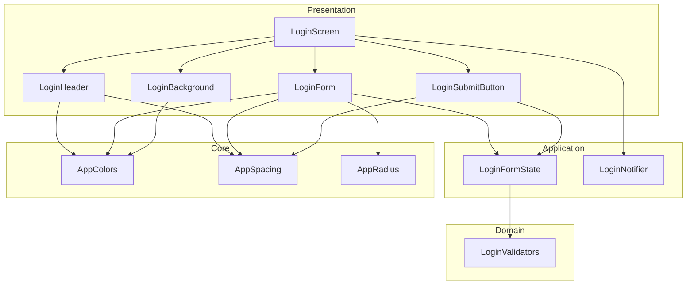
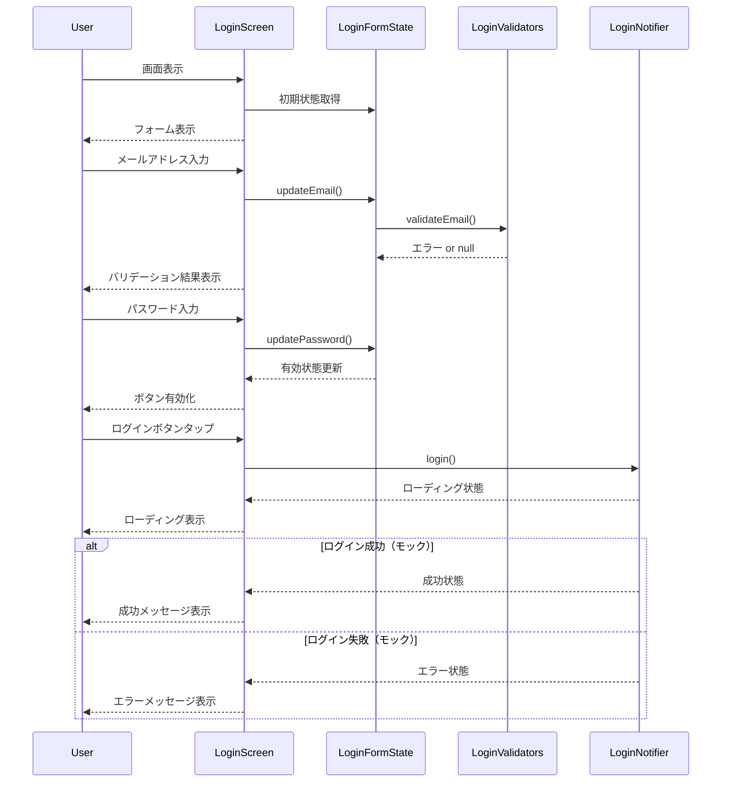

# Design Document: login-screen

## Overview

**Purpose**: ログイン画面機能は、既存ユーザーがメールアドレスとパスワードを使用してアプリにログインするためのUIを提供する。

**Users**: 既にアカウントを持つユーザーが、アプリへのログインフローを利用する。

**Impact**: 既存の新規登録画面（Registration）と一貫したデザインシステムを使用し、認証フローの入口として機能する。API が未実装のため、送信処理はモック実装とする。

### Goals

- 新規登録画面と一貫したUI/UXを提供する
- メールアドレス・パスワードによるログインフォームを実装する
- リアルタイムバリデーションでユーザー入力を検証する
- モックによるログイン処理で将来のAPI統合に備える

### Non-Goals

- 実際のAPI連携（後続タスクで対応）
- パスワードリセット画面の実装（リンクのみ表示）
- ソーシャルログイン（Google、Apple等）
- 生体認証（指紋、Face ID）

## Architecture

### Existing Architecture Analysis

ログイン画面は既存の新規登録画面（Registration）と同様のアーキテクチャパターンを踏襲する。

- **Feature-first + Clean Architecture**: 機能単位でモジュール化
- **Riverpod による状態管理**: `Notifier` + `FormState` パターン
- **freezed によるイミュータブルな状態モデル**
- **既存UIパターン**: `RegistrationBackground`、`RegistrationHeader`、`RegistrationForm` の構造を踏襲

### Architecture Pattern & Boundary Map



**Architecture Integration**:
- Selected pattern: Feature-first + Clean Architecture（既存パターンを踏襲）
- Domain/feature boundaries: `features/login/` 配下に全ファイルを配置
- Existing patterns preserved: Registration 画面と同一の構造・命名規則
- New components rationale: 新規登録画面のコンポーネントを基にログイン専用に調整
- Steering compliance: mobile-tech.md の Riverpod + freezed パターンに準拠

### Technology Stack

| Layer | Choice / Version | Role in Feature | Notes |
|-------|------------------|-----------------|-------|
| Frontend | Flutter 3.x | UIフレームワーク | 既存インストール済み |
| State Management | flutter_riverpod ^2.5.1 | フォーム状態管理 | 既存利用 |
| Code Generation | riverpod_annotation ^2.3.5 | Provider 生成 | 既存利用 |
| Data Modeling | freezed_annotation ^2.4.4 | 状態モデル定義 | 既存利用 |
| Routing | go_router ^14.6.2 | 画面遷移 | 既存ルート `/auth/login` |

## System Flows

### ログインフロー



## Requirements Traceability

| Requirement | Summary | Components | Interfaces | Flows |
|-------------|---------|------------|------------|-------|
| 1.1 | 戻るボタン表示 | LoginHeader | - | - |
| 1.2 | ロックアイコン中央表示 | LoginHeader | - | - |
| 1.3 | タイトル「ログイン」表示 | LoginHeader | - | - |
| 1.4 | サブタイトル「おかえりなさい」表示 | LoginHeader | - | - |
| 1.5 | メールアドレス入力フィールド表示 | LoginForm | - | - |
| 1.6 | パスワード入力フィールド表示 | LoginForm | - | - |
| 1.7 | パスワード表示切り替えアイコン | LoginForm | - | - |
| 1.8 | パスワードを忘れた方リンク | LoginForm | - | - |
| 1.9 | ログインボタン表示 | LoginSubmitButton | - | - |
| 2.1 | メールプレースホルダー | LoginForm | - | - |
| 2.2 | パスワードマスク表示 | LoginForm | - | - |
| 2.3 | パスワード表示切り替え | LoginForm, LoginFormState | togglePasswordVisibility | - |
| 3.1 | メールバリデーションエラー | LoginForm, LoginValidators | validateEmail | ログインフロー |
| 3.2 | 未入力時ボタン無効化 | LoginSubmitButton, LoginFormState | isValid | - |
| 3.3 | 有効入力時ボタン有効化 | LoginSubmitButton, LoginFormState | isValid | - |
| 4.1 | ログイン処理開始 | LoginNotifier | login | ログインフロー |
| 4.2 | ローディング表示 | LoginScreen, LoginNotifier | - | ログインフロー |
| 4.3 | 処理中ボタン無効化 | LoginSubmitButton, LoginNotifier | - | ログインフロー |
| 4.4 | 成功メッセージ表示 | LoginScreen | - | ログインフロー |
| 4.5 | エラーメッセージ表示 | LoginScreen | - | ログインフロー |
| 5.1 | 戻るボタン遷移 | LoginScreen | onBackPressed | - |
| 5.2 | パスワードリセット遷移 | LoginScreen | onForgotPasswordPressed | - |
| 6.1 | ダークグラデーション背景 | LoginBackground | - | - |
| 6.2 | デザインシステム準拠 | All | - | - |
| 6.3 | パスワードリンクティールカラー | LoginForm | - | - |
| 6.4 | 半透明枠線入力フィールド | LoginForm | - | - |

## Components and Interfaces

| Component | Domain/Layer | Intent | Req Coverage | Key Dependencies | Contracts |
|-----------|--------------|--------|--------------|------------------|-----------|
| LoginScreen | Presentation | ログイン画面全体の構成と状態監視 | 4.2, 4.4, 4.5, 5.1, 5.2 | LoginNotifier (P0) | - |
| LoginHeader | Presentation | ヘッダー表示（戻るボタン、アイコン、タイトル） | 1.1, 1.2, 1.3, 1.4 | AppColors (P1), AppSpacing (P1) | - |
| LoginForm | Presentation | 入力フィールドとパスワードリンク表示 | 1.5-1.8, 2.1-2.3, 3.1, 6.3, 6.4 | LoginFormState (P0) | - |
| LoginSubmitButton | Presentation | 送信ボタン表示と有効状態管理 | 1.9, 3.2, 3.3, 4.3 | LoginFormState (P0) | - |
| LoginBackground | Presentation | ダークグラデーション背景表示 | 6.1 | AppColors (P1) | - |
| LoginFormState | Application | フォーム入力状態とバリデーション管理 | 2.3, 3.1-3.3 | LoginValidators (P0) | State |
| LoginNotifier | Application | ログイン処理状態管理 | 4.1-4.5 | LoginFormState (P0) | State |
| LoginValidators | Domain | 入力バリデーションロジック | 3.1 | - | Service |

### Presentation Layer

#### LoginScreen

| Field | Detail |
|-------|--------|
| Intent | ログイン画面全体を構成し、状態変化を監視してUIに反映する |
| Requirements | 4.2, 4.4, 4.5, 5.1, 5.2 |

**Responsibilities & Constraints**
- 子ウィジェットの配置と構成
- `LoginNotifier` の状態変化を監視し、SnackBar でフィードバック表示
- 画面遷移（戻る、パスワードリセット）のハンドリング
- ローディング中のオーバーレイ表示

**Dependencies**
- Inbound: AppRouter - 画面遷移先として呼び出し (P0)
- Outbound: LoginNotifier - ログイン処理実行 (P0)
- Outbound: LoginFormState - フォーム状態取得 (P1)

**Contracts**: State [ ]

**Implementation Notes**
- Integration: `RegistrationScreen` と同一構造（Stack + SafeArea + SingleChildScrollView）
- Validation: 状態変化は `ref.listen` で監視
- Risks: なし

#### LoginHeader

| Field | Detail |
|-------|--------|
| Intent | 戻るボタン、ロックアイコン、タイトル「ログイン」、サブタイトル「おかえりなさい」を表示 |
| Requirements | 1.1, 1.2, 1.3, 1.4 |

**Responsibilities & Constraints**
- 戻るボタンのタップイベント伝播
- ティールカラー円形背景にロックアイコン表示（新規登録画面はメールアイコン）
- AppColors、AppSpacing を使用したスタイリング

**Dependencies**
- Inbound: LoginScreen - 配置 (P0)
- Outbound: AppColors - カラー取得 (P1)
- Outbound: AppSpacing - 間隔取得 (P1)

**Implementation Notes**
- Integration: `RegistrationHeader` を基にアイコンとテキストを変更
- Validation: なし
- Risks: なし

#### LoginForm

| Field | Detail |
|-------|--------|
| Intent | メールアドレス・パスワード入力フィールドとパスワードリセットリンクを表示 |
| Requirements | 1.5, 1.6, 1.7, 1.8, 2.1, 2.2, 2.3, 3.1, 6.3, 6.4 |

**Responsibilities & Constraints**
- メールアドレス入力フィールド（メールアイコン、プレースホルダー）
- パスワード入力フィールド（ロックアイコン、マスク表示、表示切り替え）
- 「パスワードを忘れた方」リンク（ティールカラー、右寄せ）
- 半透明枠線スタイルの入力フィールド

**Dependencies**
- Inbound: LoginScreen - 配置 (P0)
- Outbound: LoginFormState - 状態管理 (P0)
- Outbound: AppColors, AppSpacing, AppRadius - スタイリング (P1)

**Implementation Notes**
- Integration: `RegistrationForm` を基にパスワード確認フィールドを削除し、パスワードリセットリンクを追加
- Validation: `LoginFormState.emailError` をリアルタイム表示
- Risks: なし

#### LoginSubmitButton

| Field | Detail |
|-------|--------|
| Intent | ログインボタンを表示し、有効状態を管理する |
| Requirements | 1.9, 3.2, 3.3, 4.3 |

**Responsibilities & Constraints**
- 白背景・角丸のボタンスタイル
- フォーム有効状態に基づくボタン有効/無効制御
- ローディング中の無効化

**Dependencies**
- Inbound: LoginScreen - 配置 (P0)
- Outbound: LoginFormState - 有効状態取得 (P0)

**Implementation Notes**
- Integration: `RegistrationSubmitButton` を基にボタンテキストを「ログイン」に変更
- Validation: `isValid` プロパティで制御
- Risks: なし

#### LoginBackground

| Field | Detail |
|-------|--------|
| Intent | ダークグラデーション背景（黒からティール）を表示 |
| Requirements | 6.1 |

**Responsibilities & Constraints**
- `RadialGradient` による背景グラデーション
- `AppColors.brandPrimary` と `AppColors.brandBackground` を使用

**Dependencies**
- Inbound: LoginScreen - 配置 (P0)
- Outbound: AppColors - カラー取得 (P1)

**Implementation Notes**
- Integration: `RegistrationBackground` と同一実装を再利用可能
- Validation: なし
- Risks: なし

### Application Layer

#### LoginFormState

| Field | Detail |
|-------|--------|
| Intent | フォーム入力値とバリデーション結果を管理する |
| Requirements | 2.3, 3.1, 3.2, 3.3 |

**Responsibilities & Constraints**
- email、password、isPasswordObscured の状態保持
- リアルタイムバリデーション結果の算出
- フォーム全体の有効性判定

**Dependencies**
- Inbound: LoginForm, LoginSubmitButton - 状態参照 (P0)
- Outbound: LoginValidators - バリデーション実行 (P0)

**Contracts**: State [x]

##### State Management

```dart
@freezed
class LoginFormData with _$LoginFormData {
  const factory LoginFormData({
    @Default('') String email,
    @Default('') String password,
    @Default(true) bool isPasswordObscured,
  }) = _LoginFormData;
}
```

- State model: `LoginFormData`（freezed による不変データクラス）
- Persistence: メモリ内のみ（永続化なし）
- Concurrency strategy: Riverpod による単一ソース

##### Service Interface

```dart
@riverpod
class LoginFormState extends _$LoginFormState {
  @override
  LoginFormData build();

  void updateEmail(String value);
  void updatePassword(String value);
  void togglePasswordVisibility();

  String? get emailError;
  bool get isValid;
}
```

- Preconditions: なし
- Postconditions: 状態更新後、依存 Widget が再ビルドされる
- Invariants: email/password は空文字列で初期化

#### LoginNotifier

| Field | Detail |
|-------|--------|
| Intent | ログイン処理の実行と状態（初期/ローディング/成功/エラー）を管理する |
| Requirements | 4.1, 4.2, 4.3, 4.4, 4.5 |

**Responsibilities & Constraints**
- ログイン処理の実行（現時点ではモック）
- 処理状態の管理（sealed class によるパターンマッチング）
- エラー時のメッセージ生成

**Dependencies**
- Inbound: LoginScreen - 状態監視と処理実行 (P0)
- Outbound: LoginFormState - フォーム値取得 (P0)

**Contracts**: State [x]

##### State Management

```dart
@freezed
sealed class LoginState with _$LoginState {
  const factory LoginState.initial() = LoginStateInitial;
  const factory LoginState.loading() = LoginStateLoading;
  const factory LoginState.success({
    required String userId,
    required String email,
  }) = LoginStateSuccess;
  const factory LoginState.error({
    required String message,
    String? field,
  }) = LoginStateError;
}
```

- State model: `LoginState`（sealed class によるパターンマッチング）
- Persistence: メモリ内のみ
- Concurrency strategy: Riverpod による単一ソース

##### Service Interface

```dart
@riverpod
class LoginNotifier extends _$LoginNotifier {
  @override
  LoginState build();

  Future<void> login();
  void reset();
}
```

- Preconditions: `login()` 呼び出し時、フォームが有効であること
- Postconditions: `login()` 完了後、success または error 状態に遷移
- Invariants: 初期状態は `LoginState.initial()`

**Implementation Notes**
- Integration: モック実装として 1 秒のディレイ後に成功を返す
- Validation: フォーム値は `LoginFormState` から取得
- Risks: 将来の API 統合時にインターフェース変更の可能性あり

### Domain Layer

#### LoginValidators

| Field | Detail |
|-------|--------|
| Intent | ログインフォームの入力バリデーションロジックを提供する |
| Requirements | 3.1 |

**Responsibilities & Constraints**
- メールアドレス形式の検証
- 空文字列の場合は null を返す（未入力時はエラー表示しない）

**Dependencies**
- Inbound: LoginFormState - バリデーション実行 (P0)

**Contracts**: Service [x]

##### Service Interface

```dart
abstract final class LoginValidators {
  static String? validateEmail(String email);
}
```

- Preconditions: なし
- Postconditions: 無効な場合はエラーメッセージ文字列、有効な場合は null を返す
- Invariants: 空文字列入力時は常に null を返す

**Implementation Notes**
- Integration: `RegistrationValidators.validateEmail` と同一ロジックを使用（共通化可能）
- Validation: 正規表現 `^[^@]+@[^@]+\.[^@]+$` による検証
- Risks: なし

## Data Models

### Domain Model

ログイン機能は入力フォームの状態管理のみを扱うため、永続化が必要なドメインモデルは存在しない。

**Entities**:
- なし（ログイン成功時のユーザー情報は将来の API 統合で定義）

**Value Objects**:
- `LoginFormData`: メールアドレス、パスワード、パスワード表示状態
- `LoginState`: ログイン処理状態（initial/loading/success/error）

**Business Rules**:
- メールアドレスは `^[^@]+@[^@]+\.[^@]+$` 形式に一致すること
- メールアドレスとパスワードの両方が入力されている場合のみログインボタンが有効

## Error Handling

### Error Strategy

ログイン画面では以下のエラーカテゴリを扱う。

### Error Categories and Responses

**User Errors**:
- 無効なメールアドレス形式 → 入力フィールド下にエラーメッセージ表示
- 未入力フィールド → ボタン無効化（エラーメッセージ非表示）

**System Errors** (モック実装):
- ネットワークエラー → SnackBar でエラーメッセージ表示
- 認証失敗 → SnackBar でエラーメッセージ表示

### Monitoring

- 開発環境: デバッグログ出力
- 本番環境: 将来の Firebase Crashlytics 統合で対応予定

## Testing Strategy

### Unit Tests

- `LoginValidators.validateEmail`: 有効/無効なメールアドレス形式の検証
- `LoginFormState`: 状態更新とバリデーションエラー算出の検証
- `LoginNotifier`: ログイン処理の状態遷移検証

### Widget Tests

- `LoginScreen`: 全UI要素の表示確認
- `LoginForm`: 入力フィールドとパスワード表示切り替えの動作確認
- `LoginSubmitButton`: ボタン有効/無効状態の切り替え確認
- `LoginHeader`: 戻るボタンタップ時のコールバック呼び出し確認

### Integration Tests

- ログインフロー全体: 入力 → バリデーション → 送信 → 結果表示
- 画面遷移: 戻るボタン、パスワードリセットリンクのナビゲーション確認
