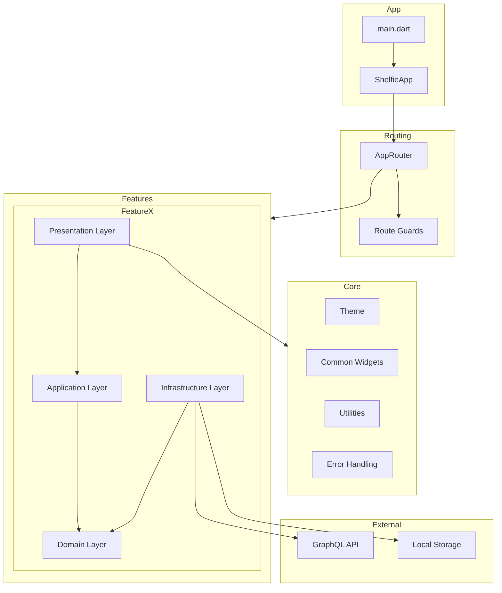
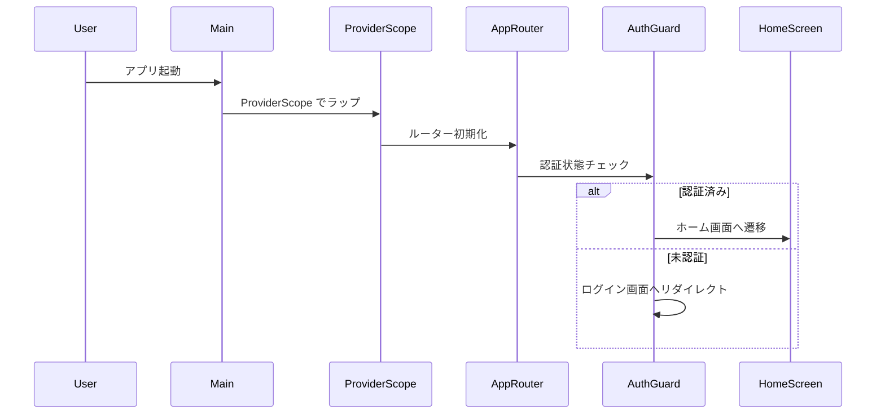
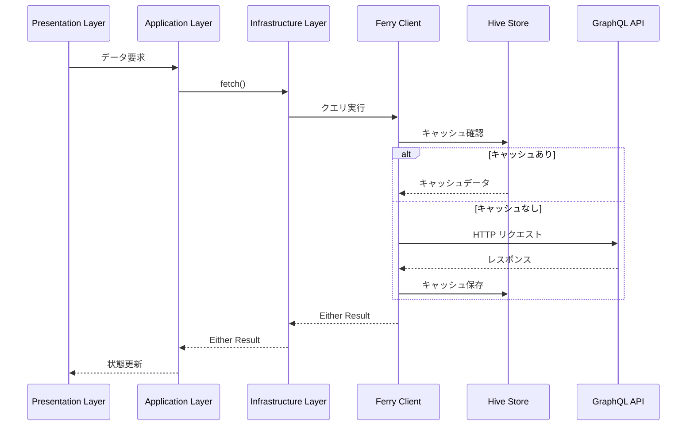
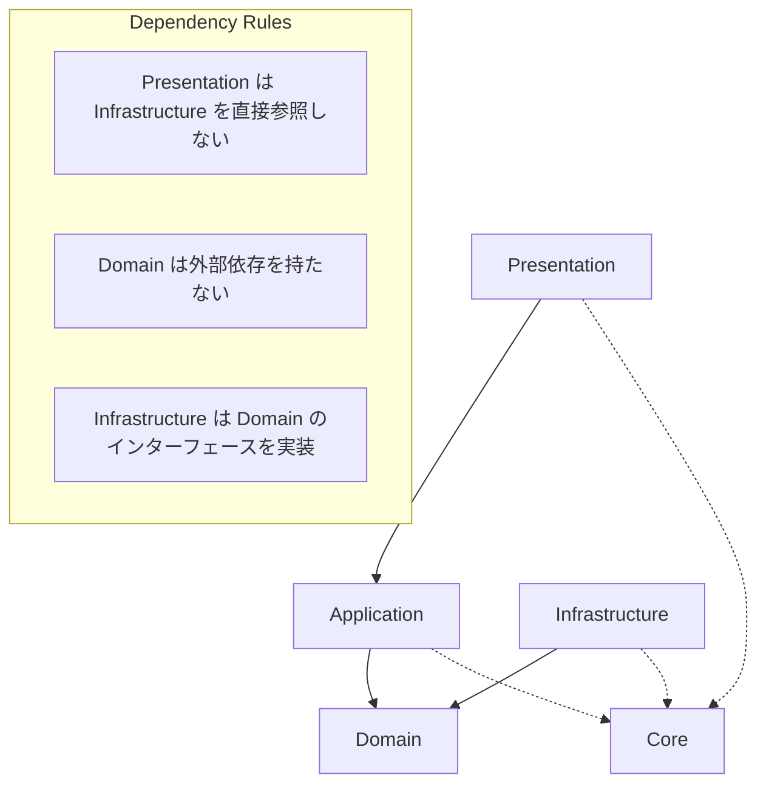

# Design Document

## Overview

**Purpose**: Shelfie モバイルアプリケーション（`apps/mobile`）の開発基盤として、スケーラブルで保守性の高いアーキテクチャを確立する。状態管理、ルーティング、デザインシステム、テスト戦略、API 連携、エラーハンドリングの各領域で一貫したパターンとライブラリ選定を行い、チーム開発の効率化と品質向上を実現する。

**Users**: 開発チームがこのアーキテクチャを使用して機能開発を行う。新規メンバーはドキュメントを参照してオンボーディングを行う。

**Impact**: 現在の Flutter デフォルトテンプレート構成から、Feature-first + Clean Architecture に移行する。

### Goals

- Riverpod + freezed による一貫した状態管理とイミュータブルなデータモデリングの確立
- go_router による宣言的ルーティングとディープリンク対応
- Feature-first ディレクトリ構成による機能単位のモジュール化
- Material 3 ベースのデザインシステムとテーマ管理の一元化
- 3 層テスト戦略（ユニット/ウィジェット/インテグレーション）の導入
- Ferry による型安全な GraphQL API 連携
- fpdart Either による明示的なエラーハンドリング

### Non-Goals

- 具体的な機能実装（本蔵書機能等）
- バックエンド API の設計
- CI/CD パイプラインの構築（テストカバレッジ計測のみ言及）
- iOS/Android 固有のネイティブ設定

## Architecture

### Architecture Pattern & Boundary Map

**Selected Pattern**: Feature-first + Clean Architecture

各機能を独立したモジュールとして配置し、内部を presentation/application/domain/infrastructure の 4 層に分離する。共通コンポーネントは `lib/core/` に配置し、機能横断で再利用する。



**Architecture Integration**:

- **Selected pattern**: Feature-first + Clean Architecture - 機能単位の独立性とレイヤー分離による保守性を両立
- **Domain/feature boundaries**: 各機能ディレクトリが独立したモジュールとして機能し、チーム間の並行開発を可能に
- **Existing patterns preserved**: Material 3 テーマシステム、Flutter の宣言的 UI パターン
- **New components rationale**: Riverpod による依存性注入、Ferry による型安全 API 連携、fpdart によるエラーハンドリング
- **Steering compliance**: モノレポ構成に準拠、Dart/Flutter のコーディング規約に従う

### Technology Stack

| Layer | Choice / Version | Role in Feature | Notes |
|-------|------------------|-----------------|-------|
| State Management | Riverpod ^2.5.0 | 状態管理と依存性注入 | flutter_riverpod + riverpod_annotation |
| Data Modeling | freezed ^3.0.0 | イミュータブルデータクラス生成 | json_serializable と併用 |
| Routing | go_router ^14.0.0 | 宣言的ルーティングとディープリンク | ShellRoute でネストナビゲーション |
| GraphQL Client | ferry ^0.16.0 | 型安全な GraphQL API 通信 | ferry_hive_store でオフラインキャッシュ |
| Error Handling | fpdart ^1.1.0 | Either 型による明示的エラー処理 | Option, Task も活用 |
| Linting | very_good_analysis ^7.0.0 | 厳格な静的解析 | 188 ルール有効 |
| Testing | mocktail ^1.0.0 | モック生成 | flutter_test と併用 |
| Crash Reporting | firebase_crashlytics ^4.0.0 | 本番エラー報告 | 要件 8.5 対応 |

## System Flows

### アプリ起動フロー



### GraphQL データ取得フロー



## Requirements Traceability

| Requirement | Summary | Components | Interfaces | Flows |
|-------------|---------|------------|------------|-------|
| 1.1, 1.2, 1.3, 1.4, 1.5 | 状態管理とデータモデリング | StateProvider, FreezedModels | ProviderScope, StateNotifier | 状態変更フロー |
| 2.1, 2.2, 2.3, 2.4, 2.5 | ルーティングとナビゲーション | AppRouter, RouteGuards | GoRouter, ShellRoute | アプリ起動フロー |
| 3.1, 3.2, 3.3, 3.4, 3.5 | ディレクトリ構成 | DirectoryStructure | N/A | N/A |
| 4.1, 4.2, 4.3, 4.4, 4.5 | デザインシステムとテーマ | ThemeProvider, AppTheme | ThemeData, AppColors | テーマ切替フロー |
| 5.1, 5.2, 5.3, 5.4, 5.5, 5.6 | テスト戦略 | TestUtils, MockProviders | flutter_test, mocktail | N/A |
| 6.1, 6.2, 6.3, 6.4, 6.5 | パッケージ戦略 | pubspec.yaml, analysis_options | very_good_analysis | N/A |
| 7.1, 7.2, 7.3, 7.4, 7.5 | API 連携 | FerryClient, Repositories | Ferry, HiveStore | GraphQL データ取得フロー |
| 8.1, 8.2, 8.3, 8.4, 8.5 | エラーハンドリング | FailureTypes, ErrorHandler | Either, Crashlytics | エラー処理フロー |
| 9.1, 9.2, 9.3, 9.4, 9.5 | ドキュメンテーション | docs/, steering/ | N/A | N/A |

## Components and Interfaces

### Component Summary

| Component | Domain/Layer | Intent | Req Coverage | Key Dependencies | Contracts |
|-----------|--------------|--------|--------------|------------------|-----------|
| ShelfieApp | App | アプリルートウィジェット | 1.1, 2.1, 4.1 | ProviderScope (P0), AppRouter (P0) | State |
| AppRouter | Routing | ルート定義と遷移管理 | 2.1, 2.2, 2.3, 2.4, 2.5 | go_router (P0), AuthProvider (P1) | Service |
| AppTheme | Core/Theme | テーマ定義とプロバイダ | 4.1, 4.2, 4.3, 4.5 | flutter (P0) | State |
| FerryClient | Core/Network | GraphQL クライアント設定 | 7.1, 7.3 | ferry (P0), hive (P1) | Service |
| BaseRepository | Core/Repository | リポジトリ基底クラス | 7.4, 8.1, 8.2 | FerryClient (P0), fpdart (P0) | Service |
| Failure | Core/Error | エラー型階層 | 8.1, 8.4 | freezed (P0) | State |
| ErrorHandler | Core/Error | グローバルエラーハンドラ | 8.2, 8.5 | Crashlytics (P1), Logger (P1) | Service |

### App Layer

#### ShelfieApp

| Field | Detail |
|-------|--------|
| Intent | アプリのエントリポイントとして ProviderScope、Router、Theme を統合 |
| Requirements | 1.1, 2.1, 4.1 |

**Responsibilities & Constraints**

- ProviderScope でアプリ全体をラップし Riverpod の依存性注入を有効化
- AppRouter をナビゲーションデリゲートとして設定
- AppTheme をテーマプロバイダとして適用
- システムテーマ変更の監視とテーマ切替

**Dependencies**

- Inbound: main.dart - runApp から呼び出し (P0)
- Outbound: AppRouter - ルーティング委譲 (P0)
- Outbound: AppTheme - テーマ取得 (P0)
- External: flutter_riverpod - ProviderScope (P0)

**Contracts**: State [x]

##### State Management

```dart
/// アプリテーマモードの状態
@riverpod
class ThemeModeNotifier extends _$ThemeModeNotifier {
  @override
  ThemeMode build() => ThemeMode.system;

  void setThemeMode(ThemeMode mode) => state = mode;
}
```

- State model: ThemeMode (system/light/dark)
- Persistence: SharedPreferences で永続化
- Concurrency: 単一状態、競合なし

**Implementation Notes**

- Integration: MaterialApp.router を使用し go_router と統合
- Validation: ThemeMode の enum 値のみ許容
- Risks: テーマ切替時のリビルドパフォーマンス - Consumer ウィジェットで最適化

### Routing Layer

#### AppRouter

| Field | Detail |
|-------|--------|
| Intent | 宣言的ルート定義、ディープリンク処理、認証ガードの統合 |
| Requirements | 2.1, 2.2, 2.3, 2.4, 2.5 |

**Responsibilities & Constraints**

- 全画面のルート定義と URL パスのマッピング
- 型安全なルートパラメータの提供
- ネストナビゲーション（ShellRoute）の設定
- 認証状態に基づくリダイレクト

**Dependencies**

- Inbound: ShelfieApp - ルーター提供 (P0)
- Outbound: AuthProvider - 認証状態取得 (P1)
- External: go_router - ルーティングエンジン (P0)

**Contracts**: Service [x]

##### Service Interface

```dart
/// ルーター設定プロバイダ
@riverpod
GoRouter appRouter(AppRouterRef ref) {
  final authState = ref.watch(authStateProvider);

  return GoRouter(
    initialLocation: '/',
    debugLogDiagnostics: kDebugMode,
    refreshListenable: authState,
    redirect: (context, state) => _guardRoute(authState, state),
    routes: _routes,
  );
}

/// ルート定義
List<RouteBase> get _routes => [
  GoRoute(
    path: '/',
    builder: (context, state) => const HomeScreen(),
    routes: [
      GoRoute(
        path: 'books/:bookId',
        builder: (context, state) {
          final bookId = state.pathParameters['bookId']!;
          return BookDetailScreen(bookId: bookId);
        },
      ),
    ],
  ),
  ShellRoute(
    builder: (context, state, child) => MainShell(child: child),
    routes: [
      GoRoute(path: '/home', builder: (_, __) => const HomeTab()),
      GoRoute(path: '/search', builder: (_, __) => const SearchTab()),
      GoRoute(path: '/profile', builder: (_, __) => const ProfileTab()),
    ],
  ),
];

/// 認証ガード
String? _guardRoute(AuthState authState, GoRouterState state) {
  final isAuthenticated = authState.isAuthenticated;
  final isAuthRoute = state.matchedLocation.startsWith('/auth');

  if (!isAuthenticated && !isAuthRoute) {
    return '/auth/login';
  }
  if (isAuthenticated && isAuthRoute) {
    return '/';
  }
  return null;
}
```

- Preconditions: GoRouter インスタンスが正しく初期化されていること
- Postconditions: ナビゲーション先画面が表示されること
- Invariants: ルートパス一意性、パラメータ型安全性

**Implementation Notes**

- Integration: refreshListenable で認証状態変更を監視
- Validation: pathParameters の存在チェック
- Risks: ディープリンク URL の検証不足 - onException でフォールバック画面を表示

### Core/Theme Layer

#### AppTheme

| Field | Detail |
|-------|--------|
| Intent | Material 3 ベースのテーマ定義とカスタム拡張の提供 |
| Requirements | 4.1, 4.2, 4.3, 4.5 |

**Responsibilities & Constraints**

- ライトモード/ダークモードの ThemeData 定義
- カスタムカラースキーム（AppColors）の一元管理
- カスタムタイポグラフィ（AppTypography）の定義
- スペーシング定数（AppSpacing）の提供

**Dependencies**

- Inbound: ShelfieApp - テーマ適用 (P0)
- External: flutter - ThemeData, ColorScheme (P0)

**Contracts**: State [x]

##### State Management

```dart
/// カスタムカラー拡張
@immutable
class AppColors extends ThemeExtension<AppColors> {
  const AppColors({
    required this.success,
    required this.warning,
    required this.info,
  });

  final Color success;
  final Color warning;
  final Color info;

  @override
  AppColors copyWith({Color? success, Color? warning, Color? info}) {
    return AppColors(
      success: success ?? this.success,
      warning: warning ?? this.warning,
      info: info ?? this.info,
    );
  }

  @override
  AppColors lerp(AppColors? other, double t) {
    if (other is! AppColors) return this;
    return AppColors(
      success: Color.lerp(success, other.success, t)!,
      warning: Color.lerp(warning, other.warning, t)!,
      info: Color.lerp(info, other.info, t)!,
    );
  }

  static const light = AppColors(
    success: Color(0xFF4CAF50),
    warning: Color(0xFFFFC107),
    info: Color(0xFF2196F3),
  );

  static const dark = AppColors(
    success: Color(0xFF81C784),
    warning: Color(0xFFFFD54F),
    info: Color(0xFF64B5F6),
  );
}

/// テーマ定義
abstract class AppTheme {
  static ThemeData light() => ThemeData(
    useMaterial3: true,
    colorScheme: ColorScheme.fromSeed(
      seedColor: const Color(0xFF6750A4),
      brightness: Brightness.light,
    ),
    extensions: const [AppColors.light],
  );

  static ThemeData dark() => ThemeData(
    useMaterial3: true,
    colorScheme: ColorScheme.fromSeed(
      seedColor: const Color(0xFF6750A4),
      brightness: Brightness.dark,
    ),
    extensions: const [AppColors.dark],
  );
}
```

- State model: ThemeData + ThemeExtension
- Persistence: ThemeMode のみ SharedPreferences で永続化
- Concurrency: イミュータブル、スレッドセーフ

**Implementation Notes**

- Integration: Theme.of(context).extension<AppColors>() でアクセス
- Validation: ThemeExtension の lerp 実装でアニメーション対応
- Risks: 拡張アクセス時の null チェック漏れ - 型安全なヘルパーメソッドを提供

### Core/Network Layer

#### FerryClient

| Field | Detail |
|-------|--------|
| Intent | Ferry GraphQL クライアントの設定とキャッシュ管理 |
| Requirements | 7.1, 7.3 |

**Responsibilities & Constraints**

- Ferry Client インスタンスの作成と提供
- HiveStore によるオフラインキャッシュの設定
- HTTP リンクと認証ヘッダーの設定
- キャッシュポリシーの定義

**Dependencies**

- Inbound: Repositories - GraphQL 操作実行 (P0)
- External: ferry - Client (P0)
- External: ferry_hive_store - HiveStore (P1)
- External: gql_http_link - HttpLink (P0)

**Contracts**: Service [x]

##### Service Interface

```dart
/// Ferry クライアントプロバイダ
@riverpod
Client ferryClient(FerryClientRef ref) {
  final authToken = ref.watch(authTokenProvider);

  final httpLink = HttpLink(
    'https://api.shelfie.example.com/graphql',
    defaultHeaders: {
      if (authToken != null) 'Authorization': 'Bearer $authToken',
    },
  );

  final cache = Cache(store: HiveStore());

  return Client(
    link: httpLink,
    cache: cache,
    defaultFetchPolicies: {
      OperationType.query: FetchPolicy.CacheFirst,
      OperationType.mutation: FetchPolicy.NetworkOnly,
    },
  );
}

/// キャッシュクリア
Future<void> clearCache(Client client) async {
  await client.cache.clear();
}
```

- Preconditions: Hive が初期化されていること
- Postconditions: 有効な Client インスタンスが返却されること
- Invariants: 認証トークン変更時にクライアント再生成

**Implementation Notes**

- Integration: main.dart で Hive.initFlutter() を呼び出し
- Validation: HTTP エラーは FerryClient 外でハンドリング
- Risks: キャッシュサイズ肥大化 - TTL ポリシーの検討

### Core/Repository Layer

#### BaseRepository

| Field | Detail |
|-------|--------|
| Intent | リポジトリ共通ロジックと Either ベースのエラーハンドリング |
| Requirements | 7.4, 8.1, 8.2 |

**Responsibilities & Constraints**

- GraphQL 操作の実行とエラー変換
- Either<Failure, T> 型でのレスポンス返却
- ネットワークエラーのリトライ処理
- ローディング状態の管理

**Dependencies**

- Inbound: Feature Repositories - 継承 (P0)
- Outbound: FerryClient - GraphQL 操作 (P0)
- External: fpdart - Either (P0)

**Contracts**: Service [x]

##### Service Interface

```dart
/// リポジトリ基底クラス
abstract class BaseRepository {
  BaseRepository(this._client);

  final Client _client;

  /// クエリ実行
  Future<Either<Failure, T>> executeQuery<T, V>(
    OperationRequest<T, V> request, {
    int maxRetries = 3,
  }) async {
    try {
      final response = await _client.request(request).first;

      if (response.hasErrors) {
        return left(ServerFailure(
          message: response.graphqlErrors?.first.message ?? 'Unknown error',
          code: 'GRAPHQL_ERROR',
        ));
      }

      if (response.data == null) {
        return left(const ServerFailure(
          message: 'No data received',
          code: 'NO_DATA',
        ));
      }

      return right(response.data as T);
    } on SocketException {
      return left(const NetworkFailure(message: 'No internet connection'));
    } on TimeoutException {
      return left(const NetworkFailure(message: 'Request timeout'));
    } catch (e) {
      return left(UnexpectedFailure(message: e.toString()));
    }
  }

  /// ミューテーション実行
  Future<Either<Failure, T>> executeMutation<T, V>(
    OperationRequest<T, V> request,
  ) async {
    // 同様のエラーハンドリング
  }
}
```

- Preconditions: FerryClient が正しく初期化されていること
- Postconditions: 成功時は Right(data)、失敗時は Left(Failure) を返却
- Invariants: 例外は全て Failure に変換

**Implementation Notes**

- Integration: 各機能の Repository がこのクラスを継承
- Validation: GraphQL エラーと HTTP エラーの区別
- Risks: リトライ無限ループ - maxRetries で制限

### Core/Error Layer

#### Failure

| Field | Detail |
|-------|--------|
| Intent | アプリ全体のエラー型階層の定義 |
| Requirements | 8.1, 8.4 |

**Responsibilities & Constraints**

- freezed によるイミュータブルなエラー型定義
- エラーカテゴリごとのサブタイプ
- ユーザー向けメッセージの提供

**Dependencies**

- External: freezed - コード生成 (P0)

**Contracts**: State [x]

##### State Management

```dart
@freezed
sealed class Failure with _$Failure {
  const Failure._();

  /// ネットワークエラー
  const factory Failure.network({
    required String message,
  }) = NetworkFailure;

  /// サーバーエラー
  const factory Failure.server({
    required String message,
    required String code,
    int? statusCode,
  }) = ServerFailure;

  /// 認証エラー
  const factory Failure.auth({
    required String message,
  }) = AuthFailure;

  /// バリデーションエラー
  const factory Failure.validation({
    required String message,
    Map<String, String>? fieldErrors,
  }) = ValidationFailure;

  /// 予期しないエラー
  const factory Failure.unexpected({
    required String message,
    StackTrace? stackTrace,
  }) = UnexpectedFailure;

  /// ユーザー向けメッセージ
  String get userMessage => when(
    network: (msg) => 'ネットワーク接続を確認してください',
    server: (msg, code, _) => 'サーバーエラーが発生しました',
    auth: (msg) => '再度ログインしてください',
    validation: (msg, _) => msg,
    unexpected: (msg, _) => '予期しないエラーが発生しました',
  );
}
```

- State model: sealed class による exhaustive パターンマッチング
- Persistence: エラーログのみ永続化
- Concurrency: イミュータブル、スレッドセーフ

#### ErrorHandler

| Field | Detail |
|-------|--------|
| Intent | グローバルなエラー処理と Crashlytics 報告 |
| Requirements | 8.2, 8.5 |

**Responsibilities & Constraints**

- 未処理例外のキャッチ
- Crashlytics へのエラー報告
- 構造化ログの出力
- ユーザーへのエラー通知

**Dependencies**

- Inbound: ShelfieApp - エラーハンドラ登録 (P0)
- External: firebase_crashlytics - エラー報告 (P1)
- External: logger - ログ出力 (P1)

**Contracts**: Service [x]

##### Service Interface

```dart
/// グローバルエラーハンドラ
class ErrorHandler {
  ErrorHandler(this._crashlytics, this._logger);

  final FirebaseCrashlytics _crashlytics;
  final Logger _logger;

  /// 初期化
  void initialize() {
    FlutterError.onError = (details) {
      _logger.e('Flutter error', error: details.exception, stackTrace: details.stack);
      _crashlytics.recordFlutterError(details);
    };

    PlatformDispatcher.instance.onError = (error, stack) {
      _logger.e('Platform error', error: error, stackTrace: stack);
      _crashlytics.recordError(error, stack);
      return true;
    };
  }

  /// Failure のハンドリング
  void handleFailure(Failure failure) {
    failure.when(
      network: (msg) => _logger.w('Network failure: $msg'),
      server: (msg, code, status) => _logger.e('Server failure: $code - $msg'),
      auth: (msg) => _logger.w('Auth failure: $msg'),
      validation: (msg, fields) => _logger.i('Validation failure: $msg'),
      unexpected: (msg, stack) {
        _logger.e('Unexpected failure: $msg', stackTrace: stack);
        _crashlytics.recordError(msg, stack);
      },
    );
  }
}
```

- Preconditions: Firebase が初期化されていること
- Postconditions: エラーがログ出力および報告されること
- Invariants: 本番環境でのみ Crashlytics 送信

**Implementation Notes**

- Integration: main.dart の runZonedGuarded 内で初期化
- Validation: エラータイプによる報告レベルの分岐
- Risks: Crashlytics のレート制限 - サンプリング設定

## Data Models

### Domain Model

#### ディレクトリ構成モデル

```
apps/mobile/
├── lib/
│   ├── app/                          # アプリケーション設定
│   │   ├── app.dart                  # ShelfieApp
│   │   └── providers.dart            # ルートレベル Provider
│   ├── core/                         # 共通コンポーネント
│   │   ├── error/                    # エラーハンドリング
│   │   │   ├── failure.dart
│   │   │   ├── failure.freezed.dart
│   │   │   └── error_handler.dart
│   │   ├── network/                  # ネットワーク設定
│   │   │   ├── ferry_client.dart
│   │   │   └── ferry_client.g.dart
│   │   ├── theme/                    # テーマ設定
│   │   │   ├── app_theme.dart
│   │   │   ├── app_colors.dart
│   │   │   ├── app_typography.dart
│   │   │   └── app_spacing.dart
│   │   ├── widgets/                  # 共通ウィジェット
│   │   │   ├── loading_indicator.dart
│   │   │   ├── error_view.dart
│   │   │   └── empty_state.dart
│   │   └── utils/                    # ユーティリティ
│   │       ├── extensions/
│   │       └── helpers/
│   ├── routing/                      # ルーティング
│   │   ├── app_router.dart
│   │   ├── app_router.g.dart
│   │   └── route_guards.dart
│   ├── features/                     # 機能モジュール
│   │   └── [feature_name]/
│   │       ├── presentation/         # UI層
│   │       │   ├── screens/
│   │       │   ├── widgets/
│   │       │   └── providers/
│   │       ├── application/          # アプリケーション層
│   │       │   ├── use_cases/
│   │       │   └── services/
│   │       ├── domain/               # ドメイン層
│   │       │   ├── models/
│   │       │   ├── entities/
│   │       │   └── repositories/     # インターフェース
│   │       └── infrastructure/       # インフラ層
│   │           ├── repositories/     # 実装
│   │           ├── data_sources/
│   │           └── dtos/
│   └── main.dart
├── test/
│   ├── unit/
│   ├── widget/
│   └── integration/
├── packages/                         # ローカルパッケージ（オプション）
├── pubspec.yaml
└── analysis_options.yaml
```

### Logical Data Model

#### レイヤー責務定義

| Layer | Responsibility | Dependencies | Artifacts |
|-------|----------------|--------------|-----------|
| Presentation | UI 表示、ユーザー入力処理 | Application, Core/Widgets | Screens, Widgets, Providers |
| Application | ユースケース実行、状態調整 | Domain | UseCases, Services |
| Domain | ビジネスルール、エンティティ定義 | なし（純粋 Dart） | Models, Entities, Repository Interfaces |
| Infrastructure | 外部システム連携、データ永続化 | Domain | Repository Implementations, DTOs, DataSources |

#### 依存関係ルール



## Error Handling

### Error Strategy

- **Repository 層**: 全ての外部通信エラーを Either<Failure, T> に変換
- **Application 層**: Failure を解釈しユースケースに応じた処理を実行
- **Presentation 層**: Failure.userMessage を UI に表示

### Error Categories and Responses

**User Errors (4xx)**:

- ValidationFailure → フィールド単位のエラーメッセージ表示
- AuthFailure → ログイン画面へのリダイレクト

**System Errors (5xx)**:

- ServerFailure → 「しばらく経ってから再試行してください」メッセージ
- NetworkFailure → 「インターネット接続を確認してください」メッセージ + リトライボタン

**Business Logic Errors**:

- 固有の Failure サブタイプを定義し、条件説明を表示

### Monitoring

- 本番環境: Firebase Crashlytics で自動収集
- 開発環境: Logger パッケージによるコンソール出力
- ログレベル: error (Crashlytics 送信), warn (ローカルログのみ), info (デバッグ)

## Testing Strategy

### Unit Tests

- **Providers**: Riverpod の ProviderContainer でテスト
- **UseCases**: mocktail でリポジトリをモック
- **Failure 変換**: Repository のエラーハンドリングロジック
- **Theme 計算**: AppColors.lerp, ThemeData 生成

### Widget Tests

- **共通ウィジェット**: LoadingIndicator, ErrorView, EmptyState
- **テーマ適用**: ライト/ダークモードでの表示確認
- **ルーター統合**: go_router でのナビゲーション

### Integration Tests

- **認証フロー**: ログイン → ホーム画面遷移
- **データ取得フロー**: API 呼び出し → キャッシュ → UI 表示
- **エラーリカバリ**: ネットワークエラー → リトライ → 成功

### Performance Tests

- **起動時間**: アプリ起動から初画面表示まで
- **メモリ使用量**: Provider の適切な dispose

## Security Considerations

- **認証トークン**: SecureStorage で暗号化保存
- **API 通信**: HTTPS 必須、Certificate Pinning 検討
- **ディープリンク**: URL パラメータのバリデーション

## Performance & Scalability

- **ビルド時間**: build_runner の watch モードとキャッシング活用
- **アプリサイズ**: tree shaking と deferred loading
- **状態管理**: Provider の autoDispose で不要な状態を解放
