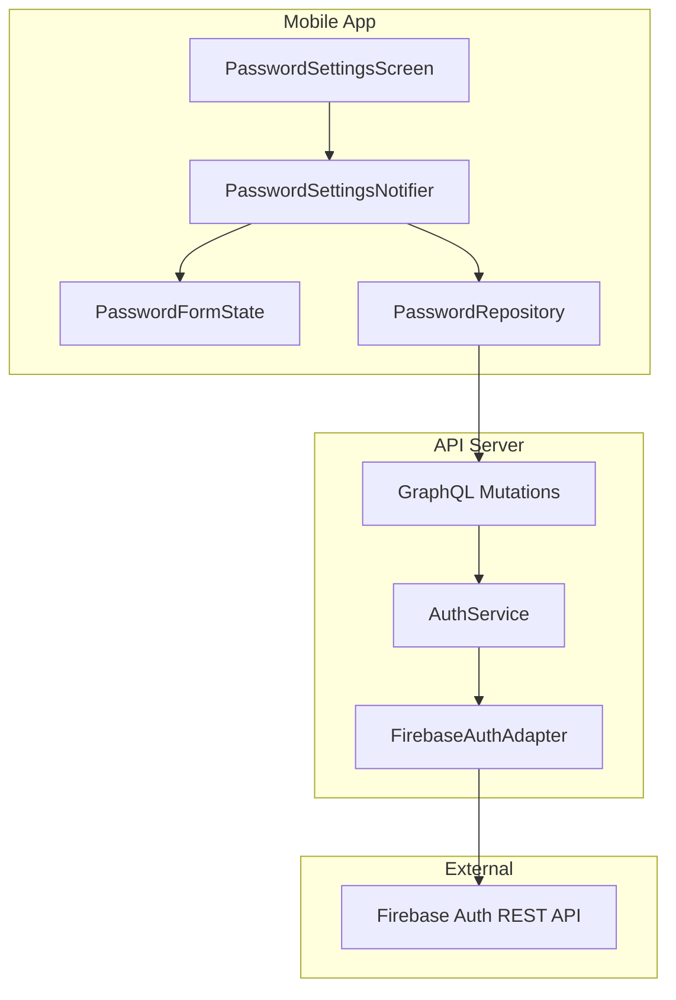
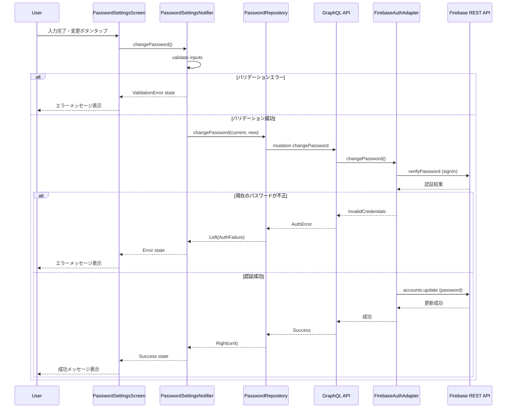
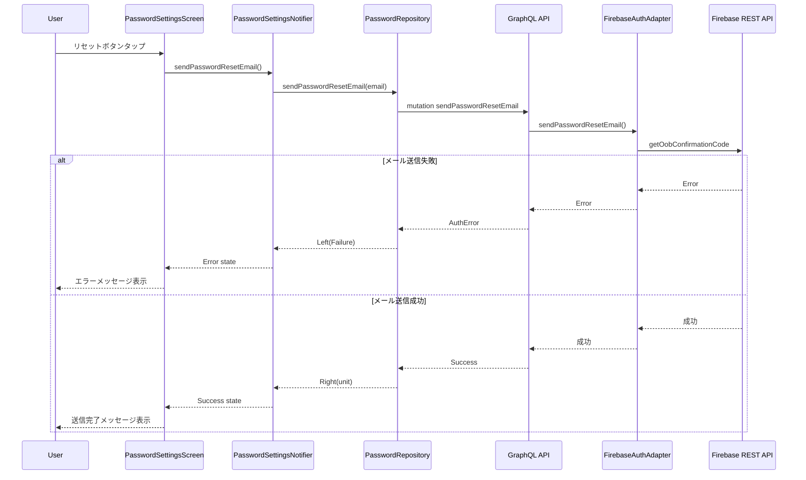

# Technical Design Document

## Overview

**Purpose**: 本機能は、Shelfie モバイルアプリケーションのユーザーに対し、パスワードの変更とリセットを行うための画面と機能を提供する。

**Users**: 認証済みユーザーがアカウント画面からパスワード設定画面にアクセスし、セキュリティ管理を行う。

**Impact**: 既存のアカウント画面のナビゲーションを拡張し、パスワード管理機能を追加する。API サーバーに新しい GraphQL Mutation を追加し、Firebase Auth との連携を実装する。

### Goals

- ユーザーが現在のパスワードを確認した上で新しいパスワードに変更できる
- パスワードを忘れた場合にリセットメールを送信できる
- 入力バリデーションをリアルタイムで提供する
- Firebase Auth エラーをユーザーフレンドリーなメッセージに変換する

### Non-Goals

- パスワード強度インジケーターの実装（将来検討）
- 二要素認証の実装
- ソーシャルログインのパスワード設定
- パスワード履歴の管理

## Architecture

### Existing Architecture Analysis

現在のアーキテクチャを分析した結果:

- **認証フロー**: モバイルアプリは API サーバー経由で Firebase Auth と通信。API は Firebase REST API (identitytoolkit.googleapis.com) を使用
- **状態管理**: Riverpod + freezed による型安全な状態管理パターンが確立
- **ルーティング**: go_router を使用。アカウント関連画面は `/account` パス配下
- **フォーム**: 既存の `PasswordField` ウィジェットが再利用可能
- **エラーハンドリング**: `Failure` sealed class による統一的なエラー型階層

### Architecture Pattern & Boundary Map



**Architecture Integration**:

- **Selected pattern**: Feature-first + Clean Architecture（既存パターン準拠）
- **Domain/feature boundaries**: パスワード設定は account feature の一部として実装。API 側は既存の auth feature を拡張
- **Existing patterns preserved**: Riverpod Provider パターン、freezed による状態定義、fpdart Either によるエラーハンドリング
- **New components rationale**: パスワード変更・リセットは独自のビジネスロジックを持つため、専用の Notifier と Repository を追加
- **Steering compliance**: mobile-tech.md のレイヤー構成、エラーハンドリング戦略に準拠

### Technology Stack

| Layer | Choice / Version | Role in Feature | Notes |
|-------|------------------|-----------------|-------|
| Mobile UI | Flutter 3.x | パスワード設定画面の実装 | 既存の PasswordField ウィジェット再利用 |
| State Management | Riverpod 2.5.x + freezed | フォーム状態・処理状態の管理 | 既存パターン準拠 |
| API Client | Ferry 0.16.x | GraphQL Mutation の呼び出し | 既存クライアント使用 |
| Backend | Node.js + Pothos | GraphQL Mutation 実装 | 既存スキーマ拡張 |
| Auth | Firebase Auth REST API | パスワード変更・リセット処理 | 新規エンドポイント使用 |

## System Flows

### Password Change Flow



### Password Reset Flow



## Requirements Traceability

| Requirement | Summary | Components | Interfaces | Flows |
|-------------|---------|------------|------------|-------|
| 1.1 | アカウント画面からパスワード設定画面への遷移 | PasswordSettingsScreen, AppRouter | - | - |
| 1.2 | パスワード変更・リセットセクション表示 | PasswordSettingsScreen | - | - |
| 1.3 | 未認証時のアクセス拒否 | AppRouter | guardRoute | - |
| 2.1 | パスワード変更フォーム表示 | PasswordChangeForm | - | - |
| 2.2 | パスワード変更実行 | PasswordSettingsNotifier, PasswordRepository | changePassword | Password Change Flow |
| 2.3 | 変更成功メッセージ | PasswordSettingsScreen | - | - |
| 2.4 | 現在のパスワード不正エラー | PasswordSettingsNotifier | PasswordFailure | Password Change Flow |
| 2.5 | パスワード不一致エラー | PasswordFormState | validateConfirmPassword | - |
| 2.6 | パスワード要件未満エラー | PasswordFormState | validateNewPassword | - |
| 2.7 | 処理中ローディング表示 | PasswordSettingsScreen | - | - |
| 2.8 | パスワード表示切り替え | PasswordField | - | - |
| 3.1 | リセットセクション表示 | PasswordResetSection | - | - |
| 3.2 | リセットメール送信 | PasswordSettingsNotifier, PasswordRepository | sendPasswordResetEmail | Password Reset Flow |
| 3.3 | 送信成功メッセージ | PasswordSettingsScreen | - | - |
| 3.4 | 送信失敗エラー | PasswordSettingsNotifier | PasswordFailure | Password Reset Flow |
| 3.5 | 送信中ローディング表示 | PasswordSettingsScreen | - | - |
| 4.1 | 8文字以上バリデーション | PasswordValidators | validateNewPassword | - |
| 4.2 | 英字・数字含有バリデーション | PasswordValidators | validateNewPassword | - |
| 4.3 | リアルタイムバリデーション | PasswordFormState | - | - |
| 4.4 | バリデーションエラー時のボタン無効化 | PasswordSettingsScreen | - | - |
| 5.1 | ネットワークエラーメッセージ | PasswordSettingsNotifier | mapFailure | - |
| 5.2 | Firebase エラー変換 | PasswordRepository, API AuthService | mapFirebaseError | - |
| 5.3 | 予期しないエラーのロギング | PasswordRepository | - | - |

## Components and Interfaces

| Component | Domain/Layer | Intent | Req Coverage | Key Dependencies | Contracts |
|-----------|--------------|--------|--------------|------------------|-----------|
| PasswordSettingsScreen | Presentation | パスワード設定画面の表示 | 1.1, 1.2, 2.1, 2.3, 2.7, 3.1, 3.3, 3.5, 4.4 | PasswordSettingsNotifier (P0) | State |
| PasswordChangeForm | Presentation | パスワード変更フォームウィジェット | 2.1, 2.8 | PasswordFormState (P0) | - |
| PasswordResetSection | Presentation | パスワードリセットセクション | 3.1 | PasswordSettingsNotifier (P0) | - |
| PasswordSettingsNotifier | Application | パスワード変更・リセットのビジネスロジック | 2.2, 2.4, 3.2, 3.4, 5.1, 5.2 | PasswordRepository (P0), PasswordFormState (P0) | Service |
| PasswordFormState | Application | フォーム状態管理・バリデーション | 2.5, 2.6, 4.1, 4.2, 4.3 | - | State |
| PasswordValidators | Domain | パスワードバリデーションルール | 4.1, 4.2 | - | Service |
| PasswordRepository | Data | API 通信 | 2.2, 3.2, 5.2, 5.3 | FerryClient (P0) | Service |
| changePassword Mutation | API/GraphQL | パスワード変更 Mutation | 2.2 | AuthService (P0) | API |
| sendPasswordResetEmail Mutation | API/GraphQL | リセットメール送信 Mutation | 3.2 | AuthService (P0) | API |
| FirebaseAuthAdapter (拡張) | API/Infrastructure | Firebase REST API 呼び出し | 2.2, 3.2 | Firebase REST API (P0, External) | Service |
| AppRouter (拡張) | Mobile/Routing | パスワード設定画面へのルート追加 | 1.1, 1.3 | - | - |

### Mobile / Presentation Layer

#### PasswordSettingsScreen

| Field | Detail |
|-------|--------|
| Intent | パスワード設定画面のメインウィジェット。変更セクションとリセットセクションを表示 |
| Requirements | 1.1, 1.2, 2.1, 2.3, 2.7, 3.1, 3.3, 3.5, 4.4 |

**Responsibilities & Constraints**

- パスワード変更フォームとリセットセクションの表示
- 処理状態に応じたローディング表示
- 成功・エラーメッセージの表示（SnackBar）
- バリデーションエラー時の送信ボタン無効化

**Dependencies**

- Inbound: AppRouter - 画面遷移 (P0)
- Outbound: PasswordSettingsNotifier - 状態取得・アクション実行 (P0)

**Contracts**: State [x]

##### State Management

```dart
// PasswordSettingsNotifier の状態を監視
final state = ref.watch(passwordSettingsNotifierProvider);
final formState = ref.watch(passwordFormStateProvider);

// 状態に応じた UI 表示
state.when(
  initial: () => _buildForm(),
  loading: () => _buildLoadingOverlay(),
  success: (message) => _showSuccessSnackBar(message),
  error: (failure) => _showErrorSnackBar(failure.userMessage),
);
```

**Implementation Notes**

- Integration: 既存の AccountScreen と同様のレイアウトパターンを使用
- Validation: formState.isValid で送信ボタンの有効/無効を制御
- Risks: 画面遷移中の状態リセット漏れ

#### PasswordChangeForm

| Field | Detail |
|-------|--------|
| Intent | パスワード変更用のフォームウィジェット |
| Requirements | 2.1, 2.8 |

**Responsibilities & Constraints**

- 現在のパスワード、新しいパスワード、確認用パスワードの入力欄表示
- 各フィールドの表示/非表示切り替え
- バリデーションエラーの表示

**Dependencies**

- Outbound: PasswordFormState - フォーム状態管理 (P0)
- Outbound: PasswordField - 既存ウィジェット再利用 (P1)

**Implementation Notes**

- Integration: 既存の `PasswordField` ウィジェットを再利用
- Validation: onChanged でリアルタイムバリデーション実行

#### PasswordResetSection

| Field | Detail |
|-------|--------|
| Intent | パスワードリセット（メール送信）セクション |
| Requirements | 3.1 |

**Responsibilities & Constraints**

- リセット機能の説明文表示
- リセットメール送信ボタン表示

**Dependencies**

- Outbound: PasswordSettingsNotifier - リセットアクション実行 (P0)

**Implementation Notes**

- Integration: シンプルな Card ウィジェットで実装

### Mobile / Application Layer

#### PasswordSettingsNotifier

| Field | Detail |
|-------|--------|
| Intent | パスワード変更・リセットのビジネスロジックと状態管理 |
| Requirements | 2.2, 2.4, 3.2, 3.4, 5.1, 5.2 |

**Responsibilities & Constraints**

- パスワード変更・リセット処理の実行
- API レスポンスに基づく状態更新
- エラーの Failure 型へのマッピング

**Dependencies**

- Outbound: PasswordRepository - API 通信 (P0)
- Outbound: PasswordFormState - バリデーション状態取得 (P0)
- Outbound: AuthState - 現在のユーザー情報取得 (P1)

**Contracts**: Service [x]

##### Service Interface

```dart
@freezed
sealed class PasswordSettingsState with _$PasswordSettingsState {
  const factory PasswordSettingsState.initial() = PasswordSettingsInitial;
  const factory PasswordSettingsState.loading() = PasswordSettingsLoading;
  const factory PasswordSettingsState.success({required String message}) = PasswordSettingsSuccess;
  const factory PasswordSettingsState.error({required Failure failure}) = PasswordSettingsError;
}

@riverpod
class PasswordSettingsNotifier extends _$PasswordSettingsNotifier {
  @override
  PasswordSettingsState build() => const PasswordSettingsState.initial();

  Future<void> changePassword() async;
  Future<void> sendPasswordResetEmail() async;
  void reset();
}
```

- Preconditions: フォームバリデーションが成功していること
- Postconditions: 処理結果に応じた状態が設定されること
- Invariants: loading 状態中は追加のアクションを受け付けない

**Implementation Notes**

- Integration: 既存の ProfileEditNotifier パターンを踏襲
- Validation: changePassword 実行前に formState.isValid をチェック
- Risks: ネットワークエラー時のリトライ戦略が未定義

#### PasswordFormState

| Field | Detail |
|-------|--------|
| Intent | パスワード変更フォームの状態管理とリアルタイムバリデーション |
| Requirements | 2.5, 2.6, 4.1, 4.2, 4.3 |

**Responsibilities & Constraints**

- フォーム入力値の保持
- 各フィールドのバリデーションエラー管理
- フォーム全体の有効性判定

**Dependencies**

- Outbound: PasswordValidators - バリデーションロジック (P0)

**Contracts**: State [x]

##### State Management

```dart
@freezed
class PasswordFormStateData with _$PasswordFormStateData {
  const factory PasswordFormStateData({
    @Default('') String currentPassword,
    @Default('') String newPassword,
    @Default('') String confirmPassword,
    @Default(true) bool isCurrentPasswordObscured,
    @Default(true) bool isNewPasswordObscured,
    @Default(true) bool isConfirmPasswordObscured,
    String? currentPasswordError,
    String? newPasswordError,
    String? confirmPasswordError,
  }) = _PasswordFormStateData;
}

@riverpod
class PasswordFormState extends _$PasswordFormState {
  @override
  PasswordFormStateData build() => const PasswordFormStateData();

  void setCurrentPassword(String value);
  void setNewPassword(String value);
  void setConfirmPassword(String value);
  void toggleCurrentPasswordVisibility();
  void toggleNewPasswordVisibility();
  void toggleConfirmPasswordVisibility();
  bool get isValid;
  void reset();
}
```

- State model: freezed による immutable 状態
- Persistence: 不要（画面離脱時にリセット）
- Concurrency: Riverpod による排他制御

### Mobile / Domain Layer

#### PasswordValidators

| Field | Detail |
|-------|--------|
| Intent | パスワードバリデーションルールの定義 |
| Requirements | 4.1, 4.2 |

**Responsibilities & Constraints**

- パスワード要件のバリデーション（8文字以上、英字・数字含有）
- エラーメッセージの生成

**Contracts**: Service [x]

##### Service Interface

```dart
abstract final class PasswordValidators {
  static const int minLength = 8;
  static final _hasLetter = RegExp(r'[a-zA-Z]');
  static final _hasNumber = RegExp(r'[0-9]');

  static String? validateNewPassword(String password);
  static String? validateConfirmPassword(String password, String confirmPassword);
  static String? validateCurrentPassword(String password);
}
```

- Preconditions: なし
- Postconditions: バリデーション結果を返す（null = 成功、String = エラーメッセージ）
- Invariants: バリデーションルールは定数として定義

### Mobile / Data Layer

#### PasswordRepository

| Field | Detail |
|-------|--------|
| Intent | パスワード関連 API との通信 |
| Requirements | 2.2, 3.2, 5.2, 5.3 |

**Responsibilities & Constraints**

- GraphQL Mutation の呼び出し
- API レスポンスの Either 型への変換
- エラーロギング

**Dependencies**

- Outbound: FerryClient - GraphQL 通信 (P0)
- External: GraphQL API - changePassword, sendPasswordResetEmail Mutation (P0)

**Contracts**: Service [x]

##### Service Interface

```dart
@riverpod
PasswordRepository passwordRepository(Ref ref);

class PasswordRepository {
  const PasswordRepository({required this.client});
  final Client client;

  Future<Either<Failure, Unit>> changePassword({
    required String currentPassword,
    required String newPassword,
  });

  Future<Either<Failure, Unit>> sendPasswordResetEmail({
    required String email,
  });
}
```

- Preconditions: FerryClient が初期化されていること
- Postconditions: Either で成功/失敗を返す
- Invariants: エラーは常に Failure 型にマッピング

**Implementation Notes**

- Integration: 既存の LoginRepository パターンを踏襲
- Validation: API レベルでのバリデーションエラーも Failure にマッピング
- Risks: GraphQL スキーマ変更時の型不整合

### API / GraphQL Layer

#### changePassword Mutation

| Field | Detail |
|-------|--------|
| Intent | パスワード変更を実行する GraphQL Mutation |
| Requirements | 2.2 |

**Dependencies**

- Outbound: AuthService - パスワード変更ロジック (P0)
- External: Firebase Auth REST API (P0)

**Contracts**: API [x]

##### API Contract

| Method | Endpoint | Request | Response | Errors |
|--------|----------|---------|----------|--------|
| POST | /graphql | ChangePasswordInput | ChangePasswordResult | AuthError |

```graphql
input ChangePasswordInput {
  currentPassword: String!
  newPassword: String!
}

type ChangePasswordSuccess {
  success: Boolean!
}

union ChangePasswordResult = ChangePasswordSuccess | AuthError

type Mutation {
  changePassword(input: ChangePasswordInput!): ChangePasswordResult!
}
```

**Implementation Notes**

- Integration: 既存の AuthError 型を再利用
- Validation: currentPassword で再認証後、newPassword で更新
- Risks: Firebase REST API のレート制限

#### sendPasswordResetEmail Mutation

| Field | Detail |
|-------|--------|
| Intent | パスワードリセットメールを送信する GraphQL Mutation |
| Requirements | 3.2 |

**Dependencies**

- Outbound: AuthService - メール送信ロジック (P0)
- External: Firebase Auth REST API (P0)

**Contracts**: API [x]

##### API Contract

| Method | Endpoint | Request | Response | Errors |
|--------|----------|---------|----------|--------|
| POST | /graphql | SendPasswordResetEmailInput | SendPasswordResetEmailResult | AuthError |

```graphql
input SendPasswordResetEmailInput {
  email: String!
}

type SendPasswordResetEmailSuccess {
  success: Boolean!
}

union SendPasswordResetEmailResult = SendPasswordResetEmailSuccess | AuthError

type Mutation {
  sendPasswordResetEmail(input: SendPasswordResetEmailInput!): SendPasswordResetEmailResult!
}
```

**Implementation Notes**

- Integration: 認証済みユーザーのメールアドレスを使用
- Risks: メール送信の遅延、スパム対策

### API / Infrastructure Layer

#### FirebaseAuthAdapter (拡張)

| Field | Detail |
|-------|--------|
| Intent | Firebase REST API を使用したパスワード変更・リセット機能 |
| Requirements | 2.2, 3.2 |

**Dependencies**

- External: Firebase Auth REST API - accounts:update, getOobConfirmationCode (P0)

**Contracts**: Service [x]

##### Service Interface

```typescript
export interface FirebaseAuthAdapter {
  // 既存メソッド
  createUser(email: string, password: string): Promise<{ uid: string; emailVerified: boolean }>;
  signIn(email: string, password: string): Promise<{ uid: string; idToken: string; refreshToken: string }>;
  refreshToken(refreshToken: string): Promise<{ idToken: string; refreshToken: string }>;

  // 新規メソッド
  changePassword(idToken: string, newPassword: string): Promise<void>;
  sendPasswordResetEmail(email: string): Promise<void>;
}
```

- Preconditions: Firebase Web API Key が設定されていること
- Postconditions: 成功時は void、失敗時は例外をスロー
- Invariants: Firebase REST API のエラーコードを適切にマッピング

**Implementation Notes**

- Integration: 既存の signIn パターンを踏襲
- Validation: Firebase 側でパスワード要件を検証
- Risks: API Key の露出リスク（既存と同等）

## Data Models

### Domain Model

本機能では永続化するデータは追加しない。フォーム状態とAPI通信のみ。

### Data Contracts & Integration

#### GraphQL Input/Output Types

**ChangePasswordInput**

| Field | Type | Required | Description |
|-------|------|----------|-------------|
| currentPassword | String | Yes | 現在のパスワード |
| newPassword | String | Yes | 新しいパスワード |

**SendPasswordResetEmailInput**

| Field | Type | Required | Description |
|-------|------|----------|-------------|
| email | String | Yes | リセットメール送信先 |

**AuthError (既存)**

| Field | Type | Description |
|-------|------|-------------|
| code | AuthErrorCode | エラーコード |
| message | String | エラーメッセージ |
| field | String? | エラーが発生したフィールド |
| retryable | Boolean | リトライ可能か |

#### Firebase REST API Contracts

**accounts:update (パスワード変更)**

- Endpoint: `https://identitytoolkit.googleapis.com/v1/accounts:update?key={API_KEY}`
- Method: POST
- Request Body:
  ```json
  {
    "idToken": "string",
    "password": "string",
    "returnSecureToken": true
  }
  ```
- Response: `{ "idToken": "string", "refreshToken": "string" }`

**getOobConfirmationCode (リセットメール)**

- Endpoint: `https://identitytoolkit.googleapis.com/v1/accounts:sendOobCode?key={API_KEY}`
- Method: POST
- Request Body:
  ```json
  {
    "requestType": "PASSWORD_RESET",
    "email": "string"
  }
  ```
- Response: `{ "email": "string" }`

## Error Handling

### Error Strategy

既存の Failure 型階層を使用し、Firebase Auth エラーを適切にマッピングする。

### Error Categories and Responses

**User Errors (4xx equivalent)**

| Error | Failure Type | User Message | Recovery |
|-------|--------------|--------------|----------|
| 現在のパスワード不正 | AuthFailure | 現在のパスワードが正しくありません | 再入力を促す |
| パスワード要件未満 | ValidationFailure | パスワードは8文字以上で、英字と数字を含む必要があります | 要件を表示 |
| パスワード不一致 | ValidationFailure | パスワードが一致しません | 再入力を促す |

**System Errors (5xx equivalent)**

| Error | Failure Type | User Message | Recovery |
|-------|--------------|--------------|----------|
| ネットワークエラー | NetworkFailure | ネットワーク接続を確認してください | リトライ可能 |
| Firebase エラー | ServerFailure | サーバーエラーが発生しました | リトライ可能 |
| 予期しないエラー | UnexpectedFailure | 予期しないエラーが発生しました | ログ記録 |

### Monitoring

- エラー発生時は debugPrint でログ出力（既存パターン準拠）
- UnexpectedFailure 発生時はスタックトレースを記録

## Testing Strategy

### Unit Tests

- PasswordValidators.validateNewPassword - 8文字未満、英字なし、数字なしの各ケース
- PasswordValidators.validateConfirmPassword - 一致/不一致ケース
- PasswordFormState - 状態遷移、isValid 判定
- PasswordSettingsNotifier - changePassword, sendPasswordResetEmail の成功/失敗ケース
- FirebaseAuthAdapter.changePassword - Firebase REST API 呼び出しのモック

### Integration Tests

- PasswordRepository - GraphQL Mutation の呼び出しと結果マッピング
- AuthService.changePassword - Firebase 連携を含むパスワード変更フロー
- AuthService.sendPasswordResetEmail - メール送信フロー

### Widget Tests

- PasswordSettingsScreen - 初期表示、ローディング表示、成功/エラーメッセージ表示
- PasswordChangeForm - 入力、バリデーションエラー表示、表示切り替え
- PasswordResetSection - ボタンタップ時のアクション実行

## Security Considerations

### Authentication

- パスワード変更時は現在のパスワードで再認証を要求
- API の changePassword Mutation は認証済みユーザーのみアクセス可能

### Data Protection

- パスワードは平文で永続化しない
- API 通信は HTTPS 経由
- Firebase REST API Key は環境変数で管理（既存と同等）

### Input Validation

- クライアント側とサーバー側の両方でバリデーション実施
- Firebase 側でもパスワード強度を検証
