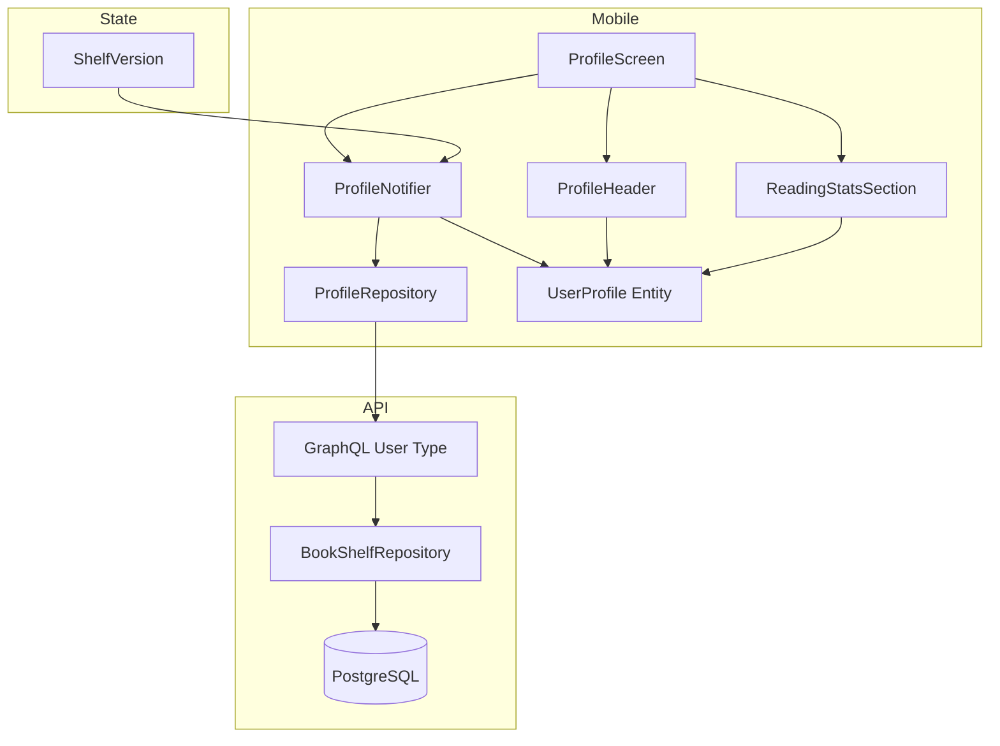
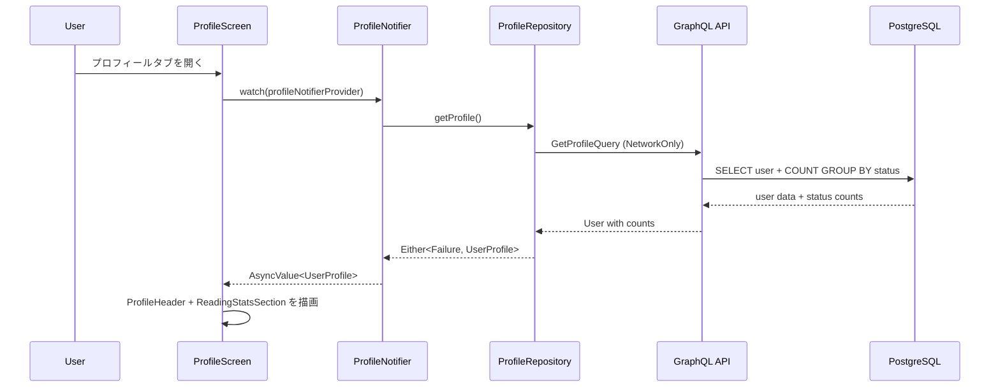
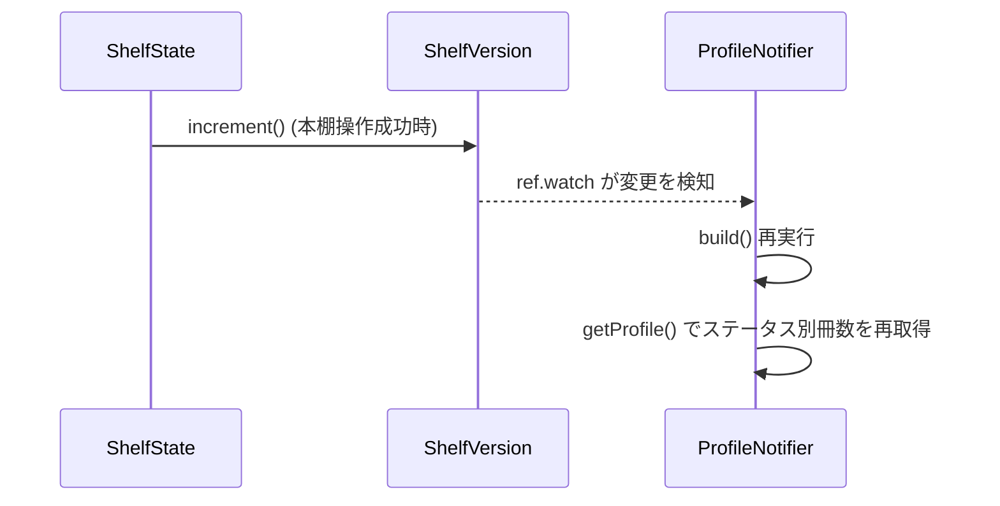

# Technical Design: profile-screen

## Overview

本機能は、Shelfie モバイルアプリのボトムタブ「プロフィール」（/profile）を、現在の「準備中です」プレースホルダーから実際のプロフィール表示画面に置き換える。プロフィールヘッダー（アバター、名前、@username）、設定画面への遷移アイコン、および読書統計（ステータス別冊数）を表示する。

**Users**: 全ての認証済みユーザーが、自身の読書状況を俯瞰するために利用する。

**Impact**: 既存の ProfileScreen（プレースホルダー）を完全に置換する。API 側では GraphQL User 型にステータス別冊数フィールドを追加する。

### Goals
- プロフィールヘッダーと読書統計をプロフィールタブに表示する
- Phase 2（友達プロフィール）を見据え、userId パラメータによる汎用的な設計とする
- 本棚の変更（追加・削除・ステータス変更）時にステータス別冊数を自動更新する

### Non-Goals
- 友達プロフィール表示（Phase 2）
- プロフィール編集機能（既存の /account/edit で提供済み）
- 読書開始情報のプロフィール表示（アカウント画面のみ）
- プロフィールの公開・非公開設定

## Architecture

### Existing Architecture Analysis

現在のシステムは Feature-first + Clean Architecture を採用しており、以下の既存パターンを活用する。

- **account feature**: `UserProfile` エンティティ、`AccountRepository`（GraphQL 経由のプロフィール取得）、`AccountNotifier`（ShelfVersion 連動）を提供
- **books feature（API）**: `BookShelfRepository.countUserBooks()` で全体冊数を取得。User 型の `bookCount` フィールドのリゾルバで使用
- **ShelfVersion パターン**: 本棚操作成功時に increment し、watch している Notifier が自動再取得

### Architecture Pattern & Boundary Map



**Architecture Integration**:
- **Selected pattern**: Feature-first + Clean Architecture（既存パターン踏襲）
- **Domain/feature boundaries**: 新規 `profile` feature を作成し、account feature とは分離。ただし `UserProfile` エンティティは account feature の定義を拡張して共用。
- **Existing patterns preserved**: ShelfVersion 連動、Ferry GraphQL クライアント、Riverpod Notifier パターン、fpdart Either 型エラーハンドリング
- **New components rationale**: ProfileNotifier は userId パラメータを family で受け取り、Phase 2 での他ユーザー対応を可能にする
- **Steering compliance**: Feature-first 構成、Clean Architecture レイヤー分離、ShelfVersion 状態伝播パターン

### Technology Stack

| Layer | Choice / Version | Role in Feature | Notes |
|-------|------------------|-----------------|-------|
| Mobile UI | Flutter 3.x / Material 3 | ProfileScreen, ProfileHeader, ReadingStatsSection | ダークモードのみ |
| Mobile State | Riverpod 2.x + riverpod_annotation | ProfileNotifier (AsyncNotifier) | ShelfVersion watch |
| Mobile Data | Ferry 0.16.x | GraphQL クエリ生成・実行 | FetchPolicy.NetworkOnly |
| Mobile Domain | freezed 2.x / fpdart 1.x | UserProfile 拡張、Either 型エラーハンドリング | 既存エンティティ拡張 |
| Backend GraphQL | Pothos 4.x / Apollo Server 5.x | User 型にステータス別冊数フィールド追加 | 既存リゾルバパターン踏襲 |
| Backend Data | Drizzle ORM 0.45+ / PostgreSQL 16+ | ステータス別冊数カウントクエリ | GROUP BY で一括取得 |

## System Flows

### プロフィールデータ取得フロー



### ShelfVersion 連動フロー



## Requirements Traceability

| Requirement | Summary | Components | Interfaces | Flows |
|-------------|---------|------------|------------|-------|
| 1.1 | アバター画像表示 | ProfileHeader, UserAvatar | UserProfile.avatarUrl | 取得フロー |
| 1.2 | 表示名表示 | ProfileHeader | UserProfile.name | 取得フロー |
| 1.3 | @username 表示 | ProfileHeader | UserProfile.username | 取得フロー |
| 1.4 | デフォルトアバター | ProfileHeader, UserAvatar | UserProfile.avatarUrl (null) | 取得フロー |
| 2.1 | 設定アイコン表示 | ProfileScreen | - | - |
| 2.2 | /account 遷移 | ProfileScreen | GoRouter | - |
| 3.1 | 読了冊数表示 | ReadingStatsSection | UserProfile.completedCount | 取得フロー |
| 3.2 | 読書中冊数表示 | ReadingStatsSection | UserProfile.readingCount | 取得フロー |
| 3.3 | 積読冊数表示 | ReadingStatsSection | UserProfile.backlogCount | 取得フロー |
| 3.4 | 気になる冊数表示 | ReadingStatsSection | UserProfile.interestedCount | 取得フロー |
| 3.5 | 読書開始情報非表示 | ProfileScreen | - | - |
| 4.1 | readingCount フィールド | User GraphQL Type, BookShelfRepository | countUserBooksByStatus | - |
| 4.2 | backlogCount フィールド | User GraphQL Type, BookShelfRepository | countUserBooksByStatus | - |
| 4.3 | completedCount フィールド | User GraphQL Type, BookShelfRepository | countUserBooksByStatus | - |
| 4.4 | interestedCount フィールド | User GraphQL Type, BookShelfRepository | countUserBooksByStatus | - |
| 4.5 | 認証済みユーザーの正確な冊数 | BookShelfRepository | SQL COUNT + GROUP BY | - |
| 5.1 | 初回データ取得 | ProfileNotifier, ProfileRepository | getProfile() | 取得フロー |
| 5.2 | ローディング表示 | ProfileScreen | AsyncValue.loading | 取得フロー |
| 5.3 | エラー表示 | ProfileScreen | AsyncValue.error | 取得フロー |
| 5.4 | ShelfVersion 連動再取得 | ProfileNotifier | ref.watch(shelfVersionProvider) | 連動フロー |
| 6.1 | userId パラメータ | ProfileNotifier (family) | userId: int | 取得フロー |
| 6.2 | 自分の場合に設定アイコン表示 | ProfileScreen | isSelf 判定 | - |
| 6.3 | 独立ウィジェット | ProfileHeader, ReadingStatsSection | UserProfile | - |

## Components and Interfaces

| Component | Domain/Layer | Intent | Req Coverage | Key Dependencies (P0/P1) | Contracts |
|-----------|--------------|--------|--------------|--------------------------|-----------|
| countUserBooksByStatus | API / Data | ステータス別冊数を一括取得 | 4.1-4.5 | PostgreSQL (P0) | Service |
| User GraphQL Type 拡張 | API / GraphQL | ステータス別冊数フィールド追加 | 4.1-4.5 | BookShelfRepository (P0) | API |
| UserProfile 拡張 | Mobile / Domain | ステータス別冊数プロパティ追加 | 3.1-3.4, 4.1-4.4 | なし | - |
| GetProfile GraphQL Query | Mobile / Data | プロフィール+冊数取得クエリ | 5.1, 4.1-4.5 | Ferry (P0) | API |
| ProfileRepository | Mobile / Data | GraphQL 応答を UserProfile に変換 | 5.1 | Ferry Client (P0) | Service |
| ProfileNotifier | Mobile / Application | プロフィールデータの状態管理 | 5.1-5.4, 6.1 | ProfileRepository (P0), ShelfVersion (P0) | State |
| ProfileScreen | Mobile / Presentation | プロフィール画面全体の構成 | 1.1-1.4, 2.1-2.2, 3.1-3.5, 5.2-5.3, 6.2 | ProfileNotifier (P0) | - |
| ProfileHeader | Mobile / Presentation | アバター、名前、username 表示 | 1.1-1.4, 6.3 | UserAvatar (P1) | - |
| ReadingStatsSection | Mobile / Presentation | ステータス別冊数の横並び表示 | 3.1-3.4, 3.5, 6.3 | なし | - |

### API / Data Layer

#### countUserBooksByStatus

| Field | Detail |
|-------|--------|
| Intent | 1つの SQL クエリでユーザーのステータス別冊数を取得する |
| Requirements | 4.1, 4.2, 4.3, 4.4, 4.5 |

**Responsibilities & Constraints**
- `user_books` テーブルに対して `GROUP BY reading_status` で全ステータスの冊数を一括取得
- 存在しないステータスは 0 として返却
- 既存の `BookShelfRepository` インターフェースにメソッドを追加

**Dependencies**
- Inbound: User GraphQL リゾルバ -- ステータス別冊数を提供 (P0)
- External: PostgreSQL / Drizzle ORM -- データアクセス (P0)

**Contracts**: Service [x]

##### Service Interface
```typescript
interface StatusCounts {
  readingCount: number;
  backlogCount: number;
  completedCount: number;
  interestedCount: number;
}

interface BookShelfRepository {
  // 既存メソッド省略
  countUserBooksByStatus(userId: number): Promise<StatusCounts>;
}
```
- Preconditions: userId は有効な整数
- Postconditions: 全ステータスの冊数を非負整数で返却。ユーザーに本がない場合は全て 0。

**Implementation Notes**
- Integration: 既存の `createBookShelfRepository` 関数内にメソッドを追加。`count()` と `groupBy(userBooks.readingStatus)` を使用。
- Risks: Drizzle ORM の `groupBy` + `count` の型推論。テストで検証。

### API / GraphQL Layer

#### User GraphQL Type 拡張

| Field | Detail |
|-------|--------|
| Intent | User 型に readingCount, backlogCount, completedCount, interestedCount フィールドを追加 |
| Requirements | 4.1, 4.2, 4.3, 4.4 |

**Responsibilities & Constraints**
- 既存の `registerUserTypes` 関数内の `UserRef.implement()` にフィールドを追加
- 各フィールドのリゾルバは `countUserBooksByStatus()` の結果から該当値を返却
- パフォーマンス: 4つのフィールドが同時にリクエストされても、1回の DB クエリで済むようにキャッシュまたは共有する

**Dependencies**
- Outbound: BookShelfRepository.countUserBooksByStatus -- データ取得 (P0)

**Contracts**: API [x]

##### API Contract

GraphQL スキーマ追加フィールド:

| Field | Type | Description |
|-------|------|-------------|
| readingCount | Int! | 読書中の冊数 |
| backlogCount | Int! | 積読の冊数 |
| completedCount | Int! | 読了の冊数 |
| interestedCount | Int! | 気になるの冊数 |

**Implementation Notes**
- Integration: 既存の `bookCount` リゾルバと同様のパターンで実装。`bookShelfRepositoryInstance.countUserBooksByStatus(user.id)` を呼び出し、各フィールドのリゾルバで対応する値を返却。
- Risks: 4フィールドが独立してリゾルバを呼ぶと4回 DB クエリが走る。DataLoader パターンまたはリゾルバ内キャッシュで回避する。Pothos の resolve 関数内で一時キャッシュ（Map）を使用し、同一リクエスト内では1回のみ `countUserBooksByStatus` を呼ぶ実装とする。

### Mobile / Domain Layer

#### UserProfile 拡張

| Field | Detail |
|-------|--------|
| Intent | 既存 UserProfile エンティティにステータス別冊数プロパティを追加 |
| Requirements | 3.1, 3.2, 3.3, 3.4 |

**Responsibilities & Constraints**
- 既存の `UserProfile` freezed クラスにフィールドを追加: `readingCount`, `backlogCount`, `completedCount`, `interestedCount`
- `UserProfile.guest()` ファクトリも更新（全て 0）
- 既存の `bookCount` フィールドはそのまま維持

**Implementation Notes**
- Integration: `apps/mobile/lib/features/account/domain/user_profile.dart` を直接修正。freezed コード生成の再実行が必要。
- Validation: 既存の `AccountRepository._mapToUserProfile` も更新し、新しい GraphQL フィールドからマッピングする。

### Mobile / Data Layer

#### GetProfile GraphQL Query

| Field | Detail |
|-------|--------|
| Intent | ステータス別冊数を含むプロフィール取得クエリを定義 |
| Requirements | 5.1, 4.1, 4.2, 4.3, 4.4 |

**Responsibilities & Constraints**
- 既存の `GetMyProfile` クエリを拡張して `readingCount`, `backlogCount`, `completedCount`, `interestedCount` を追加
- 新規クエリファイルは不要（既存の `get_my_profile.graphql` を修正）

**Contracts**: API [x]

##### API Contract

```graphql
query GetMyProfile {
  me {
    ... on User {
      id
      email
      name
      avatarUrl
      createdAt
      bookCount
      readingCount
      backlogCount
      completedCount
      interestedCount
    }
    ... on AuthErrorResult {
      code
      message
    }
  }
}
```

**Implementation Notes**
- Integration: `apps/mobile/lib/features/account/data/get_my_profile.graphql` に4フィールドを追加。Ferry のコード生成を再実行。
- Validation: スキーマ同期（`schema.graphql`）も更新が必要。

#### ProfileRepository

| Field | Detail |
|-------|--------|
| Intent | GraphQL レスポンスを UserProfile に変換し、Either 型でエラーハンドリングする |
| Requirements | 5.1 |

**Responsibilities & Constraints**
- 既存の `AccountRepository` のプロフィール取得パターンを踏襲
- `FetchPolicy.NetworkOnly` を使用（ShelfVersion 連動のため）
- Phase 2: userId パラメータを受け取る別クエリへの拡張を考慮した設計

**Dependencies**
- Outbound: Ferry Client -- GraphQL 通信 (P0)
- Inbound: ProfileNotifier -- プロフィールデータ取得 (P0)

**Contracts**: Service [x]

##### Service Interface
```dart
class ProfileRepository {
  Future<Either<Failure, UserProfile>> getMyProfile();
  // Phase 2: Future<Either<Failure, UserProfile>> getProfile(int userId);
}
```
- Preconditions: 認証済みユーザー
- Postconditions: 成功時は UserProfile（ステータス別冊数含む）、失敗時は Failure

**Implementation Notes**
- Integration: 実質的には既存の `AccountRepository.getMyProfile()` と同じ実装だが、profile feature 内に配置して責務を分離する。あるいは、既存の `AccountRepository` を直接利用しても良い（実装判断）。ステータス別冊数のマッピングは `UserProfile` の拡張に合わせて `_mapToUserProfile` を更新する。
- Risks: AccountRepository と ProfileRepository で GetMyProfile クエリが重複する。Phase 1 では既存の AccountRepository を直接利用し、ProfileNotifier が AccountRepository を参照する方式を推奨。これにより重複を避けつつ、Phase 2 で分離が必要になった時点で ProfileRepository を導入する。

### Mobile / Application Layer

#### ProfileNotifier

| Field | Detail |
|-------|--------|
| Intent | プロフィールデータの非同期取得と状態管理 |
| Requirements | 5.1, 5.2, 5.3, 5.4, 6.1 |

**Responsibilities & Constraints**
- AsyncNotifier として実装（`@riverpod` アノテーション使用）
- `build()` 内で `ref.watch(shelfVersionProvider)` を呼び出し、本棚変更時に自動再取得
- Phase 2 対応: family provider として userId パラメータを受け取る構造にする（Phase 1 では自分の userId 固定）
- ゲストモード時はデフォルトの UserProfile.guest() を返却

**Dependencies**
- Outbound: AccountRepository -- プロフィールデータ取得 (P0)
- Outbound: ShelfVersion -- 本棚変更検知 (P0)
- Outbound: AuthState -- ゲストモード判定 (P1)
- Inbound: ProfileScreen -- UI からの参照 (P0)

**Contracts**: State [x]

##### State Management
- State model: `AsyncValue<UserProfile>`
- Persistence: なし（毎回 API から取得）
- Concurrency: Riverpod の AsyncNotifier が自動管理。build() 再実行時に前回のリクエストはキャンセルされる。

```dart
@riverpod
class ProfileNotifier extends _$ProfileNotifier {
  @override
  Future<UserProfile> build() async {
    ref.watch(shelfVersionProvider);
    return _fetchProfile();
  }

  Future<UserProfile> _fetchProfile() async {
    final repository = ref.read(accountRepositoryProvider);
    final result = await repository.getMyProfile();
    return result.fold(
      (failure) => throw failure,
      (profile) => profile,
    );
  }
}
```

**Implementation Notes**
- Integration: Phase 1 では AccountRepository を直接利用する。AccountNotifier と同様のパターン。
- Risks: AccountNotifier と ProfileNotifier が同じ ShelfVersion を watch するため、本棚変更時に2回の API リクエストが発生する。Phase 1 ではパフォーマンスへの影響は軽微と判断。

### Mobile / Presentation Layer

#### ProfileScreen

| Field | Detail |
|-------|--------|
| Intent | プロフィール画面全体の構成（ヘッダー、統計、設定遷移） |
| Requirements | 1.1-1.4, 2.1, 2.2, 3.1-3.5, 5.2, 5.3, 6.2 |

既存の `apps/mobile/lib/features/account/presentation/profile_screen.dart` を置換する。

**Implementation Notes**
- Integration: `ConsumerWidget` として実装。`profileNotifierProvider` を watch し、`AsyncValue` の `when` で loading / error / data を切り分ける。
- 設定アイコン: 右上に `Icons.settings` を配置。タップで `context.push(AppRoutes.account)` を呼ぶ。Phase 2 で isSelf 判定を追加し、他ユーザーの場合は非表示。
- ゲストモード: `authStateProvider.select((s) => s.isGuest)` で判定。ゲスト時は設定アイコンを非表示にし、プレースホルダーまたはログイン誘導を表示。

#### ProfileHeader (Summary-only)

プロフィールヘッダーウィジェット。アバター（`UserAvatar`）、名前、@username を表示する。`UserProfile` を受け取る純粋なプレゼンテーションウィジェット。既存の `ProfileCard` ウィジェットを参考にするが、読書開始情報や累計冊数は含めない。

#### ReadingStatsSection (Summary-only)

ステータス別冊数を横並びで表示するウィジェット。`UserProfile` を受け取り、readingCount / backlogCount / completedCount / interestedCount を数字 + ラベルの形式で表示する。既存の `_StatItem` パターンを参考にする。

## Data Models

### Domain Model

**UserProfile エンティティ拡張**:

```dart
@freezed
class UserProfile with _$UserProfile {
  const factory UserProfile({
    required int id,
    required String email,
    required String? name,
    required String? avatarUrl,
    required String? username,
    required int bookCount,
    required int readingCount,
    required int backlogCount,
    required int completedCount,
    required int interestedCount,
    required int? readingStartYear,
    required int? readingStartMonth,
    required DateTime createdAt,
  }) = _UserProfile;
}
```

- 既存フィールドは全て維持
- 4つのステータス別冊数フィールドを追加
- `UserProfile.guest()` は全カウントを 0 で初期化

### Physical Data Model

既存テーブルを変更せず、クエリレベルで対応する。

**ステータス別冊数取得クエリ**:

```sql
SELECT reading_status, COUNT(*) as count
FROM user_books
WHERE user_id = $1
GROUP BY reading_status
```

- 新規テーブル・カラムの追加は不要
- 既存の `idx_user_books_user_id` インデックスが利用される

### Data Contracts & Integration

**GraphQL レスポンス（User 型拡張後）**:

```json
{
  "me": {
    "id": 1,
    "email": "user@example.com",
    "name": "Test User",
    "avatarUrl": "https://...",
    "createdAt": "2026-01-01T00:00:00Z",
    "bookCount": 15,
    "readingCount": 3,
    "backlogCount": 5,
    "completedCount": 6,
    "interestedCount": 1
  }
}
```

## Error Handling

### Error Strategy

既存の Failure 型階層（steering 準拠）をそのまま使用する。

| Error | Trigger | User Response |
|-------|---------|---------------|
| NetworkFailure | ネットワーク接続なし / タイムアウト | エラー画面表示 + リトライ誘導 |
| ServerFailure | GraphQL エラー / レスポンスなし | エラー画面表示 |
| AuthFailure | 認証トークン期限切れ | ログイン画面へリダイレクト |

ProfileScreen は `AsyncValue.when` の `error` ケースでエラーウィジェットを表示する。

## Testing Strategy

### Unit Tests (API)
- `BookShelfRepository.countUserBooksByStatus()`: 各ステータスの冊数が正確に返却されること、本がないユーザーで全て 0 が返ること
- User GraphQL リゾルバ: readingCount / backlogCount / completedCount / interestedCount が正しい値を返すこと

### Unit Tests (Mobile)
- `ProfileNotifier`: 初回 build でプロフィールデータを取得すること、ShelfVersion 変更時に再取得されること、API エラー時に AsyncValue.error になること
- `UserProfile` 拡張: ステータス別冊数フィールドが正しく設定されること、`guest()` ファクトリで全て 0 であること

### Widget Tests (Mobile)
- `ProfileScreen`: ローディング時にインジケーター表示、データ取得後にヘッダーと統計が表示されること
- `ProfileHeader`: アバター / 名前 / @username が表示されること、アバター未設定時にデフォルトアイコンが表示されること
- `ReadingStatsSection`: 4つのステータス別冊数が数字 + ラベルで表示されること
- 設定アイコンタップで /account へ遷移すること
