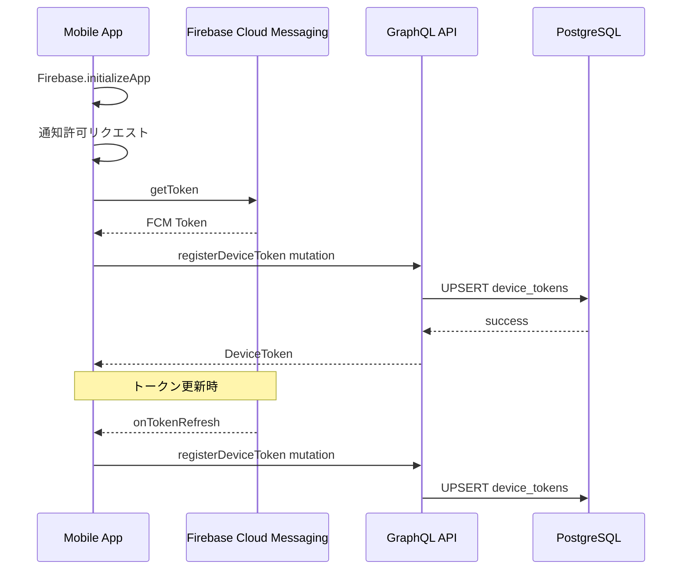
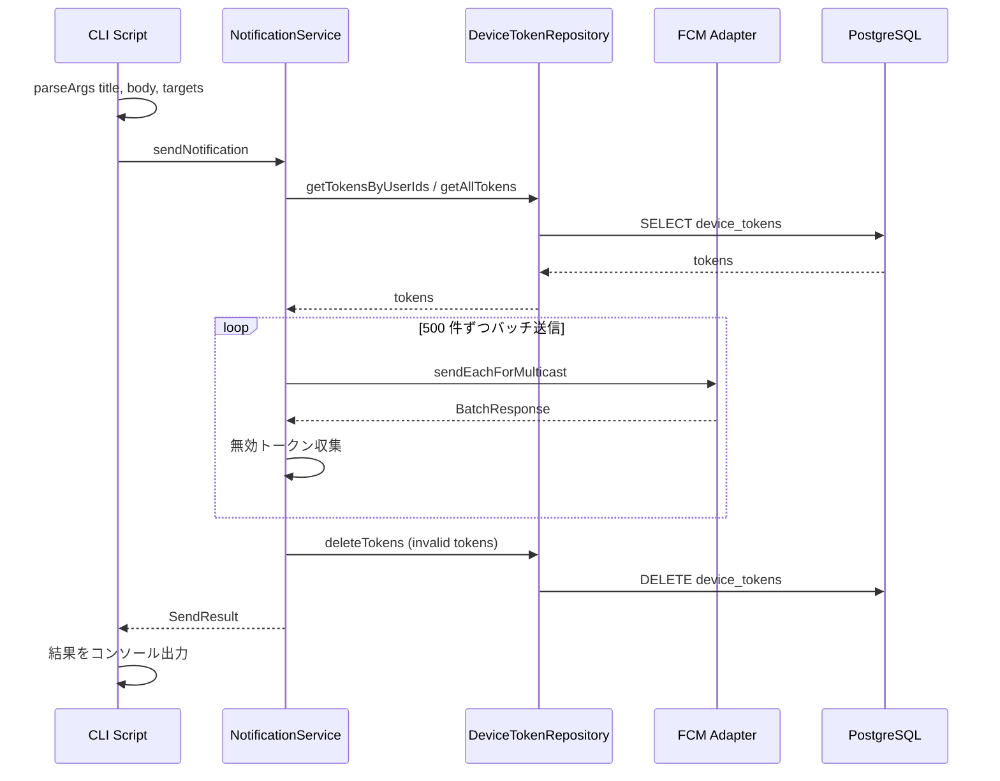
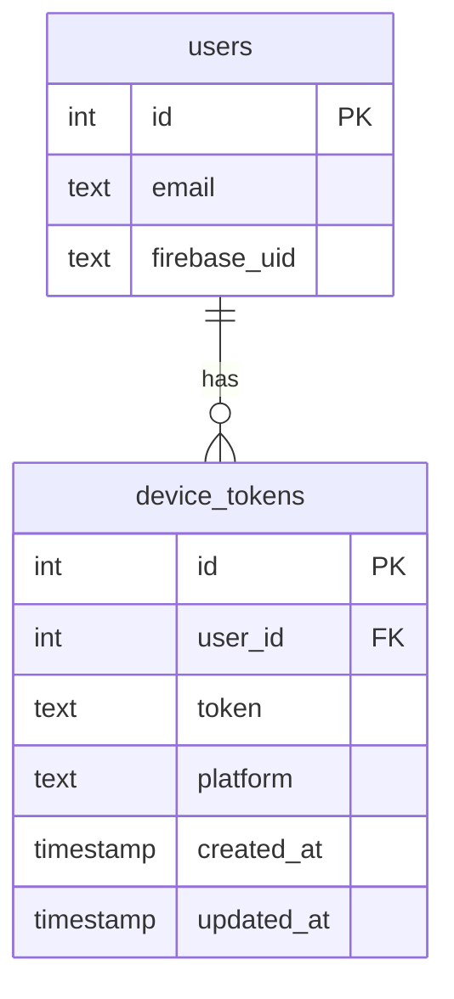

# Design Document: Push Notification

## Overview

本機能は、Shelfie アプリケーションにプッシュ通知の送受信基盤を導入する。運営者が CLI スクリプトを通じて任意のユーザー群にプッシュ通知を送信し、モバイルアプリがフォアグラウンド・バックグラウンドの両状態で通知を受信・表示する。

**Purpose**: タイムリーな情報伝達によりユーザーエンゲージメントを向上させる。
**Users**: 運営者（CLI スクリプト経由で通知送信）、一般ユーザー（モバイルアプリで通知受信）。
**Impact**: 新規テーブル・Feature モジュール・CLI スクリプトの追加、モバイルアプリへの Firebase SDK 統合。

### Goals
- FCM を介したプッシュ通知の送受信基盤を構築する
- デバイストークンのライフサイクル管理（登録・更新・削除）を実装する
- CLI スクリプトによる柔軟な通知送信（全ユーザー / 個別ユーザー指定）を実現する
- モバイルアプリでフォアグラウンド・バックグラウンド両方の通知受信を実装する

### Non-Goals
- Web 管理画面による通知送信
- API レベルの認可（Requirement 7 はスコープ外）
- 通知の開封率トラッキング
- 通知履歴の保存・閲覧機能
- スケジュール送信・定期送信

## Architecture

### Existing Architecture Analysis

現行システムは以下のパターンで構成されている。

- **API**: Express + Apollo Server + Pothos による GraphQL API。Feature モジュールは `repository.ts` + `service.ts` + `graphql.ts` の 3 層構成
- **Mobile**: Flutter + Riverpod + Ferry（GraphQL Client）。Feature-first + Clean Architecture
- **認証**: Firebase Auth（`firebase-admin` がサーバー側に既存）
- **DB**: PostgreSQL + Drizzle ORM

プッシュ通知機能はこれらの既存パターンを踏襲し、新規 Feature モジュールとして追加する。

### Architecture Pattern & Boundary Map

```mermaid
graph TB
    subgraph CLI
        Script[send-notification CLI]
    end

    subgraph API Server
        GQL[GraphQL Mutations]
        NotifSvc[NotificationService]
        DeviceRepo[DeviceTokenRepository]
        FCMAdapter[FCM Adapter]
    end

    subgraph Mobile App
        PushInit[PushNotificationInitializer]
        TokenMgr[DeviceTokenNotifier]
        FGHandler[ForegroundNotificationHandler]
        GQLClient[Ferry GraphQL Client]
    end

    subgraph External
        FCM[Firebase Cloud Messaging]
        DB[(PostgreSQL)]
    end

    Script --> NotifSvc
    GQL --> DeviceRepo
    NotifSvc --> DeviceRepo
    NotifSvc --> FCMAdapter
    FCMAdapter --> FCM
    DeviceRepo --> DB
    FCM --> Mobile App
    TokenMgr --> GQLClient
    GQLClient --> GQL
    PushInit --> TokenMgr
```

**Architecture Integration**:
- **Selected pattern**: 既存の Feature モジュールパターン拡張（repository + service + graphql 3 層）
- **Domain boundaries**: API 側に `device-tokens` Feature を新設。CLI スクリプトは Service 層を直接利用。Mobile 側に `push_notification` Feature を新設。
- **Existing patterns preserved**: Barrel Export、Result 型エラーハンドリング、Riverpod Provider パターン
- **New components rationale**: FCM Adapter（外部サービス隔離）、CLI Script（運営者向けインターフェース）
- **Steering compliance**: Feature-first 構成、型安全性、ライブラリエコシステム活用

### Technology Stack

| Layer | Choice / Version | Role in Feature | Notes |
|-------|------------------|-----------------|-------|
| CLI | vite-node + Node.js parseArgs | 通知送信スクリプト実行 | 既存の vite-node 実行パターンを踏襲 |
| Backend | firebase-admin ^13.6.0 | FCM メッセージ送信 | 既存依存、追加不要 |
| Backend | Drizzle ORM 0.45.1 | device_tokens テーブル操作 | 既存依存 |
| Backend | Pothos + Apollo Server | デバイストークン管理 GraphQL API | 既存依存 |
| Mobile | firebase_core ^3.6.0 | Firebase 初期化 | 新規追加 |
| Mobile | firebase_messaging ^15.1.3 | FCM トークン取得・メッセージ受信 | 新規追加 |
| Mobile | flutter_local_notifications ^18.0.0 | フォアグラウンド通知表示（Android） | 新規追加 |
| Data | PostgreSQL 16+ | device_tokens テーブル | 既存 |

## System Flows

### デバイストークン登録フロー



登録は UPSERT で冪等性を確保する。同一 `user_id` + `token` の組み合わせが既存の場合は `updated_at` を更新する。

### 通知送信フロー



バッチサイズ 500 は FCM API の制限に基づく。無効トークン（`messaging/registration-token-not-registered`）は送信完了後に一括削除する。

## Requirements Traceability

| Requirement | Summary | Components | Interfaces | Flows |
|-------------|---------|------------|------------|-------|
| 1.1 | ログイン時に FCM トークンを登録 | DeviceTokenNotifier, DeviceTokenRepository | registerDeviceToken mutation | デバイストークン登録フロー |
| 1.2 | トークン更新時にサーバー情報を更新 | DeviceTokenNotifier, DeviceTokenRepository | registerDeviceToken mutation | デバイストークン登録フロー |
| 1.3 | ログアウト時にトークン登録を解除 | DeviceTokenNotifier, AuthState | unregisterDeviceToken mutation | - |
| 1.4 | 1 ユーザー複数デバイス対応 | DeviceTokenRepository | device_tokens テーブル設計 | - |
| 2.1 | 全ユーザー対象の送信 | CLI Script, NotificationService | --all フラグ | 通知送信フロー |
| 2.2 | 特定ユーザー ID 指定での送信 | CLI Script, NotificationService | ユーザー ID 引数 | 通知送信フロー |
| 2.3 | 有効トークン保持ユーザーのみ送信 | NotificationService, DeviceTokenRepository | getTokensByUserIds | 通知送信フロー |
| 3.1 | --title, --body で通知内容指定 | CLI Script | CLI 引数パース | - |
| 3.2 | タイトル・本文の必須バリデーション | CLI Script | CLI 引数バリデーション | - |
| 3.3 | 未指定時のエラーメッセージ表示 | CLI Script | エラー出力 | - |
| 4.1 | FCM 経由での通知送信 | NotificationService, FCMAdapter | sendEachForMulticast | 通知送信フロー |
| 4.2 | バッチ処理での効率的配信 | NotificationService | 500 件チャンク分割 | 通知送信フロー |
| 4.3 | FCM 送信失敗時のログ記録 | NotificationService | Pino logger | 通知送信フロー |
| 4.4 | 無効トークンの自動削除 | NotificationService, DeviceTokenRepository | deleteTokens | 通知送信フロー |
| 5.1 | 送信成功数・失敗数の出力 | CLI Script | SendResult 型 | - |
| 5.2 | 失敗ユーザー ID とエラー理由の出力 | CLI Script | FailedNotification 型 | - |
| 6.1 | バックグラウンド通知表示 | PushNotificationInitializer | FCM 自動表示 | - |
| 6.2 | フォアグラウンド通知表示 | ForegroundNotificationHandler | flutter_local_notifications | - |
| 6.3 | 初回起動時の通知許可リクエスト | PushNotificationInitializer | requestPermission | デバイストークン登録フロー |

## Components and Interfaces

| Component | Domain/Layer | Intent | Req Coverage | Key Dependencies | Contracts |
|-----------|-------------|--------|--------------|-----------------|-----------|
| DeviceTokenRepository | API / Data | デバイストークンの CRUD | 1.1, 1.2, 1.3, 1.4, 2.3 | PostgreSQL (P0) | Service |
| DeviceTokenService | API / Domain | トークン管理ビジネスロジック | 1.1, 1.2, 1.3, 1.4 | DeviceTokenRepository (P0) | Service |
| DeviceTokenGraphQL | API / GraphQL | トークン管理 Mutation 定義 | 1.1, 1.2, 1.3 | DeviceTokenService (P0) | API |
| NotificationService | API / Domain | 通知送信ビジネスロジック | 2.1, 2.2, 2.3, 4.1, 4.2, 4.3, 4.4 | DeviceTokenRepository (P0), FCMAdapter (P0) | Service |
| FCMAdapter | API / Infrastructure | FCM API ラッパー | 4.1, 4.2 | firebase-admin (P0, External) | Service |
| CLI Script | CLI | 通知送信コマンドラインツール | 2.1, 2.2, 3.1, 3.2, 3.3, 5.1, 5.2 | NotificationService (P0) | Batch |
| DeviceTokenNotifier | Mobile / Application | FCM トークンの取得と同期 | 1.1, 1.2, 1.3 | firebase_messaging (P0, External), Ferry (P0) | State |
| PushNotificationInitializer | Mobile / Application | 通知許可リクエストと初期設定 | 6.1, 6.3 | firebase_messaging (P0, External) | State |
| ForegroundNotificationHandler | Mobile / Application | フォアグラウンド通知表示 | 6.2 | flutter_local_notifications (P0, External) | State |

### API / Data Layer

#### DeviceTokenRepository

| Field | Detail |
|-------|--------|
| Intent | デバイストークンの永続化操作を提供する |
| Requirements | 1.1, 1.2, 1.3, 1.4, 2.3, 4.4 |

**Responsibilities & Constraints**
- device_tokens テーブルに対する CRUD 操作を提供する
- user_id + token のユニーク制約により重複登録を防止する
- ユーザー ID リストまたは全ユーザーでのトークン検索をサポートする

**Dependencies**
- Outbound: PostgreSQL via Drizzle ORM -- データ永続化 (P0)

**Contracts**: Service [x]

##### Service Interface
```typescript
interface DeviceTokenRepository {
  upsert(data: NewDeviceToken): Promise<DeviceToken>;
  deleteByUserAndToken(userId: number, token: string): Promise<void>;
  deleteByTokens(tokens: string[]): Promise<void>;
  findByUserId(userId: number): Promise<DeviceToken[]>;
  findByUserIds(userIds: number[]): Promise<DeviceToken[]>;
  findAll(): Promise<DeviceToken[]>;
}
```
- Preconditions: DB 接続が確立済みであること
- Postconditions: データの一貫性が保証されること
- Invariants: 同一 user_id + token の組み合わせは一意

### API / Domain Layer

#### DeviceTokenService

| Field | Detail |
|-------|--------|
| Intent | デバイストークン管理のビジネスロジックを提供する |
| Requirements | 1.1, 1.2, 1.3, 1.4 |

**Responsibilities & Constraints**
- トークン登録・更新（UPSERT）のオーケストレーション
- トークン解除時のバリデーション
- 既存の Result 型パターンに従ったエラーハンドリング

**Dependencies**
- Inbound: DeviceTokenGraphQL -- GraphQL Resolver から呼び出し (P0)
- Outbound: DeviceTokenRepository -- データ永続化 (P0)

**Contracts**: Service [x]

##### Service Interface
```typescript
type DeviceTokenServiceErrors =
  | { code: "USER_NOT_FOUND"; message: string }
  | { code: "INVALID_TOKEN"; message: string };

interface RegisterDeviceTokenInput {
  userId: number;
  token: string;
  platform: "ios" | "android";
}

interface UnregisterDeviceTokenInput {
  userId: number;
  token: string;
}

interface DeviceTokenService {
  registerToken(
    input: RegisterDeviceTokenInput
  ): Promise<Result<DeviceToken, DeviceTokenServiceErrors>>;
  unregisterToken(
    input: UnregisterDeviceTokenInput
  ): Promise<Result<void, DeviceTokenServiceErrors>>;
}
```
- Preconditions: userId が有効なユーザーに対応すること
- Postconditions: 登録成功時、DB にトークンが永続化されていること
- Invariants: token は空文字列でないこと

#### NotificationService

| Field | Detail |
|-------|--------|
| Intent | プッシュ通知の送信ロジックを提供する |
| Requirements | 2.1, 2.2, 2.3, 4.1, 4.2, 4.3, 4.4, 5.1, 5.2 |

**Responsibilities & Constraints**
- 対象ユーザーのデバイストークン取得
- 500 件ずつのバッチ分割と逐次送信
- 無効トークンの検出と自動削除
- 送信結果の集計

**Dependencies**
- Inbound: CLI Script -- 通知送信コマンドから呼び出し (P0)
- Outbound: DeviceTokenRepository -- トークン取得・削除 (P0)
- Outbound: FCMAdapter -- FCM メッセージ送信 (P0)
- Outbound: Pino Logger -- エラーログ記録 (P1)

**Contracts**: Service [x]

##### Service Interface
```typescript
interface SendNotificationInput {
  title: string;
  body: string;
  userIds: number[] | "all";
}

interface FailedNotification {
  userId: number;
  token: string;
  error: string;
}

interface SendNotificationResult {
  totalTargets: number;
  successCount: number;
  failureCount: number;
  invalidTokensRemoved: number;
  failures: FailedNotification[];
}

interface NotificationService {
  sendNotification(
    input: SendNotificationInput
  ): Promise<Result<SendNotificationResult, NotificationServiceErrors>>;
}

type NotificationServiceErrors =
  | { code: "NO_TARGETS"; message: string }
  | { code: "FCM_ERROR"; message: string };
```
- Preconditions: title と body が空でないこと
- Postconditions: すべてのバッチが処理され、無効トークンが削除されていること
- Invariants: バッチサイズは 500 を超えないこと

### API / Infrastructure Layer

#### FCMAdapter

| Field | Detail |
|-------|--------|
| Intent | Firebase Cloud Messaging API との通信を隔離する |
| Requirements | 4.1, 4.2 |

**Responsibilities & Constraints**
- `firebase-admin` の `messaging()` API をラップする
- `sendEachForMulticast` の呼び出しと結果のパース
- テスト時にモック可能なインターフェースを提供する

**Dependencies**
- External: firebase-admin messaging API (P0)

**Contracts**: Service [x]

##### Service Interface
```typescript
interface FCMBatchResult {
  successCount: number;
  failureCount: number;
  responses: Array<{
    success: boolean;
    error?: { code: string; message: string };
    token: string;
  }>;
}

interface FCMAdapter {
  sendMulticast(
    tokens: string[],
    notification: { title: string; body: string }
  ): Promise<FCMBatchResult>;
}
```
- Preconditions: Firebase Admin SDK が初期化済みであること
- Postconditions: FCM API の結果がパースされた構造化データとして返却されること

### API / GraphQL Layer

#### DeviceTokenGraphQL

| Field | Detail |
|-------|--------|
| Intent | デバイストークン管理の GraphQL Mutation を定義する |
| Requirements | 1.1, 1.2, 1.3 |

**Responsibilities & Constraints**
- `registerDeviceToken` / `unregisterDeviceToken` Mutation を提供する
- 認証済みユーザーのみアクセス可能（`authScopes: { loggedIn: true }`）
- 既存の Pothos パターンに従った型定義

**Dependencies**
- Inbound: Mobile App (Ferry GraphQL Client) -- Mutation 呼び出し (P0)
- Outbound: DeviceTokenService -- ビジネスロジック (P0)

**Contracts**: API [x]

##### API Contract

| Operation | Type | Input | Response | Auth |
|-----------|------|-------|----------|------|
| registerDeviceToken | Mutation | RegisterDeviceTokenInput(token: String!, platform: String!) | DeviceToken | loggedIn |
| unregisterDeviceToken | Mutation | UnregisterDeviceTokenInput(token: String!) | Boolean | loggedIn |

### CLI

#### CLI Script (send-notification)

| Field | Detail |
|-------|--------|
| Intent | 運営者がコマンドラインからプッシュ通知を送信する |
| Requirements | 2.1, 2.2, 3.1, 3.2, 3.3, 5.1, 5.2 |

**Responsibilities & Constraints**
- CLI 引数のパースとバリデーション
- NotificationService の呼び出しと結果のコンソール出力
- DB 接続と Firebase Admin の初期化・クリーンアップ

**Dependencies**
- Outbound: NotificationService -- 通知送信 (P0)
- Outbound: DB connection -- 初期化 (P0)
- Outbound: Firebase Admin -- FCM 初期化 (P0)

**Contracts**: Batch [x]

##### Batch / Job Contract
- **Trigger**: 手動実行（`pnpm notify` または `vite-node src/scripts/send-notification.ts`）
- **Input / validation**:
  - `--title <string>` (必須): 通知タイトル
  - `--body <string>` (必須): 通知本文
  - `--user-ids <id1,id2,...>` (任意): 対象ユーザー ID（カンマ区切り）
  - `--all` (任意): 全ユーザー対象
  - `--user-ids` と `--all` のいずれかが必須。両方指定時はエラー
- **Output / destination**: stdout にサマリー（成功数・失敗数）、失敗詳細を出力
- **Idempotency & recovery**: 冪等ではない（同一内容の再送信は別通知として送信される）。失敗時は再実行で対応

**Implementation Notes**
- Integration: `apps/api/package.json` に `notify` スクリプトを追加
- Validation: `parseArgs` で引数パース後、title/body の空チェック、user-ids/all の排他チェックを実施
- Risks: DB 接続やFirebase 初期化の失敗時は明確なエラーメッセージで終了する

### Mobile / Application Layer

#### DeviceTokenNotifier

| Field | Detail |
|-------|--------|
| Intent | FCM トークンの取得・更新・削除を管理する Riverpod Notifier |
| Requirements | 1.1, 1.2, 1.3 |

**Responsibilities & Constraints**
- ログイン後に FCM トークンを取得し、GraphQL Mutation で API に登録する
- `onTokenRefresh` ストリームを監視し、トークン更新時に API を再呼び出しする
- ログアウト時に API のトークン登録を解除する
- AuthState の変化を監視して自動的に登録・解除を行う

**Dependencies**
- Outbound: Ferry GraphQL Client -- registerDeviceToken / unregisterDeviceToken Mutation (P0)
- External: firebase_messaging -- FCM トークン取得 (P0)
- Inbound: AuthState -- 認証状態変化の監視 (P0)

**Contracts**: State [x]

##### State Management
- **State model**: `DeviceTokenState`（`idle` / `registering` / `registered` / `error`）
- **Persistence**: FCM トークン自体は firebase_messaging が管理。登録状態はメモリのみ
- **Concurrency strategy**: `ref.listen(authStateProvider)` で認証状態変化を監視。二重登録は UPSERT で防止

**Implementation Notes**
- Integration: `AuthState.login()` 完了後に自動トリガー。`AuthState.logout()` 時に解除。
- Validation: FCM トークンが null の場合は登録をスキップ（通知許可が拒否された場合）
- Risks: ネットワークエラー時の登録失敗は次回アプリ起動時にリトライ

#### PushNotificationInitializer

| Field | Detail |
|-------|--------|
| Intent | Firebase Messaging の初期化と通知許可リクエストを行う |
| Requirements | 6.1, 6.3 |

**Responsibilities & Constraints**
- アプリ起動時に `FirebaseMessaging.instance.requestPermission()` を呼び出す
- iOS の `setForegroundNotificationPresentationOptions` を設定する
- バックグラウンドメッセージハンドラを登録する

**Dependencies**
- External: firebase_messaging -- 通知許可リクエスト・設定 (P0)
- Outbound: ForegroundNotificationHandler -- フォアグラウンド通知設定 (P1)

**Contracts**: State [x]

##### State Management
- **State model**: `NotificationPermissionState`（`notDetermined` / `authorized` / `denied`）
- **Persistence**: OS レベルで管理（アプリ側では保持しない）
- **Concurrency strategy**: 初期化は 1 回のみ実行

**Implementation Notes**
- Integration: `main.dart` の `_initAndRunApp()` 内で `Firebase.initializeApp()` の後に呼び出す
- Risks: iOS で通知許可ダイアログは一度しか表示されない。拒否後は設定アプリへの誘導が必要（初期スコープ外）

#### ForegroundNotificationHandler

| Field | Detail |
|-------|--------|
| Intent | フォアグラウンド時のプッシュ通知をネイティブ通知として表示する |
| Requirements | 6.2 |

**Responsibilities & Constraints**
- `FirebaseMessaging.onMessage` ストリームを監視する
- 受信メッセージを `flutter_local_notifications` で OS ネイティブ通知として表示する
- Android の通知チャネル設定を管理する

**Dependencies**
- External: flutter_local_notifications -- ネイティブ通知表示 (P0)
- Inbound: firebase_messaging onMessage -- フォアグラウンドメッセージ受信 (P0)

**Contracts**: State [x]

##### State Management
- **State model**: ステートレス（受信イベントをそのまま通知表示に変換）
- **Persistence**: なし
- **Concurrency strategy**: ストリームリスナーによるイベント駆動

**Implementation Notes**
- Integration: `PushNotificationInitializer` から初期化される
- Validation: notification が null のメッセージ（data-only）はスキップする
- Risks: Android チャネル設定が正しくない場合、通知が表示されない

## Data Models

### Domain Model

- **DeviceToken**: ユーザーのデバイスに紐づく FCM トークンを表すエンティティ
- **Invariants**:
  - 同一ユーザー・同一トークンの組み合わせは一意
  - platform は `ios` または `android` のいずれか
  - token は空文字列でないこと

### Logical Data Model



- **Cardinality**: 1 ユーザーが 0..N のデバイストークンを持つ
- **Referential integrity**: `user_id` は `users.id` への外部キー。ユーザー削除時はカスケード削除

### Physical Data Model

**device_tokens テーブル定義（Drizzle ORM）**:

```typescript
const deviceTokens = pgTable(
  "device_tokens",
  {
    id: integer("id").primaryKey().generatedAlwaysAsIdentity(),
    userId: integer("user_id")
      .notNull()
      .references(() => users.id, { onDelete: "cascade" }),
    token: text("token").notNull(),
    platform: text("platform").notNull(), // "ios" | "android"
    createdAt: timestamp("created_at").defaultNow().notNull(),
    updatedAt: timestamp("updated_at").defaultNow().notNull(),
  },
  (table) => [
    uniqueIndex("idx_device_tokens_user_token").on(table.userId, table.token),
    index("idx_device_tokens_user_id").on(table.userId),
  ]
);
```

- **Primary key**: `id`（自動生成）
- **Unique constraint**: `(user_id, token)` -- 同一デバイスの重複登録を防止
- **Index**: `user_id` -- ユーザー別トークン検索の高速化
- **Cascade**: `onDelete: "cascade"` -- ユーザー削除時にトークンも自動削除

### Data Contracts & Integration

**GraphQL Input/Output スキーマ**:

```graphql
input RegisterDeviceTokenInput {
  token: String!
  platform: String!
}

input UnregisterDeviceTokenInput {
  token: String!
}

type DeviceToken {
  id: Int!
  userId: Int!
  platform: String!
  createdAt: DateTime!
}
```

## Error Handling

### Error Strategy

既存の `Result<T, E>` パターンに従い、Service 層で型安全なエラーハンドリングを行う。

### Error Categories and Responses

**User Errors**:
- 未認証でのトークン登録 → GraphQL authScope エラー（既存の仕組みで処理）
- CLI の必須引数不足 → エラーメッセージを stderr に出力して exit code 1 で終了

**System Errors**:
- FCM API 送信失敗 → エラー情報を Pino logger で記録、処理は継続
- DB 接続失敗 → 初期化時にエラー出力して終了

**Business Logic Errors**:
- 無効なデバイストークン → FCM レスポンスから検出し、DB から自動削除
- 送信対象ユーザーが 0 人 → `NO_TARGETS` エラーを返却

### Monitoring

- API 側: 既存の Pino logger でエラーログを記録
- FCM 送信結果: 成功/失敗数を構造化ログとして記録
- Mobile 側: 既存の Sentry 統合でエラーを報告

## Testing Strategy

### Unit Tests
- **DeviceTokenRepository**: UPSERT、検索、削除の各操作
- **DeviceTokenService**: 登録・解除のビジネスロジック、バリデーション
- **NotificationService**: バッチ分割ロジック、無効トークン削除、結果集計
- **FCMAdapter**: モック FCM レスポンスのパース
- **CLI 引数パース**: 各種引数パターンのバリデーション

### Integration Tests
- GraphQL Mutation `registerDeviceToken` / `unregisterDeviceToken` の E2E フロー
- 通知送信の全体フロー（FCM はモック）
- デバイストークンのカスケード削除（ユーザー削除時）

### Mobile Unit Tests
- **DeviceTokenNotifier**: 認証状態変化に応じたトークン登録・解除
- **PushNotificationInitializer**: 許可リクエストの呼び出し確認
- **ForegroundNotificationHandler**: メッセージ受信時の通知表示呼び出し

## Security Considerations

- **トークンの機密性**: FCM トークンはデバイス固有の識別子であるため、GraphQL レスポンスでは他ユーザーのトークンを返却しない
- **認証必須**: トークン登録・解除は認証済みユーザーのみ（`authScopes: { loggedIn: true }`）
- **CLI アクセス制御**: スクリプト実行者 = 管理者とみなす（Requirement 7 スコープ外の方針）
- **トークン漏洩リスク**: DB に平文保存だが、トークン単体では通知送信不可（サーバーキーが必要）のため許容範囲
