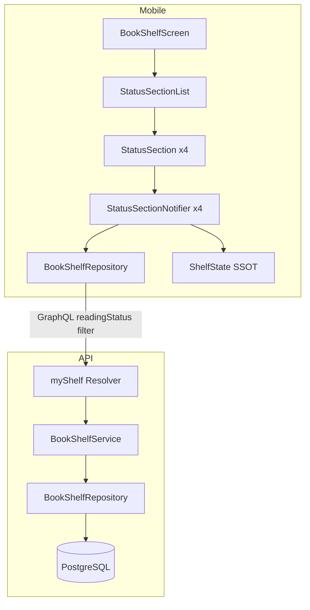
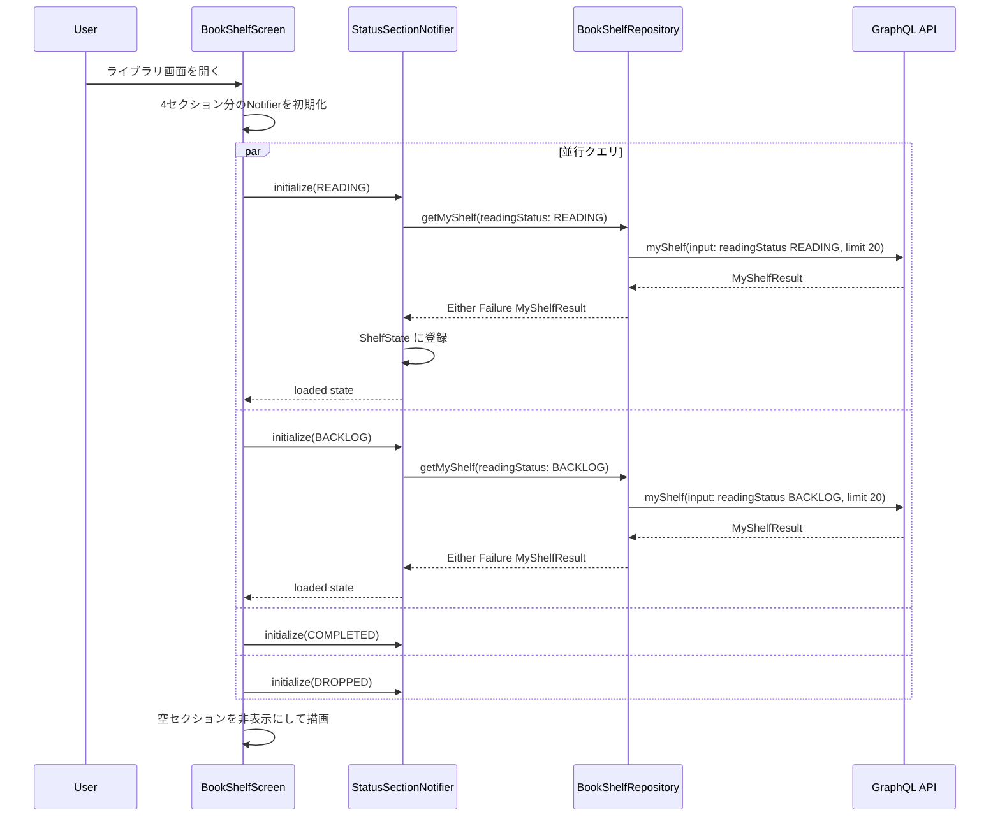
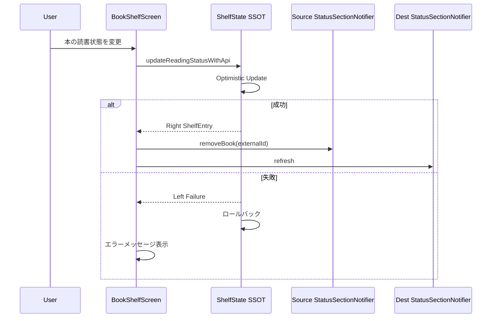

# Design Document: reading-status-sections

## Overview

**Purpose**: 本機能は、ライブラリ画面の本一覧を読書状態（読書中・積読・読了・読まない）ごとのセクションに分類表示する。現在のフラットリスト表示とクライアント側グループ化の組み合わせで発生しているページネーション不整合問題を、サーバー側 readingStatus フィルタとセクション独立データ取得により根本的に解消する。

**Users**: Shelfie モバイルアプリのユーザーがライブラリ画面で読書の進捗を一目で把握するために使用する。

**Impact**: 既存の `MyShelfInput` GraphQL インプットに `readingStatus` フィルタフィールドを追加し、クライアント側のグループ化ロジック（`GroupOption`, `_groupBooks`）を削除してセクション独立取得に置き換える。

### Goals

- API の `MyShelfInput` に `readingStatus` フィルタを追加し、ステータス別のクエリを可能にする
- ライブラリ画面を読書中・積読・読了・読まないの 4 セクション構成に変更する
- 各セクションが独立してデータ取得・ページネーションを行い、不整合を解消する
- 既存のクライアント側グループ化機能（`GroupOption`）を削除してコードを簡素化する

### Non-Goals

- 検索機能のセクション対応（検索はセクション横断のフラットリストで維持）
- セクションの折りたたみ・展開 UI
- セクション表示順のカスタマイズ
- cursor ベースページネーションへの移行（既存 offset ベースを維持）

## Architecture

### Existing Architecture Analysis

**現在のアーキテクチャ**:
- API: `myShelf` クエリが `MyShelfInput`（query, sortBy, sortOrder, limit, offset）を受け取り、全ステータスの本をページネーション付きで返却
- Repository: `getUserBooksWithPagination` が `userId` + `GetUserBooksInput` で Drizzle ORM 経由のクエリを実行
- Mobile: `BookShelfNotifier` が単一の `myShelf` クエリでデータ取得し、`_groupBooks` でクライアント側グループ化を実行
- SSOT: `ShelfState`（keepAlive Provider）が `externalId -> ShelfEntry` のマッピングで読書状態を一元管理

**課題**:
- クライアント側グループ化は、サーバーがページ単位でスライスしたデータを別軸でグループ化するため、グループの中身が不完全になる
- `GroupOption.byAuthor` のようなサーバー非対応のグループ化が存在し、ページネーションと矛盾する

**維持すべきパターン**:
- Feature-first + Clean Architecture のレイヤー構成（Presentation / Application / Domain / Infrastructure）
- Riverpod + freezed によるイミュータブル状態管理
- Ferry GraphQL クライアントのコード生成パイプライン
- `ShelfState` (SSOT) による読書状態の一元管理
- `Either<Failure, T>` による明示的なエラーハンドリング

### Architecture Pattern & Boundary Map



**Architecture Integration**:
- Selected pattern: 既存の Feature-first + Clean Architecture を踏襲。セクションごとに独立した Notifier を持つファミリーパターンを採用
- Domain/feature boundaries: API 側は既存の books feature 内で `readingStatus` フィルタを追加。Mobile 側は `book_shelf` feature 内でセクション表示ロジックに置き換え
- Existing patterns preserved: Riverpod Provider パターン、Ferry コード生成、ShelfState SSOT、Either エラーハンドリング
- New components rationale: `StatusSectionNotifier` はステータスごとの独立したページネーション状態を管理するために必要
- Steering compliance: ライブラリエコシステムガイドラインに従い、Riverpod ファミリー Provider を活用

### Technology Stack

| Layer | Choice / Version | Role in Feature | Notes |
|-------|------------------|-----------------|-------|
| Mobile | Flutter 3.x + Riverpod 2.x | セクション別 UI と状態管理 | ファミリー Provider でステータス別 Notifier を生成 |
| Mobile GraphQL | Ferry 0.16.x | readingStatus フィルタ付きクエリ | 既存 `MyShelfPaginated` クエリを拡張 |
| API | Pothos 4.x + Express | readingStatus フィルタの GraphQL スキーマ定義 | 既存 `MyShelfInput` を拡張 |
| Data | Drizzle ORM 0.45+ + PostgreSQL 16+ | readingStatus 条件の WHERE 句追加 | 既存インデックスで対応可能 |

## System Flows

### セクション初期表示フロー



### 読書状態変更時のセクション更新フロー



## Requirements Traceability

| Requirement | Summary | Components | Interfaces | Flows |
|-------------|---------|------------|------------|-------|
| 1.1 | readingStatus 指定時に該当ステータスの本のみ返却 | API BookShelfRepository, BookShelfService, GraphQL Resolver | GetUserBooksInput, MyShelfInput | セクション初期表示 |
| 1.2 | readingStatus 未指定時に全ステータスの本を返却 | API BookShelfRepository, GraphQL Resolver | GetUserBooksInput, MyShelfInput | 既存動作維持 |
| 1.3 | 4 つの readingStatus 値を受け付ける | GraphQL ReadingStatus enum, MyShelfInput | MyShelfInput.readingStatus | - |
| 1.4 | readingStatus とページネーションの組み合わせ動作 | API BookShelfRepository | GetUserBooksInput | セクション初期表示 |
| 1.5 | readingStatus とソート条件の組み合わせ動作 | API BookShelfRepository | GetUserBooksInput | セクション初期表示 |
| 2.1 | 4 セクションに分類表示 | StatusSectionList, StatusSection | - | セクション初期表示 |
| 2.2 | 固定順序で表示 | StatusSectionList | ReadingStatus.displayOrder | セクション初期表示 |
| 2.3 | 空セクションの非表示 | StatusSectionList | StatusSectionState | セクション初期表示 |
| 2.4 | セクションヘッダー表示 | StatusSection | ReadingStatus.displayName | セクション初期表示 |
| 3.1 | セクション独立クエリ | StatusSectionNotifier, BookShelfRepository | getMyShelf(readingStatus) | セクション初期表示 |
| 3.2 | セクション独立ページネーション状態 | StatusSectionNotifier | StatusSectionState | セクション初期表示 |
| 3.3 | セクション末尾到達時の追加読み込み | StatusSectionNotifier | loadMore() | - |
| 3.4 | セクション間の独立性維持 | StatusSectionNotifier x4 | ファミリー Provider | - |
| 3.5 | ローディング状態表示 | StatusSection | StatusSectionState.loading | - |
| 4.1 | GroupOption 列挙型の削除 | - | - | - |
| 4.2 | グループ化ロジックの削除 | BookShelfNotifier | - | - |
| 4.3 | グループ化 UI の削除 | SearchFilterBar | - | - |
| 4.4 | セクション表示をデフォルトに | BookShelfScreen | - | セクション初期表示 |
| 5.1 | 変更元セクションから書籍除去 | StatusSectionNotifier | removeBook() | 読書状態変更 |
| 5.2 | 変更先セクションに書籍追加 | StatusSectionNotifier | refresh() | 読書状態変更 |
| 5.3 | セクション件数表示の更新 | StatusSection | StatusSectionState.totalCount | 読書状態変更 |
| 5.4 | 変更失敗時のロールバック | ShelfState | updateReadingStatusWithApi | 読書状態変更 |
| 6.1 | セクション別エラーメッセージ | StatusSection | StatusSectionState.error | - |
| 6.2 | エラー時の他セクション独立性 | StatusSectionNotifier x4 | ファミリー Provider | - |
| 6.3 | セクション別リトライ | StatusSectionNotifier | retry() | - |

## Components and Interfaces

| Component | Domain/Layer | Intent | Req Coverage | Key Dependencies | Contracts |
|-----------|------------|--------|--------------|-----------------|-----------|
| MyShelfInput (API) | API / GraphQL | readingStatus フィルタの追加 | 1.1, 1.2, 1.3 | Pothos (P0) | API |
| GetUserBooksInput (API) | API / Data | readingStatus WHERE 句の追加 | 1.1, 1.4, 1.5 | Drizzle ORM (P0) | Service |
| StatusSectionNotifier | Mobile / Application | ステータス別の独立した状態管理 | 3.1, 3.2, 3.3, 3.4, 5.1, 5.2 | BookShelfRepository (P0), ShelfState (P0) | State |
| StatusSectionList | Mobile / Presentation | 4 セクションの配置と空セクション制御 | 2.1, 2.2, 2.3 | StatusSectionNotifier (P0) | - |
| StatusSection | Mobile / Presentation | セクションヘッダーと書籍グリッド表示 | 2.4, 3.5, 5.3, 6.1, 6.3 | StatusSectionNotifier (P0) | - |
| BookShelfRepository (Mobile) | Mobile / Infrastructure | readingStatus パラメータ付きクエリ発行 | 3.1 | Ferry Client (P0) | Service |

### API / GraphQL Layer

#### MyShelfInput readingStatus Extension

| Field | Detail |
|-------|--------|
| Intent | 既存 MyShelfInput に readingStatus フィルタフィールドを追加する |
| Requirements | 1.1, 1.2, 1.3 |

**Responsibilities & Constraints**
- `MyShelfInput` に `ReadingStatus` 型のオプショナルフィールド `readingStatus` を追加
- 未指定の場合は既存動作（全ステータス返却）を維持
- 既存の `query`, `sortBy`, `sortOrder`, `limit`, `offset` と組み合わせて動作

**Dependencies**
- Inbound: Mobile GraphQL クライアント -- readingStatus 付きクエリ送信 (P0)
- External: Pothos 4.x -- GraphQL スキーマビルダー (P0)

**Contracts**: API [x]

##### API Contract

変更前の `MyShelfInput`:
```
query, sortBy, sortOrder, limit, offset
```

変更後の `MyShelfInput`:
```
query, sortBy, sortOrder, limit, offset, readingStatus
```

| Field | Type | Required | Description |
|-------|------|----------|-------------|
| readingStatus | ReadingStatus | No | フィルタする読書状態。未指定時は全ステータス |

GraphQL スキーマ上の `ReadingStatus` enum（既存）:
`READING`, `BACKLOG`, `COMPLETED`, `DROPPED`

**Implementation Notes**
- `MyShelfInputData` インターフェースに `readingStatus?: ReadingStatusValue | null` を追加
- `MyShelfInputRef.implement` で `ReadingStatusRef` 型のオプショナルフィールドを追加
- myShelf Resolver で `input.readingStatus` を Service 層に伝搬

### API / Data Layer

#### GetUserBooksInput readingStatus Extension

| Field | Detail |
|-------|--------|
| Intent | Repository の入力型に readingStatus を追加し、WHERE 句でフィルタを適用する |
| Requirements | 1.1, 1.4, 1.5 |

**Responsibilities & Constraints**
- `GetUserBooksInput` に `readingStatus?: ReadingStatusValue` を追加
- Repository の `getUserBooksWithPagination` で `readingStatus` が指定された場合、`eq(userBooks.readingStatus, readingStatus)` を WHERE 条件に追加
- `totalCount` も同じ WHERE 条件で算出（ステータス内の正確な件数を返す）
- 既存のソート・検索条件とのAND結合

**Dependencies**
- Inbound: BookShelfService -- フィルタ付きページネーションリクエスト (P0)
- External: Drizzle ORM 0.45+ -- クエリビルダー (P0)

**Contracts**: Service [x]

##### Service Interface

```typescript
interface GetUserBooksInput {
  query?: string;
  sortBy?: ShelfSortField;
  sortOrder?: SortOrder;
  limit?: number;
  offset?: number;
  readingStatus?: ReadingStatusValue;  // 追加
}
```

- Preconditions: `readingStatus` は `"reading" | "backlog" | "completed" | "dropped"` のいずれかまたは未指定
- Postconditions: 指定時はそのステータスの本のみ返却、未指定時は全ステータス返却
- Invariants: `totalCount` は WHERE 条件適用後の件数

**Implementation Notes**
- `readingStatus` が指定された場合のみ `conditions` 配列に `eq(userBooks.readingStatus, readingStatus)` を追加
- 既存の `query` フィルタとは AND 結合
- `userBooks` テーブルの `readingStatus` カラムに対する等価条件のため、既存インデックスで十分なパフォーマンスが見込まれる

### Mobile / Application Layer

#### StatusSectionNotifier

| Field | Detail |
|-------|--------|
| Intent | 特定の ReadingStatus に対する独立したデータ取得・ページネーション・状態管理 |
| Requirements | 3.1, 3.2, 3.3, 3.4, 5.1, 5.2 |

**Responsibilities & Constraints**
- Riverpod ファミリー Provider として `ReadingStatus` をパラメータに取る
- セクションごとに独立した offset, 書籍リスト, ページネーション状態を管理
- ShelfState (SSOT) への登録・参照を行う
- 読書状態変更時のセクション間書籍移動を処理

**Dependencies**
- Inbound: StatusSection Widget -- UI イベント (P0)
- Outbound: BookShelfRepository -- GraphQL クエリ発行 (P0)
- Outbound: ShelfState -- SSOT への読書状態登録 (P0)

**Contracts**: State [x]

##### State Management

```dart
// Riverpod ファミリー Provider（ReadingStatus をパラメータ化）
@riverpod
class StatusSectionNotifier extends _$StatusSectionNotifier {
  // パラメータ: ReadingStatus
}
```

State model: `StatusSectionState` (freezed sealed class)

```
StatusSectionState
  .initial()
  .loading()
  .loaded(
    books: List<ShelfBookItem>,
    hasMore: bool,
    isLoadingMore: bool,
    totalCount: int,
  )
  .error(failure: Failure)
```

公開メソッド:

| Method | Description |
|--------|-------------|
| `initialize()` | 初回データ取得（offset=0） |
| `loadMore()` | 次ページ追加読み込み |
| `refresh()` | データ再取得（offset=0 からリセット） |
| `removeBook(String externalId)` | ローカルリストから書籍を除去 |
| `retry()` | エラー後の再取得 |

- Persistence: なし（メモリ上のみ、autoDispose）
- Concurrency: 各セクションが独立した非同期処理を実行

**Implementation Notes**
- 既存 `BookShelfNotifier` の単一クエリパターンを、ファミリー Provider による並行 4 クエリパターンに置き換える
- `removeBook` は Optimistic に書籍リストから除去し、`totalCount` を減算する
- `refresh` は変更先セクションの再取得に使用する（変更先のソート順序内の正確な位置にアイテムを挿入するのは複雑なため、再取得が安全）

### Mobile / Presentation Layer

#### StatusSectionList

| Field | Detail |
|-------|--------|
| Intent | 4 つのステータスセクションを固定順で縦に配置し、空セクションを非表示にする |
| Requirements | 2.1, 2.2, 2.3 |

**Responsibilities & Constraints**
- `ReadingStatus.values` を `displayOrder` 順にソートして配置
- 各セクションの Notifier 状態を監視し、`loaded` かつ `totalCount == 0` のセクションを非表示
- `CustomScrollView` + `SliverList` で全セクションを単一スクロール内に配置

**Dependencies**
- Inbound: BookShelfScreen -- 書籍タブのコンテンツ (P0)
- Outbound: StatusSectionNotifier -- 各セクションの状態参照 (P0)

**Implementation Notes**
- 既存 `LibraryBooksTab` を置き換える
- ShelfState リスナーで読書状態変更を検知し、元セクションからの除去と先セクションの再取得をトリガー

#### StatusSection

| Field | Detail |
|-------|--------|
| Intent | 個別ステータスセクションのヘッダー・書籍グリッド・ローディング・エラー表示 |
| Requirements | 2.4, 3.5, 5.3, 6.1, 6.3 |

**Responsibilities & Constraints**
- セクションヘッダーに `ReadingStatus.displayName` と `totalCount` を表示
- `StatusSectionState` に応じて書籍グリッド / ローディング / エラー を切り替え
- 末尾到達時に `StatusSectionNotifier.loadMore()` を呼び出す
- エラー時にリトライボタンを表示

**Dependencies**
- Inbound: StatusSectionList -- セクション配置 (P0)
- Outbound: StatusSectionNotifier -- 状態参照とイベント発火 (P0)

**Implementation Notes**
- 既存 `BookGrid` ウィジェットを再利用して書籍グリッドを描画
- Sliver ベースでスクロール統合
- セクション内の追加読み込みはスクロール末尾検知で自動実行

### Mobile / Infrastructure Layer

#### BookShelfRepository readingStatus Extension

| Field | Detail |
|-------|--------|
| Intent | GraphQL クエリに readingStatus パラメータを追加する |
| Requirements | 3.1 |

**Responsibilities & Constraints**
- 既存の `getMyShelf` メソッドに `GReadingStatus?` パラメータを追加
- `GMyShelfInput` ビルダーに `readingStatus` をセット
- Ferry コード生成で新しいスキーマに対応

**Dependencies**
- Inbound: StatusSectionNotifier -- ステータス別クエリ要求 (P0)
- External: Ferry 0.16.x -- GraphQL クライアント (P0)

**Contracts**: Service [x]

##### Service Interface

```dart
abstract class BookShelfRepository {
  Future<Either<Failure, MyShelfResult>> getMyShelf({
    String? query,
    GShelfSortField? sortBy,
    GSortOrder? sortOrder,
    int? limit,
    int? offset,
    GReadingStatus? readingStatus,  // 追加
  });
}
```

- Preconditions: `readingStatus` は `GReadingStatus` enum のいずれかまたは null
- Postconditions: 指定時はそのステータスの本のみ、未指定時は全ステータスの本を返却

**Implementation Notes**
- `my_shelf_paginated.graphql` に `readingStatus` 引数を追加
- `dart run build_runner build` で Ferry コード再生成が必要

## Data Models

### Domain Model

本機能で新たなエンティティやテーブルは追加しない。既存のデータモデルをそのまま活用する。

**既存エンティティ（変更なし）**:
- `UserBook`: 本棚に追加された書籍（`readingStatus` カラムを既に保持）
- `ShelfEntry`: SSOT の値オブジェクト（`ReadingStatus` を既に保持）
- `ShelfBookItem`: 表示用モデル（読書状態は `ShelfState` から参照）

**変更点は入力型のみ**:
- `MyShelfInput` (GraphQL): `readingStatus` フィールド追加
- `GetUserBooksInput` (API Repository): `readingStatus` フィールド追加

### Data Contracts & Integration

**API Request/Response**

Request:
```graphql
query MyShelfPaginated($input: MyShelfInput) {
  myShelf(input: $input) {
    items { id externalId title authors coverImageUrl readingStatus source addedAt completedAt rating }
    totalCount
    hasMore
  }
}
```

`MyShelfInput` に追加されるフィールド:
```graphql
input MyShelfInput {
  # ... 既存フィールド
  readingStatus: ReadingStatus  # 追加
}
```

Response は既存の `MyShelfResult` 型をそのまま使用（変更なし）。

## Error Handling

### Error Strategy

本機能のエラーハンドリングは、セクションごとの独立性を最重要原則とする。あるセクションのエラーが他のセクションに波及してはならない。

### Error Categories and Responses

**ネットワークエラー**: セクション内にエラーメッセージとリトライボタンを表示。他のセクションは正常に動作を継続。

**GraphQL エラー**:
- `UNAUTHENTICATED`: 認証エラーとして `AuthFailure` に変換。セクション内に表示。
- その他: `ServerFailure` に変換。セクション内に表示。

**読書状態変更失敗**: `ShelfState.updateReadingStatusWithApi` の既存 Optimistic Update ロールバック機構を活用。エラーメッセージを SnackBar で表示。

### Monitoring

既存の `ConsoleLogger`（開発環境）パターンを踏襲。セクション別のエラーログにステータス値を含める。

## Testing Strategy

### Unit Tests (API)

- `BookShelfRepository.getUserBooksWithPagination`: readingStatus フィルタ指定時に該当ステータスのみ返却されることを検証
- `BookShelfRepository.getUserBooksWithPagination`: readingStatus 未指定時に全ステータスが返却されることを検証
- `BookShelfRepository.getUserBooksWithPagination`: readingStatus と query の AND 結合が正しく動作することを検証
- `BookShelfService.getUserBooksWithPagination`: readingStatus フィルタの伝搬と totalCount の正確性を検証

### Unit Tests (Mobile)

- `StatusSectionNotifier.initialize`: 指定ステータスの書籍が取得され loaded 状態に遷移することを検証
- `StatusSectionNotifier.loadMore`: offset が進み追加データが既存リストに結合されることを検証
- `StatusSectionNotifier.removeBook`: ローカルリストから書籍が除去され totalCount が減算されることを検証
- `StatusSectionNotifier.refresh`: offset がリセットされ最新データで状態が更新されることを検証

### Integration Tests (API)

- `myShelf` クエリに `readingStatus: READING` を指定した場合、reading ステータスの本のみが返却されること
- `readingStatus` フィルタと `sortBy`, `limit`, `offset` の組み合わせが正しく動作すること

### Widget Tests (Mobile)

- `StatusSectionList`: 4 セクションが `displayOrder` 順で表示されること
- `StatusSectionList`: 空セクションが非表示になること
- `StatusSection`: ヘッダーにステータス名と件数が表示されること
- `StatusSection`: エラー時にリトライボタンが表示されること

## Performance & Scalability

- 初回表示時に 4 セクション分の並行クエリが発生するが、各クエリは `readingStatus` フィルタにより小さな結果セットを返すため、単一の全件クエリと比較してトータルの応答時間は同等以下と見込まれる
- `userBooks.readingStatus` カラムは既存のテーブルカラムであり、`userId` + `readingStatus` の組み合わせクエリは `userId` インデックスでカバーされる。データ量増加に伴い複合インデックスの追加を検討する余地がある
- 各セクションのページサイズは 20 件で維持し、無限スクロールで追加読み込みする
