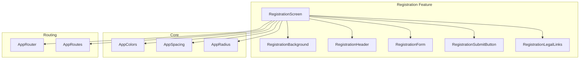
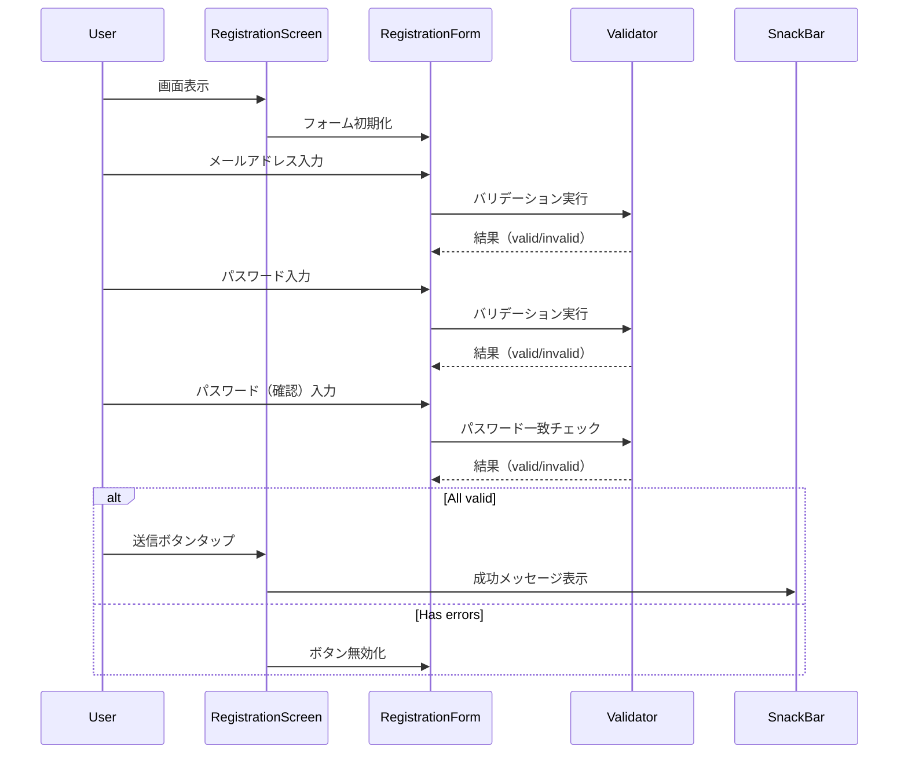

# Design Document: registration-screen

## Overview

**Purpose**: 本機能は、Shelfie モバイルアプリケーションにおける新規ユーザー登録画面のUI実装を提供する。ユーザーがメールアドレスとパスワードを入力し、認証コード送信をリクエストするためのフォームインターフェースを実現する。

**Users**: 新規ユーザーが本機能を利用してアカウント作成プロセスを開始する。

**Impact**: 既存のウェルカム画面から遷移可能な登録フローを追加し、`apps/mobile/lib/features/registration/` に新規 Feature モジュールを作成する。

### Goals

- ウェルカム画面と一貫性のあるダークモードUIを提供する
- Feature-first + Clean Architecture パターンに準拠した実装構造を確立する
- 既存のデザインシステム（AppColors, AppSpacing, AppRadius）を活用する
- クライアントサイドバリデーションによる即時フィードバックを実現する

### Non-Goals

- 実際の認証API連携（Firebase Authentication）
- メール送信処理
- 認証コード検証画面
- サーバーサイドバリデーション

## Architecture

### Existing Architecture Analysis

既存のウェルカム画面（`lib/features/welcome/`）の実装パターンを踏襲する:

- **画面構造**: `Scaffold` > `Stack` > `[Background, SafeArea > Content]`
- **ウィジェット分割**: Screen, Background, Content, 個別ウィジェット（Logo, Buttons, Links）
- **状態管理**: `ConsumerWidget` による Riverpod 統合
- **ナビゲーション**: `go_router` の `context.go()` / `context.pop()` によるルーティング
- **テーマ適用**: `Theme.of(context).extension<AppColors>()` によるカスタムカラー取得

### Architecture Pattern & Boundary Map



**Architecture Integration**:

- **Selected pattern**: Feature-first + Presentation Layer（Clean Architecture の Presentation 層のみ）
- **Domain/feature boundaries**: registration Feature は presentation 層のみで構成され、domain/infrastructure 層は本スコープ外
- **Existing patterns preserved**: ウェルカム画面のウィジェット分割パターン、テーマ適用パターン、ナビゲーションパターン
- **New components rationale**: 登録画面固有のフォーム入力とバリデーションロジックを担当
- **Steering compliance**: Feature-first 構成、Riverpod 状態管理、型安全な実装

### Technology Stack

| Layer | Choice / Version | Role in Feature | Notes |
|-------|------------------|-----------------|-------|
| UI Framework | Flutter 3.x | 画面レンダリング | 既存環境 |
| State Management | flutter_riverpod ^2.5.1 | フォーム状態管理 | ConsumerWidget 継承 |
| Routing | go_router ^14.6.2 | 画面遷移 | 既存 AppRouter 統合 |
| Theme | AppColors, AppSpacing, AppRadius | デザインシステム | ThemeExtension |

## System Flows

### Registration Flow Sequence



## Requirements Traceability

| Requirement | Summary | Components | Interfaces | Flows |
|-------------|---------|------------|------------|-------|
| 1.1-1.6 | 画面レイアウト構成 | RegistrationScreen, RegistrationBackground, RegistrationHeader | - | 画面表示 |
| 2.1-2.13 | 入力フォーム | RegistrationForm, RegistrationTextField | TextEditingController, FocusNode | 入力処理 |
| 3.1-3.3 | 送信ボタン | RegistrationSubmitButton | VoidCallback | 送信フロー |
| 4.1-4.4 | 利用規約・プライバシーポリシー | RegistrationLegalLinks | VoidCallback | リンクタップ |
| 5.1-5.2 | ナビゲーション | RegistrationScreen | GoRouter | 画面遷移 |
| 6.1-6.4 | 入力バリデーション | RegistrationForm, RegistrationFormState | Validator functions | バリデーション |
| 7.1-7.5 | アーキテクチャ準拠 | 全コンポーネント | - | - |

## Components and Interfaces

| Component | Domain/Layer | Intent | Req Coverage | Key Dependencies | Contracts |
|-----------|--------------|--------|--------------|------------------|-----------|
| RegistrationScreen | Presentation | 登録画面全体の構成とナビゲーション | 1.1-1.6, 5.1-5.2 | GoRouter (P0), AppColors (P1) | State |
| RegistrationBackground | Presentation/Widget | グラデーション背景表示 | 1.1 | AppColors (P1) | - |
| RegistrationHeader | Presentation/Widget | アイコン・タイトル・サブタイトル表示 | 1.3-1.5 | AppColors (P1), AppSpacing (P2) | - |
| RegistrationForm | Presentation/Widget | フォーム入力とバリデーション | 2.1-2.13, 6.1-6.4 | RegistrationFormState (P0) | State |
| RegistrationSubmitButton | Presentation/Widget | 送信ボタン表示と状態制御 | 3.1-3.3, 6.4 | VoidCallback (P0) | - |
| RegistrationLegalLinks | Presentation/Widget | 利用規約・プライバシーリンク | 4.1-4.4 | VoidCallback (P0), AppColors (P1) | - |
| RegistrationFormState | State | フォーム入力値とバリデーション状態管理 | 6.1-6.4 | - | State |

### Presentation Layer

#### RegistrationScreen

| Field | Detail |
|-------|--------|
| Intent | 登録画面全体の構成、ナビゲーション、子ウィジェットの統合 |
| Requirements | 1.1-1.6, 5.1-5.2, 7.1-7.5 |

**Responsibilities & Constraints**

- Scaffold を使用した画面構造の提供
- Stack による背景とコンテンツの重ね合わせ
- SafeArea によるシステムUI回避
- ナビゲーションコールバックの提供（戻る、利用規約、プライバシー）
- SnackBar によるフィードバック表示

**Dependencies**

- Inbound: AppRouter — ルーティング (P0)
- Outbound: RegistrationBackground, RegistrationHeader, RegistrationForm, RegistrationSubmitButton, RegistrationLegalLinks — 子ウィジェット (P0)
- External: go_router — ナビゲーション (P0)

**Contracts**: State [x]

##### State Management

```dart
/// RegistrationScreen は ConsumerWidget を継承
/// フォーム状態は RegistrationFormState Provider で管理
class RegistrationScreen extends ConsumerWidget {
  const RegistrationScreen({super.key});

  Widget build(BuildContext context, WidgetRef ref);

  void _onBackPressed(BuildContext context);
  void _onSubmitPressed(BuildContext context);
  void _onTermsPressed(BuildContext context);
  void _onPrivacyPressed(BuildContext context);
}
```

**Implementation Notes**

- Integration: go_router の `context.pop()` で戻るナビゲーション実装
- Validation: 送信前にフォーム状態の `isValid` をチェック
- Risks: なし

---

#### RegistrationBackground

| Field | Detail |
|-------|--------|
| Intent | ウェルカム画面と同一のグラデーション背景を提供 |
| Requirements | 1.1 |

**Implementation Notes**

- WelcomeBackground と同一パターンを使用（再利用または複製）
- opacity パラメータで透明度調整可能

---

#### RegistrationHeader

| Field | Detail |
|-------|--------|
| Intent | メールアイコン、タイトル、サブタイトルの表示 |
| Requirements | 1.2-1.5 |

**Responsibilities & Constraints**

- ターコイズ色の円形背景内にメールアイコン（Icons.email_outlined）を配置
- 「新規登録」タイトルを白色太字で表示
- 「アカウントを作成して始めましょう」サブタイトルをグレー色で表示
- 「戻る」テキストリンクを含む

**Dependencies**

- Outbound: AppColors — brandPrimary, textPrimary, textSecondary (P1)
- Outbound: AppSpacing — レイアウト間隔 (P2)

**Contracts**: -

##### Widget Interface

```dart
class RegistrationHeader extends StatelessWidget {
  const RegistrationHeader({
    required this.onBackPressed,
    super.key,
  });

  final VoidCallback onBackPressed;

  Widget build(BuildContext context);
}
```

**Implementation Notes**

- Integration: Container + CircleAvatar でアイコン背景を実現
- Validation: なし
- Risks: なし

---

#### RegistrationForm

| Field | Detail |
|-------|--------|
| Intent | メールアドレスとパスワード入力フィールドの提供およびバリデーション |
| Requirements | 2.1-2.13, 6.1-6.4 |

**Responsibilities & Constraints**

- 3つのテキストフィールド（メールアドレス、パスワード、パスワード確認）を提供
- 各フィールドにラベル、プレースホルダー、アイコンを設定
- パスワードフィールドに表示/非表示トグルを提供
- リアルタイムバリデーションとエラーメッセージ表示
- OutlineInputBorder による角丸枠線スタイル

**Dependencies**

- Inbound: RegistrationScreen — 親ウィジェット (P0)
- Outbound: RegistrationFormState — 状態管理 (P0)
- Outbound: AppColors, AppSpacing, AppRadius — テーマ (P1)

**Contracts**: State [x]

##### State Management

```dart
/// フォーム状態を管理する StateNotifier
@riverpod
class RegistrationFormState extends _$RegistrationFormState {
  @override
  RegistrationFormData build();

  void updateEmail(String value);
  void updatePassword(String value);
  void updatePasswordConfirmation(String value);
  void togglePasswordVisibility();
  void togglePasswordConfirmationVisibility();

  bool get isValid;
  String? get emailError;
  String? get passwordError;
  String? get passwordConfirmationError;
}

/// フォームデータモデル
@freezed
class RegistrationFormData with _$RegistrationFormData {
  const factory RegistrationFormData({
    @Default('') String email,
    @Default('') String password,
    @Default('') String passwordConfirmation,
    @Default(true) bool isPasswordObscured,
    @Default(true) bool isPasswordConfirmationObscured,
  }) = _RegistrationFormData;
}
```

##### Widget Interface

```dart
class RegistrationForm extends ConsumerWidget {
  const RegistrationForm({super.key});

  Widget build(BuildContext context, WidgetRef ref);
}
```

**Implementation Notes**

- Integration: TextEditingController は dispose 不要（ConsumerWidget のため ref.watch で状態管理）
- Validation: バリデーションは StateNotifier 内で実行、エラーメッセージは TextFormField の errorText に表示
- Risks: キーボード表示時のレイアウト崩れ対策として SingleChildScrollView を使用

---

#### RegistrationSubmitButton

| Field | Detail |
|-------|--------|
| Intent | 認証コード送信ボタンの表示と有効/無効状態の制御 |
| Requirements | 3.1-3.3, 6.4 |

**Responsibilities & Constraints**

- 白色背景・黒色テキストの FilledButton を全幅で表示
- フォームバリデーション状態に応じて有効/無効を切り替え
- タップ時にコールバックを実行

**Dependencies**

- Inbound: RegistrationScreen — onPressed コールバック (P0)
- Inbound: RegistrationFormState — isValid 状態 (P0)

**Contracts**: -

##### Widget Interface

```dart
class RegistrationSubmitButton extends ConsumerWidget {
  const RegistrationSubmitButton({
    required this.onPressed,
    super.key,
  });

  final VoidCallback onPressed;

  Widget build(BuildContext context, WidgetRef ref);
}
```

**Implementation Notes**

- Integration: FilledButton.styleFrom で白背景・黒テキストのカスタムスタイル適用
- Validation: `ref.watch(registrationFormStateProvider).isValid` で有効性判定
- Risks: なし

---

#### RegistrationLegalLinks

| Field | Detail |
|-------|--------|
| Intent | 利用規約とプライバシーポリシーへのリンクテキストを表示 |
| Requirements | 4.1-4.4 |

**Implementation Notes**

- LegalLinks（ウェルカム画面）と同一パターンを使用
- リンク色はターコイズ（brandPrimary）を使用
- RichText + TapGestureRecognizer でリンク実装

---

### State Layer

#### RegistrationFormState Provider

| Field | Detail |
|-------|--------|
| Intent | フォーム入力値、バリデーション結果、UI状態を一元管理 |
| Requirements | 6.1-6.4 |

**Responsibilities & Constraints**

- メールアドレス、パスワード、パスワード確認の入力値を保持
- パスワード表示/非表示状態を保持
- バリデーションロジックを提供
- 派生状態（isValid, エラーメッセージ）を計算

**Contracts**: State [x]

##### State Interface

```dart
/// バリデーションルール
abstract final class RegistrationValidators {
  /// メールアドレス形式チェック
  /// Returns: エラーメッセージ or null
  static String? validateEmail(String email);

  /// パスワード長チェック（8文字以上）
  /// Returns: エラーメッセージ or null
  static String? validatePassword(String password);

  /// パスワード一致チェック
  /// Returns: エラーメッセージ or null
  static String? validatePasswordConfirmation(String password, String confirmation);
}
```

**Validation Rules**

| Field | Rule | Error Message |
|-------|------|---------------|
| email | RegExp(r'^[^@]+@[^@]+\.[^@]+$') | 「有効なメールアドレスを入力してください」 |
| password | length >= 8 | 「パスワードは8文字以上で入力してください」 |
| passwordConfirmation | password == confirmation | 「パスワードが一致しません」 |

**Implementation Notes**

- Integration: riverpod_annotation によるコード生成
- Validation: 入力変更時に即時バリデーション実行
- Risks: なし

## Data Models

### Domain Model

本機能はUI実装に集中するため、永続化対象のドメインモデルは定義しない。

### Logical Data Model

#### RegistrationFormData

| Field | Type | Description | Constraints |
|-------|------|-------------|-------------|
| email | String | メールアドレス入力値 | 空文字可 |
| password | String | パスワード入力値 | 空文字可 |
| passwordConfirmation | String | パスワード確認入力値 | 空文字可 |
| isPasswordObscured | bool | パスワード非表示フラグ | default: true |
| isPasswordConfirmationObscured | bool | パスワード確認非表示フラグ | default: true |

## Error Handling

### Error Strategy

クライアントサイドバリデーションエラーのみを扱い、各入力フィールドに即時フィードバックを表示する。

### Error Categories and Responses

**User Errors (Validation)**:

- メールアドレス形式不正 → フィールド下部にエラーメッセージ表示
- パスワード8文字未満 → フィールド下部にエラーメッセージ表示
- パスワード不一致 → 確認フィールド下部にエラーメッセージ表示

**UI Feedback**:

- 送信ボタン無効化（バリデーションエラー存在時）
- 送信成功時 → SnackBar「認証コードを送信しました（モック）」
- リンクタップ時 → SnackBar「準備中です」

## Testing Strategy

### Unit Tests

- RegistrationValidators.validateEmail: 有効/無効なメールアドレスパターン
- RegistrationValidators.validatePassword: 8文字未満/以上のパターン
- RegistrationValidators.validatePasswordConfirmation: 一致/不一致パターン
- RegistrationFormState: 状態更新とバリデーション結果の整合性

### Widget Tests

- RegistrationScreen: 全要素の表示確認
- RegistrationHeader: アイコン、タイトル、サブタイトルの表示確認
- RegistrationForm: 入力フィールドの動作確認、エラーメッセージ表示
- RegistrationSubmitButton: 有効/無効状態の切り替え
- ナビゲーション: 戻るリンクタップ時の遷移確認

### Integration Tests

- 登録フロー全体: フォーム入力 → バリデーション → 送信 → SnackBar 表示
- エラー表示フロー: 不正入力 → エラー表示 → 修正 → エラー消去
