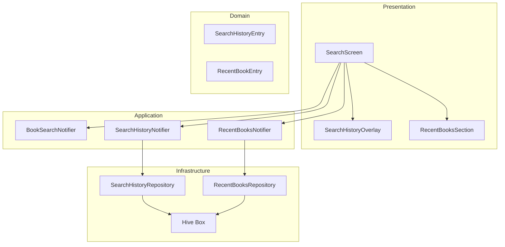
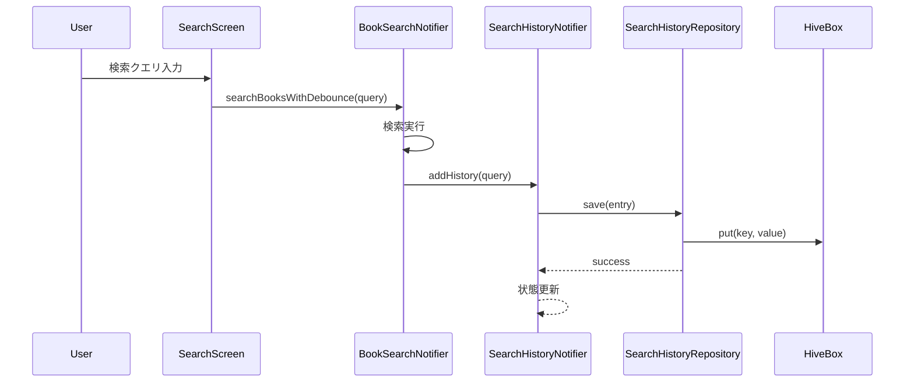
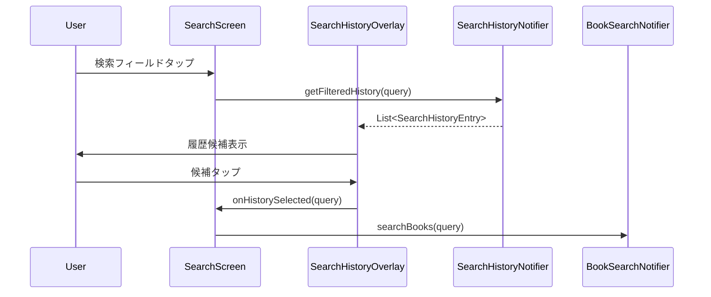
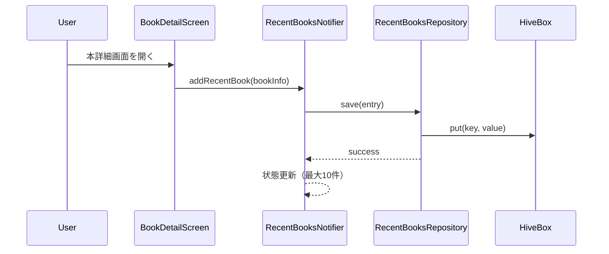
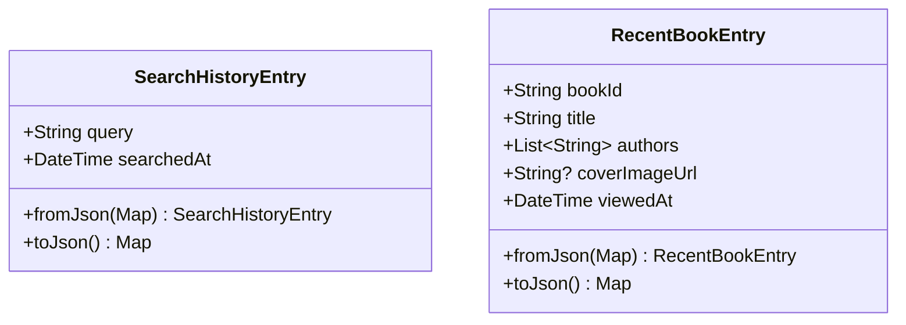

# Design Document

## Overview

**Purpose**: 本機能は、Shelfie モバイルアプリの検索タブに検索履歴機能と「最近チェックした本」セクションを追加し、ユーザーの検索体験を向上させる。

**Users**: アプリユーザーは、過去の検索クエリを素早く再利用し、最近閲覧した書籍に効率的にアクセスできるようになる。

**Impact**: 既存の `SearchScreen` を拡張し、新しいローカルストレージサービスと状態管理コンポーネントを追加する。

### Goals

- 検索履歴をローカルストレージに保存し、最大20件を管理する
- 検索フィールドタップ時に履歴候補を表示し、インクリメンタル検索をサポートする
- 初期表示時に「最近チェックした本」セクションを表示する
- 既存の Feature-first + Clean Architecture パターンを維持する

### Non-Goals

- サーバーサイドでの検索履歴同期
- 検索履歴のクラウドバックアップ
- 複数デバイス間での履歴共有

## Architecture

### Existing Architecture Analysis

現在の検索機能は以下の構成で実装されている:

- `SearchScreen`: 検索 UI を提供（ConsumerStatefulWidget）
- `BookSearchNotifier`: 検索状態管理（Riverpod）
- `BookSearchState`: 検索状態の sealed class（freezed）
- `BookSearchRepository`: GraphQL API 呼び出し

本機能は既存の `book_search` フィーチャーを拡張し、ローカルストレージ層を追加する。

### Architecture Pattern & Boundary Map



**Architecture Integration**:

- **Selected pattern**: Feature-first + Clean Architecture（既存パターンを踏襲）
- **Domain/feature boundaries**: 検索履歴と最近チェックした本は独立したドメインとして分離
- **Existing patterns preserved**: Riverpod + freezed + Hive のパターンを維持
- **New components rationale**: ローカルストレージ専用の Repository と Notifier を追加
- **Steering compliance**: mobile-tech.md のレイヤー構成ルールに準拠

### Technology Stack

| Layer | Choice / Version | Role in Feature | Notes |
|-------|------------------|-----------------|-------|
| Frontend | Flutter 3.x | UI 表示、ユーザー入力処理 | 既存 |
| State Management | Riverpod 2.5.x | 状態管理、Provider 定義 | 既存 |
| Data Model | freezed 2.4.x | イミュータブルなデータクラス | 既存 |
| Local Storage | Hive 2.x / hive_flutter 1.1.0 | 検索履歴・閲覧履歴の永続化 | 既存依存 |
| JSON Serialization | json_serializable 6.7.x | Hive 保存用シリアライゼーション | 既存 |

## System Flows

### 検索履歴保存フロー



### 検索履歴表示・選択フロー



### 最近チェックした本の記録フロー



## Requirements Traceability

| Requirement | Summary | Components | Interfaces | Flows |
|-------------|---------|------------|------------|-------|
| 1.1 | 検索クエリをローカルストレージに保存 | SearchHistoryNotifier, SearchHistoryRepository | SearchHistoryService | 検索履歴保存フロー |
| 1.2 | 最大20件の検索履歴を保持 | SearchHistoryRepository | SearchHistoryService | - |
| 1.3 | 20件超過時に古い履歴を削除 | SearchHistoryRepository | SearchHistoryService | - |
| 1.4 | 重複クエリを最新として更新 | SearchHistoryRepository | SearchHistoryService | - |
| 2.1 | 検索フィールドタップで履歴表示 | SearchScreen, SearchHistoryOverlay | SearchHistoryService | 検索履歴表示フロー |
| 2.2 | 履歴を新しい順に表示 | SearchHistoryNotifier | SearchHistoryService | - |
| 2.3 | 入力に部分一致する履歴をフィルタ | SearchHistoryNotifier | SearchHistoryService | - |
| 2.4 | 履歴タップで検索実行 | SearchHistoryOverlay | - | 検索履歴選択フロー |
| 2.5 | 履歴なしの場合は候補非表示 | SearchHistoryOverlay | SearchHistoryService | - |
| 3.1 | 左スワイプで削除ボタン表示 | SearchHistoryOverlay | - | - |
| 3.2 | 削除ボタンで該当履歴削除 | SearchHistoryNotifier, SearchHistoryRepository | SearchHistoryService | - |
| 3.3 | 全履歴削除アクション | SearchHistoryNotifier, SearchHistoryRepository | SearchHistoryService | - |
| 4.1 | 初期表示で「最近チェックした本」表示 | SearchScreen, RecentBooksSection | RecentBooksService | - |
| 4.2 | 最近チェックした本を最大10件表示 | RecentBooksNotifier | RecentBooksService | - |
| 4.3 | 本詳細閲覧時にリストに追加 | BookDetailScreen, RecentBooksNotifier | RecentBooksService | 最近チェックした本の記録フロー |
| 4.4 | 10件超過時に古い項目を削除 | RecentBooksRepository | RecentBooksService | - |
| 4.5 | 履歴なしの場合はセクション非表示 | RecentBooksSection | RecentBooksService | - |
| 5.1 | 項目タップで本詳細画面へ遷移 | RecentBooksSection | - | - |
| 5.2 | カバー画像とタイトルを表示 | RecentBooksSection | - | - |
| 5.3 | 画像なしでプレースホルダー表示 | RecentBooksSection | - | - |
| 6.1 | フィールド外タップで候補非表示 | SearchScreen, SearchHistoryOverlay | - | - |
| 6.2 | 検索実行で最近チェックセクション非表示 | SearchScreen | - | - |
| 6.3 | 検索クリアで初期状態に復帰 | SearchScreen, BookSearchNotifier | - | - |

## Components and Interfaces

| Component | Domain/Layer | Intent | Req Coverage | Key Dependencies (P0/P1) | Contracts |
|-----------|--------------|--------|--------------|--------------------------|-----------|
| SearchHistoryEntry | Domain | 検索履歴エントリのデータモデル | 1.1-1.4 | - | State |
| RecentBookEntry | Domain | 最近チェックした本のデータモデル | 4.1-4.4 | - | State |
| SearchHistoryRepository | Infrastructure | Hive を使用した検索履歴の永続化 | 1.1-1.4, 3.2-3.3 | Hive (P0) | Service |
| RecentBooksRepository | Infrastructure | Hive を使用した閲覧履歴の永続化 | 4.1-4.4 | Hive (P0) | Service |
| SearchHistoryNotifier | Application | 検索履歴の状態管理 | 1.1-1.4, 2.1-2.5, 3.2-3.3 | SearchHistoryRepository (P0) | Service, State |
| RecentBooksNotifier | Application | 最近チェックした本の状態管理 | 4.1-4.5, 5.1 | RecentBooksRepository (P0) | Service, State |
| SearchHistoryOverlay | Presentation | 検索履歴候補の表示 UI | 2.1-2.5, 3.1-3.2 | SearchHistoryNotifier (P0) | - |
| RecentBooksSection | Presentation | 最近チェックした本セクションの UI | 4.1-4.5, 5.1-5.3 | RecentBooksNotifier (P0) | - |

### Domain

#### SearchHistoryEntry

| Field | Detail |
|-------|--------|
| Intent | 検索履歴の単一エントリを表現するイミュータブルなデータモデル |
| Requirements | 1.1, 1.2, 1.3, 1.4 |

**Responsibilities & Constraints**

- 検索クエリ文字列と検索日時を保持
- イミュータブルなデータクラスとして freezed で生成
- JSON シリアライゼーション対応（Hive 保存用）

**Contracts**: State [x]

##### State Management

```dart
@freezed
class SearchHistoryEntry with _$SearchHistoryEntry {
  const factory SearchHistoryEntry({
    required String query,
    required DateTime searchedAt,
  }) = _SearchHistoryEntry;

  factory SearchHistoryEntry.fromJson(Map<String, dynamic> json) =>
      _$SearchHistoryEntryFromJson(json);
}
```

- State model: イミュータブルな検索履歴エントリ
- Persistence: Hive Box に JSON 形式で保存
- Consistency: 単一デバイス内でのローカル一貫性

---

#### RecentBookEntry

| Field | Detail |
|-------|--------|
| Intent | 最近チェックした本の情報を表現するイミュータブルなデータモデル |
| Requirements | 4.1, 4.2, 4.3, 4.4 |

**Responsibilities & Constraints**

- 書籍 ID、タイトル、著者、カバー画像 URL、閲覧日時を保持
- イミュータブルなデータクラスとして freezed で生成
- JSON シリアライゼーション対応（Hive 保存用）

**Contracts**: State [x]

##### State Management

```dart
@freezed
class RecentBookEntry with _$RecentBookEntry {
  const factory RecentBookEntry({
    required String bookId,
    required String title,
    required List<String> authors,
    String? coverImageUrl,
    required DateTime viewedAt,
  }) = _RecentBookEntry;

  factory RecentBookEntry.fromJson(Map<String, dynamic> json) =>
      _$RecentBookEntryFromJson(json);
}
```

- State model: イミュータブルな閲覧履歴エントリ
- Persistence: Hive Box に JSON 形式で保存
- Consistency: 単一デバイス内でのローカル一貫性

---

### Infrastructure

#### SearchHistoryRepository

| Field | Detail |
|-------|--------|
| Intent | Hive を使用した検索履歴の永続化層 |
| Requirements | 1.1, 1.2, 1.3, 1.4, 3.2, 3.3 |

**Responsibilities & Constraints**

- 検索履歴の CRUD 操作を提供
- 最大20件の履歴制限を強制
- 重複クエリの検出と更新
- Hive Box への読み書きを抽象化

**Dependencies**

- External: Hive Box (P0) - ローカルストレージ

**Contracts**: Service [x]

##### Service Interface

```dart
abstract interface class SearchHistoryRepositoryInterface {
  /// 全ての検索履歴を新しい順で取得
  Future<List<SearchHistoryEntry>> getAll();

  /// 検索履歴を追加（重複時は更新、20件超過時は古いものを削除）
  Future<void> add(SearchHistoryEntry entry);

  /// 指定したクエリの履歴を削除
  Future<void> remove(String query);

  /// 全履歴を削除
  Future<void> clear();
}

@riverpod
SearchHistoryRepository searchHistoryRepository(SearchHistoryRepositoryRef ref);
```

- Preconditions: Hive が初期化済みであること
- Postconditions: 履歴は常に20件以下を維持
- Invariants: 同一クエリは1つのエントリのみ存在

**Implementation Notes**

- Integration: 既存の Hive 初期化フロー（main.dart）に Box オープンを追加
- Validation: クエリの空文字チェックは Notifier 層で実施
- Risks: Hive Box の破損時はデータ消失の可能性あり（再作成で対応）

---

#### RecentBooksRepository

| Field | Detail |
|-------|--------|
| Intent | Hive を使用した最近チェックした本の永続化層 |
| Requirements | 4.1, 4.2, 4.3, 4.4 |

**Responsibilities & Constraints**

- 閲覧履歴の CRUD 操作を提供
- 最大10件の履歴制限を強制
- 重複書籍 ID の検出と更新
- Hive Box への読み書きを抽象化

**Dependencies**

- External: Hive Box (P0) - ローカルストレージ

**Contracts**: Service [x]

##### Service Interface

```dart
abstract interface class RecentBooksRepositoryInterface {
  /// 全ての閲覧履歴を新しい順で取得
  Future<List<RecentBookEntry>> getAll();

  /// 閲覧履歴を追加（重複時は更新、10件超過時は古いものを削除）
  Future<void> add(RecentBookEntry entry);

  /// 指定した書籍 ID の履歴を削除
  Future<void> remove(String bookId);

  /// 全履歴を削除
  Future<void> clear();
}

@riverpod
RecentBooksRepository recentBooksRepository(RecentBooksRepositoryRef ref);
```

- Preconditions: Hive が初期化済みであること
- Postconditions: 履歴は常に10件以下を維持
- Invariants: 同一書籍 ID は1つのエントリのみ存在

**Implementation Notes**

- Integration: 既存の Hive 初期化フロー（main.dart）に Box オープンを追加
- Validation: 書籍情報の必須フィールドチェックは Notifier 層で実施
- Risks: Hive Box の破損時はデータ消失の可能性あり（再作成で対応）

---

### Application

#### SearchHistoryNotifier

| Field | Detail |
|-------|--------|
| Intent | 検索履歴の状態管理とビジネスロジック |
| Requirements | 1.1, 1.2, 1.3, 1.4, 2.1, 2.2, 2.3, 2.4, 2.5, 3.2, 3.3 |

**Responsibilities & Constraints**

- 検索履歴リストの状態管理
- 履歴のフィルタリング（部分一致検索）
- Repository 層への委譲
- UI 層へのリアクティブな状態提供

**Dependencies**

- Outbound: SearchHistoryRepository - 永続化 (P0)

**Contracts**: Service [x] / State [x]

##### Service Interface

```dart
@riverpod
class SearchHistoryNotifier extends _$SearchHistoryNotifier {
  @override
  Future<List<SearchHistoryEntry>> build();

  /// 検索履歴を追加
  Future<void> addHistory(String query);

  /// 指定した履歴を削除
  Future<void> removeHistory(String query);

  /// 全履歴を削除
  Future<void> clearAll();

  /// クエリに部分一致する履歴を取得
  List<SearchHistoryEntry> getFilteredHistory(String query);
}
```

- Preconditions: Repository が利用可能であること
- Postconditions: 状態変更後は自動的に UI に反映
- Invariants: 履歴リストは常に新しい順でソート

##### State Management

```dart
// AsyncNotifier を使用し、List<SearchHistoryEntry> を状態として保持
// build() で Repository から初期データをロード
// 各操作後に状態を更新し、UI に反映
```

- State model: `AsyncValue<List<SearchHistoryEntry>>`
- Persistence: Repository 経由で Hive に永続化
- Concurrency: Riverpod の AsyncNotifier による自動管理

**Implementation Notes**

- Integration: BookSearchNotifier から検索実行時に呼び出し
- Validation: 空文字クエリは無視
- Risks: 非同期操作中の状態不整合（AsyncValue で対応）

---

#### RecentBooksNotifier

| Field | Detail |
|-------|--------|
| Intent | 最近チェックした本の状態管理とビジネスロジック |
| Requirements | 4.1, 4.2, 4.3, 4.4, 4.5, 5.1 |

**Responsibilities & Constraints**

- 閲覧履歴リストの状態管理
- Repository 層への委譲
- UI 層へのリアクティブな状態提供

**Dependencies**

- Outbound: RecentBooksRepository - 永続化 (P0)

**Contracts**: Service [x] / State [x]

##### Service Interface

```dart
@riverpod
class RecentBooksNotifier extends _$RecentBooksNotifier {
  @override
  Future<List<RecentBookEntry>> build();

  /// 閲覧履歴を追加
  Future<void> addRecentBook({
    required String bookId,
    required String title,
    required List<String> authors,
    String? coverImageUrl,
  });

  /// 指定した書籍を履歴から削除
  Future<void> removeBook(String bookId);

  /// 全履歴を削除
  Future<void> clearAll();
}
```

- Preconditions: Repository が利用可能であること
- Postconditions: 状態変更後は自動的に UI に反映
- Invariants: 履歴リストは常に新しい順でソート

##### State Management

```dart
// AsyncNotifier を使用し、List<RecentBookEntry> を状態として保持
// build() で Repository から初期データをロード
// 各操作後に状態を更新し、UI に反映
```

- State model: `AsyncValue<List<RecentBookEntry>>`
- Persistence: Repository 経由で Hive に永続化
- Concurrency: Riverpod の AsyncNotifier による自動管理

**Implementation Notes**

- Integration: BookDetailScreen の initState から呼び出し
- Validation: 必須フィールド（bookId, title, authors）の存在確認
- Risks: 非同期操作中の状態不整合（AsyncValue で対応）

---

### Presentation

#### SearchHistoryOverlay

| Field | Detail |
|-------|--------|
| Intent | 検索履歴候補をオーバーレイとして表示する UI コンポーネント |
| Requirements | 2.1, 2.2, 2.3, 2.4, 2.5, 3.1, 3.2 |

**Summary-only component**: Presentation 層の UI ウィジェット

**Implementation Notes**

- Flutter の `Overlay` または `CompositedTransformTarget/Follower` を使用
- `Dismissible` ウィジェットで左スワイプ削除を実装
- 履歴が空の場合は非表示（透明なサイズゼロウィジェット）
- テキスト入力に応じて `SearchHistoryNotifier.getFilteredHistory()` を呼び出し

---

#### RecentBooksSection

| Field | Detail |
|-------|--------|
| Intent | 検索タブ初期表示時に「最近チェックした本」を表示する UI コンポーネント |
| Requirements | 4.1, 4.2, 4.5, 5.1, 5.2, 5.3 |

**Summary-only component**: Presentation 層の UI ウィジェット

**Implementation Notes**

- 水平スクロール可能な `ListView.builder` または `SingleChildScrollView` + `Row`
- `CachedNetworkImage` でカバー画像を表示（既存依存）
- 画像なしの場合はプレースホルダーアイコンを表示
- タップ時に `context.push(AppRoutes.bookDetail(bookId: bookId))` で遷移
- 履歴が空の場合はセクション全体を非表示

---

### Existing Components Modification

#### SearchScreen（既存拡張）

| Field | Detail |
|-------|--------|
| Intent | 検索タブのメイン画面（検索履歴・最近チェックした本の統合） |
| Requirements | 2.1, 4.1, 6.1, 6.2, 6.3 |

**Modification Points**

- `FocusNode` を追加して検索フィールドのフォーカス状態を監視
- フォーカス時に `SearchHistoryOverlay` を表示
- `_buildInitialState()` を `RecentBooksSection` を含むように変更
- 検索実行時に `SearchHistoryNotifier.addHistory()` を呼び出し
- `GestureDetector` でフィールド外タップを検知しオーバーレイを閉じる

---

#### BookDetailScreen（既存拡張）

| Field | Detail |
|-------|--------|
| Intent | 本詳細画面（閲覧履歴の記録を追加） |
| Requirements | 4.3 |

**Modification Points**

- `initState` または `build` で `RecentBooksNotifier.addRecentBook()` を呼び出し
- 書籍詳細データ取得成功後に履歴を記録

---

#### BookSearchNotifier（既存拡張）

| Field | Detail |
|-------|--------|
| Intent | 検索状態管理（検索履歴保存の統合） |
| Requirements | 1.1 |

**Modification Points**

- `searchBooks()` 成功時に `SearchHistoryNotifier.addHistory()` を呼び出し
- Notifier 間の依存は `ref.read()` で取得

## Data Models

### Domain Model



**Business Rules & Invariants**

- 検索履歴は最大20件、同一クエリは1エントリのみ
- 閲覧履歴は最大10件、同一書籍 ID は1エントリのみ
- 両履歴とも新しい順でソート

### Logical Data Model

**Hive Box 構成**

| Box Name | Key | Value | Purpose |
|----------|-----|-------|---------|
| search_history | クエリ文字列 | SearchHistoryEntry JSON | 検索履歴の永続化 |
| recent_books | 書籍 ID | RecentBookEntry JSON | 閲覧履歴の永続化 |

**Indexing & Access Patterns**

- search_history: クエリ文字列をキーとして O(1) アクセス、全件取得後にソート
- recent_books: 書籍 ID をキーとして O(1) アクセス、全件取得後にソート

### Physical Data Model

**Hive Box 設計**

```dart
// Box 名の定数定義
const String searchHistoryBoxName = 'search_history';
const String recentBooksBoxName = 'recent_books';

// JSON 形式で保存（TypeAdapter 不使用でシンプルに）
// Box<Map<String, dynamic>> として開く
```

**容量・パフォーマンス考慮**

- 検索履歴: 最大20件 x 約100バイト = 約2KB
- 閲覧履歴: 最大10件 x 約500バイト = 約5KB
- 合計7KB程度でメモリ・ストレージ影響は軽微

## Error Handling

### Error Strategy

| Error Type | Handling | User Feedback |
|------------|----------|---------------|
| Hive 初期化失敗 | 履歴機能を無効化、検索機能は継続 | なし（サイレント） |
| Box 読み取りエラー | 空リストを返却 | なし（サイレント） |
| Box 書き込みエラー | エラーログ出力、操作を続行 | なし（サイレント） |
| データ破損 | Box をクリアして再作成 | なし（サイレント） |

### Error Categories and Responses

**System Errors**: ローカルストレージのエラーはサイレントに処理し、コア検索機能に影響を与えない。履歴機能は付加価値機能として位置づけ、失敗時も検索自体は動作を継続する。

### Monitoring

- 開発環境: `debugPrint` でエラーログ出力
- 本番環境: 将来的に Firebase Crashlytics への報告を検討

## Testing Strategy

### Unit Tests

- `SearchHistoryEntry` / `RecentBookEntry` の JSON シリアライゼーション
- `SearchHistoryRepository` の CRUD 操作（最大件数制限、重複処理）
- `RecentBooksRepository` の CRUD 操作（最大件数制限、重複処理）
- `SearchHistoryNotifier` のフィルタリングロジック
- `RecentBooksNotifier` の状態管理

### Widget Tests

- `SearchHistoryOverlay` の表示・非表示切り替え
- `SearchHistoryOverlay` の左スワイプ削除
- `RecentBooksSection` のアイテム表示とプレースホルダー
- `SearchScreen` の初期状態表示とフォーカス状態遷移

### Integration Tests

- 検索実行から履歴保存までのフロー
- 本詳細画面遷移から閲覧履歴記録までのフロー
- 履歴選択から検索実行までのフロー
