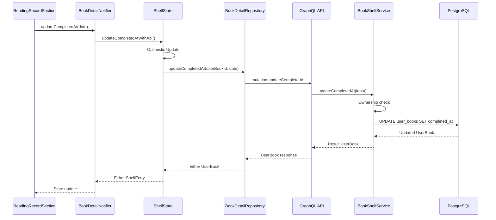
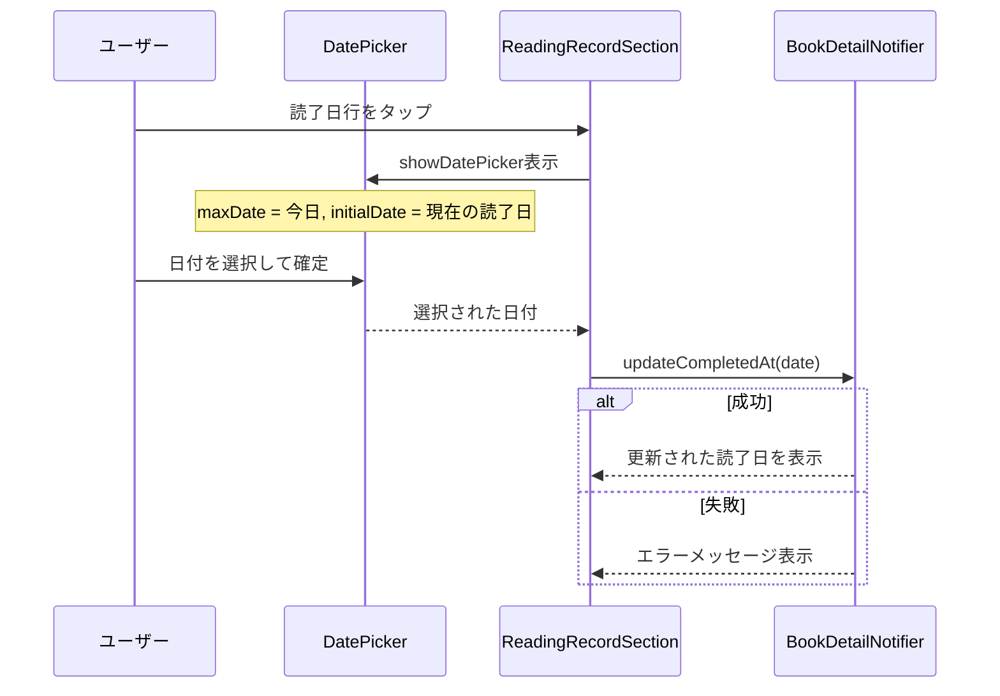
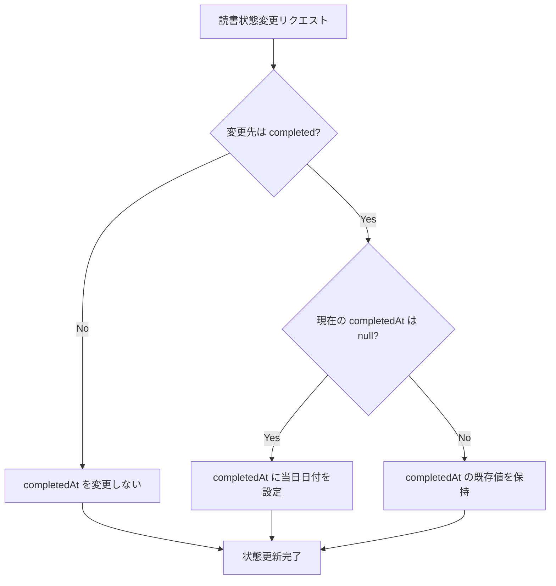

# Design Document: 読了日の手動更新

## Overview

本機能は、ユーザーが読了日（completedAt）を任意の日付に手動で変更できるようにする。現在、読了日は読書状態を「読了」に変更した際にシステムが自動で現在日時を設定するのみであり、過去に読み終えた本の日付を正確に記録できない。

**Users**: 本棚を利用するユーザーが、書籍詳細画面の読書記録セクションから読了日を編集する。

**Impact**: API に新しい Mutation（updateCompletedAt）を追加し、モバイルアプリの読書記録セクションに日付編集 UI を追加する。また、読書状態変更時の completedAt 自動設定ロジックを、既存値を保護する方式に変更する。

### Goals

- ユーザーが読了日を任意の日付に変更できること
- 読書状態変更時に手動設定済みの読了日を保護すること
- 既存の updateReadingStatus パターンに倣い、一貫性のある実装を行うこと

### Non-Goals

- 読書開始日（startedAt）の編集機能（本スコープ外）
- 時刻の入力・編集（日付のみを対象とする）
- 読了日の履歴管理（変更ログの記録）

## Architecture

### Existing Architecture Analysis

現在のシステムは以下のパターンで構成されている。

- **API**: Feature モジュールパターン（graphql.ts / service.ts / repository.ts）
- **Mobile**: Feature-first + Clean Architecture（Presentation / Application / Data / Domain）
- **状態管理**: ShelfState（SSOT）+ ShelfVersion による状態伝播
- **エラーハンドリング**: Result 型（API）/ Either 型（Mobile）

completedAt は `user_books` テーブルに既存のカラムとして存在し、`updateUserBook` リポジトリメソッドで更新可能である。新しいテーブルやカラムの追加は不要。

### Architecture Pattern & Boundary Map



**Architecture Integration**:
- 選定パターン: 既存の Mutation パターン（updateRating / updateReadingNote と同一構造）を踏襲
- ドメイン境界: books Feature 内で完結（新しい Feature モジュール不要）
- 既存パターン維持: Optimistic Update + API 呼び出し + ロールバック
- Steering 準拠: SSOT、ShelfVersion、Feature-first + Clean Architecture

### Technology Stack

| Layer | Choice / Version | Role in Feature | Notes |
|-------|------------------|-----------------|-------|
| Frontend | Flutter 3.x / Dart 3.x | 日付選択 UI、状態管理 | 標準の showDatePicker を使用 |
| Backend | Node.js 24+ / Pothos 4.x | GraphQL Mutation 定義 | 既存の builder パターンを踏襲 |
| Data | PostgreSQL 16+ / Drizzle ORM | completedAt カラム更新 | 既存カラム、マイグレーション不要 |

## System Flows

### 読了日更新フロー



### 読書状態変更時の completedAt 管理フロー



## Requirements Traceability

| Requirement | Summary | Components | Interfaces | Flows |
|-------------|---------|------------|------------|-------|
| 1.1 | 読了日タップで日付選択 UI 表示 | ReadingRecordSection | onCompletedAtTap callback | 読了日更新フロー |
| 1.2 | 選択された日付で読了日更新 | BookDetailNotifier, ShelfState | updateCompletedAt, updateCompletedAtWithApi | 読了日更新フロー |
| 1.3 | 更新後の読了日を即座に反映 | ReadingRecordSection, ShelfState | Optimistic Update | 読了日更新フロー |
| 1.4 | 読了以外では読了日編集非表示 | ReadingRecordSection | isCompleted 条件 | - |
| 1.5 | 更新失敗時エラーメッセージ表示 | ReadingRecordSection | SnackBar | 読了日更新フロー |
| 2.1 | API で completedAt を更新 | updateCompletedAt Mutation, BookShelfService | updateCompletedAt service method | 読了日更新フロー |
| 2.2 | 所有者検証 | BookShelfService | ownership check | 読了日更新フロー |
| 2.3 | BOOK_NOT_FOUND エラー | BookShelfService | BookShelfErrors | 読了日更新フロー |
| 2.4 | FORBIDDEN エラー | BookShelfService | BookShelfErrors | 読了日更新フロー |
| 2.5 | 更新後 UserBook 返却 | updateCompletedAt Mutation | UserBook type | 読了日更新フロー |
| 3.1 | 未来日付の選択不可 | ReadingRecordSection | showDatePicker lastDate | - |
| 3.2 | 追加日より前の日付も選択可 | ReadingRecordSection | showDatePicker firstDate | - |
| 3.3 | 日付のみ対象、時刻不要 | ReadingRecordSection, API | Date 型（時刻なし） | - |
| 4.1 | completed 変更時 null なら自動設定 | BookShelfService | resolveCompletedAt 改修 | 状態変更フロー |
| 4.2 | completed 変更時 null でなければ保持 | BookShelfService | resolveCompletedAt 改修 | 状態変更フロー |
| 4.3 | completed 以外への変更時も保持 | BookShelfService | resolveCompletedAt 改修 | 状態変更フロー |

## Components and Interfaces

| Component | Domain/Layer | Intent | Req Coverage | Key Dependencies | Contracts |
|-----------|-------------|--------|--------------|------------------|-----------|
| updateCompletedAt Mutation | API / GraphQL | 読了日更新エンドポイント | 2.1, 2.2, 2.3, 2.4, 2.5 | BookShelfService (P0) | API |
| BookShelfService.updateCompletedAt | API / Domain | 読了日更新ビジネスロジック | 2.1, 2.2, 2.3, 2.4, 2.5, 3.3 | BookShelfRepository (P0) | Service |
| BookShelfService.updateReadingStatus (改修) | API / Domain | completedAt 保護ロジック | 4.1, 4.2, 4.3 | BookShelfRepository (P0) | Service |
| update_completed_at.graphql | Mobile / Data | GraphQL Mutation 定義 | 2.1 | Ferry (P0) | API |
| BookDetailRepository.updateCompletedAt | Mobile / Data | API 呼び出し | 2.1, 2.5 | Ferry Client (P0) | Service |
| ShelfState.updateCompletedAtWithApi | Mobile / Application | 状態更新 + API 呼び出し | 1.2, 1.3 | BookDetailRepository (P0) | State |
| BookDetailNotifier.updateCompletedAt | Mobile / Application | UI からの操作起点 | 1.2 | ShelfState (P0) | Service |
| ReadingRecordSection (改修) | Mobile / Presentation | 読了日の編集 UI | 1.1, 1.4, 1.5, 3.1, 3.2, 3.3 | BookDetailNotifier (P0) | State |
| ShelfState._resolveCompletedAt (改修) | Mobile / Application | Optimistic Update の completedAt 解決 | 4.1, 4.2, 4.3 | - | - |

### API Layer

#### updateCompletedAt Mutation

| Field | Detail |
|-------|--------|
| Intent | ユーザーの読了日を手動で更新するための GraphQL Mutation |
| Requirements | 2.1, 2.2, 2.3, 2.4, 2.5, 3.3 |

**Responsibilities & Constraints**
- 認証済みユーザーのみアクセス可能（authScopes: loggedIn）
- 入力値は userBookId（Int!）と completedAt（DateTime!）
- completedAt は日付精度で保存（時刻部分は UTC 00:00:00 に正規化）

**Dependencies**
- Inbound: GraphQL Client (Mobile) -- Mutation 呼び出し (P0)
- Outbound: BookShelfService.updateCompletedAt -- ビジネスロジック委譲 (P0)
- Outbound: UserService.getUserByFirebaseUid -- ユーザー ID 解決 (P0)

**Contracts**: API [x]

##### API Contract

| Method | Endpoint | Request | Response | Errors |
|--------|----------|---------|----------|--------|
| Mutation | updateCompletedAt | userBookId: Int!, completedAt: DateTime! | UserBook! | UNAUTHENTICATED, USER_NOT_FOUND, BOOK_NOT_FOUND, FORBIDDEN |

#### BookShelfService.updateCompletedAt

| Field | Detail |
|-------|--------|
| Intent | 読了日更新のビジネスロジック（所有者検証 + DB 更新） |
| Requirements | 2.1, 2.2, 2.3, 2.4, 2.5 |

**Responsibilities & Constraints**
- 対象の userBook の存在確認と所有者検証を行う
- 既存の updateRating / updateReadingNote と同一のパターンを踏襲
- completedAt の値をそのまま repository.updateUserBook に渡す（日付バリデーションはクライアント側で実施）

**Dependencies**
- Inbound: updateCompletedAt Mutation -- Mutation Resolver から呼び出し (P0)
- Outbound: BookShelfRepository.updateUserBook -- DB 更新 (P0)

**Contracts**: Service [x]

##### Service Interface

```typescript
interface UpdateCompletedAtInput {
  userBookId: number;
  userId: number;
  completedAt: Date;
}

// BookShelfService に追加
interface BookShelfService {
  // ... existing methods ...
  updateCompletedAt(
    input: UpdateCompletedAtInput,
  ): Promise<Result<UserBook, BookShelfErrors>>;
}
```

- Preconditions: userBookId が存在し、userId が所有者であること
- Postconditions: completedAt が指定された日付で更新され、更新後の UserBook が返却される
- Invariants: 所有者以外は更新不可

#### BookShelfService.updateReadingStatus (改修)

| Field | Detail |
|-------|--------|
| Intent | 読書状態変更時の completedAt 自動設定ロジックを改修 |
| Requirements | 4.1, 4.2, 4.3 |

**Responsibilities & Constraints**
- `resolveCompletedAt` 関数を改修し、既存の completedAt 値を考慮する
- completed に変更する場合: 既存の completedAt が null なら現在日時を設定、null でなければ保持
- completed 以外に変更する場合: completedAt をクリアせず保持

**Contracts**: Service [x]

##### Service Interface

```typescript
// 現在の実装
function resolveCompletedAt(status: ReadingStatusValue): Date | null {
  return status === "completed" ? new Date() : null;
}

// 改修後
function resolveCompletedAt(
  status: ReadingStatusValue,
  currentCompletedAt: Date | null,
): Date | null {
  if (status === "completed") {
    return currentCompletedAt ?? new Date();
  }
  return currentCompletedAt;
}
```

- Preconditions: 読書状態変更リクエストが受信されていること
- Postconditions: completedAt が要件 4.1-4.3 に従って適切に設定されること

**Implementation Notes**
- Integration: `updateReadingStatus` 内の `resolveCompletedAt` 呼び出しに `userBook.completedAt` を渡す
- Integration: `addBookToShelf` 内の `resolveCompletedAt` 呼び出しにも同様の変更が必要（新規追加時は currentCompletedAt = null）
- Risks: 既存テストの修正が必要（resolveCompletedAt のシグネチャ変更）

### Mobile Data Layer

#### update_completed_at.graphql

| Field | Detail |
|-------|--------|
| Intent | 読了日更新 Mutation の GraphQL 定義 |
| Requirements | 2.1 |

**Contracts**: API [x]

##### API Contract

```graphql
mutation UpdateCompletedAt($userBookId: Int!, $completedAt: DateTime!) {
  updateCompletedAt(userBookId: $userBookId, completedAt: $completedAt) {
    id
    externalId
    title
    authors
    publisher
    publishedDate
    isbn
    coverImageUrl
    addedAt
    readingStatus
    completedAt
    note
    noteUpdatedAt
    rating
  }
}
```

**Implementation Notes**
- Integration: Ferry コード生成で `GUpdateCompletedAtReq` / `GUpdateCompletedAtData` が生成される
- Integration: 既存の update_rating.graphql / update_reading_status.graphql と同一のレスポンスフィールド構成

#### BookDetailRepository.updateCompletedAt

| Field | Detail |
|-------|--------|
| Intent | 読了日更新 API の呼び出しとレスポンス変換 |
| Requirements | 2.1, 2.5 |

**Responsibilities & Constraints**
- 既存の updateRating / updateReadingNote メソッドと同一のパターンを踏襲
- Ferry Client 経由で GraphQL Mutation を実行
- レスポンスを UserBook ドメインモデルに変換

**Dependencies**
- Inbound: ShelfState.updateCompletedAtWithApi -- 状態管理から呼び出し (P0)
- Outbound: Ferry Client -- GraphQL 通信 (P0)

**Contracts**: Service [x]

##### Service Interface

```dart
// BookDetailRepository に追加
Future<Either<Failure, UserBook>> updateCompletedAt({
  required int userBookId,
  required DateTime completedAt,
});
```

### Mobile Application Layer

#### ShelfState.updateCompletedAtWithApi

| Field | Detail |
|-------|--------|
| Intent | Optimistic Update + API 呼び出しによる読了日更新 |
| Requirements | 1.2, 1.3 |

**Responsibilities & Constraints**
- 既存の updateRatingWithApi / updateReadingNoteWithApi と同一のパターンを踏襲
- Optimistic Update: API 呼び出し前に状態を即座に更新
- ロールバック: API 失敗時に元の状態に復元

**Dependencies**
- Inbound: BookDetailNotifier.updateCompletedAt -- Notifier から呼び出し (P0)
- Outbound: BookDetailRepository.updateCompletedAt -- API 呼び出し (P0)

**Contracts**: State [x]

##### State Management

```dart
// ShelfState に追加
Future<Either<Failure, ShelfEntry>> updateCompletedAtWithApi({
  required String externalId,
  required DateTime completedAt,
});
```

- State model: ShelfEntry.completedAt を更新
- Persistence: API 経由で永続化
- Concurrency: Optimistic Update + ロールバック

**Implementation Notes**
- Integration: ShelfVersion の increment は不要（completedAt の変更は本棚の構成に影響しないため、updateRatingWithApi と同様）
- Risks: Optimistic Update 中にユーザーが画面遷移した場合のロールバック漏れ（既存パターンと同一リスク）

#### ShelfState._resolveCompletedAt (改修)

| Field | Detail |
|-------|--------|
| Intent | Mobile 側の Optimistic Update における completedAt 解決ロジック |
| Requirements | 4.1, 4.2, 4.3 |

**Contracts**: State [x]

##### State Management

```dart
// 現在の実装
static DateTime? _resolveCompletedAt(ReadingStatus status) {
  return status == ReadingStatus.completed ? DateTime.now() : null;
}

// 改修後
static DateTime? _resolveCompletedAt(
  ReadingStatus status,
  DateTime? currentCompletedAt,
) {
  if (status == ReadingStatus.completed) {
    return currentCompletedAt ?? DateTime.now();
  }
  return currentCompletedAt;
}
```

- State model: _updateReadingStatusOptimistic 内で既存の completedAt を参照して解決
- Consistency: API 側の resolveCompletedAt と同一ロジック

#### BookDetailNotifier.updateCompletedAt

| Field | Detail |
|-------|--------|
| Intent | UI からの読了日更新操作の起点 |
| Requirements | 1.2 |

**Responsibilities & Constraints**
- 既存の updateRating / updateReadingNote と同一のパターンを踏襲
- ShelfState の存在確認後、updateCompletedAtWithApi を呼び出す

**Contracts**: Service [x]

##### Service Interface

```dart
// BookDetailNotifier に追加
Future<Either<Failure, ShelfEntry>> updateCompletedAt({
  required int userBookId,
  required DateTime completedAt,
});
```

### Mobile Presentation Layer

#### ReadingRecordSection (改修)

| Field | Detail |
|-------|--------|
| Intent | 読了日行にタップ可能な編集機能を追加 |
| Requirements | 1.1, 1.4, 1.5, 3.1, 3.2, 3.3 |

**Responsibilities & Constraints**
- 読書状態が「読了」の場合のみ、読了日行をタップ可能にする（1.4）
- タップ時に showDatePicker を表示する（1.1）
- lastDate を DateTime.now() に設定して未来日付を選択不可にする（3.1）
- firstDate を十分過去の日付（例: 2000年1月1日）に設定する（3.2）
- initialDate を現在の completedAt に設定する
- 日付選択後に onCompletedAtChanged コールバックを呼び出す
- 時刻は関与せず、選択された日付のみを使用する（3.3）

**Dependencies**
- Inbound: BookDetailScreen -- ウィジェットツリーから呼び出し (P0)
- Outbound: BookDetailNotifier.updateCompletedAt -- 日付更新操作 (P0)

**Contracts**: State [x]

##### State Management

```dart
// ReadingRecordSection のコンストラクタに追加
final ValueChanged<DateTime>? onCompletedAtTap;
```

**Implementation Notes**
- Integration: 読了日行の `_buildTableRow` に `onTap` パラメータを追加。現在は onTap なしの静的表示だが、isCompleted 条件下でタップ可能にする
- Validation: showDatePicker の lastDate / firstDate で日付範囲を制御
- Risks: DatePicker のロケール設定（日本語表示）は Flutter の localizations 設定に依存

## Data Models

### Domain Model

**UserBook エンティティ（既存）**:
- `completedAt: DateTime?` -- 既存フィールド、変更なし
- 読了日の更新は単一フィールドの更新であり、トランザクション境界の拡張は不要

**ビジネスルール（変更）**:
- completedAt は読書状態が「読了」の場合に手動設定可能
- 読書状態を「読了」に変更する際、completedAt が null なら自動設定、null でなければ保持
- 読書状態を「読了」以外に変更する際、completedAt は保持される（クリアしない）

### Logical Data Model

**user_books テーブル（既存カラム、変更なし）**:

| Column | Type | Nullable | Description |
|--------|------|----------|-------------|
| completed_at | timestamp with time zone | Yes | 読了日 |

- スキーマ変更: なし（既存カラムを使用）
- マイグレーション: 不要
- インデックス: 既存のまま（completedAt でのソートは既に対応済み）

## Error Handling

### Error Strategy

既存の BookShelfErrors パターンを踏襲する。新しいエラーコードの追加は不要。

### Error Categories and Responses

| Error | HTTP Level | Condition | User Message |
|-------|------------|-----------|--------------|
| UNAUTHENTICATED | 401 | 未認証ユーザー | 再度ログインしてください |
| USER_NOT_FOUND | 404 | ユーザーが存在しない | ユーザーが見つかりません |
| BOOK_NOT_FOUND | 404 | 対象の本が存在しない | 本が見つかりません |
| FORBIDDEN | 403 | 所有者以外のアクセス | この本を更新する権限がありません |
| DATABASE_ERROR | 500 | DB 更新失敗 | サーバーエラーが発生しました |

### Monitoring

- 既存のロギングパターン（Pino）を踏襲
- 読了日更新の成功/失敗をログ出力

## Testing Strategy

### Unit Tests (API)

- BookShelfService.updateCompletedAt: 正常系（completedAt 更新成功）
- BookShelfService.updateCompletedAt: BOOK_NOT_FOUND エラー
- BookShelfService.updateCompletedAt: FORBIDDEN エラー
- BookShelfService.updateReadingStatus: completed 変更時に null なら自動設定
- BookShelfService.updateReadingStatus: completed 変更時に既存値保持

### Unit Tests (Mobile)

- ShelfState.updateCompletedAtWithApi: 成功時の状態更新
- ShelfState.updateCompletedAtWithApi: 失敗時のロールバック
- ShelfState._resolveCompletedAt: completed で null なら DateTime.now()
- ShelfState._resolveCompletedAt: completed で既存値なら保持
- ShelfState._resolveCompletedAt: completed 以外で既存値保持
- BookDetailNotifier.updateCompletedAt: ShelfState 経由の呼び出し

### Integration Tests (API)

- updateCompletedAt Mutation の E2E テスト（GraphQL 統合テスト）
- updateReadingStatus Mutation の completedAt 保護の確認

### Widget Tests (Mobile)

- ReadingRecordSection: 読了状態で読了日行がタップ可能
- ReadingRecordSection: 読了以外で読了日行が非表示
- ReadingRecordSection: 日付選択後のコールバック呼び出し
