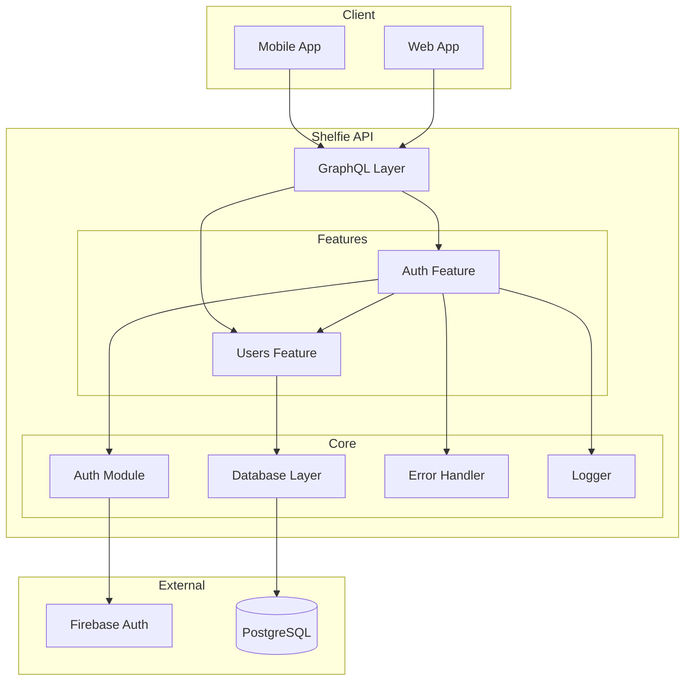
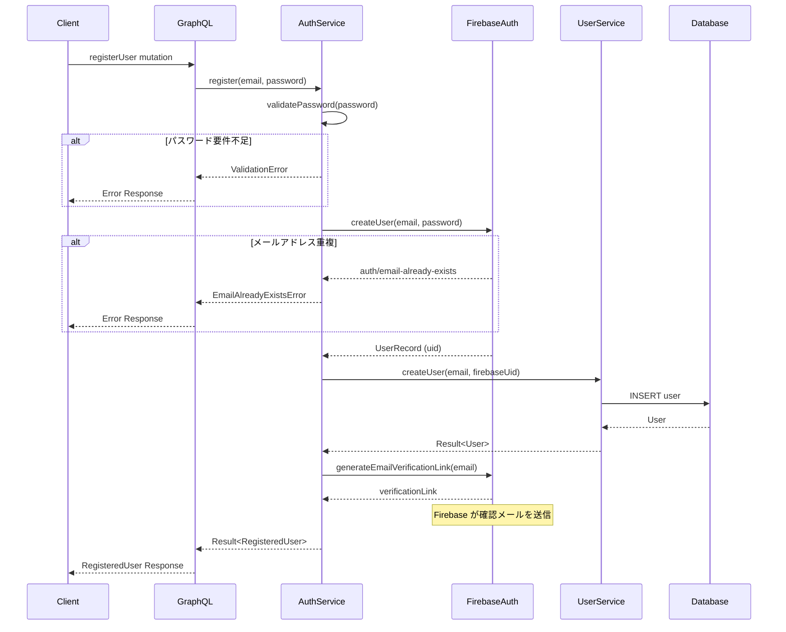
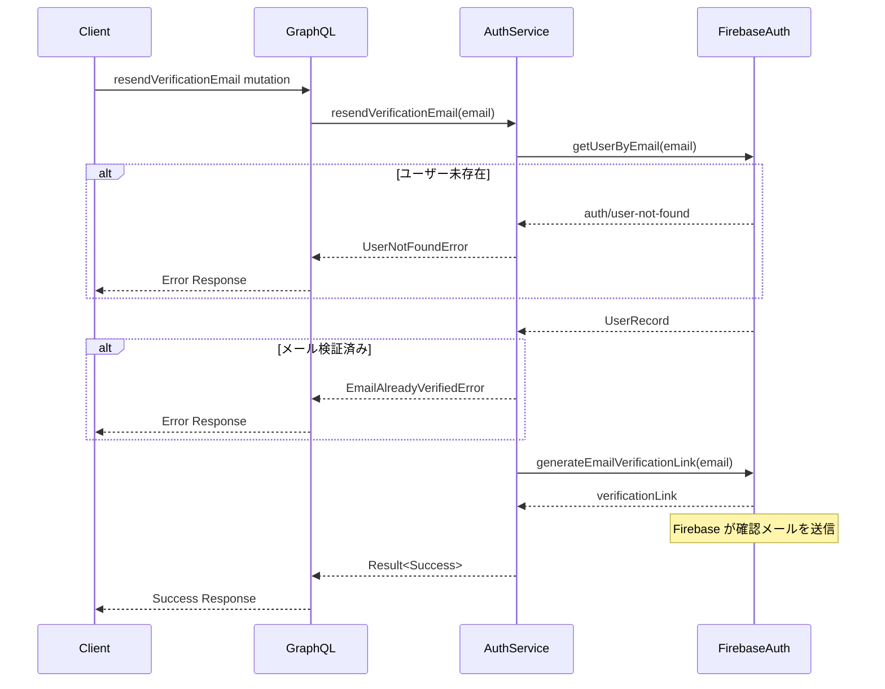

# Design Document

## Overview

**Purpose**: 本機能は、Shelfie API にメールアドレス/パスワード認証によるユーザー新規登録機能を提供する。Firebase Authentication を認証基盤として利用し、メールアドレス検証を通じてアカウントセキュリティを確保する。

**Users**: 新規ユーザーがアカウントを作成し、クライアントアプリケーション（モバイル/Web）が GraphQL API 経由でユーザー登録処理を実行する。

**Impact**: 既存の `users` Feature モジュールを拡張し、`auth` Feature モジュールを新設して認証関連のビジネスロジックを分離する。既存の Firebase Admin SDK 初期化処理とユーザースキーマを活用する。

### Goals

- Firebase Authentication を使用したメールアドレス/パスワードによるユーザー登録
- メールアドレス検証リンクの生成と確認メール再送信機能
- パスワードセキュリティ要件（8文字以上）の強制
- 明確なエラーハンドリングとユーザー向けメッセージの提供

### Non-Goals

- ソーシャルログイン（Google, Apple, Facebook 等）の実装
- パスワードリセット機能（別機能として実装予定）
- 多要素認証（MFA）の実装
- カスタムメールテンプレートの送信（Firebase 標準テンプレートを使用）

## Architecture

### Existing Architecture Analysis

現在のシステムは以下の構成を持つ:

- **Firebase Admin SDK**: `src/auth/firebase.ts` で初期化済み、IDトークン検証機能が実装済み
- **Users Feature**: `src/features/users/` に Service/Repository/Types パターンで実装済み
- **Users Schema**: `src/db/schema/users.ts` に基本的なユーザーテーブル定義あり（id, email, createdAt, updatedAt）
- **Result 型**: `src/errors/result.ts` で明示的なエラーハンドリングパターンが確立済み
- **GraphQL Builder**: Pothos を使用した Code-first スキーマ構築が確立済み

### Architecture Pattern & Boundary Map



**Architecture Integration**:
- **Selected pattern**: Feature-first + Clean Architecture（既存パターンを継承）
- **Domain/feature boundaries**: Auth Feature が認証ロジックを担当、Users Feature がユーザーデータ永続化を担当
- **Existing patterns preserved**: Service/Repository 分離、Result 型によるエラーハンドリング、FeatureModule インターフェース
- **New components rationale**: Auth Feature を新設し、認証関連のビジネスロジックを Users Feature から分離することで単一責任原則を維持
- **Steering compliance**: Feature モジュール構成規則に従い、Core モジュールへの依存方向を遵守

### Technology Stack

| Layer | Choice / Version | Role in Feature | Notes |
|-------|------------------|-----------------|-------|
| Backend | Node.js 24+, Express 4.x | HTTP サーバー | 既存 |
| GraphQL | Apollo Server 5.x, Pothos 4.x | スキーマ定義、Mutation 実装 | 既存 |
| Auth | firebase-admin 13.6.0 | ユーザー作成、メール検証リンク生成 | 既存インストール済み |
| Data | PostgreSQL 16+, Drizzle ORM 0.45+ | ユーザーデータ永続化 | 既存 |
| Validation | 組み込み | パスワード要件検証 | 新規実装 |

## System Flows

### ユーザー新規登録フロー



### 確認メール再送信フロー



## Requirements Traceability

| Requirement | Summary | Components | Interfaces | Flows |
|-------------|---------|------------|------------|-------|
| 1.1 | Firebase にユーザー作成 | AuthService, FirebaseAuth | AuthService.register | 登録フロー |
| 1.2 | ローカル DB にユーザー保存 | UserService, UserRepository | UserService.createUser | 登録フロー |
| 1.3 | 確認メール送信 | AuthService, FirebaseAuth | generateEmailVerificationLink | 登録フロー |
| 1.4 | メールアドレス重複エラー | AuthService | AuthServiceErrors | 登録フロー |
| 1.5 | パスワード要件エラー | AuthService | validatePassword | 登録フロー |
| 2.1 | 確認メール自動送信 | AuthService | generateEmailVerificationLink | 登録フロー |
| 2.2 | メールアドレス検証（Firebase 側） | FirebaseAuth | - | Firebase 管理 |
| 2.3 | 未検証ユーザーの識別 | AuthService, GraphQL Context | emailVerified フラグ | 認証コンテキスト |
| 2.4 | 確認メール再送信 | AuthService | resendVerificationEmail | 再送信フロー |
| 2.5 | レート制限エラー | AuthService | AuthServiceErrors | 再送信フロー |
| 3.1 | パスワード 8 文字以上 | AuthService | validatePassword | 登録フロー |
| 3.2 | パスワードバリデーションエラー | AuthService | ValidationError | 登録フロー |
| 3.3 | パスワード要件充足時の処理続行 | AuthService | register | 登録フロー |
| 4.1 | 登録用 GraphQL Mutation | GraphQL Types | registerUser | 登録フロー |
| 4.2 | 再送信用 GraphQL Mutation | GraphQL Types | resendVerificationEmail | 再送信フロー |
| 4.3 | 成功時のユーザー情報返却 | GraphQL Types | RegisterUserPayload | 登録フロー |
| 4.4 | 失敗時のエラー返却 | GraphQL Types | AuthError | 両フロー |
| 5.1 | Firebase エラーの変換 | AuthService | mapFirebaseError | 両フロー |
| 5.2 | ネットワークエラーの処理 | AuthService | NetworkError | 両フロー |
| 5.3 | バリデーションエラーの明示 | AuthService | ValidationError | 両フロー |
| 5.4 | エラーログ記録 | Logger | logger.error | 両フロー |

## Components and Interfaces

### Component Summary

| Component | Domain/Layer | Intent | Req Coverage | Key Dependencies | Contracts |
|-----------|--------------|--------|--------------|------------------|-----------|
| AuthService | Auth Feature / Domain | 認証ビジネスロジックの実行 | 1.1-1.5, 2.1, 2.3-2.5, 3.1-3.3, 5.1-5.4 | FirebaseAuth (P0), UserService (P0), Logger (P1) | Service |
| AuthTypes | Auth Feature / GraphQL | GraphQL 型定義と Mutation 実装 | 4.1-4.4 | AuthService (P0), Pothos Builder (P0) | API |
| UserRepository | Users Feature / Data | ユーザーデータアクセス（拡張） | 1.2 | Drizzle (P0), users table (P0) | Service |
| UserService | Users Feature / Domain | ユーザードメインロジック（拡張） | 1.2 | UserRepository (P0) | Service |

### Auth Feature / Domain Layer

#### AuthService

| Field | Detail |
|-------|--------|
| Intent | Firebase Authentication と連携したユーザー登録・メール検証ロジックの実行 |
| Requirements | 1.1, 1.2, 1.3, 1.4, 1.5, 2.1, 2.3, 2.4, 2.5, 3.1, 3.2, 3.3, 5.1, 5.2, 5.3, 5.4 |

**Responsibilities & Constraints**
- Firebase Authentication へのユーザー作成リクエストの送信
- パスワードセキュリティ要件の検証（8文字以上）
- メールアドレス検証リンクの生成要求
- Firebase エラーコードからユーザー向けエラーメッセージへの変換
- 登録成功時のローカルデータベースへのユーザー情報保存の調整

**Dependencies**
- Outbound: FirebaseAuth (`firebase-admin/auth`) - ユーザー作成、検証リンク生成 (P0)
- Outbound: UserService - ローカルユーザーデータ作成 (P0)
- Outbound: Logger - エラーログ記録 (P1)
- Inbound: AuthTypes - GraphQL Resolver からの呼び出し (P0)

**Contracts**: Service [x] / API [ ] / Event [ ] / Batch [ ] / State [ ]

##### Service Interface

```typescript
interface RegisterUserInput {
  email: string;
  password: string;
}

interface RegisterUserOutput {
  user: User;
  firebaseUid: string;
  emailVerified: boolean;
}

interface ResendVerificationInput {
  email: string;
}

interface ResendVerificationOutput {
  success: boolean;
}

type AuthServiceError =
  | { code: "EMAIL_ALREADY_EXISTS"; message: string }
  | { code: "INVALID_PASSWORD"; message: string; requirements: string[] }
  | { code: "USER_NOT_FOUND"; message: string }
  | { code: "EMAIL_ALREADY_VERIFIED"; message: string }
  | { code: "RATE_LIMIT_EXCEEDED"; message: string; retryAfter?: number }
  | { code: "NETWORK_ERROR"; message: string; retryable: boolean }
  | { code: "FIREBASE_ERROR"; message: string; originalCode: string };

interface AuthService {
  register(input: RegisterUserInput): Promise<Result<RegisterUserOutput, AuthServiceError>>;
  resendVerificationEmail(input: ResendVerificationInput): Promise<Result<ResendVerificationOutput, AuthServiceError>>;
}
```

- Preconditions:
  - `email` は有効なメールアドレス形式
  - `password` は空文字列でない
- Postconditions:
  - 登録成功時: Firebase と PostgreSQL の両方にユーザーが作成される
  - 登録成功時: Firebase から確認メールが送信される
- Invariants:
  - Firebase ユーザー作成失敗時、ローカル DB への保存は行わない
  - パスワードは Firebase に保存され、ローカル DB には保存しない

**Implementation Notes**
- Integration: Firebase Admin SDK の `createUser()` と `generateEmailVerificationLink()` を使用。Firebase がメール送信を処理するため、カスタム SMTP 設定は不要
- Validation: パスワード長検証は Firebase 呼び出し前にサービス層で実行し、早期エラー返却を実現
- Risks: Firebase と PostgreSQL 間のトランザクション整合性。Firebase 成功後の PostgreSQL 失敗時は Firebase ユーザーが残存するが、次回同一メールでの登録時に EMAIL_ALREADY_EXISTS エラーとなる。このエッジケースは将来的に補償トランザクションで対応検討

### Auth Feature / GraphQL Layer

#### AuthTypes

| Field | Detail |
|-------|--------|
| Intent | ユーザー登録関連の GraphQL 型定義と Mutation Resolver の実装 |
| Requirements | 4.1, 4.2, 4.3, 4.4 |

**Responsibilities & Constraints**
- `registerUser` Mutation の定義と実装
- `resendVerificationEmail` Mutation の定義と実装
- 入力型（Input Type）の定義
- レスポンス型（Payload Type）の定義
- エラー型の GraphQL 表現

**Dependencies**
- Outbound: AuthService - ビジネスロジック実行 (P0)
- Outbound: Pothos Builder - スキーマ構築 (P0)
- Inbound: GraphQL Client - Mutation リクエスト (P0)

**Contracts**: Service [ ] / API [x] / Event [ ] / Batch [ ] / State [ ]

##### API Contract

| Method | Endpoint | Request | Response | Errors |
|--------|----------|---------|----------|--------|
| POST | /graphql (registerUser) | RegisterUserInput | RegisterUserPayload | EMAIL_ALREADY_EXISTS, INVALID_PASSWORD, NETWORK_ERROR |
| POST | /graphql (resendVerificationEmail) | ResendVerificationEmailInput | ResendVerificationEmailPayload | USER_NOT_FOUND, EMAIL_ALREADY_VERIFIED, RATE_LIMIT_EXCEEDED |

**GraphQL Schema Definition**

```graphql
input RegisterUserInput {
  email: String!
  password: String!
}

type RegisterUserPayload {
  user: User
  error: AuthError
}

input ResendVerificationEmailInput {
  email: String!
}

type ResendVerificationEmailPayload {
  success: Boolean!
  error: AuthError
}

type AuthError {
  code: AuthErrorCode!
  message: String!
  field: String
  retryable: Boolean!
}

enum AuthErrorCode {
  EMAIL_ALREADY_EXISTS
  INVALID_PASSWORD
  USER_NOT_FOUND
  EMAIL_ALREADY_VERIFIED
  RATE_LIMIT_EXCEEDED
  NETWORK_ERROR
  INTERNAL_ERROR
}
```

**Implementation Notes**
- Integration: Pothos の `mutationType` 拡張パターンを使用し、既存の `builder.queryType` と同様のパターンで実装
- Validation: GraphQL 層では型検証のみ実施、ビジネスバリデーションは AuthService に委譲
- Risks: なし

### Users Feature / Data Layer

#### UserRepository (Extension)

| Field | Detail |
|-------|--------|
| Intent | Firebase UID によるユーザー検索機能の追加 |
| Requirements | 1.2 |

**Responsibilities & Constraints**
- 既存の `findByEmail` に加え、`findByFirebaseUid` メソッドを追加
- Firebase UID を含むユーザー作成機能の拡張

**Dependencies**
- Outbound: Drizzle ORM - データアクセス (P0)
- Outbound: users table - スキーマ定義 (P0)
- Inbound: UserService - データ操作要求 (P0)

**Contracts**: Service [x] / API [ ] / Event [ ] / Batch [ ] / State [ ]

##### Service Interface

```typescript
interface UserRepository {
  // 既存メソッド
  findById(id: number): Promise<User | null>;
  findByEmail(email: string): Promise<User | null>;
  findMany(filter: Partial<User>): Promise<User[]>;
  create(data: NewUser): Promise<User>;
  update(id: number, data: Partial<User>): Promise<User>;
  delete(id: number): Promise<void>;

  // 新規追加
  findByFirebaseUid(firebaseUid: string): Promise<User | null>;
}
```

**Implementation Notes**
- Integration: 既存の Repository パターンを踏襲し、新規メソッドを追加
- Validation: なし（Service 層で実施）
- Risks: なし

### Users Feature / Domain Layer

#### UserService (Extension)

| Field | Detail |
|-------|--------|
| Intent | Firebase UID 付きユーザー作成機能の追加 |
| Requirements | 1.2 |

**Responsibilities & Constraints**
- Firebase UID を含むユーザー作成メソッドの追加
- 既存の `createUser` との互換性維持

**Dependencies**
- Outbound: UserRepository - データアクセス (P0)
- Inbound: AuthService - ユーザー作成要求 (P0)

**Contracts**: Service [x] / API [ ] / Event [ ] / Batch [ ] / State [ ]

##### Service Interface

```typescript
interface CreateUserWithFirebaseInput {
  email: string;
  firebaseUid: string;
}

interface UserService {
  // 既存メソッド
  getUserById(input: GetUserInput): Promise<Result<User, UserServiceErrors>>;
  createUser(input: CreateUserInput): Promise<Result<User, UserServiceErrors>>;
  getUsers(): Promise<Result<User[], DomainError>>;

  // 新規追加
  createUserWithFirebase(input: CreateUserWithFirebaseInput): Promise<Result<User, UserServiceErrors>>;
  getUserByFirebaseUid(firebaseUid: string): Promise<Result<User, UserServiceErrors>>;
}
```

**Implementation Notes**
- Integration: 既存の Service パターンを踏襲
- Validation: メールアドレス重複チェックは既存ロジックを再利用
- Risks: なし

## Data Models

### Domain Model

**Entities**:
- **User**: システム内のユーザーを表すエンティティ
  - Attributes: id, email, firebaseUid, createdAt, updatedAt
  - Invariants: email は一意、firebaseUid は一意

**Value Objects**:
- **Email**: 有効なメールアドレス形式を保証
- **Password**: セキュリティ要件を満たすパスワード（永続化しない）

**Domain Events**:
- `UserRegistered`: ユーザー登録完了時に発生（将来的な拡張用）

### Logical Data Model

**User Entity**:

| Attribute | Type | Constraints | Description |
|-----------|------|-------------|-------------|
| id | integer | PK, auto-increment | 内部識別子 |
| email | text | NOT NULL, UNIQUE | メールアドレス |
| firebaseUid | text | NOT NULL, UNIQUE | Firebase ユーザー ID |
| createdAt | timestamp | NOT NULL, DEFAULT now() | 作成日時 |
| updatedAt | timestamp | NOT NULL, DEFAULT now() | 更新日時 |

**Consistency & Integrity**:
- `email` と `firebaseUid` の両方に UNIQUE 制約を設定
- Firebase と PostgreSQL 間の結果整合性を許容

### Physical Data Model

**users テーブル（拡張）**:

```sql
ALTER TABLE users
ADD COLUMN firebase_uid TEXT NOT NULL UNIQUE;

CREATE INDEX idx_users_firebase_uid ON users(firebase_uid);
```

**Drizzle Schema Definition**:

```typescript
import { integer, pgTable, text, timestamp } from "drizzle-orm/pg-core";

export const users = pgTable("users", {
  id: integer("id").primaryKey().generatedAlwaysAsIdentity(),
  email: text("email").notNull().unique(),
  firebaseUid: text("firebase_uid").notNull().unique(),
  createdAt: timestamp("created_at").defaultNow().notNull(),
  updatedAt: timestamp("updated_at").defaultNow().notNull(),
});

export type User = typeof users.$inferSelect;
export type NewUser = typeof users.$inferInsert;
```

## Error Handling

### Error Strategy

Firebase Authentication エラーをドメイン固有のエラーに変換し、ユーザー向けの明確なメッセージを提供する。

### Error Categories and Responses

**User Errors (4xx equivalent)**:
- `EMAIL_ALREADY_EXISTS`: 「このメールアドレスは既に使用されています」
- `INVALID_PASSWORD`: 「パスワードは8文字以上で入力してください」
- `USER_NOT_FOUND`: 「指定されたメールアドレスのユーザーが見つかりません」
- `EMAIL_ALREADY_VERIFIED`: 「メールアドレスは既に確認済みです」

**Rate Limiting (429)**:
- `RATE_LIMIT_EXCEEDED`: 「確認メールの送信回数が上限に達しました。しばらく時間をおいてから再度お試しください」

**System Errors (5xx equivalent)**:
- `NETWORK_ERROR`: 「ネットワークエラーが発生しました。再度お試しください」（retryable: true）
- `INTERNAL_ERROR`: 「予期しないエラーが発生しました」

### Firebase Error Code Mapping

| Firebase Error Code | Domain Error Code | User Message |
|---------------------|-------------------|--------------|
| auth/email-already-exists | EMAIL_ALREADY_EXISTS | このメールアドレスは既に使用されています |
| auth/invalid-password | INVALID_PASSWORD | パスワードが無効です |
| auth/weak-password | INVALID_PASSWORD | パスワードは8文字以上で入力してください |
| auth/user-not-found | USER_NOT_FOUND | 指定されたメールアドレスのユーザーが見つかりません |
| auth/too-many-requests | RATE_LIMIT_EXCEEDED | リクエストが多すぎます。しばらく時間をおいてから再度お試しください |
| auth/internal-error | INTERNAL_ERROR | 予期しないエラーが発生しました |
| auth/network-request-failed | NETWORK_ERROR | ネットワークエラーが発生しました |

### Monitoring

- すべてのエラーを Pino Logger で記録
- センシティブ情報（パスワード、トークン）はログから除外
- エラーコードとリクエスト ID を含めてトレーサビリティを確保

## Testing Strategy

### Unit Tests

- `AuthService.register`: パスワードバリデーション、Firebase 呼び出し、エラーマッピング
- `AuthService.resendVerificationEmail`: ユーザー存在確認、検証済みチェック、レート制限
- `AuthService.validatePassword`: 各種パスワード要件のテスト
- `mapFirebaseError`: Firebase エラーコードからドメインエラーへの変換
- `UserRepository.findByFirebaseUid`: Firebase UID によるユーザー検索

### Integration Tests

- ユーザー登録フロー（Firebase モック使用）: 正常系、メールアドレス重複、パスワード要件不足
- 確認メール再送信フロー: 正常系、ユーザー未存在、検証済みユーザー
- GraphQL Mutation テスト: registerUser、resendVerificationEmail
- データベース整合性: users テーブルへの正常な INSERT、UNIQUE 制約違反

### E2E Tests (Future)

- 実際の Firebase Authentication との連携テスト（ステージング環境）
- メール受信確認（メールテストサービス使用）

## Security Considerations

### Authentication & Authorization

- パスワードは Firebase Authentication にのみ保存、ローカル DB には保存しない
- Firebase ID Token による認証は既存の middleware を活用
- 登録 Mutation は認証不要（パブリックエンドポイント）

### Data Protection

- パスワードはログ出力から除外
- メールアドレスはログに記録するが、本番環境ではマスキングを検討
- Firebase 通信は HTTPS を使用

### Rate Limiting

- Firebase 側のレート制限に依存
- 将来的にアプリケーション層でのレート制限追加を検討（IP ベース）

## Performance & Scalability

### Target Metrics

- ユーザー登録レスポンス時間: p95 < 2000ms（Firebase API 呼び出しを含む）
- 確認メール再送信レスポンス時間: p95 < 1000ms

### Scalability Considerations

- Firebase Authentication のスケーラビリティに依存
- PostgreSQL への書き込みは単一レコードのため、スケーラビリティ上の懸念なし
- 将来的な大量ユーザー登録時は、非同期処理（キュー）への移行を検討
