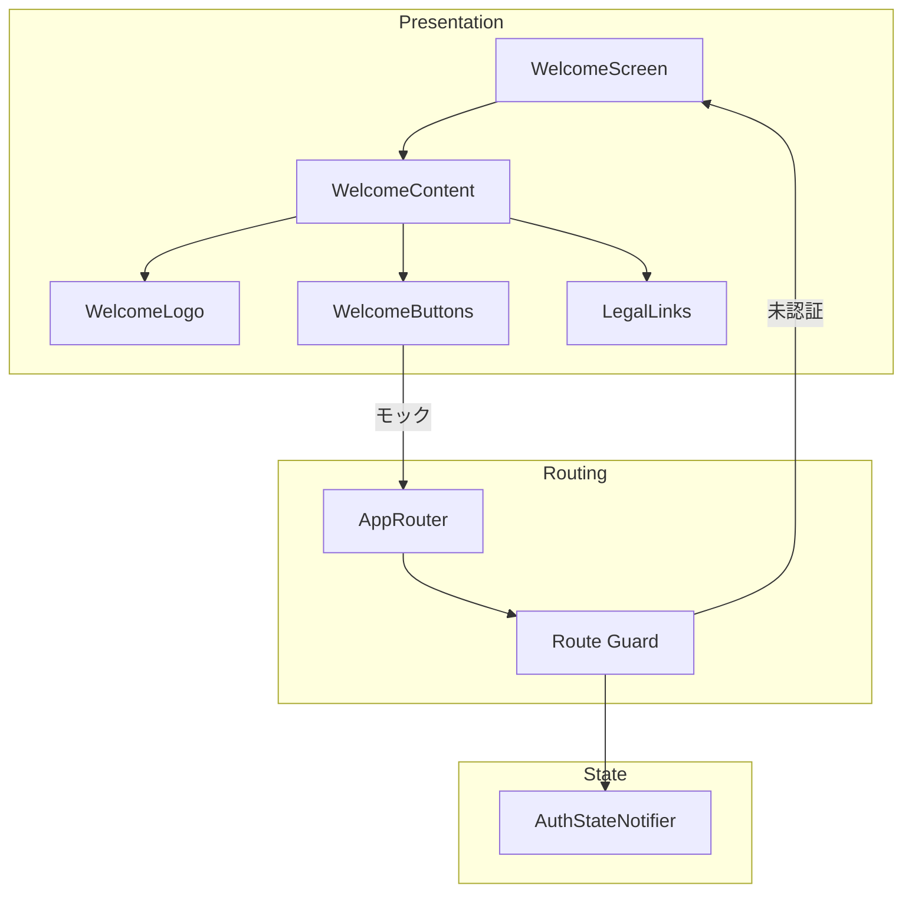
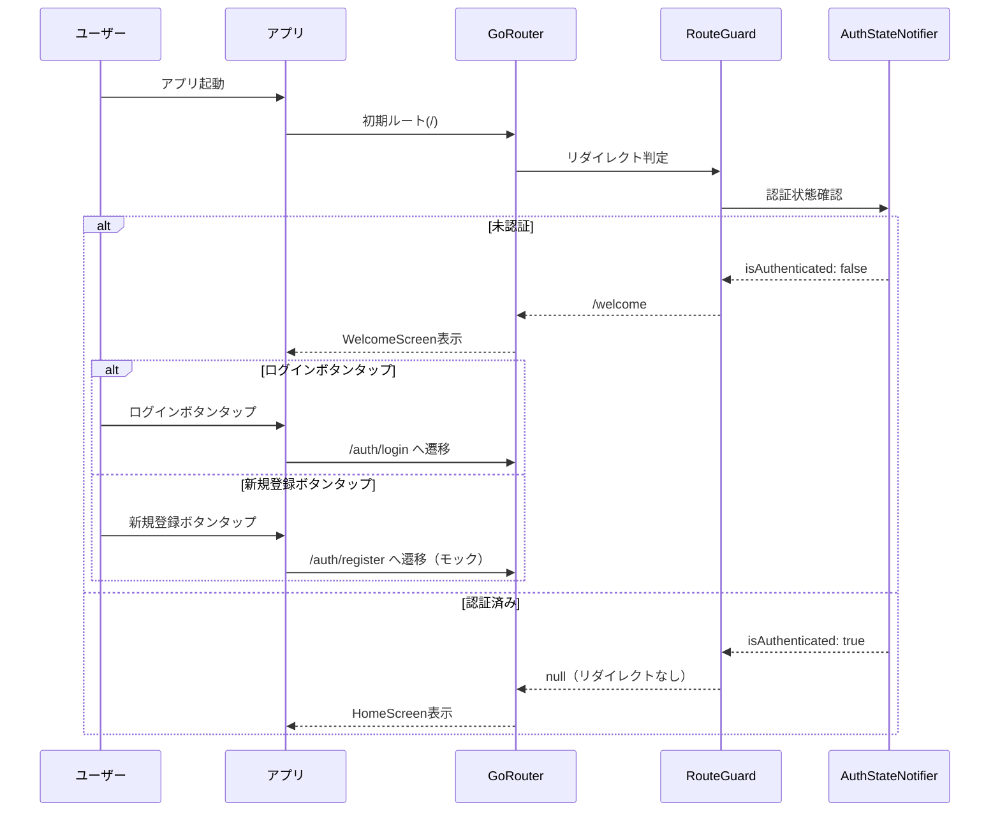

# Design Document

## Overview

**Purpose**: ウェルカム画面機能は、未認証ユーザーがアプリを起動した際に最初に表示される画面を提供する。アプリのブランドイメージを伝え、ログインまたは新規登録への導線を提供することで、ユーザーの第一印象を形成し、オンボーディングフローを開始する。

**Users**: 新規ユーザーおよび未ログイン状態の既存ユーザーが、アプリ起動時にこの画面を利用する。

**Impact**: 現在のルーティング構成を変更し、未認証時の初期画面をログイン画面からウェルカム画面に置き換える。既存の認証ガードロジックを拡張してウェルカム画面を新たなエントリーポイントとして統合する。

### Goals

- 未認証ユーザーに対してブランドイメージを伝えるウェルカム画面を表示する
- ログインと新規登録への明確な導線を提供する
- 利用規約・プライバシーポリシーへの同意を暗示的に取得する
- 既存のダークテーマおよびデザインシステムと一貫したUIを実現する
- 各種画面サイズ・デバイス向きに対応したレスポンシブレイアウトを実現する
- **アプリ全体で統一されたデザインシステム（カラーパレット、タイポグラフィ、スペーシング、ボタンスタイル）の基盤を確立する**

### Non-Goals

- Firebase Authenticationとの実際の連携（モック実装で対応）
- 実際の認証処理（ログイン・新規登録ボタンはモック動作）
- 利用規約・プライバシーポリシーの実コンテンツ表示（仮URL/動作）
- ライトモード対応（現時点ではダークモードのみ）
- ローカライゼーション対応（日本語固定）

## Design System

本ウェルカム画面の実装を機に、アプリ全体で統一されたデザインシステムの基盤を確立する。既存の `AppColors`, `AppTypography`, `AppSpacing`, `AppTheme` を拡張・更新する。

### Color Palette

#### Brand Colors

| Token | Hex | RGB | 用途 |
|-------|-----|-----|------|
| `brand.primary` | `#4FD1C5` | rgb(79, 209, 197) | ロゴ、アクセント、プライマリアクション |
| `brand.accent` | `#F6C94A` | rgb(246, 201, 74) | 星アイコン、ハイライト |
| `brand.background` | `#0A0A0A` | rgb(10, 10, 10) | メイン背景 |

#### Semantic Colors

| Token | Hex | 用途 |
|-------|-----|------|
| `surface.primary` | `#0A0A0A` | 画面背景 |
| `surface.elevated` | `#1A1A1A` | カード、モーダル背景 |
| `surface.overlay` | `rgba(0, 0, 0, 0.6)` | 背景画像上のオーバーレイ |
| `text.primary` | `#FFFFFF` | メインテキスト |
| `text.secondary` | `#A0A0A0` | サブテキスト、キャプション |
| `text.link` | `#FFFFFF` (underline) | リンクテキスト |
| `border.default` | `#FFFFFF` | ボタン枠線 |
| `border.muted` | `rgba(255, 255, 255, 0.3)` | 薄い枠線 |

#### Button Colors

| Token | Background | Text | Border |
|-------|------------|------|--------|
| `button.filled` | `#FFFFFF` | `#000000` | - |
| `button.outlined` | `transparent` | `#FFFFFF` | `#FFFFFF` |
| `button.text` | `transparent` | `#FFFFFF` | - |

### Typography

#### Font Family

| 用途 | Font Family | Fallback |
|------|-------------|----------|
| 全般 | `Noto Sans JP` | `system-ui, sans-serif` |
| ロゴ | `Noto Sans JP` (Bold) | `system-ui, sans-serif` |

**Note**: Google Fonts から `Noto Sans JP` を使用。pubspec.yaml で `google_fonts` パッケージを追加、または assets としてバンドル。

#### Type Scale (ウェルカム画面用)

| Token | Size | Weight | Letter Spacing | Line Height | 用途 |
|-------|------|--------|----------------|-------------|------|
| `display.logo` | 40px | 700 (Bold) | -0.5px | 1.2 | アプリ名「Shelfie」 |
| `body.tagline` | 16px | 400 (Regular) | 0.5px | 1.5 | キャッチコピー |
| `button.label` | 16px | 600 (SemiBold) | 0.25px | 1.0 | ボタンテキスト |
| `caption.legal` | 12px | 400 (Regular) | 0.2px | 1.4 | 利用規約テキスト |
| `caption.link` | 12px | 400 (Regular) | 0.2px | 1.4 | リンクテキスト（下線付き） |

### Spacing

既存の `AppSpacing` (4pt グリッド) を継続使用。

| Token | Value | 用途 |
|-------|-------|------|
| `spacing.xs` | 8px | アイテム間の最小間隔 |
| `spacing.sm` | 12px | テキスト間、アイコン間 |
| `spacing.md` | 16px | セクション内パディング |
| `spacing.lg` | 24px | セクション間 |
| `spacing.xl` | 32px | 大きなセクション間 |
| `spacing.xxl` | 48px | 画面端パディング（水平） |

### Border Radius

| Token | Value | 用途 |
|-------|-------|------|
| `radius.none` | 0px | - |
| `radius.sm` | 4px | 小さいチップ |
| `radius.md` | 8px | ボタン、カード |
| `radius.lg` | 12px | モーダル、大きいカード |
| `radius.full` | 9999px | 円形ボタン、アバター |

### Button Styles

#### Filled Button (ログインボタン)

```dart
FilledButton.styleFrom(
  backgroundColor: Colors.white,
  foregroundColor: Colors.black,
  minimumSize: Size(double.infinity, 56),
  shape: RoundedRectangleBorder(
    borderRadius: BorderRadius.circular(8),
  ),
  textStyle: TextStyle(
    fontSize: 16,
    fontWeight: FontWeight.w600,
  ),
)
```

#### Outlined Button (新規登録ボタン)

```dart
OutlinedButton.styleFrom(
  foregroundColor: Colors.white,
  minimumSize: Size(double.infinity, 56),
  side: BorderSide(color: Colors.white, width: 1.5),
  shape: RoundedRectangleBorder(
    borderRadius: BorderRadius.circular(8),
  ),
  textStyle: TextStyle(
    fontSize: 16,
    fontWeight: FontWeight.w600,
  ),
)
```

### Icon Specifications

#### App Logo Icon

| Property | Value |
|----------|-------|
| Size | 80 x 80 px |
| Book Color | `#4FD1C5` (brand.primary) |
| Star Color | `#F6C94A` (brand.accent) |
| Star Size | 24 x 24 px (ロゴ右上に配置) |
| Implementation | カスタム SVG または CustomPainter |

### Implementation: Theme Updates

#### AppColors 拡張

```dart
@immutable
class AppColors extends ThemeExtension<AppColors> {
  // 既存フィールド...

  // Brand colors (新規追加)
  final Color brandPrimary;
  final Color brandAccent;
  final Color brandBackground;

  // Surface colors (新規追加)
  final Color surfacePrimary;
  final Color surfaceElevated;
  final Color surfaceOverlay;

  // Text colors (新規追加)
  final Color textPrimary;
  final Color textSecondary;
  final Color textLink;

  static const dark = AppColors(
    // 既存...
    brandPrimary: Color(0xFF4FD1C5),
    brandAccent: Color(0xFFF6C94A),
    brandBackground: Color(0xFF0A0A0A),
    surfacePrimary: Color(0xFF0A0A0A),
    surfaceElevated: Color(0xFF1A1A1A),
    surfaceOverlay: Color(0x99000000), // 60% opacity
    textPrimary: Color(0xFFFFFFFF),
    textSecondary: Color(0xFFA0A0A0),
    textLink: Color(0xFFFFFFFF),
  );
}
```

#### AppTheme 更新

```dart
abstract final class AppTheme {
  // seedColor を brand.primary に変更
  static const seedColor = Color(0xFF4FD1C5);

  static ThemeData dark() {
    final colorScheme = ColorScheme.fromSeed(
      seedColor: seedColor,
      brightness: Brightness.dark,
      surface: const Color(0xFF0A0A0A),
      onSurface: Colors.white,
    );

    return ThemeData(
      useMaterial3: true,
      brightness: Brightness.dark,
      colorScheme: colorScheme,
      scaffoldBackgroundColor: const Color(0xFF0A0A0A),
      textTheme: AppTypography.textTheme,
      extensions: const [AppColors.dark],
      // Button themes
      filledButtonTheme: FilledButtonThemeData(
        style: FilledButton.styleFrom(
          backgroundColor: Colors.white,
          foregroundColor: Colors.black,
          minimumSize: const Size(double.infinity, 56),
          shape: RoundedRectangleBorder(
            borderRadius: BorderRadius.circular(8),
          ),
        ),
      ),
      outlinedButtonTheme: OutlinedButtonThemeData(
        style: OutlinedButton.styleFrom(
          foregroundColor: Colors.white,
          minimumSize: const Size(double.infinity, 56),
          side: const BorderSide(color: Colors.white, width: 1.5),
          shape: RoundedRectangleBorder(
            borderRadius: BorderRadius.circular(8),
          ),
        ),
      ),
    );
  }
}
```

### Design Tokens Summary

設計時に参照するデザイントークンの一覧:

| Category | File | Constants/Class |
|----------|------|-----------------|
| Colors | `app_colors.dart` | `AppColors.dark` |
| Typography | `app_typography.dart` | `AppTypography` |
| Spacing | `app_spacing.dart` | `AppSpacing` |
| Theme | `app_theme.dart` | `AppTheme.dark()` |
| Border Radius | `app_theme.dart` | `AppRadius` (新規追加) |

---

## Architecture

### Existing Architecture Analysis

現在のモバイルアプリアーキテクチャ:
- **ルーティング**: go_router による宣言的ルーティング、`AppRoutes` でパス定義を一元管理
- **認証ガード**: `_guardRoute` 関数で認証状態に基づくリダイレクト制御
- **状態管理**: Riverpod + riverpod_annotation によるコード生成
- **テーマ**: Material 3 ベース、ダークモード固定、`AppTheme` / `AppColors` / `AppSpacing` で統一
- **レイヤー構成**: Feature-first + Clean Architecture

現在の認証フロー:
1. 未認証 + 非認証ルート → `/auth/login` へリダイレクト
2. 認証済み + 認証ルート → `/` へリダイレクト

### Architecture Pattern & Boundary Map



**Architecture Integration**:
- 選択パターン: Feature-first + Clean Architecture（既存パターン継承）
- ドメイン境界: Presentation 層のみの変更、新規画面を `features/welcome/` に配置
- 既存パターン保持: go_router ルート定義、Riverpod Provider、テーマ拡張
- 新規コンポーネント理由: ウェルカム画面専用のUIコンポーネント群が必要
- Steering 準拠: Clean Architecture のレイヤー分離、既存テーマシステム活用

### Technology Stack

| Layer | Choice / Version | Role in Feature | Notes |
|-------|------------------|-----------------|-------|
| Frontend | Flutter 3.x / Dart 3.x | UI実装 | 既存スタック |
| State | flutter_riverpod ^2.5.1 | 認証状態管理 | 既存Provider活用 |
| Routing | go_router ^14.6.2 | 画面遷移・認証ガード | ルート追加のみ |
| Theme | Material 3 + ThemeExtension | ダークテーマ適用 | AppColors/AppSpacing活用 |
| Image | 標準Flutter Image | ぼかし背景画像 | ImageFiltered使用、Unsplash画像をassets配置 |

## System Flows

### 認証状態に基づく画面遷移



## Requirements Traceability

| Requirement | Summary | Components | Interfaces | Flows |
|-------------|---------|------------|------------|-------|
| 1.1 | 未認証時にウェルカム画面表示 | AppRouter, RouteGuard | _guardRoute | 認証状態フロー |
| 1.2 | 認証済み時にホーム画面へ遷移 | RouteGuard | _guardRoute | 認証状態フロー |
| 1.3 | 認証完了時に自動遷移 | AuthStateNotifier, AuthChangeNotifier | - | 認証状態フロー |
| 2.1 | ダークテーマ表示 | WelcomeScreen | AppTheme.theme | - |
| 2.2 | アプリロゴ表示 | WelcomeLogo | WelcomeLogoProps | - |
| 2.3 | アプリ名表示 | WelcomeLogo | WelcomeLogoProps | - |
| 2.4 | キャッチコピー表示 | WelcomeLogo | WelcomeLogoProps | - |
| 2.5 | 背景ぼかし画像 | WelcomeBackground | WelcomeBackgroundProps | - |
| 3.1 | ログインボタン表示 | WelcomeButtons | WelcomeButtonsProps | - |
| 3.2 | ログインボタンタップ遷移 | WelcomeButtons | onLoginPressed | 認証状態フロー |
| 3.3 | ログインボタン押下フィードバック | WelcomeButtons | - | - |
| 4.1 | 新規登録ボタン表示 | WelcomeButtons | WelcomeButtonsProps | - |
| 4.2 | 新規登録ボタンタップ遷移 | WelcomeButtons | onRegisterPressed | 認証状態フロー |
| 4.3 | 新規登録ボタン押下フィードバック | WelcomeButtons | - | - |
| 5.1 | 同意テキスト表示 | LegalLinks | LegalLinksProps | - |
| 5.2 | 利用規約リンク | LegalLinks | onTermsPressed | - |
| 5.3 | プライバシーポリシーリンク | LegalLinks | onPrivacyPressed | - |
| 5.4 | 利用規約表示 | LegalLinks | onTermsPressed | - |
| 5.5 | プライバシーポリシー表示 | LegalLinks | onPrivacyPressed | - |
| 6.1 | レスポンシブレイアウト | WelcomeContent | - | - |
| 6.2 | セーフエリア対応 | WelcomeScreen | SafeArea | - |
| 6.3 | 画面回転対応 | WelcomeContent | MediaQuery | - |

## Components and Interfaces

| Component | Domain/Layer | Intent | Req Coverage | Key Dependencies | Contracts |
|-----------|--------------|--------|--------------|------------------|-----------|
| AppColors (拡張) | core/theme | ブランドカラー・セマンティックカラー追加 | DS | - | - |
| AppTheme (更新) | core/theme | ボタンテーマ・カラースキーム更新 | DS | AppColors (P0) | - |
| AppRadius (新規) | core/theme | Border Radius 定数 | DS | - | - |
| WelcomeScreen | features/welcome/presentation | ウェルカム画面のルートウィジェット | 1.1, 2.1, 6.2 | AppRouter (P0) | State |
| WelcomeContent | features/welcome/presentation | メインコンテンツレイアウト | 6.1, 6.3 | WelcomeLogo (P1), WelcomeButtons (P1), LegalLinks (P1) | - |
| WelcomeBackground | features/welcome/presentation | ぼかし背景画像 | 2.5 | - | - |
| WelcomeLogo | features/welcome/presentation | ロゴ・アプリ名・キャッチコピー | 2.2, 2.3, 2.4 | AppColors (P1) | - |
| WelcomeButtons | features/welcome/presentation | ログイン・新規登録ボタン | 3.1-3.3, 4.1-4.3 | AppRouter (P0), AppTheme (P1) | Service |
| LegalLinks | features/welcome/presentation | 利用規約・プライバシーリンク | 5.1-5.5 | AppColors (P1) | Service |
| AppRouter (拡張) | routing | ウェルカムルート追加 | 1.1, 1.2, 1.3 | AuthStateNotifier (P0) | - |

**DS** = Design System 基盤確立

### Routing Layer

#### AppRouter (拡張)

| Field | Detail |
|-------|--------|
| Intent | ウェルカム画面ルートを追加し、認証ガードロジックを更新 |
| Requirements | 1.1, 1.2, 1.3 |

**Responsibilities & Constraints**
- `/welcome` ルートを追加
- 未認証時のデフォルトリダイレクト先を `/auth/login` から `/welcome` に変更
- ウェルカム画面は認証ルート（`/auth/*`）と同様に未認証でもアクセス可能

**Dependencies**
- Inbound: MaterialApp.router — ルーター設定提供 (P0)
- Outbound: AuthStateNotifier — 認証状態監視 (P0)

**Contracts**: Service [ ] / API [ ] / Event [ ] / Batch [ ] / State [x]

##### State Management

```dart
/// 拡張されたルートパス定義
abstract final class AppRoutes {
  /// ウェルカム画面
  static const welcome = '/welcome';

  /// 新規登録画面
  static const register = '/auth/register';

  // 既存ルートは変更なし
  static const home = '/';
  static const login = '/auth/login';
  // ...
}
```

**Implementation Notes**
- Integration: 既存の `_guardRoute` 関数を修正し、ウェルカム画面へのリダイレクトを追加
- Validation: 認証状態の変更を `AuthChangeNotifier` 経由で監視
- Risks: 既存の認証フロー動作への影響を最小限に抑える

### Presentation Layer

#### WelcomeScreen

| Field | Detail |
|-------|--------|
| Intent | ウェルカム画面のルートウィジェット、SafeArea とテーマ適用 |
| Requirements | 1.1, 2.1, 6.2 |

**Responsibilities & Constraints**
- SafeArea でセーフエリア対応
- Stack で背景画像とコンテンツを重ね合わせ
- ConsumerWidget として Riverpod と統合

**Dependencies**
- Inbound: GoRouter — ルーティングから呼び出し (P0)
- Outbound: WelcomeContent, WelcomeBackground — 子コンポーネント (P1)

**Contracts**: Service [ ] / API [ ] / Event [ ] / Batch [ ] / State [x]

##### State Management

```dart
/// ウェルカム画面のルートウィジェット
class WelcomeScreen extends ConsumerWidget {
  const WelcomeScreen({super.key});

  @override
  Widget build(BuildContext context, WidgetRef ref);
}
```

**Implementation Notes**
- Integration: `features/welcome/presentation/welcome_screen.dart` に配置
- Validation: 画面サイズに応じたレイアウト調整を MediaQuery で実施

#### WelcomeBackground

| Field | Detail |
|-------|--------|
| Intent | ぼかし効果を適用した背景画像を表示 |
| Requirements | 2.5 |

**Responsibilities & Constraints**
- 本の画像をアセットから読み込み（Unsplashからダウンロードした画像を `assets/images/welcome_background.jpg` に配置）
- ImageFiltered でガウシアンブラーを適用
- 画面全体を覆うサイズ調整（BoxFit.cover）
- ダークオーバーレイを重ねて上部コンテンツの視認性を確保

**Dependencies**
- External: Flutter Image/ImageFiltered — 画像表示・フィルタ (P1)

**Contracts**: Service [ ] / API [ ] / Event [ ] / Batch [ ] / State [ ]

```dart
/// 背景画像ウィジェットのProps
class WelcomeBackgroundProps {
  const WelcomeBackgroundProps({
    this.blurSigma = 10.0,
    this.opacity = 0.3,
  });

  /// ぼかしの強度
  final double blurSigma;

  /// 画像の不透明度
  final double opacity;
}
```

**Implementation Notes**
- Integration: Unsplashから取得した本の画像を `assets/images/welcome_background.jpg` に配置して使用
- Assets: pubspec.yaml に `assets/images/` ディレクトリを追加
- Risks: 大きな画像はパフォーマンスに影響する可能性があるため、適切なサイズ（1080x1920程度）に事前リサイズ推奨

#### WelcomeLogo

| Field | Detail |
|-------|--------|
| Intent | アプリロゴ、アプリ名、キャッチコピーを縦に配置 |
| Requirements | 2.2, 2.3, 2.4 |

**Responsibilities & Constraints**
- ロゴアイコン: 本のアイコンと星マーク、ターコイズ/緑色
- アプリ名: 「Shelfie」白い太字
- キャッチコピー: 「読書家のための本棚」

**Dependencies**
- External: Flutter Icon/Text — UI表示 (P1)

**Contracts**: Service [ ] / API [ ] / Event [ ] / Batch [ ] / State [ ]

```dart
/// ロゴセクションのProps
class WelcomeLogoProps {
  const WelcomeLogoProps({
    this.logoSize = 80.0,
    this.appNameStyle,
    this.taglineStyle,
  });

  /// ロゴアイコンのサイズ
  final double logoSize;

  /// アプリ名のテキストスタイル（null時はデフォルト）
  final TextStyle? appNameStyle;

  /// キャッチコピーのテキストスタイル（null時はデフォルト）
  final TextStyle? taglineStyle;
}
```

**Implementation Notes**
- Integration: `features/welcome/presentation/widgets/welcome_logo.dart` に配置
- Validation: テーマのテキストスタイルと一貫性を保つ

#### WelcomeButtons

| Field | Detail |
|-------|--------|
| Intent | ログインボタンと新規登録ボタンを提供 |
| Requirements | 3.1, 3.2, 3.3, 4.1, 4.2, 4.3 |

**Responsibilities & Constraints**
- ログインボタン: 白背景・黒文字・角丸デザイン（FilledButton）
- 新規登録ボタン: 白枠・透明背景・黒文字・角丸デザイン（OutlinedButton）
- タップ時の視覚的フィードバック（Material ripple）

**Dependencies**
- Outbound: GoRouter — 画面遷移 (P0)

**Contracts**: Service [x] / API [ ] / Event [ ] / Batch [ ] / State [ ]

##### Service Interface

```dart
/// ボタンセクションのProps
class WelcomeButtonsProps {
  const WelcomeButtonsProps({
    required this.onLoginPressed,
    required this.onRegisterPressed,
  });

  /// ログインボタン押下時のコールバック
  final VoidCallback onLoginPressed;

  /// 新規登録ボタン押下時のコールバック
  final VoidCallback onRegisterPressed;
}
```

- Preconditions: コールバックが非null
- Postconditions: 対応する画面への遷移が開始される
- Invariants: ボタンは常にタップ可能状態

**Implementation Notes**
- Integration: モック実装のため、遷移先は既存のプレースホルダー画面
- Validation: ボタンサイズは最小タップ領域（48x48）を確保

#### LegalLinks

| Field | Detail |
|-------|--------|
| Intent | 利用規約・プライバシーポリシーへのリンクと同意テキストを表示 |
| Requirements | 5.1, 5.2, 5.3, 5.4, 5.5 |

**Responsibilities & Constraints**
- 同意テキスト: 「続けることで、利用規約とプライバシーポリシーに同意したものとみなされます」
- 「利用規約」「プライバシーポリシー」はタップ可能なリンク
- リンクタップで対応ページを表示（モック）

**Dependencies**
- External: url_launcher（オプション）— 外部URL表示 (P2)

**Contracts**: Service [x] / API [ ] / Event [ ] / Batch [ ] / State [ ]

##### Service Interface

```dart
/// 法的リンクセクションのProps
class LegalLinksProps {
  const LegalLinksProps({
    required this.onTermsPressed,
    required this.onPrivacyPressed,
  });

  /// 利用規約リンク押下時のコールバック
  final VoidCallback onTermsPressed;

  /// プライバシーポリシーリンク押下時のコールバック
  final VoidCallback onPrivacyPressed;
}
```

- Preconditions: コールバックが非null
- Postconditions: 対応するページが表示される（モック時はSnackBar等で通知）
- Invariants: リンクは常にタップ可能状態

**Implementation Notes**
- Integration: モック実装のため、SnackBarで仮表示またはダイアログ表示
- Risks: 将来的には実際の利用規約ページへの遷移が必要

#### WelcomeContent

| Field | Detail |
|-------|--------|
| Intent | ウェルカム画面のメインコンテンツをレスポンシブにレイアウト |
| Requirements | 6.1, 6.3 |

**Responsibilities & Constraints**
- 縦方向に WelcomeLogo, WelcomeButtons, LegalLinks を配置
- Flexible/Expanded で画面サイズに応じた配置調整
- 画面回転時にレイアウトを自動調整

**Dependencies**
- Outbound: WelcomeLogo, WelcomeButtons, LegalLinks — 子コンポーネント (P1)

**Contracts**: Service [ ] / API [ ] / Event [ ] / Batch [ ] / State [ ]

**Implementation Notes**
- Integration: Column + MainAxisAlignment.spaceBetween でバランス良く配置
- Validation: 小さい画面でもコンテンツが切れないように SingleChildScrollView でラップ

## Data Models

### Domain Model

本機能はプレゼンテーション層のみの変更であり、新規のドメインモデルは不要。既存の `AuthState` を使用する。

```dart
/// 既存の認証状態（変更なし）
@immutable
class AuthState {
  const AuthState({
    this.isAuthenticated = false,
    this.userId,
    this.token,
  });

  final bool isAuthenticated;
  final String? userId;
  final String? token;
}
```

### Logical Data Model

新規のデータモデルは不要。ウェルカム画面はステートレスなUIコンポーネントとして実装する。

## Error Handling

### Error Strategy

ウェルカム画面は主にステートレスなUI表示であり、複雑なエラーハンドリングは不要。

### Error Categories and Responses

**User Errors**:
- ボタンタップ時の遷移失敗 → SnackBar でエラーメッセージ表示

**System Errors**:
- アセット読み込み失敗 → フォールバック背景色を使用
- ルーティングエラー → 既存の onException ハンドラーでエラー画面へ遷移

## Testing Strategy

### Unit Tests

- `_guardRoute` 関数のリダイレクトロジック
  - 未認証 + ルートパス → `/welcome` へリダイレクト
  - 未認証 + `/welcome` → リダイレクトなし
  - 認証済み + `/welcome` → `/` へリダイレクト
- `WelcomeButtonsProps` コールバック呼び出し検証

### Widget Tests

- `WelcomeScreen` の基本レンダリング
- `WelcomeLogo` のロゴ・テキスト表示
- `WelcomeButtons` のボタンタップイベント
- `LegalLinks` のリンクタップイベント
- SafeArea 適用の検証
- レスポンシブレイアウトの検証（異なる画面サイズ）

### Integration Tests

- アプリ起動から認証フローまでの一連の動作
  - 未認証時: 起動 → ウェルカム画面表示
  - ログインボタンタップ → ログイン画面遷移
  - 新規登録ボタンタップ → 新規登録画面遷移（モック）

## Security Considerations

- 利用規約・プライバシーポリシーリンクは外部URLを開く可能性があるため、url_launcher を使用する場合は適切なURL検証を実施
- 認証状態は既存の `AuthStateNotifier` で管理され、改ざん不可

## Performance & Scalability

- 背景画像のぼかし処理は `ImageFiltered` を使用し、GPUアクセラレーションを活用
- Unsplash背景画像は事前に適切なサイズ（1080x1920程度、JPEG品質80%）にリサイズしてアセットに含める
- ウィジェットは `const` コンストラクタを活用してリビルドを最小化

## Assets

### 必要なアセット

| ファイルパス | 説明 | ソース |
|-------------|------|--------|
| `assets/images/welcome_background.jpg` | ウェルカム画面の背景画像（本の画像） | Unsplash（ライセンス確認済み） |

### フォント

`google_fonts` パッケージを使用して Noto Sans JP をランタイムでロード。

```yaml
dependencies:
  google_fonts: ^6.2.1
```

**代替案**: パフォーマンスを優先する場合はフォントファイルをアセットとしてバンドル:

```yaml
flutter:
  fonts:
    - family: NotoSansJP
      fonts:
        - asset: assets/fonts/NotoSansJP-Regular.ttf
          weight: 400
        - asset: assets/fonts/NotoSansJP-Medium.ttf
          weight: 500
        - asset: assets/fonts/NotoSansJP-SemiBold.ttf
          weight: 600
        - asset: assets/fonts/NotoSansJP-Bold.ttf
          weight: 700
```

### pubspec.yaml への追加

```yaml
flutter:
  assets:
    - assets/images/
```
